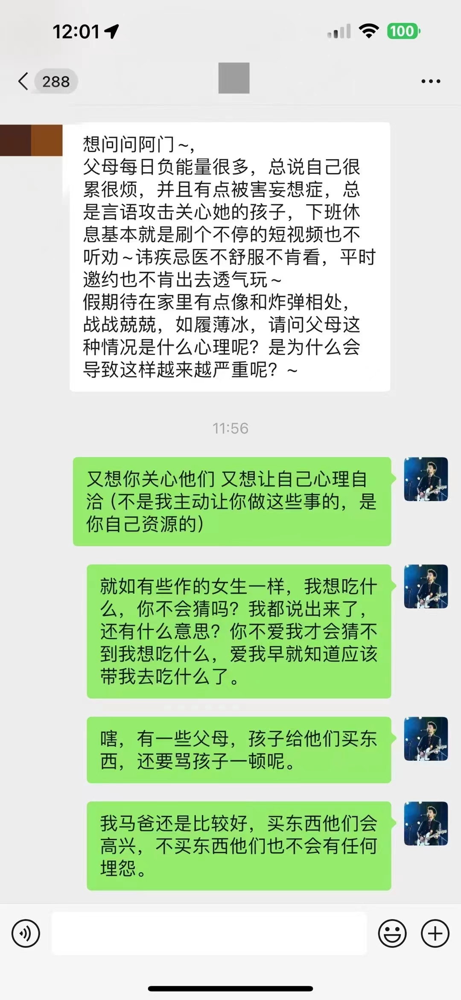

## 工作

较为无奈，工作没有得到相应的报酬

市场价？

## 生活

#### 游戏生活

steam epic EA  手柄 单机游戏 双人游戏 

最开始是2017年在steam上买的第一个游戏，声音解密，网易出的，之后一直都没有玩过，过完年来又买了两个手柄，可以通过手柄玩游戏，

单机解谜游戏，inside

《双人成行》 《野餐大冒险》此类游戏两人一起玩，

《异形工厂》拼凑剪切游戏，各工厂生成对应的图案，玩起来就忘记了时间，看着很大的工程，造到最后很有成就感，

#### 摇滚音乐

越来越喜欢这种音乐，一首《蓝莲花》，送我到拉萨。没有什么能够阻挡，你对自由的向往。南门外，城墙边，整群整群的人，在生活之外，寻找一丝自我。孤单是一个人的寂寞，寂寞是一群人的狂欢。

郑钧 《私奔》 我梦寐以求 是真爱和自由 想带上你私奔，奔向最遥远城镇 想带上你私奔，去做最幸福的人
《活着》 每天站在高楼上，看着地上的小蚂蚁 慌慌张张，匆匆忙忙 为何生活总是这样 难道说我的理想，就是这样度过一生的时光

还有五月天，伍佰，凤凰传奇的歌曲

五月天的音乐，就像带着我们的青春走回来一样，伍佰，像一个多年未见的朋友，讲述着他的人生，凤凰传奇，就像他的名字一样，就是个传奇，从俗气不想听，到再次火热，有一种特别的魔力。

#### 生活逐渐有了乐趣

有了牵挂的人和事，生活过得有些乐趣了，

#### 体验了勾心斗角

装修真的太折磨人了，我感觉我还是选的比较不错的装修公司，都是这样的，中间的过程，稍有不注意，就被坑钱，真的是你捂着口袋，他就开始回首掏，互相拉扯，互相推责，随便一个地方都是坑你个三五百，真的太心累了，

## 玩乐

#### 拉萨之旅

我梦寐以求 是真爱和自由

五一去拉萨，去珠峰大本营，追求心灵上的慰藉。一个人的时候，就没有这么多的顾虑，花钱也显得随心所欲，硬座去拉萨，沿着青海湖，进入格尔木， 看到了沱沱河，唐古拉山，看到了日出东方，看到了那措湖，走过了青藏铁路，看到了藏羚羊和执勤的铁路护卫队。带着我的音响，一路上是摇滚的天堂，同行的都是大学生，都是热爱这片土地的人，和他们在一起真的能感受到年轻人的激情，让麻木的心再次火热起来，对世界充满期待。

布达拉宫，唐朝时期，松赞干布给文成公主修建的。布达拉宫，大昭寺，八廓街，羊卓雍措 纯净，人纯净，环境纯净，就是很纯洁，不忍心去破坏。

缺氧问题，没有很严重，可以说就是没有。 过唐古拉山口时，如果感觉不错，基本上就不用吸氧，后面去冰川有些运动量感觉有些吃力，正常在超过4800米后，走路要慢，像企鹅一样，慢走，还有就是要带水杯多喝水，因为海拔高，呢里的热水都是没有到100摄氏度就开了，所以就不是很烫。

纳木措、玛旁雍措和羊卓雍措， 三大圣湖。只看了羊湖，湖水颜色感觉有矿物质，映射出有层次的湖蓝色，跟前的水非常清澈，

南迦巴瓦峰和珠穆拉玛峰，去珠峰大本营（日喀则），可惜没有看到日照金山，这边属于后藏，一般都是天葬，也是有权势，有威望的才可以。 林芝是前藏，主要是水葬。大部分都是同胞共妻制，就是一妻多夫制。

还想再去一次前藏，看林芝的桃花节（3月15日-4月1日）

#### 内蒙大草原

7、8月

看到了传说中的win XP壁纸， 带弟弟去看下外面的世界，让他看到世界的无法缤纷，希望他可以留心了，自己的事情该操心了，乌兰巴托的夜，篝火晚会，烟花，白天骑马，挺好玩的，还给弟弟拍了照片，带他去了内蒙古博物馆，见了各民族的生活状态，

重要的是要让弟弟知道外面的天地有多广阔，不用局限在家里面，出去见世面，但不能让他养成对我的依赖，要让他独立，只有在他真的找过之后还无法处理，无法解决，再来寻求帮助，

#### 杭州姻缘

8月杭州 元旦杭州，去了两次杭州。一次奠定基础，一次共谋前程。她说了两次分开，一次一定要12月见面，等不到元旦后，那就算了，二次，年前还要说结婚的事情，就算了，给我的感受是胁迫，我也不好说什么，总要互相包容，她也有她的考量，两个人走到一起还是很不容易的，她能同意来西安也是下了很大决心的。我要能体谅。

#### 重庆火辣热情

国庆5天，一起去了重庆，看了洪崖洞，坐了夜游嘉陵江轮渡。有冲突有甜蜜，只能说，两人都在试探，未达到进一步的程度。都在极限拉扯。

## 感情

#### 关于承诺

她2024年1月19日也来了一次西安，还下了雪，给我买了衣服，她说不让我告诉任何人，我事后和家里说了，这是我的问题，没有考虑她的感受。要知道那些事情是再三强调的，要注意，她在意的是信守诺言，承诺的问题，不是说没说的问题。我是感觉已经过去了，让家里知道她是想和我一起生活的，告诉家里面她来过，就能让家里更能接受她。和家里说一些这些有的没的，就更和一些，都真诚对待彼此，一家人是否和睦，主要还是看这家的男生怎么处理爸妈和妻子的关系，你来我家带这100块钱的东西，足以表明态度，我肯定要把这个说出来，这都是你买的，他们也开心，也更接纳你。妈妈又给你红包，是认可你的，

#### 互相照顾

你为我着想，有想着我，我也把家里的压力屏蔽掉，我也站你角度考虑。你可以大声说我，但不能当着我这边的亲戚家人面说，这样会让人觉得你强势。但是在娘家，就没关系。

####  关于拉扯和心意

我很烦你猜我猜心，我猜你心思，很累。就像明天是纪念日，你想要花，或者晚上想要出去玩，你可以不直接点出来，可以说，明天是一个特别的日子，或者 明天是个纪念日，或者，那的花好香啊，咱们好久都没有一起共进晚餐了，想吃肉了。因为有时候，我是真的意识不到，很不喜欢这种拉扯，但你放心，我会给你惊喜，可就不知道是惊喜还是惊吓 [囧]

阿门： 我身边就认识几个人，他们的父母就是那种对他们好还叫挨骂，但是，你还真不能不对他们好，因为那样背后骂这种心理我懂，不想自己产生一丝感激，你们对我好是你们自己的事，我不欠你的。

有一个最近的图片 

主要的是心理上觉得我不欠你的，都是你自愿的，这个总结我认可，我觉得我爸妈真的很明白。

## 计划

#### 2023年计划完成情况

- 交房，装修，买车，还款，成年人的世界里只剩下生存
- 积极面对工作
- 等待正缘

完成度：60%

至少如期交付，装修也做了下来，越来越感觉钱不够用了，也多亏了一位阿姨帮忙。

积极面对了，工作没有给到相应的报酬，调整部门，觉得很难受。

认识了一位菇凉，还没有一起生活过。

#### 2024年计划

- 过好平凡的生活，经历几次xxx，几次xxx
- 今年把事情办了，共同前行
- 搬家，开始新生活
- 

张鹏飞
2024.01.19 于西安  
