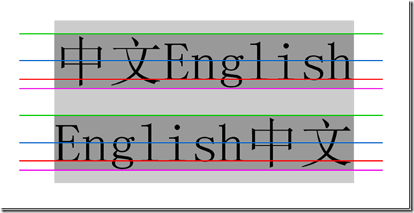
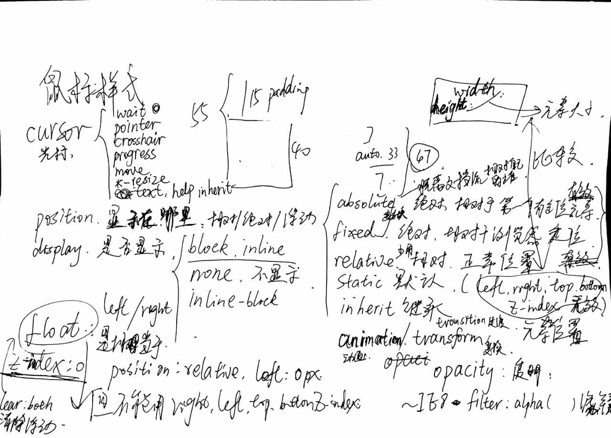
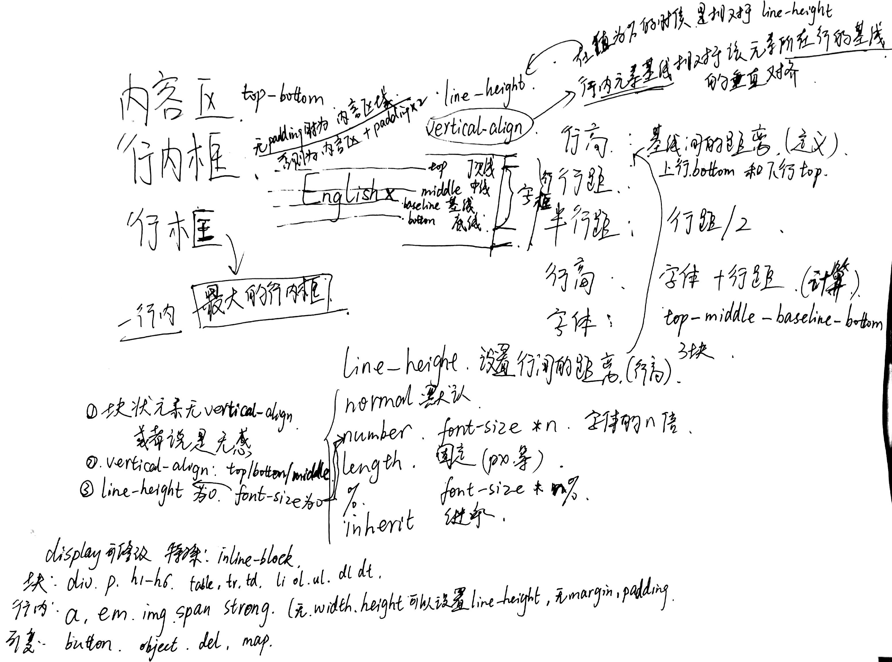

## position:absolute fixed relative static inherit

absolute和fixed脱离文档流，相对于有定位元素的父级定位,可以使用(left top right bottom z-index)
其中fixed的绝对是相对于可是窗口的，浏览器中的document。
relative 相对定位，尽量少用，相对于原来本身的位置定位，和下面说的float有的一拼，
static 默认状态下没有(left top right bottom z-index),无效。
inherit 继承有定位的父级元素
[jsfiddle测试实例](https://jsfiddle.net/muxiaobai/bqx9rep5/)
参考[display与position之间的关系](http://www.cnblogs.com/baimiaolei/p/5627755.html)
    
  
## float:left/right

浮动是相对于本行，相当于 `{position:relative;left:0px;}`  相对左边为0px；可以使用{clear:both}来消除浮动，
浮动脱离文档流.不常用，一般我也不会用。破坏文档流。

## display:block inline inline-block none;常用

 通常使用 `{display:block;position:absolute;}` ，然后让{display:none}来隐藏。
 

## 行内模型 四条线

[HTML/CSS盒子模型，块级元素和行内元素](http://www.tuicool.com/articles/JzuQZnI)
行内元素没有width heigth padding margin 可以通过设置line-heigth来控制高度

块级盒子模型已经谈的不少了，这种通常是block类型的或者具有disploy:block属性的元素,什么padding border margin之类；
 
这次谈到的是行内模型。四条线
英语中的四线三格，不了解每线的规则，怎么写的一手漂亮的英文？

从上到下的线 :

top顶线
middle中线
baseline基线传说中根据张鑫旭的说法x-height，"x"的底。
bottom底线

> 行高的定义:是两条基线的距离

不过计算的时候可以使用字体＋行距来计算。
如果设定了行高后减去字体就得到行距（上一行的bottom到下一行的top之间的高度）那么一些行距也就随之展开了。
首先是行内框，如果没有padding等因素的影响，字体的高度就是行内框，然后就是行框，也是实际占据一行的高度，即一行内最大的行内距。

注:以上两张图片是借用的，如有要求，可删除。
[jsfiddle inline-height test ](https://jsfiddle.net/muxiaobai/8of4omak/)
参考[CSS行高——line-height](http://www.cnblogs.com/dolphinX/p/3236686.html)
[vertical-align-and-line-height](http://www.zhangxinxu.com/wordpress/2015/08/css-deep-understand-vertical-align-and-line-height/)

## 最后上两张图片

