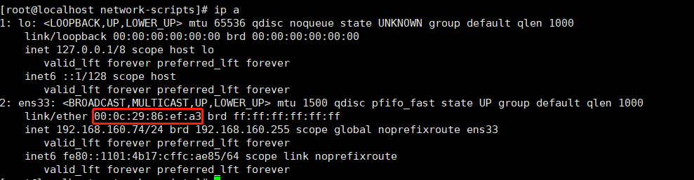
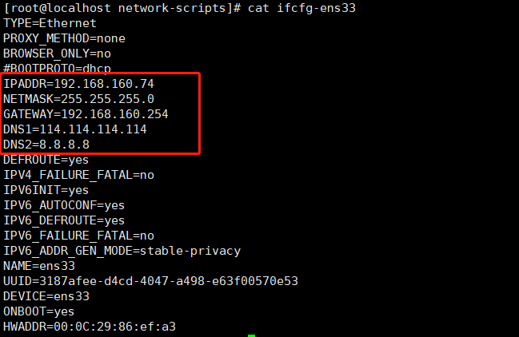

查看硬件的编号

`ip a`



路径：`/etc/sysconfig/network-scripts/ifcfg-ens33`
```
TYPE=Ethernet
PROXY_METHOD=none
BROWSER_ONLY=no
#BOOTPROTO=dhcp
IPADDR=192.168.160.74
NETMASK=255.255.255.0
GATEWAY=192.168.160.254
DNS1=114.114.114.114
DNS2=8.8.8.8
DEFROUTE=yes
IPV4_FAILURE_FATAL=no
IPV6INIT=yes
IPV6_AUTOCONF=yes
IPV6_DEFROUTE=yes
IPV6_FAILURE_FATAL=no
IPV6_ADDR_GEN_MODE=stable-privacy
NAME=ens33
UUID=3187afee-d4cd-4047-a498-e63f00570e53
DEVICE=ens33
ONBOOT=yes
HWADDR=00:0C:29:86:ef:a3
```

