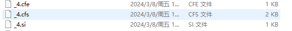

IndexWriter 保存一个文档到落盘

会创建一个段


new IndexWriter()里面创建一个空段
```
docWriter = new DocumentsWriter(flushNotifications, segmentInfos.getIndexCreatedVersionMajor(), pendingNumDocs,
          enableTestPoints, this::newSegmentName,
          config, directoryOrig, directory, globalFieldNumberMap);

new DocumentsWriter() 里面的ThreadPool里面有一个 DocumentsWriterPerThread(),

 this.perThreadPool = new DocumentsWriterPerThreadPool(() -> {
      final FieldInfos.Builder infos = new FieldInfos.Builder(globalFieldNumberMap);
      return new DocumentsWriterPerThread(indexCreatedVersionMajor,
          segmentNameSupplier.get(), directoryOrig,
          directory, config, deleteQueue, infos,
          pendingNumDocs, enableTestPoints);
    });

new DocumentsWriterPerThread()这个里面创建段  和执行flush 的对象；

segmentInfo = new SegmentInfo(directoryOrig, Version.LATEST, Version.LATEST, segmentName, -1, false, codec, Collections.emptyMap(), StringHelper.randomId(), Collections.emptyMap(), indexWriterConfig.getIndexSort());
consumer = indexWriterConfig.getIndexingChain().getChain(indexVersionCreated, segmentInfo, this.directory, fieldInfos, indexWriterConfig, this::onAbortingException);

```


IndexWriter.prepareCommitInternal 预提交

```

  private long prepareCommitInternal() throws IOException {
    startCommitTime = System.nanoTime();
    synchronized(commitLock) {
      ensureOpen(false);
      if (infoStream.isEnabled("IW")) {
        infoStream.message("IW", "prepareCommit: flush");
        infoStream.message("IW", "  index before flush " + segString());
      }

      if (tragedy.get() != null) {
        throw new IllegalStateException("this writer hit an unrecoverable error; cannot commit", tragedy.get());
      }

      if (pendingCommit != null) {
        throw new IllegalStateException("prepareCommit was already called with no corresponding call to commit");
      }

      doBeforeFlush();
      testPoint("startDoFlush");
      SegmentInfos toCommit = null;
      boolean anyChanges = false;
      long seqNo;
      MergePolicy.MergeSpecification pointInTimeMerges = null;
      AtomicBoolean stopAddingMergedSegments = new AtomicBoolean(false);
      final long maxCommitMergeWaitMillis = config.getMaxFullFlushMergeWaitMillis();
      // This is copied from doFlush, except it's modified to
      // clone & incRef the flushed SegmentInfos inside the
      // sync block:

      try {

        synchronized (fullFlushLock) {
          boolean flushSuccess = false;
          boolean success = false;
          try {
            //写文件，执行所有的flush
            seqNo = docWriter.flushAllThreads();
            if (seqNo < 0) {
              anyChanges = true;
              seqNo = -seqNo;
            }
            if (anyChanges == false) {
              // prevent double increment since docWriter#doFlush increments the flushcount
              // if we flushed anything.
              flushCount.incrementAndGet();
            }
            //写索引数据
            publishFlushedSegments(true);
            // cannot pass triggerMerges=true here else it can lead to deadlock:
            processEvents(false);
            
            flushSuccess = true;

            applyAllDeletesAndUpdates();
            synchronized(this) {
              writeReaderPool(true);
              if (changeCount.get() != lastCommitChangeCount) {
                // There are changes to commit, so we will write a new segments_N in startCommit.
                // The act of committing is itself an NRT-visible change (an NRT reader that was
                // just opened before this should see it on reopen) so we increment changeCount
                // and segments version so a future NRT reopen will see the change:
                changeCount.incrementAndGet();
                segmentInfos.changed();
              }

              if (commitUserData != null) {
                Map<String,String> userData = new HashMap<>();
                for(Map.Entry<String,String> ent : commitUserData) {
                  userData.put(ent.getKey(), ent.getValue());
                }
                segmentInfos.setUserData(userData, false);
              }

              // Must clone the segmentInfos while we still
              // hold fullFlushLock and while sync'd so that
              // no partial changes (eg a delete w/o
              // corresponding add from an updateDocument) can
              // sneak into the commit point:
              toCommit = segmentInfos.clone();
              pendingCommitChangeCount = changeCount.get();
              // This protects the segmentInfos we are now going
              // to commit.  This is important in case, eg, while
              // we are trying to sync all referenced files, a
              // merge completes which would otherwise have
              // removed the files we are now syncing.
              deleter.incRef(toCommit.files(false));
              if (anyChanges && maxCommitMergeWaitMillis > 0) {
                
                // we can safely call preparePointInTimeMerge since writeReaderPool(true) above wrote all
                // necessary files to disk and checkpointed them.
                pointInTimeMerges = preparePointInTimeMerge(toCommit, stopAddingMergedSegments::get, MergeTrigger.COMMIT, sci->{});
              }
            }
            success = true;
          } finally {
            if (!success) {
              if (infoStream.isEnabled("IW")) {
                infoStream.message("IW", "hit exception during prepareCommit");
              }
            }
            assert Thread.holdsLock(fullFlushLock);
            // Done: finish the full flush!
            docWriter.finishFullFlush(flushSuccess);
            doAfterFlush();
          }
        }
      } catch (VirtualMachineError tragedy) {
        tragicEvent(tragedy, "prepareCommit");
        throw tragedy;
      } finally {
        maybeCloseOnTragicEvent();
      }


      // 进行段合并   是在条件下执行
      if (pointInTimeMerges != null) {
        if (infoStream.isEnabled("IW")) {
          infoStream.message("IW", "now run merges during commit: " + pointInTimeMerges.segString(directory));
        }
        mergeScheduler.merge(mergeSource, MergeTrigger.COMMIT);
        pointInTimeMerges.await(maxCommitMergeWaitMillis, TimeUnit.MILLISECONDS);
        if (infoStream.isEnabled("IW")) {
          infoStream.message("IW", "done waiting for merges during commit");
        }
        synchronized (this) {
          // we need to call this under lock since mergeFinished above is also called under the IW lock
          stopAddingMergedSegments.set(true);
        }
      }


      // do this after handling any pointInTimeMerges since the files will have changed if any merges
      // did complete
      filesToCommit = toCommit.files(false);
      
      
      try {
        if (anyChanges) {
          maybeMerge.set(true);
        }
        // 写segments_N文件
        startCommit(toCommit);
        if (pendingCommit == null) {
          return -1;
        } else {
          return seqNo;
        }
      } catch (Throwable t) {
        synchronized (this) {
          if (filesToCommit != null) {
            try {
              deleter.decRef(filesToCommit);
            } catch (Throwable t1) {
              t.addSuppressed(t1);
            } finally {
              filesToCommit = null;
            }
          }
        }
        throw t;
      }


    }


  }


```

这段代码是Apache Lucene中IndexWriter类的一个方法实现，名为prepareCommitInternal()。这个方法的主要目的是准备提交索引的更改到磁盘，包括将内存中的文档和更新操作刷新到磁盘、创建一个新的段信息文件（segments_N）、处理合并策略，并确保在提交过程中数据的一致性和完整性。

以下是步骤分解：

1. 记录开始执行commit的时间戳。
2. 检查IndexWriter是否已打开且未遇到任何不可恢复错误。
3. 检查是否有正在进行的但尚未提交的commit操作，如果有则抛出异常。
4. 执行flush前的操作，例如清理缓冲区等。
5. 同步执行真正的flush操作，包括：
  - 刷新所有线程的文档写入器（docWriter），获取最新的序列号seqNo，并判断是否有任何更改发生。
  - 发布已刷新的段信息。
  - 应用所有删除和更新操作。
  - 写入reader池状态。
  - 如果有变更，则增加版本号并标记segmentInfos为已更改。
  - 复制当前的segmentInfos实例（toCommit），用于后续的提交操作。
  - 增加对即将提交的索引文件的引用计数，防止在同步期间被删除。
  - 根据配置检查是否需要在commit时进行合并，并生成一个MergeSpecification（如果需要的话）。
6. 在finally块中，确保无论成功与否都会正确结束flush操作，并释放锁资源。
7. 如果存在pointInTimeMerges（即在commit阶段需要执行的合并），则启动合并并在给定时间内等待其完成。
8. 设置要提交的文件列表（filesToCommit）。
9. 调用startCommit(toCommit)方法来开始实际的提交过程，包括写入新的segments_N文件。
10. 如果一切正常，返回序列号seqNo；否则，在捕获到异常时，解除对提交文件的引用，并重新抛出异常。

总体来说，此方法负责管理Lucene索引提交的整个生命周期，从内部状态刷新、变更追踪、文件引用计数管理到合并策略的应用以及最终的文件系统提交。


在flush完成后会进行合并操作

 pointInTimeMerges = preparePointInTimeMerge(toCommit, stopAddingMergedSegments::get, MergeTrigger.COMMIT, sci->{});
 合并段


 seqNo = docWriter.flushAllThreads();


DocumentWriter.flushAllThreads() 

 ```
 
 
  /*
   * FlushAllThreads is synced by IW fullFlushLock. Flushing all threads is a
   * two stage operation; the caller must ensure (in try/finally) that finishFlush
   * is called after this method, to release the flush lock in DWFlushControl
   */
  long flushAllThreads()
    throws IOException {
    final DocumentsWriterDeleteQueue flushingDeleteQueue;
    if (infoStream.isEnabled("DW")) {
      infoStream.message("DW", "startFullFlush");
    }

    long seqNo;
    synchronized (this) {
      pendingChangesInCurrentFullFlush = anyChanges();
      flushingDeleteQueue = deleteQueue;
      /* Cutover to a new delete queue.  This must be synced on the flush control
       * otherwise a new DWPT could sneak into the loop with an already flushing
       * delete queue */
      seqNo = flushControl.markForFullFlush(); // swaps this.deleteQueue synced on FlushControl
      assert setFlushingDeleteQueue(flushingDeleteQueue);
    }
    assert currentFullFlushDelQueue != null;
    assert currentFullFlushDelQueue != deleteQueue;
    
    boolean anythingFlushed = false;
    try {
      DocumentsWriterPerThread flushingDWPT;
      // Help out with flushing:
      //遍历所有等待刷新的DocumentsWriterPerThread
      while ((flushingDWPT = flushControl.nextPendingFlush()) != null) {
        anythingFlushed |= doFlush(flushingDWPT);
      }
      // If a concurrent flush is still in flight wait for it
      flushControl.waitForFlush();  
      if (anythingFlushed == false && flushingDeleteQueue.anyChanges()) { // apply deletes if we did not flush any document
        if (infoStream.isEnabled("DW")) {
          infoStream.message("DW", Thread.currentThread().getName() + ": flush naked frozen global deletes");
        }
        assert assertTicketQueueModification(flushingDeleteQueue);
        ticketQueue.addDeletes(flushingDeleteQueue);
      }
      // we can't assert that we don't have any tickets in teh queue since we might add a DocumentsWriterDeleteQueue
      // concurrently if we have very small ram buffers this happens quite frequently
      assert !flushingDeleteQueue.anyChanges();
    } finally {
      assert flushingDeleteQueue == currentFullFlushDelQueue;
      flushingDeleteQueue.close(); // all DWPT have been processed and this queue has been fully flushed to the ticket-queue
    }
    if (anythingFlushed) {
      return -seqNo;
    } else {
      return seqNo;
    }
  }
  
 ```


这段代码是Apache Lucene中DocumentsWriterFlushControl类的一个方法flushAllThreads()的实现，这个方法负责将所有线程中的文档写入操作落盘。以下是代码逻辑的简要解释：

1. 获取当前待刷新的删除队列（flushingDeleteQueue），并切换到新的删除队列，以确保在刷新过程中不会接收新的删除请求。
2. 调用flushControl.markForFullFlush()标记进行全量刷新，并返回一个序列号（seqNo）。
3. 遍历所有等待刷新的DocumentsWriterPerThread实例（每个实例通常对应一个线程的索引缓冲区），调用doFlush(flushingDWPT)逐个执行实际的文档数据落盘操作。
4. 在所有待刷新的DocumentsWriterPerThread都处理完毕后，通过waitForFlush()方法确保没有并发刷新任务还在进行中。
5. 如果在刷新过程中没有真正写入任何文档内容，但有全局删除变更，则将这些删除操作应用到ticketQueue中，以便在后续搜索时能够正确反映删除情况。
6. 最后，关闭已完全刷新的删除队列（flushingDeleteQueue）。

根据return -seqNo和return seqNo的条件判断，如果在这个过程中有任何文档被成功刷新到磁盘，则返回负数形式的序列号；否则返回正数形式的序列号。这可能是Lucene内部的一种约定，用于标识是否进行了实际的数据更新操作。


此处有获取到了最开始的DocumentsWriterPerThread  下面要用它进行 flush()
```
 // Help out with flushing:
      while ((flushingDWPT = flushControl.nextPendingFlush()) != null) {
        anythingFlushed |= doFlush(flushingDWPT);
      }

```
当前执行doFlush();

循环处理待刷新的DWPT：

- 首先检查当前flushingDWPT是否已经完成过刷新，并设置hasEvents为true表示有事件发生。
- 尝试获取一个刷新票证（FlushTicket），并确保删除队列正确无误。
- 添加该DWPT到刷新队列，并获取其在内存中的文档数量


而DocumentsWriterPerThread.flush()则是完成从内存缓冲区到磁盘段的实际数据落地过程。

下面方法负责了将内存中待写入的文档数据完整地刷新至磁盘上的新索引段，并生成描述新段状态的对象。 主要是在  sortMap = consumer.flush(flushState);

```

  /** Flush all pending docs to a new segment */
  FlushedSegment flush(DocumentsWriter.FlushNotifications flushNotifications) throws IOException {
    assert flushPending.get() == Boolean.TRUE;
    assert numDocsInRAM > 0;
    assert deleteSlice.isEmpty() : "all deletes must be applied in prepareFlush";
    segmentInfo.setMaxDoc(numDocsInRAM);
    final SegmentWriteState flushState = new SegmentWriteState(infoStream, directory, segmentInfo, fieldInfos.finish(),
        pendingUpdates, new IOContext(new FlushInfo(numDocsInRAM, lastCommittedBytesUsed)));
    final double startMBUsed = lastCommittedBytesUsed / 1024. / 1024.;

    // Apply delete-by-docID now (delete-byDocID only
    // happens when an exception is hit processing that
    // doc, eg if analyzer has some problem w/ the text):
    if (numDeletedDocIds > 0) {
      flushState.liveDocs = new FixedBitSet(numDocsInRAM);
      flushState.liveDocs.set(0, numDocsInRAM);
      for (int i = 0; i < numDeletedDocIds; i++) {
        flushState.liveDocs.clear(deleteDocIDs[i]);
      }
      flushState.delCountOnFlush = numDeletedDocIds;
      deleteDocIDs = new int[0];
    }

    if (aborted) {
      if (infoStream.isEnabled("DWPT")) {
        infoStream.message("DWPT", "flush: skip because aborting is set");
      }
      return null;
    }

    long t0 = System.nanoTime();

    if (infoStream.isEnabled("DWPT")) {
      infoStream.message("DWPT", "flush postings as segment " + flushState.segmentInfo.name + " numDocs=" + numDocsInRAM);
    }
    final Sorter.DocMap sortMap;
    try {
      DocIdSetIterator softDeletedDocs;
      if (indexWriterConfig.getSoftDeletesField() != null) {
        softDeletedDocs = consumer.getHasDocValues(indexWriterConfig.getSoftDeletesField());
      } else {
        softDeletedDocs = null;
      }
      // 将文档数据和索引结构写入磁盘
      sortMap = consumer.flush(flushState);
      if (softDeletedDocs == null) {
        flushState.softDelCountOnFlush = 0;
      } else {
        flushState.softDelCountOnFlush = PendingSoftDeletes.countSoftDeletes(softDeletedDocs, flushState.liveDocs);
        assert flushState.segmentInfo.maxDoc() >= flushState.softDelCountOnFlush + flushState.delCountOnFlush;
      }
      // We clear this here because we already resolved them (private to this segment) when writing postings:
      pendingUpdates.clearDeleteTerms();
      segmentInfo.setFiles(new HashSet<>(directory.getCreatedFiles()));

      final SegmentCommitInfo segmentInfoPerCommit = new SegmentCommitInfo(segmentInfo, 0, flushState.softDelCountOnFlush, -1L, -1L, -1L, StringHelper.randomId());
      if (infoStream.isEnabled("DWPT")) {
        infoStream.message("DWPT", "new segment has " + (flushState.liveDocs == null ? 0 : flushState.delCountOnFlush) + " deleted docs");
        infoStream.message("DWPT", "new segment has " + flushState.softDelCountOnFlush + " soft-deleted docs");
        infoStream.message("DWPT", "new segment has " +
            (flushState.fieldInfos.hasVectors() ? "vectors" : "no vectors") + "; " +
            (flushState.fieldInfos.hasNorms() ? "norms" : "no norms") + "; " +
            (flushState.fieldInfos.hasDocValues() ? "docValues" : "no docValues") + "; " +
            (flushState.fieldInfos.hasProx() ? "prox" : "no prox") + "; " +
            (flushState.fieldInfos.hasFreq() ? "freqs" : "no freqs"));
        infoStream.message("DWPT", "flushedFiles=" + segmentInfoPerCommit.files());
        infoStream.message("DWPT", "flushed codec=" + codec);
      }

      final BufferedUpdates segmentDeletes;
      if (pendingUpdates.deleteQueries.isEmpty() && pendingUpdates.numFieldUpdates.get() == 0) {
        pendingUpdates.clear();
        segmentDeletes = null;
      } else {
        segmentDeletes = pendingUpdates;
      }

      if (infoStream.isEnabled("DWPT")) {
        final double newSegmentSize = segmentInfoPerCommit.sizeInBytes() / 1024. / 1024.;
        infoStream.message("DWPT", "flushed: segment=" + segmentInfo.name +
            " ramUsed=" + nf.format(startMBUsed) + " MB" +
            " newFlushedSize=" + nf.format(newSegmentSize) + " MB" +
            " docs/MB=" + nf.format(flushState.segmentInfo.maxDoc() / newSegmentSize));
      }

      assert segmentInfo != null;

      FlushedSegment fs = new FlushedSegment(infoStream, segmentInfoPerCommit, flushState.fieldInfos,
          segmentDeletes, flushState.liveDocs, flushState.delCountOnFlush, sortMap);
      sealFlushedSegment(fs, sortMap, flushNotifications);
      if (infoStream.isEnabled("DWPT")) {
        infoStream.message("DWPT", "flush time " + ((System.nanoTime() - t0) / 1000000.0) + " msec");
      }
      return fs;
    } catch (Throwable t) {
      onAbortingException(t);
      throw t;
    } finally {
      maybeAbort("flush", flushNotifications);
      hasFlushed.set(Boolean.TRUE);
    }
  }
```

这段代码是Apache Lucene中DocumentsWriterPerThread类的一个方法，名为flush(DocumentsWriter.FlushNotifications flushNotifications)。该方法的主要功能是将当前线程中的所有待处理文档数据刷新到一个新的索引段（segment）中，并返回一个FlushedSegment对象。

以下是该方法的详细步骤：

1. 检查当前是否有待刷新的数据（flushPending.get() == Boolean.TRUE），并且确保内存中存在未写入磁盘的文档(numDocsInRAM > 0)。
2. 初始化新的SegmentWriteState对象，它包含了用于构建新段所需的各种信息，如目录路径、段信息、字段信息、待更新项等。
3. 处理删除操作：
  - 如果有按docID的删除操作，创建一个FixedBitSet表示有效的文档集合（live docs），并应用这些删除。
  - 计算硬删除（hard deletes）的数量，并清空内部删除记录数组。
4. 检查是否已触发中断标志（aborted）。如果是，则跳过本次刷新，并返回null。
5. 开始执行实际的文档数据和倒排索引刷新过程：
  - 使用consumer.flush(flushState)方法将文档数据和索引结构写入磁盘，同时获取排序映射（sortMap）。
  - 如果启用了软删除功能，计算并记录软删除文档的数量。
  - 清除已解决的删除术语。
6. 创建新的SegmentCommitInfo实例，记录新段的相关元数据，如最大文档数、软删除数量等。
7. 根据刷新结果创建一个FlushedSegment对象，其中包含新段的信息、字段信息、可能存在的段级删除信息、有效的文档集合（live docs）、硬删除数量以及排序映射。
8. 调用sealFlushedSegment(fs, sortMap, flushNotifications)方法完成新段的封装，并通知外部组件刷新完成。
9. 在整个刷新过程中进行日志输出，包括开始时间、刷新耗时、新段大小、文档密度等信息。
10. 最后，设置hasFlushed标志为true，并在遇到异常或正常结束时调用maybeAbort方法来处理可能的清理工作。


consumer.flush(flushState) 是直接落盘的操作。

调用到 DefaultIndexingChain 
indexWriterConfig.getCodec().fieldInfosFormat().write(state.directory, state.segmentInfo, "", state.fieldInfos, IOContext.DEFAULT);
    
indexWriterConfig.getCodec().fieldInfosFormat() 这个有两个 新版用Lucene60FieldInfosFormat


```

  @Override
  public void write(Directory directory, SegmentInfo segmentInfo, String segmentSuffix, FieldInfos infos, IOContext context) throws IOException {
    final String fileName = IndexFileNames.segmentFileName(segmentInfo.name, segmentSuffix, EXTENSION);
    try (IndexOutput output = directory.createOutput(fileName, context)) {
      CodecUtil.writeIndexHeader(output, Lucene60FieldInfosFormat.CODEC_NAME, Lucene60FieldInfosFormat.FORMAT_CURRENT, segmentInfo.getId(), segmentSuffix);
      output.writeVInt(infos.size());
      for (FieldInfo fi : infos) {
        fi.checkConsistency();

        output.writeString(fi.name);
        output.writeVInt(fi.number);

        byte bits = 0x0;
        if (fi.hasVectors()) bits |= STORE_TERMVECTOR;
        if (fi.omitsNorms()) bits |= OMIT_NORMS;
        if (fi.hasPayloads()) bits |= STORE_PAYLOADS;
        if (fi.isSoftDeletesField()) bits |= SOFT_DELETES_FIELD;
        output.writeByte(bits);

        output.writeByte(indexOptionsByte(fi.getIndexOptions()));

        // pack the DV type and hasNorms in one byte
        output.writeByte(docValuesByte(fi.getDocValuesType()));
        output.writeLong(fi.getDocValuesGen());
        output.writeMapOfStrings(fi.attributes());
        output.writeVInt(fi.getPointDimensionCount());
        if (fi.getPointDimensionCount() != 0) {
          output.writeVInt(fi.getPointIndexDimensionCount());
          output.writeVInt(fi.getPointNumBytes());
        }
      }
      CodecUtil.writeFooter(output);
    }
  }

```

此处之后就有磁盘文件就加好了


写结构数据完成

而添加索引原始数据是通过add


```
  public long addDocuments(Iterable<? extends Iterable<? extends IndexableField>> docs) throws IOException {
    return updateDocuments((DocumentsWriterDeleteQueue.Node<?>) null, docs);
  }

```

```
void addDocument(Document doc) throws IOException {
    // ... 省略内部逻辑 ...
    try {
        DocumentsWriterPerThread dwpt = getThreadState();
        dwpt.updateDocument(doc);
    } catch (IOException e) {
        // ... 处理异常 ...
    }
}
```

多个通过updateDocument调用到 DocumentWriter的doFlush()的的方法

private boolean doFlush(DocumentsWriterPerThread flushingDWPT) throws IOException ;


```
FlushedSegment flush(DocumentsWriter.FlushNotifications flushNotifications) throws IOException {
    // ... 进行一系列准备和删除处理 ...
    DocIdSetIterator softDeletedDocs;
    sortMap = consumer.flush(flushState); // 这里consumer会执行实际的索引数据写入操作
    // ... 创建SegmentCommitInfo并返回...
}

```

最终是这个一个文件 ,后面有删除其它的文件



