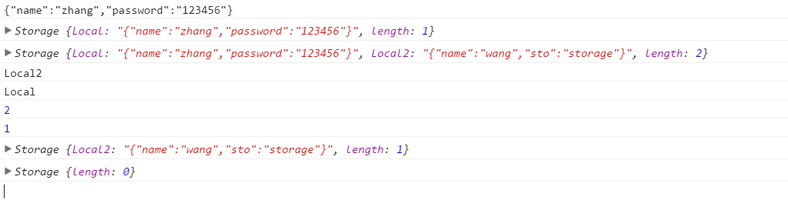
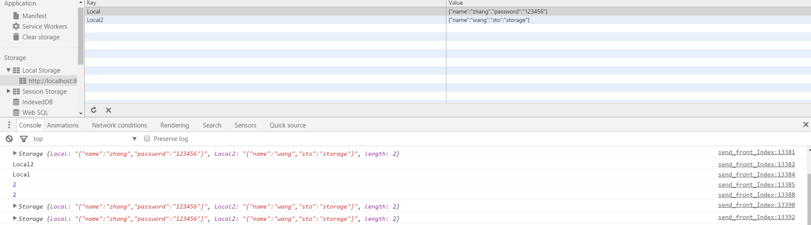
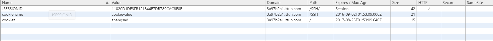
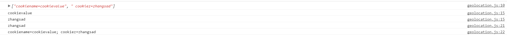
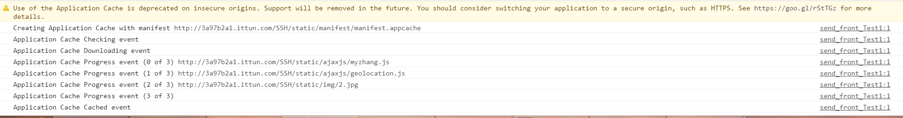
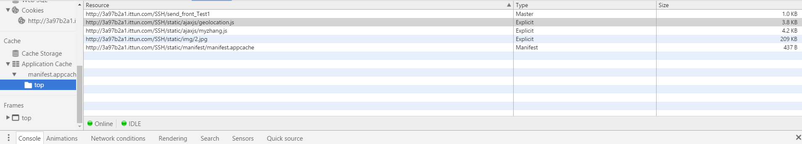

# HTML5-API新特性

主要内容：存储、文件 、图形图像、 媒体（视频、音频）

---------------

## Storage 存储

#### Local Storage

```
	var local=this.localStorage;
	var STORAGE_KEY = 'Local';
	var items={"name":"zhang","password":"123456"}
	var STORAGE_KEY2 = 'Local2';
	var items2={"name":"wang","sto":"storage"}
	local.setItem(STORAGE_KEY, JSON.stringify(items));//把itemJSON话后，添加到LocalStorage，此时在浏览器中可以看到
	console.log(local.getItem(STORAGE_KEY));//根据key获取{key:value}
	console.log(local);
	local.setItem(STORAGE_KEY2, JSON.stringify(items2));
	console.log(local);
	console.log(local.key(1));
	
	console.log(local.key(0));获取第一个{key:value}
	console.log(local.length);
	local.removeItem(STORAGE_KEY);//根据key移除{key:value}

	console.log(local.length);//获取内容的长度
	
	console.log(local);
	local.clear();//清除localStorage
	console.log(local);
```



- 获取添加移除:getItem(),setItem() removeItem()

- 长度 length

- 清除所有{key:value}:LocalStorage.clear()

其中LocalStorage对象中，存储5M左右内容，同时这个对象和Cookies不同，Cookies会和Server进行信息传递，但是LocalStorage不会，根据名字就可以看出，这个对象只存在于本地。

#### Session Storage

SessionStorage和LocalStorage类似，方法也一样，只不过存在的生命周期和存储大小、服务器不同。比较：

| 比较       | sessionStorage           | localStorage  | cookie|
| ------------- |:-------------:| -----:|-----:|
| 存储大小      | 5M | 5M或者更大 | cookie数据不能超过4k，cookie只适合保存很小的数据，如会话标识。|
| 生命周期     | 一旦窗口或标签页被永久关闭了，那么所有通过sessionStorage存储的数据也就被清空了。    |   始终有效 | 取决于expires/max-age|
| 同源策略 |  不可跨域     |    在所有同源窗口中都是共享的 |不可以跨域调用。|
| 	是否和服务器交换数据 |数据和服务器交换  | 只存在于本地|每次http请求都会携带cookie，|


#### IndexedDB  Web SQL

这两个存储，一般属于离线应用的数据保存。web网页一般不使用，主要是应用、游戏等使用。

支持的浏览器：WEB SQL DATABASE SUPPORT

|IE |	FIREFOX	|SAFARI|	CHROME	|OPERA	|IPHONE|	ANDROID|
|----:|:----:|----:|----:|----:|----:|
|·	·	|4.0+|	4.0+	|10.5+	|3.0+|	2.0+|

#### Cookies


document.cookie="userId=1";

document.cookie="userName=hulk";

document.cookie它的赋值并不意味着丢失原来的值，上面两句说明浏览器将维护两个cookie，分别是userId和userName，因此给document.cookie赋值更像执
行类似这样的语句：

document.addCookie("userId=1");

document.addCookie("userName=hulk");

事实上，浏览器就是按照这样的方式来设置cookie的，如果要改变一个cookie的值，只需重新赋值，例如：

document.cookie="userId=2";

这样就将名为userId的cookie值设置为了2。

```
		var date=new Date();
		var expireDays=10;
		//将date设置为10天以后的时间
		date.setTime(date.getTime()+expireDays*24*3600*1000);
		document.cookie = 'cookiename=cookievalue;expires=+'+date.toGMTString()+';';
		document.cookie = 'cookiez=zhangsad; max-age='+(60*60*24*365)+';path=/;';
		function getCookie(c_name){
			 var i,x,y; 
			 var cookieArray = document.cookie.split(";"); 
			 console.log(cookieArray);
			 for (i=0;i<cookieArray.length;i++){
			  x = cookieArray[i].substr(0,cookieArray[i].indexOf("=")); 
			  y = cookieArray[i].substr(cookieArray[i].indexOf("=")+1); 
			  x = x.replace(/^\s+|\s+$/g,""); 
			  console.log(y);
			  if(x == c_name){ 
				  return unescape(y); 
			  }
			 }
		 } 
		console.log(getCookie('cookiez'));
		console.log(document.cookie);

```
Chrome浏览器上的显示结果:



## Cache

#### Cache Storage Application Cache

离线缓存技术主要是应用于在没有网络的情况下，通过创建cache manifest文件，可以轻松的创建离线应用。

```
<!DOCTYPE html>
<html lang="en" manifest="static/manifest/manifest.appcache">
<head>
    <meta charset="UTF-8">
    <title>APP CACHE</title>
    <script type="text/javascript" src="http://apps.bdimg.com/libs/jquery/2.1.4/jquery.min.js"></script>
    <script type="text/javascript" src="http://api.map.baidu.com/api?v=1.4"></script>
 <script type="text/javascript" src="http://developer.baidu.com/map/jsdemo/demo/convertor.js"></script>
  <script src="static/ajaxjs/myzhang.js" type="text/javascript"></script>
 <script src="static/ajaxjs/geolocation.js" type="text/javascript"></script>
</head><!-- text/cache-mainfest -->
<body>
    
    
<script type="text/javascript">
    window.addEventListener('load', function(e){
        console.log(window.applicationCache.status);
    })
</script>
</body>
</html>
```
在html上使用manifest属性，引用appcache文件，文件下主要内容如下：

```
CACHE MANIFEST
#version 1.3
# 需要缓存的列表
CACHE:
    ../ajaxjs/myzhang.js
    ../ajaxjs/geolocation.js
    ../img/2.jpg
    ../img/2.jpg
NETWORK:
# 不需要缓存的
    *

FALLBACK:
# 访问缓存失败后，备用访问的资源，第一个是访问源，第二个是替换文件*.html /offline.html
2.jpg/3.jpg

```
CACHE上面的内容就是下载的内容，保存在本地，作为缓存。



[HTML5应用程序缓存Application Cache详解](http://www.admin10000.com/document/5921.html)
[HTML5离线存储之Application Cache](https://www.nihaoshijie.com.cn/index.php/archives/425)
## 文件

#### File
具体应用：
[上传图片立即显示](http://blog.csdn.net/a35038438/article/details/51162291)
1.文件即传即显

```
$("input:file").on("click",function(){
    console.log($(this));
    var img=$($($(this).next("label"))).find("img");
    //*原理是把本地图片路径："D(盘符):/image/..."转为"http://..."格式路径来进行显示图片*/  
    $(this).change(function() {  
        var $file = $(this);  
        var objUrl = $file[0].files[0];  
        var windowURL = window.URL || window.webkitURL;  
        //createObjectURL创建一个指向该参数对象(图片)的URL  
        var dataURL;  
        dataURL = windowURL.createObjectURL(objUrl);  
        $(img).attr("src",dataURL);  
    });  
})
```
2.AJAX上传文件 XMLHttpRequest Level 2中的的FormData

```

	
	var data=new FormData();
	data.append("currentPage", 1);
	data.append("order", "desc"); 
	ajax("","",data);

function ajax(method,url,data){
	var xhr ;
    if (window.XMLHttpRequest) { // Mozilla, Safari, ...
        xhr = new XMLHttpRequest();
    } else if (window.ActiveXObject) { // IE
        xhr = new ActiveXObject("Microsoft.XMLHTTP");
    }
    xhr.addEventListener("progress", updateProgress, false);
    xhr.addEventListener("load", transferComplete, false);
    xhr.addEventListener("error", transferFailed, false);
    xhr.addEventListener("abort", transferCanceled, false);
    xhr.open(method,url, true);
    xhr.setRequestHeader("Content-Type","multipart/form-data");
    xhr.send(data);
}

// progress on transfers from the server to the client (downloads)
function updateProgress(evt) {
  if (evt.lengthComputable) {
    var percentComplete = evt.loaded / evt.total;
    console.log("The transfer is updateProgress.");
  } else {
    // Unable to compute progress information since the total size is unknown
  }
}

function transferComplete(evt) {
	console.log(evt);
	console.log(this.response);
	console.log(JSON.parse(this.response));
	console.log(evt.responseText);
	console.log("The transfer is complete.");
}

function transferFailed(evt) {
	 console.log("An error occurred while transferring the file.");
}

function transferCanceled(evt) {
	 console.log("The transfer has been canceled by the user.");
}

```
[使用FormData对象](https://developer.mozilla.org/zh-CN/docs/Web/Guide/Using_FormData_Objects)
[什么是 AJAX?](https://developer.mozilla.org/zh-CN/docs/AJAX/Getting_Started)

#### FileReader Blob


## 图形图像、多媒体

#### Canvas SVG
在body中添加Canvas和svg标签，具体的图形图像展示需要在js中书写。

```
<canvas id="myCanvas" width="200" height="100"></canvas>
<svg xmlns="http://www.w3.org/2000/svg" version="1.1" height="190"></svg>
<script type="text/javascript">
var ctx=document.getElementById("myCanvas");
ctx.fillStyle = "green";
ctx.fillRect(10, 10, 100, 100);
</script>

```
具体的内容就不展开了。
[Canvas](https://developer.mozilla.org/zh-CN/docs/Web/API/Canvas_API)


#### video 
```
 <video id="video" width="420" style="margin-top:15px;">
    <source src="/example/html5/mov_bbb.mp4" type="video/mp4" />
    <source src="/example/html5/mov_bbb.ogg" type="video/ogg" />
    Your browser does not support HTML5 video.
  </video>

```

#### audio
```
<audio src="song.ogg" controls="controls"></audio>

```

## 其他API

#### navigator.geolocation 位置信息

结合手机和PC,通过百度Map和google convertor

```
<script type="text/javascript" src="http://api.map.baidu.com/api?v=1.4"></script>
<script type="text/javascript" src="http://developer.baidu.com/map/jsdemo/demo/convertor.js"></script>

//获取地理信息并Hander
 $(function(){
		 
		 if(check()){
			 pc();
		 }else{
			 phone();
		 }
	
 })
//geo
 function Hander(city){
	 console.log(city);
	// if(city.charAt(city.length-1)=="市"&&city.substring(city.length-2,city.length-1)!="市"){
	//	 city=city.substring(0,city.length-1); 
	// }
 	//city="徐州";
 }

 function check() {
	  var userAgentInfo=navigator.userAgent;
	  var Agents =new Array("Android","iPhone","SymbianOS","Windows Phone","iPad","iPod");
	  var flag=true;
	  for(var v=0;v<Agents.length;v++) {
	     if(userAgentInfo.indexOf(Agents[v])>0) {
	       flag=false;
	       break;
	     }
	   }
	 return flag;
}

function pc(){
 $.getScript('http://int.dpool.sina.com.cn/iplookup/iplookup.php?format=js',getCity);
}

function getCity(_result){
	  if (remote_ip_info.ret == '1') {
	         console.log(remote_ip_info.country + ' ,' + remote_ip_info.province + '省,' + remote_ip_info.city+ '市'   );
	         Hander(remote_ip_info.city);
	     } else {
	    	 console.log('没有找到匹配的IP地址信息！');
	     }
}

function phone(){
	    var options={
	            enableHighAccuracy:true,
	            maximunAge:1000,
	            timeout:5000
	    };
	    if(window.navigator.geolocation){
	        navigator.geolocation.getCurrentPosition(successCallback,errorCallback,options);
	    }else{
	    	 console.log('你的浏览器不支持地理位置！');
	}
}
 
function successCallback(position){
		// 百度地图API功能
	   var lng = position.coords.longitude;
	   var lat = position.coords.latitude;
	   var point = new BMap.Point(lng, lat); // 创建点坐标//116.331398,39.897445
	   BMap.Convertor.translate(point,0,translateCallback); 
	   console.log('当前地址的经纬度：经度' + lng + '，纬度' + lat);
	   
}
function translateCallback(point){
	 console.log(point);
	  var geoc = new BMap.Geocoder();//地址解析类 
	  geoc.getLocation(point, function(rs){
		 var defCity = {
			        id: '000001',
			        name: '北京',
			        date: new Date()//获取当前时间方法
		};
		var addComp = rs.addressComponents;
		console.log(addComp.province + ", " + addComp.city + ", " + addComp.district + ", " + addComp.street + ", " + addComp.streetNumber);
		Hander(addComp.city);
	});
}
	
function errorCallback(error){
   switch(error.code){
   case error.PERMISSION_DENIED:
	   console.log("you have denied access to your position .");
       break;
   case error.POSITION_UNAVAILABLE:
	   console.log("there was a problem getting yout position .");
       break;
   case error.TIMEOUT:
       console.log("The application has timed out attempting to get your location .");
       break;
   }
}

```

navigator.geolocation.getCurrentPosition(successCallback,errorCallback,options);

Geolocation.getCurrentPosition()

Determines the device's current location and gives back a Position object with the data.

Geolocation.watchPosition()

Returns a long value representing the newly established callback function to be invoked whenever the device location changes.

Geolocation.clearWatch()

Removes the particular handler previously installed using watchPosition().

geolocation有三个方法，其中getCurrentPosition中的回调函数。

会回传参数Position其中有两个参数Coordinates和timestamp

Position.coords Read only : Returns a Coordinates object defining the current location.

Position.timestamp Read only : Returns a DOMTimeStamp representing the time at which the location was retrieved.

#### history 历史信息

history.back():后退  加载 history 列表中的前一个 URL。

history.forward() 加载 history 列表中的下一个 URL。

history.go(0);//刷新当前页面

//以下是要在浏览器中有历史记录的,否则不会有效果.
history.go(1);//前进一页

history.go(-1);//后退一页

history.go(-2);//后退两页

history.length;//当前窗口包含的历史记录条数

#### Worker

[深入 HTML5 Web Worker 应用实践：多线程编程](http://www.ibm.com/developerworks/cn/web/1112_sunch_webworker/)