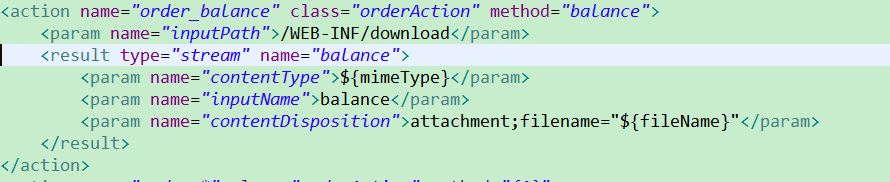
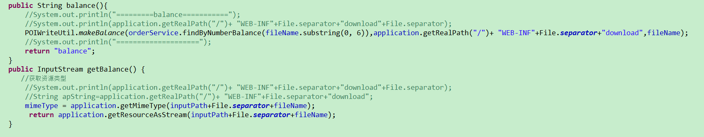

## JavaEE下的路径（Struts，Servlet）
<!--more-->
##### strtus.xml


```
		<action name="order_balance" class="orderAction" method="balance">
			<!-- 指定被下载资源的位置 -->
			<param name="inputPath">/WEB-INF/download</param>
				<!-- 配置结果类型为stream的结果 -->
			<result type="stream" name="balance">
				<!-- 指定下载文件的文件类型 动态获取getMimeType()-->
				<param name="contentType">${mimeType}</param>
				<!-- 指定由getBalance()方法返回被下载文件的InputStream -->
				<param name="inputName">balance</param>
				<param name="contentDisposition">attachment;filename="${fileName}"</param>
			</result>
		</action>

```
##### Action

```
package Action;
import java.io.File;
import java.io.InputStream;
import org.apache.struts2.ServletActionContext;
import Model.Order;
import SQLModel.Pager;
import Service.OrderService;
import Util.POIWriteUtil;

public class OrderAction extends  SuperAction<Order>{
	private static final long serialVersionUID = 1L;
	private OrderService orderService;
	private String fileName;
	private String inputPath;
	private String mimeType;
	private InputStream balance;
	public void setFileName(String fileName) {
		this.fileName = fileName;
	}
	public String getFileName() {
		return fileName;
	}
	public void setInputPath(String inputPath) {
		this.inputPath = inputPath;
	}
	public String getMimeType() {
		return mimeType;
	}
	public void setOrderService(OrderService orderService) {
		this.orderService = orderService;
	}
	public String balance(){
		//System.out.println("=========balance===========");
		//System.out.println(application.getRealPath("/")+ "WEB-INF"+File.separator+"download"+File.separator);
		String realPath=application.getRealPath("/")+ "WEB-INF"+File.separator+"download";
		POIWriteUtil.makeBalance(orderService.findByNumberBalance(fileName.substring(0, 6)),realPath,fileName);
		//System.out.println("====================");
		return "balance";
	}
	public InputStream getBalance() {  
       //获取资源类型
		//System.out.println(application.getRealPath("/")+ "WEB-INF"+File.separator+"download"+File.separator);
		//String apString=application.getRealPath("/")+ "WEB-INF"+File.separator+"download";
		//System.out.println(application.getResourceAsStream(inputPath+File.separator+fileName));
		mimeType = application.getMimeType(inputPath+File.separator+fileName);
		 return application.getResourceAsStream(inputPath+File.separator+fileName);
    }  

}


```
##### SuperAction
```
package Action;

import java.lang.reflect.ParameterizedType;
import javax.servlet.ServletContext;
import javax.servlet.http.HttpServletRequest;
import javax.servlet.http.HttpServletResponse;
import javax.servlet.http.HttpSession;
import org.apache.struts2.interceptor.ServletRequestAware;
import org.apache.struts2.interceptor.ServletResponseAware;
import org.apache.struts2.util.ServletContextAware;
import org.springframework.beans.BeansException;
import org.springframework.context.ApplicationContext;
import org.springframework.context.ApplicationContextAware;
import com.opensymphony.xwork2.ActionSupport;
import com.opensymphony.xwork2.ModelDriven;

//所有Action的父类
public class SuperAction<T> extends ActionSupport
		implements ApplicationContextAware,ServletRequestAware, ServletResponseAware, ServletContextAware,ModelDriven<T> {
	/**
	 * 
	 */
	private static final long serialVersionUID = 1L;
	protected HttpServletRequest request;// 请求对象
	protected HttpServletResponse response;// 响应对象
	protected HttpSession session;// 会话对象
	protected ServletContext application;// 全局对象
	protected ApplicationContext ctx;
	protected T model = null;
	
	
	public void setServletContext(ServletContext application) {
		this.application = application;
	}

	public void setServletResponse(HttpServletResponse response) {
		this.response = response;
	}

	public void setServletRequest(HttpServletRequest request) {
		this.request = request;
		this.session = this.request.getSession();
	}
	@Override
	public void setApplicationContext(ApplicationContext ctx) throws BeansException {
		this.ctx=ctx;
	}
	// 在拦截器执行此方法的时候Action的构造方法已经创建,所以Model中有值
	public T getModel() {
		return model;
	}
	@SuppressWarnings({ "rawtypes", "unchecked" })
	public SuperAction() {
		ParameterizedType type = (ParameterizedType) this.getClass().getGenericSuperclass();
		Class clazz = (Class) type.getActualTypeArguments()[0];
		try {
			model = (T) clazz.newInstance();
		} catch (Exception e) {
			e.printStackTrace();
		}
	}


}

```
POIWriteUtil作用：通过POI生成excel文件
##### 前台
```
<a href="order_balance?fileName=201607.xls">下载账单</a>
```

#### 上传，新增
application对象是我的应用全局变量

```
application.getRealPath("/");
```

```
	System.out.println(application.getRealPath("/"));
	D:\WorkSpace\.metadata\.plugins\org.eclipse.wst.server.core\tmp0\wtpwebapps\SSH\
```
##### 找到的是eclipse的工作路径，生成的文件也在
#### 下载通过<struts.xml\><param name="inputPath"\>/WEB-INF/download</param\>配置inputPath
通过Struts拦截器调用setFileName()获取前台的fileName
```
application.getResourceAsStream(inputPath+File.separator+fileName);

```

#### 常见错误分析

##### Can not find a java.io.InputStream with the name [balance] in the invocation stack. Check the <param name="inputName"> tag specified for this action.
实际上我已经定义了balance，但是报错说的balance找不到实际上是因为获取不到文件导致的

System.out.println(application.getResourceAsStream(inputPath+File.separator+fileName));等于null
```
Stacktraces
java.lang.IllegalArgumentException: Can not find a java.io.InputStream with the name [balance] in the invocation stack. Check the <param name="inputName"> tag specified for this action.
    org.apache.struts2.dispatcher.StreamResult.doExecute(StreamResult.java:237)
    org.apache.struts2.dispatcher.StrutsResultSupport.execute(StrutsResultSupport.java:191)
    com.opensymphony.xwork2.DefaultActionInvocation.executeResult(DefaultActionInvocation.java:372)
    com.opensymphony.xwork2.DefaultActionInvocation.invoke(DefaultActionInvocation.java:276)
    org.apache.struts2.interceptor.DeprecationInterceptor.intercept(DeprecationInterceptor.java:41)
    com.opensymphony.xwork2.DefaultActionInvocation.invoke(DefaultActionInvocation.java:245)
    org.apache.struts2.interceptor.debugging.DebuggingInterceptor.intercept(DebuggingInterceptor.java:256)
    com.opensymphony.xwork2.DefaultActionInvocation.invoke(DefaultActionInvocation.java:245)
    com.opensymphony.xwork2.interceptor.DefaultWorkflowInterceptor.doIntercept(DefaultWorkflowInterceptor.java:168)
    com.opensymphony.xwork2.interceptor.MethodFilterInterceptor.intercept(MethodFilterInterceptor.java:98)
    com.opensymphony.xwork2.DefaultActionInvocation.invoke(DefaultActionInvocation.java:245)
    com.opensymphony.xwork2.validator.ValidationInterceptor.doIntercept(ValidationInterceptor.java:265)
    org.apache.struts2.interceptor.validation.AnnotationValidationInterceptor.doIntercept(AnnotationValidationInterceptor.java:76)
    com.opensymphony.xwork2.interceptor.MethodFilterInterceptor.intercept(MethodFilterInterceptor.java:98)
    com.opensymphony.xwork2.DefaultActionInvocation.invoke(DefaultActionInvocation.java:245)
    com.opensymphony.xwork2.interceptor.ConversionErrorInterceptor.intercept(ConversionErrorInterceptor.java:138)
    com.opensymphony.xwork2.DefaultActionInvocation.invoke(DefaultActionInvocation.java:245)
    com.opensymphony.xwork2.interceptor.ParametersInterceptor.doIntercept(ParametersInterceptor.java:229)
    com.opensymphony.xwork2.interceptor.MethodFilterInterceptor.intercept(MethodFilterInterceptor.java:98)
    com.opensymphony.xwork2.DefaultActionInvocation.invoke(DefaultActionInvocation.java:245)
    com.opensymphony.xwork2.interceptor.ParametersInterceptor.doIntercept(ParametersInterceptor.java:229)
    com.opensymphony.xwork2.interceptor.MethodFilterInterceptor.intercept(MethodFilterInterceptor.java:98)
    com.opensymphony.xwork2.DefaultActionInvocation.invoke(DefaultActionInvocation.java:245)
    com.opensymphony.xwork2.interceptor.StaticParametersInterceptor.intercept(StaticParametersInterceptor.java:191)
    com.opensymphony.xwork2.DefaultActionInvocation.invoke(DefaultActionInvocation.java:245)
    org.apache.struts2.interceptor.MultiselectInterceptor.intercept(MultiselectInterceptor.java:73)
    com.opensymphony.xwork2.DefaultActionInvocation.invoke(DefaultActionInvocation.java:245)
    org.apache.struts2.interceptor.DateTextFieldInterceptor.intercept(DateTextFieldInterceptor.java:125)
    com.opensymphony.xwork2.DefaultActionInvocation.invoke(DefaultActionInvocation.java:245)
    org.apache.struts2.interceptor.CheckboxInterceptor.intercept(CheckboxInterceptor.java:91)
    com.opensymphony.xwork2.DefaultActionInvocation.invoke(DefaultActionInvocation.java:245)
    org.apache.struts2.interceptor.FileUploadInterceptor.intercept(FileUploadInterceptor.java:253)
    com.opensymphony.xwork2.DefaultActionInvocation.invoke(DefaultActionInvocation.java:245)
    com.opensymphony.xwork2.interceptor.ModelDrivenInterceptor.intercept(ModelDrivenInterceptor.java:100)
    com.opensymphony.xwork2.DefaultActionInvocation.invoke(DefaultActionInvocation.java:245)
    com.opensymphony.xwork2.interceptor.ScopedModelDrivenInterceptor.intercept(ScopedModelDrivenInterceptor.java:141)
    com.opensymphony.xwork2.DefaultActionInvocation.invoke(DefaultActionInvocation.java:245)
    com.opensymphony.xwork2.interceptor.ChainingInterceptor.intercept(ChainingInterceptor.java:145)
    com.opensymphony.xwork2.DefaultActionInvocation.invoke(DefaultActionInvocation.java:245)
    com.opensymphony.xwork2.interceptor.PrepareInterceptor.doIntercept(PrepareInterceptor.java:171)
    com.opensymphony.xwork2.interceptor.MethodFilterInterceptor.intercept(MethodFilterInterceptor.java:98)
    com.opensymphony.xwork2.DefaultActionInvocation.invoke(DefaultActionInvocation.java:245)
    com.opensymphony.xwork2.interceptor.I18nInterceptor.intercept(I18nInterceptor.java:140)
    com.opensymphony.xwork2.DefaultActionInvocation.invoke(DefaultActionInvocation.java:245)
    org.apache.struts2.interceptor.ServletConfigInterceptor.intercept(ServletConfigInterceptor.java:164)
    com.opensymphony.xwork2.DefaultActionInvocation.invoke(DefaultActionInvocation.java:245)
    com.opensymphony.xwork2.interceptor.AliasInterceptor.intercept(AliasInterceptor.java:193)
    com.opensymphony.xwork2.DefaultActionInvocation.invoke(DefaultActionInvocation.java:245)
    com.opensymphony.xwork2.interceptor.ExceptionMappingInterceptor.intercept(ExceptionMappingInterceptor.java:189)
    com.opensymphony.xwork2.DefaultActionInvocation.invoke(DefaultActionInvocation.java:245)
    org.apache.struts2.impl.StrutsActionProxy.execute(StrutsActionProxy.java:54)
    org.apache.struts2.dispatcher.Dispatcher.serviceAction(Dispatcher.java:567)
    org.apache.struts2.dispatcher.ng.ExecuteOperations.executeAction(ExecuteOperations.java:81)
    org.apache.struts2.dispatcher.ng.filter.StrutsPrepareAndExecuteFilter.doFilter(StrutsPrepareAndExecuteFilter.java:99)
    org.apache.catalina.core.ApplicationFilterChain.internalDoFilter(ApplicationFilterChain.java:239)
    org.apache.catalina.core.ApplicationFilterChain.doFilter(ApplicationFilterChain.java:206)
    org.springframework.web.filter.CharacterEncodingFilter.doFilterInternal(CharacterEncodingFilter.java:121)
    org.springframework.web.filter.OncePerRequestFilter.doFilter(OncePerRequestFilter.java:107)
    org.apache.catalina.core.ApplicationFilterChain.internalDoFilter(ApplicationFilterChain.java:239)
    org.apache.catalina.core.ApplicationFilterChain.doFilter(ApplicationFilterChain.java:206)
    org.apache.catalina.core.StandardWrapperValve.invoke(StandardWrapperValve.java:219)
    org.apache.catalina.core.StandardContextValve.invoke(StandardContextValve.java:106)
    org.apache.catalina.authenticator.AuthenticatorBase.invoke(AuthenticatorBase.java:501)
    org.apache.catalina.core.StandardHostValve.invoke(StandardHostValve.java:142)
    org.apache.catalina.valves.ErrorReportValve.invoke(ErrorReportValve.java:79)
    org.apache.catalina.valves.AbstractAccessLogValve.invoke(AbstractAccessLogValve.java:610)
    org.apache.catalina.core.StandardEngineValve.invoke(StandardEngineValve.java:88)
    org.apache.catalina.connector.CoyoteAdapter.service(CoyoteAdapter.java:516)
    org.apache.coyote.http11.AbstractHttp11Processor.process(AbstractHttp11Processor.java:1086)
    org.apache.coyote.AbstractProtocol$AbstractConnectionHandler.process(AbstractProtocol.java:659)
    org.apache.coyote.http11.Http11NioProtocol$Http11ConnectionHandler.process(Http11NioProtocol.java:223)
    org.apache.tomcat.util.net.NioEndpoint$SocketProcessor.doRun(NioEndpoint.java:1558)
    org.apache.tomcat.util.net.NioEndpoint$SocketProcessor.run(NioEndpoint.java:1515)
    java.util.concurrent.ThreadPoolExecutor.runWorker(ThreadPoolExecutor.java:1142)
    java.util.concurrent.ThreadPoolExecutor$Worker.run(ThreadPoolExecutor.java:617)
    org.apache.tomcat.util.threads.TaskThread$WrappingRunnable.run(TaskThread.java:61)
    java.lang.Thread.run(Thread.java:745)
```

#####  java.io.IOException: 系统找不到指定的路径。
在上传文件的时候, 把realPath写错了，找不到路径，无法保存文件

```
application.getRealPath("/")
```


```
2016-07-19 16:55:04,917 -HHH000397: Using ASTQueryTranslatorFactory -INFO  -org.hibernate.hql.internal.QueryTranslatorFactoryInitiator:47 -[http-nio-8080-exec-42:8591ms]
 java.io.IOException: 系统找不到指定的路径。
	at java.io.WinNTFileSystem.createFileExclusively(Native Method)
	at java.io.File.createNewFile(File.java:1012)
	at Util.POIWriteUtil.makeHSSF(POIWriteUtil.java:38)
	at Util.POIWriteUtil.makeBalance(POIWriteUtil.java:29)
	at Action.OrderAction.balance(OrderAction.java:65)
	at sun.reflect.NativeMethodAccessorImpl.invoke0(Native Method)
	at sun.reflect.NativeMethodAccessorImpl.invoke(NativeMethodAccessorImpl.java:62)
	at sun.reflect.DelegatingMethodAccessorImpl.invoke(DelegatingMethodAccessorImpl.java:43)
	at java.lang.reflect.Method.invoke(Method.java:483)
	at ognl.OgnlRuntime.invokeMethod(OgnlRuntime.java:871)
	at ognl.OgnlRuntime.callAppropriateMethod(OgnlRuntime.java:1294)
	at ognl.ObjectMethodAccessor.callMethod(ObjectMethodAccessor.java:68)
	at com.opensymphony.xwork2.ognl.accessor.XWorkMethodAccessor.callMethodWithDebugInfo(XWorkMethodAccessor.java:117)
	at com.opensymphony.xwork2.ognl.accessor.XWorkMethodAccessor.callMethod(XWorkMethodAccessor.java:108)
	at ognl.OgnlRuntime.callMethod(OgnlRuntime.java:1370)
	at ognl.ASTMethod.getValueBody(ASTMethod.java:90)
	at ognl.SimpleNode.evaluateGetValueBody(SimpleNode.java:212)
	at ognl.SimpleNode.getValue(SimpleNode.java:258)
	at ognl.Ognl.getValue(Ognl.java:494)
	at ognl.Ognl.getValue(Ognl.java:458)
	at com.opensymphony.xwork2.ognl.OgnlUtil$2.execute(OgnlUtil.java:315)
	at com.opensymphony.xwork2.ognl.OgnlUtil.compileAndExecute(OgnlUtil.java:346)
	at com.opensymphony.xwork2.ognl.OgnlUtil.getValue(OgnlUtil.java:313)
	at com.opensymphony.xwork2.DefaultActionInvocation.invokeAction(DefaultActionInvocation.java:430)
	at com.opensymphony.xwork2.DefaultActionInvocation.invokeActionOnly(DefaultActionInvocation.java:290)
	at com.opensymphony.xwork2.DefaultActionInvocation.invoke(DefaultActionInvocation.java:251)
	at org.apache.struts2.interceptor.DeprecationInterceptor.intercept(DeprecationInterceptor.java:41)
	at com.opensymphony.xwork2.DefaultActionInvocation.invoke(DefaultActionInvocation.java:245)
	at org.apache.struts2.interceptor.debugging.DebuggingInterceptor.intercept(DebuggingInterceptor.java:256)
	at com.opensymphony.xwork2.DefaultActionInvocation.invoke(DefaultActionInvocation.java:245)
	at com.opensymphony.xwork2.interceptor.DefaultWorkflowInterceptor.doIntercept(DefaultWorkflowInterceptor.java:168)
	at com.opensymphony.xwork2.interceptor.MethodFilterInterceptor.intercept(MethodFilterInterceptor.java:98)
	at com.opensymphony.xwork2.DefaultActionInvocation.invoke(DefaultActionInvocation.java:245)
	at com.opensymphony.xwork2.validator.ValidationInterceptor.doIntercept(ValidationInterceptor.java:265)
	at org.apache.struts2.interceptor.validation.AnnotationValidationInterceptor.doIntercept(AnnotationValidationInterceptor.java:76)
	at com.opensymphony.xwork2.interceptor.MethodFilterInterceptor.intercept(MethodFilterInterceptor.java:98)
	at com.opensymphony.xwork2.DefaultActionInvocation.invoke(DefaultActionInvocation.java:245)
	at com.opensymphony.xwork2.interceptor.ConversionErrorInterceptor.intercept(ConversionErrorInterceptor.java:138)
	at com.opensymphony.xwork2.DefaultActionInvocation.invoke(DefaultActionInvocation.java:245)
	at com.opensymphony.xwork2.interceptor.ParametersInterceptor.doIntercept(ParametersInterceptor.java:229)
	at com.opensymphony.xwork2.interceptor.MethodFilterInterceptor.intercept(MethodFilterInterceptor.java:98)
	at com.opensymphony.xwork2.DefaultActionInvocation.invoke(DefaultActionInvocation.java:245)
	at com.opensymphony.xwork2.interceptor.ParametersInterceptor.doIntercept(ParametersInterceptor.java:229)
	at com.opensymphony.xwork2.interceptor.MethodFilterInterceptor.intercept(MethodFilterInterceptor.java:98)
	at com.opensymphony.xwork2.DefaultActionInvocation.invoke(DefaultActionInvocation.java:245)
	at com.opensymphony.xwork2.interceptor.StaticParametersInterceptor.intercept(StaticParametersInterceptor.java:191)
	at com.opensymphony.xwork2.DefaultActionInvocation.invoke(DefaultActionInvocation.java:245)
	at org.apache.struts2.interceptor.MultiselectInterceptor.intercept(MultiselectInterceptor.java:73)
	at com.opensymphony.xwork2.DefaultActionInvocation.invoke(DefaultActionInvocation.java:245)
	at org.apache.struts2.interceptor.DateTextFieldInterceptor.intercept(DateTextFieldInterceptor.java:125)
	at com.opensymphony.xwork2.DefaultActionInvocation.invoke(DefaultActionInvocation.java:245)
	at org.apache.struts2.interceptor.CheckboxInterceptor.intercept(CheckboxInterceptor.java:91)
	at com.opensymphony.xwork2.DefaultActionInvocation.invoke(DefaultActionInvocation.java:245)
	at org.apache.struts2.interceptor.FileUploadInterceptor.intercept(FileUploadInterceptor.java:253)
	at com.opensymphony.xwork2.DefaultActionInvocation.invoke(DefaultActionInvocation.java:245)
	at com.opensymphony.xwork2.interceptor.ModelDrivenInterceptor.intercept(ModelDrivenInterceptor.java:100)
	at com.opensymphony.xwork2.DefaultActionInvocation.invoke(DefaultActionInvocation.java:245)
	at com.opensymphony.xwork2.interceptor.ScopedModelDrivenInterceptor.intercept(ScopedModelDrivenInterceptor.java:141)
	at com.opensymphony.xwork2.DefaultActionInvocation.invoke(DefaultActionInvocation.java:245)
	at com.opensymphony.xwork2.interceptor.ChainingInterceptor.intercept(ChainingInterceptor.java:145)
	at com.opensymphony.xwork2.DefaultActionInvocation.invoke(DefaultActionInvocation.java:245)
	at com.opensymphony.xwork2.interceptor.PrepareInterceptor.doIntercept(PrepareInterceptor.java:171)
	at com.opensymphony.xwork2.interceptor.MethodFilterInterceptor.intercept(MethodFilterInterceptor.java:98)
	at com.opensymphony.xwork2.DefaultActionInvocation.invoke(DefaultActionInvocation.java:245)
	at com.opensymphony.xwork2.interceptor.I18nInterceptor.intercept(I18nInterceptor.java:140)
	at com.opensymphony.xwork2.DefaultActionInvocation.invoke(DefaultActionInvocation.java:245)
	at org.apache.struts2.interceptor.ServletConfigInterceptor.intercept(ServletConfigInterceptor.java:164)
	at com.opensymphony.xwork2.DefaultActionInvocation.invoke(DefaultActionInvocation.java:245)
	at com.opensymphony.xwork2.interceptor.AliasInterceptor.intercept(AliasInterceptor.java:193)
	at com.opensymphony.xwork2.DefaultActionInvocation.invoke(DefaultActionInvocation.java:245)
	at com.opensymphony.xwork2.interceptor.ExceptionMappingInterceptor.intercept(ExceptionMappingInterceptor.java:189)
	at com.opensymphony.xwork2.DefaultActionInvocation.invoke(DefaultActionInvocation.java:245)
	at org.apache.struts2.impl.StrutsActionProxy.execute(StrutsActionProxy.java:54)
	at org.apache.struts2.dispatcher.Dispatcher.serviceAction(Dispatcher.java:567)
	at org.apache.struts2.dispatcher.ng.ExecuteOperations.executeAction(ExecuteOperations.java:81)
	at org.apache.struts2.dispatcher.ng.filter.StrutsPrepareAndExecuteFilter.doFilter(StrutsPrepareAndExecuteFilter.java:99)
	at org.apache.catalina.core.ApplicationFilterChain.internalDoFilter(ApplicationFilterChain.java:239)
	at org.apache.catalina.core.ApplicationFilterChain.doFilter(ApplicationFilterChain.java:206)
	at org.springframework.web.filter.CharacterEncodingFilter.doFilterInternal(CharacterEncodingFilter.java:121)
	at org.springframework.web.filter.OncePerRequestFilter.doFilter(OncePerRequestFilter.java:107)
	at org.apache.catalina.core.ApplicationFilterChain.internalDoFilter(ApplicationFilterChain.java:239)
	at org.apache.catalina.core.ApplicationFilterChain.doFilter(ApplicationFilterChain.java:206)
	at org.apache.catalina.core.StandardWrapperValve.invoke(StandardWrapperValve.java:219)
	at org.apache.catalina.core.StandardContextValve.invoke(StandardContextValve.java:106)
	at org.apache.catalina.authenticator.AuthenticatorBase.invoke(AuthenticatorBase.java:501)
	at org.apache.catalina.core.StandardHostValve.invoke(StandardHostValve.java:142)
	at org.apache.catalina.valves.ErrorReportValve.invoke(ErrorReportValve.java:79)
	at org.apache.catalina.valves.AbstractAccessLogValve.invoke(AbstractAccessLogValve.java:610)
	at org.apache.catalina.core.StandardEngineValve.invoke(StandardEngineValve.java:88)
	at org.apache.catalina.connector.CoyoteAdapter.service(CoyoteAdapter.java:516)
	at org.apache.coyote.http11.AbstractHttp11Processor.process(AbstractHttp11Processor.java:1086)
	at org.apache.coyote.AbstractProtocol$AbstractConnectionHandler.process(AbstractProtocol.java:659)
	at org.apache.coyote.http11.Http11NioProtocol$Http11ConnectionHandler.process(Http11NioProtocol.java:223)
	at org.apache.tomcat.util.net.NioEndpoint$SocketProcessor.doRun(NioEndpoint.java:1558)
	at org.apache.tomcat.util.net.NioEndpoint$SocketProcessor.run(NioEndpoint.java:1515)
	at java.util.concurrent.ThreadPoolExecutor.runWorker(ThreadPoolExecutor.java:1142)
	at java.util.concurrent.ThreadPoolExecutor$Worker.run(ThreadPoolExecutor.java:617)
	at org.apache.tomcat.util.threads.TaskThread$WrappingRunnable.run(TaskThread.java:61)
	at java.lang.Thread.run(Thread.java:745)

```