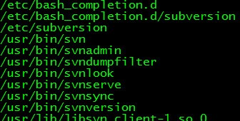
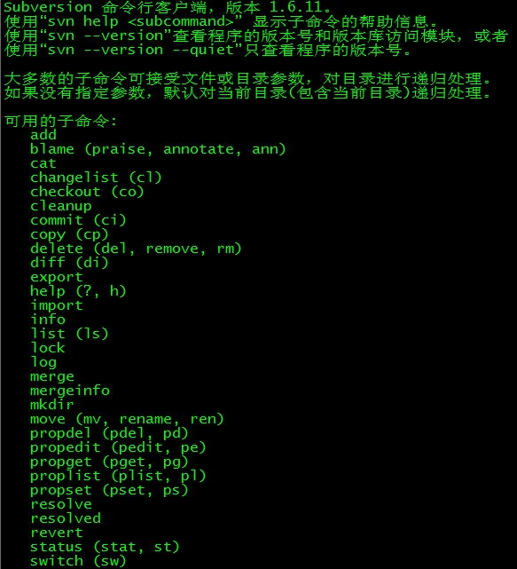
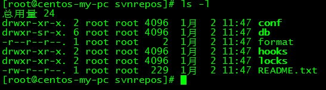
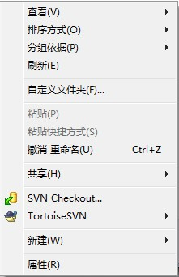
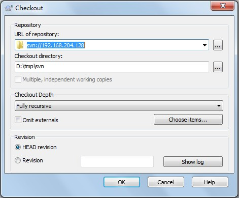

### 1、安装步骤如下：

```
yum install subversion

```

<!--more-->
### 2、输入rpm -ql subversion查看安装位置，如下图：

我们知道svn在bin目录下生成了几个二进制文件。

输入 svn --help可以查看svn的使用方法，如下图。

### 3、创建svn版本库目录

```
mkdir -p /var/svn/svnrepos
```

### 4、创建版本库
```
svnadmin create /var/svn/svnrepos
```
执行了这个命令之后会在/var/svn/svnrepos目录下生成如下这些文件

### 5、进入conf目录（该svn版本库配置文件）

authz文件是权限控制文件
passwd是帐号密码文件
svnserve.conf SVN服务配置文件

### 6、设置帐号密码

```
vi passwd
```

在[users]块中添加用户和密码，格式：帐号=密码，如zhang=zhang

### 7、设置权限
```
vi authz
```
在末尾添加如下代码：
```
[/]
zhang=rw
w=r
```
意思是版本库的根目录zhang对其有读写权限，w只有读权限。

### 8、修改svnserve.conf文件
```
vi svnserve.conf（注意前面没有空格）
```
打开下面的几个注释：
```
anon-access = read #匿名用户可读
auth-access = write #授权用户可写
password-db = passwd #使用哪个文件作为账号文件
authz-db = authz #使用哪个文件作为权限文件
realm = /var/svn/svnrepos # 认证空间名，版本库所在目录
```

### 9、启动svn版本库

```
svnserve -d -r /var/svn/svnrepos
```

### 10、在windows上测试

新建一个测试文件夹，在该文件夹下右键选择 SVN checkout如下图(要事先安装TortoiseSVN)：
填写SVN的地址，如下图：
输入密码，如下图：



# svn 日志文件显示时间为1970-01-01 No data ----------最终解决办法

此问题主要出现在svnserve文件中的anon-access访问权限的设置问题上。

##### 如果anon-access = none时，按照文档中注释：禁止所有匿名访问，也就是说如果不在authz-db中开放访问的用户，是不会允许读写版本日志的，故系统对日志的读写也纳入禁止访问范围，
#####  所以在查看日志时，出现时间日期显示为1970-01-01， 日志信息显示no data。也就是这个原因。所以在设置svnserve中的访问权限时，请设置为 anon-access = read，只读模式。这样的话，日志文件即可显示正常。

## 但是，实践证明`anon-access = none`才是正确的。
