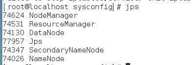

```
修改/etc/profile文件 
如果你的计算机仅仅作为开发使用时推荐使用这种方法，因为所有用户的shell都有权使用这些环境变量，可能会给系统带来安全性问题。 
·用文本编辑器打开/etc/profile 
·在profile文件末尾加入： 
export JAVA_HOME=/usr/local/jdk1.8.0_144 
export CLASSPATH=.:$JAVA_HOME/lib 
export PATH=$JAVA_HOME/bin:$PATH 

```
> source /etc/profile


原本是有openjdk的但是为了少踩点坑，准备换成HotSpot，于是就遇到了很多问题，总是更换失败。

环境变量/etc/profile  .bashrc .profile

```
#set oracle jdk environment
export JAVA_HOME=/usr/lib/jvm/jdk1.8.0_111  ## 这里要注意目录要换成自己解压的jdk 目录
export JRE_HOME=${JAVA_HOME}/jre  
export CLASSPATH=.:${JAVA_HOME}/lib:${JRE_HOME}/lib  
export PATH=${JAVA_HOME}/bin:$PATH 
```
#### java -version 版本查看
#### which java 查看是执行的哪一个

`which java `总是出现的就是一个/usr/bin/java 这里需要的是软链。

将下载下来的java版本安装
sudo update-alternatives --install /usr/bin/java java /usr/lib/jvm/jdk1.8.0_111/bin/java 300
sudo update-alternatives --install /usr/bin/javac javac /usr/lib/jvm/jdk1.8.0_111/bin/javac 300

sudo update-alternatives --display java 展示
sudo update-alternatives --config java 配置
sudo update-alternatives --config javac 配置
sudo update-java-alternatives -l
需要选中一个

-----------------------------------------

hadoop配置文件 ，以及安装步骤
[hadoop配置文件](https://ask.hellobi.com/blog/niupoop/8832)

window用cygwin64 总是失败，就转换到linux，一下子就启动成功了。

CentOS 7.0默认使用的是firewall作为防火墙，这样对于传统的 `service iptables stop` 就没有用了,

```
systemctl stop firewalld.service #停止firewall
systemctl disable firewalld.service #禁止firewall开机启动
firewall-cmd --state #查看默认防火墙状态（关闭后显示notrunning，开启后显示running）
```
