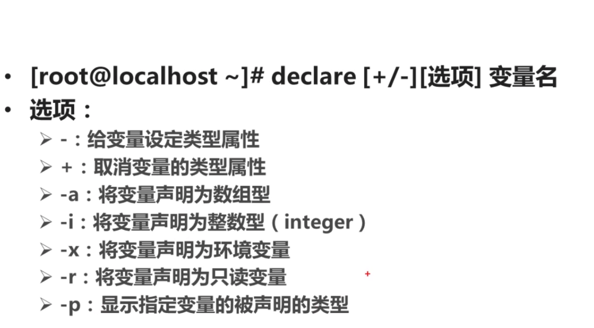
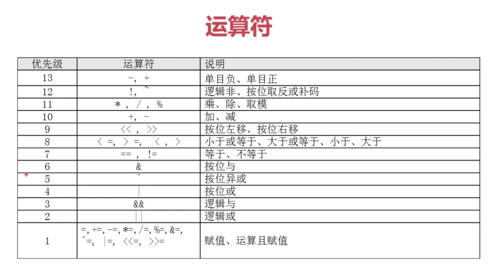
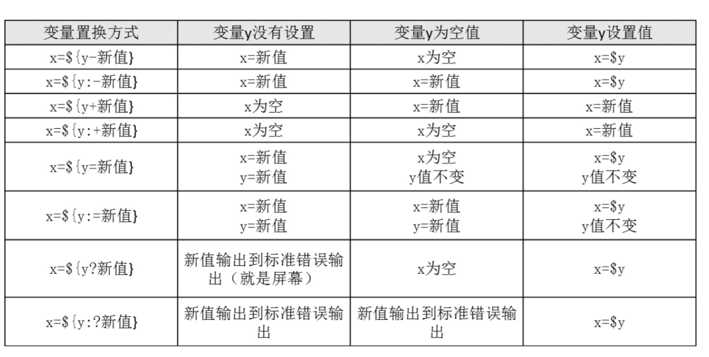
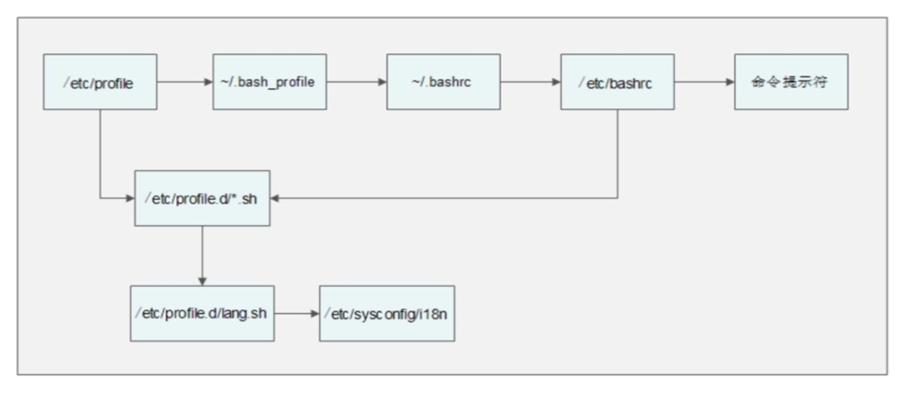

# `#!/bin/bash`

## Bash变量

#### 用户自定义变量

`变量名=变量值` 默认变量值为字符串

`echo $变量名`

变量叠加  x="$x"other | x=${x}other

`set`：查询所有变量

`set -u` 然后调用未声明的变量会报错

`unset 变量名`：删除变量

`exoprt` 变成系统变量(实质上是`declare`)

`env`:只能看到环境变量
<!--more-->
#### 常见系统变量

HOSTNAME SHELL SSH USER  HOME MAIL TERM

PATH

`locale` 支持的语系 LANG系统主语系 LC_ALL

下次开机的默认语系:/etc/sysconfig/i18n

PS1 命令提示符变量

#### 位置参数变量
$n 

$0 命令本身

$1-9 ${10} 参数

$\*  所有传入的参数是一个整体

$@   所有传入的参数是独立的，有几个参数，循环几次

$\#  返回传入参数的个数

------

`read` 接受键盘输入(交互)

##### -p 输入

##### -t 等待时间

##### -s 隐藏

##### -n 指定输入的字节数

--------

#### 预定义变量

$? 返回上一条命令的执行状态

正确执行 返回0 | 执行错误 返回2 | 命令找不到 返回127

$$ 返回当前进程的PID号

$! 返回后台运行的最后一个进程的PID号

## Shell运算符
 >弱类型，类似javascript

`declare` [+/-] [i/a/]

`expr` `let`

##### $((运算式)) $[运算式]

##### 变量测试

## 环境变量配置文件

重新加载配置文件: `source 配置文件`  `. 配置文件`

正常登陆过程，主要的文件:

/etc/profile

/etc/profile.d/*.sh

~/.bash_profile

~/.bashrc

/etc/bashrc

加载文件顺序>>[login而不是开机]

注销

~/.bash_logout

历史命令

~/.bash_history

## 正则表达式

## 流程控制语句

常用的shell

#### 判断文件存在

if [ -e file ] then

fi
