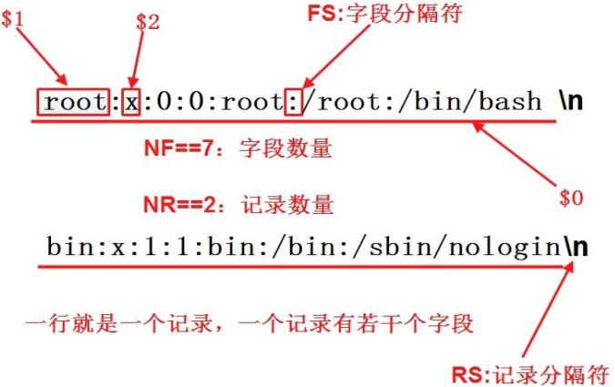

## 安装

#### yum 


`yum list` 

`yum install`

`rpm`

-a：查询所有套件； 
-b<完成阶段><套件档>+或-t <完成阶段><套件档>+：设置包装套件的完成阶段，并指定套件档的文件名称； 
-c：只列出组态配置文件，本参数需配合"-l"参数使用； 
-d：只列出文本文件，本参数需配合"-l"参数使用； 
-e<套件档>或--erase<套件档>：删除指定的套件； 
-f<文件>+：查询拥有指定文件的套件； 
-h或--hash：套件安装时列出标记； 
-i：显示套件的相关信息； -i<套件档>或--install<套件档>：安装指定的套件档； 
-l：显示套件的文件列表； -p<套件档>+：查询指定的RPM套件档； 
-q：使用询问模式，当遇到任何问题时，rpm指令会先询问用户； 
-R：显示套件的关联性信息； 
-s：显示文件状态，本参数需配合"-l"参数使用； 
-U<套件档>或--upgrade<套件档>：升级指定的套件档； 
-v：显示指令执行过程； 
-vv：详细显示指令执行过程，便于排错。


`yum`

install：安装rpm软件包； 
update：更新rpm软件包； 
check-update：检查是否有可用的更新rpm软件包； 
remove：删除指定的rpm软件包； 
list：显示软件包的信息； 
search：检查软件包的信息； 
info：显示指定的rpm软件包的描述信息和概要信息； 
clean：清理yum过期的缓存； 
shell：进入yum的shell提示符； 
resolvedep：显示rpm软件包的依赖关系； 
localinstall：安装本地的rpm软件包； 
localupdate：显示本地rpm软件包进行更新；
deplist：显示rpm软件包的所有依赖关系。

## Vim

- 选中 v，移动光标 然后y复制  （visual mode）
- 复制yy 3yy 复制光标行，复制光标及下面两行（yank拉取）
- 粘贴p 光标处粘贴复制内容（put paste放置）
- 删除dd 3dd 删除光标行，删除光标及以下三行（delete）
- u 撤销（undo）  Ctrl +R 回撤
- Ctrl f 下一页 Ctrl b 上一页（）
- 行头行尾 0/^行首 $ 行尾
- 文件头文件尾 gg/1G 文件头部  3G 第三行 G 文件尾部 
- 光标跳转上一个位置Ctrl + O  Ctrl + I
- /查找匹配 n 下一个

### 查找高亮：

在查找模式中加入\c表示大小写不敏感查找，\C表示大小写敏感查找。例如：  /foo\c  将会查找所有的"foo","FOO","Foo"等字符串

一，全匹配：

1，从上往下查找，比如“string” ：   /string

2，从下往上查找，比如“string” ： ?string 

二，模糊匹配（正则表达式）

1，. ：通配1个字符 ，如 匹配 server, 可以用  /se...r

2，* ：通配多个字符，如 匹配 privilege，可以用 p*ge

三，快速查找

1， Shift + * ：让光标停留在想要查找的单词的任意一个字母上面， 然后输入 Shift + * ，即可快速选中该单词，并且通过 n  或  N 进行上一个或下一个的匹配。

不常用
2，yw ：让光标停留在单词的第一个字母上， 然后输入yw拷贝该单词， 然后输入 / (Ctrl + R) 0 （即 /"0），回车， 就查找到了第一个匹配的单词， 并且通过 n  或  N 进行上一个或下一个的匹配。

取消搜索高亮

:nohlsearch

### 查找与替换  :s（substitute）命令用来查找和替换字符串。语法如下：

:{作用范围}s/{目标}/{替换}/{替换标志}
例如:%s/foo/bar/g会在全局范围(%)查找foo并替换为bar，所有出现都会被替换（g）。i表示大小写不敏感查找，I表示大小写敏感， 默认敏感查找

作用范围 作用范围分为当前行、全文、选区等等。

- 当前行：  :s/foo/bar/g
- 全文：    :%s/foo/bar/g
- 选区，在Visual模式下选择区域后输入:，Vim即可自动补全为 :'<,'>。 :'<,'>s/foo/bar/g
- 2-11行： :5,12s/foo/bar/g
- 当前行.与接下来两行+2：  :.,+2s/foo/bar/g


[网址](https://blog.csdn.net/de_moivre/article/details/84663132)


vim的一些默认配置

```
/.vimrc
https://www.cnblogs.com/qiyuexin/p/6398606.html

"显示行号, 或set number
set nu

"打开语法高亮
syntax on

"使用配色方案
colorscheme desert

"打开文件类型检测功能
filetype on

"不同文件类型采用不同缩进
filetype indent on

"允许使用插件
filetype plugin on
filetype plugin indent on

"关闭vi模式
set nocp

"与windows共享剪贴板
set clipboard+=unnamed

"取消VI兼容，VI键盘模式不易用
set nocompatible

"历史命令保存行数 
set history=100 

"当文件被外部改变时自动读取
set autoread 

"取消自动备份及产生swp文件
set nobackup
set nowb
set noswapfile

"允许使用鼠标点击定位
set mouse=a

"允许区域选择
set selection=exclusive
set selectmode=mouse,key

"高亮光标所在行
set cursorline

"取消光标闪烁
set novisualbell

"总是显示状态行
set laststatus=2

"状态栏显示当前执行的命令
set showcmd

"标尺功能，显示当前光标所在行列号
set ruler

"设置命令行高度为3
set cmdheight=3

"粘贴时保持格式
set paste

"高亮显示匹配的括号
set showmatch

"在搜索的时候忽略大小写
set ignorecase
 
"高亮被搜索的句子
set hlsearch
 
"在搜索时，输入的词句的逐字符高亮（类似firefox的搜索）
set incsearch

"继承前一行的缩进方式，特别适用于多行注释
set autoindent

"为C程序提供自动缩进
set smartindent

"使用C样式的缩进
set cindent

"制表符为4
set tabstop=4

"统一缩进为4
set softtabstop=4
set shiftwidth=4

"允许使用退格键，或set backspace=2
set backspace=eol,start,indent
set whichwrap+=<,>,h,l

"取消换行
set nowrap

"启动的时候不显示那个援助索马里儿童的提示
set shortmess=atI

"在被分割的窗口间显示空白，便于阅读
set fillchars=vert:\ ,stl:\ ,stlnc:\

"光标移动到buffer的顶部和底部时保持3行距离, 或set so=3
set scrolloff=3

"设定默认解码
set fenc=utf-8
set fencs=utf-8,usc-bom,euc-jp,gb18030,gbk,gb2312,cp936

"设定字体
set guifont=Courier_New:h11:cANSI
set guifontwide=新宋体:h11:cGB2312
 
"设定编码
set enc=utf-8
set fileencodings=ucs-bom,utf-8,chinese
set langmenu=zh_CN.UTF-8
language message zh_CN.UTF-8
source $VIMRUNTIME/delmenu.vim
source $VIMRUNTIME/menu.vim

"自动补全
filetype plugin indent on
set completeopt=longest,menu

"自动补全命令时候使用菜单式匹配列表
set wildmenu
autocmd FileType ruby,eruby set omnifunc=rubycomplete#Complete
autocmd FileType python set omnifunc=pythoncomplete#Complete
autocmd FileType javascript set omnifunc=javascriptcomplete#CompleteJS
autocmd FileType html set omnifunc=htmlcomplete#CompleteTags
autocmd FileType css set omnifunc=csscomplete#CompleteCSS
autocmd FileType xml set omnifunc=xmlcomplete#CompleteTags
autocmd FileType java set omnifunc=javacomplete#Complet

```
## 高级

`awk` `gawk`: 



awk '{print $0}'

    -F参数：指定分隔符，可指定一个或多个
 awk -F":" '{ print $1 }' /etc/passwd  冒号作为分隔符
 awk -F '[ ,]+' '{print $3" "$7}' test.txt    空格和逗号都分隔

[awk 操作指南](http://www.cnblogs.com/ginvip/p/6352157.html)


`sed`: 

`m4`: 

`gcc`: gcc/g++程序,语言C、C++

`perl`: perl程序,语言Perl

`python`: python程序,语言Python

`java`: javac程序,语言java

`mono`: mono程序,语言.NET

`php`: php程序,语言PHP

`ruby`: ruby程序,语言Ruby

[CMD快捷键](https://www.cnblogs.com/webzhangnan/p/3221410.html)

[scp](https://www.cnblogs.com/webnote/p/5877920.html)

scp root@192.168.120.204:/opt/soft/nginx-0.5.38.tar.gz /opt/soft/

scp root@192.168.120.204:/opt/soft/nginx-0.5.38.tar.gz /opt/soft/