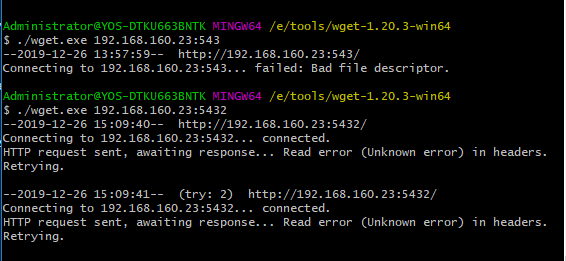

#### shell 常用快捷键

[常用shell快捷键](https://blog.csdn.net/weixin_42256178/article/details/80392077)

- ctrl + a 命令行首
- ctrl + e 命令行尾（end）
- ctrl + b 相当于方向键左←（）
- ctrl + f 相当于方向键右→
- 
- ctrl + u 剪切光标到行首
- ctrl + k 剪切光标到行尾
- ctrl + w 剪切光标前一个单词
- ctrl + y 粘贴上面三个的复制
- ctrl + z 挂起当前命令 jobs bg fg  唤醒
- 
- ctrl + r 搜索之前的命令
- ctrl + g 取消搜索
-
- ctrl + s 锁屏，挂起当前shell
- ctrl + q 取消锁屏，重新启用当前shell
- ctrl + l clear 清屏

- ctrl + insert 插入

#### 其他常用命令

- ps -ef | grep tomcat 
- ps -aux | sort -k4nr |head -h 10 内存前十的进程
- du -sh *   当前路径（disk usage）
- df -hP  整个磁盘（disk free）
- df -k /tmp 查看磁盘使用
- crontab -l 定时任务
- tail -f -n 200 /root/file.log 查看实时日志文件
- free -h 查询内存文件
- /var/log/messages 系统日志，
- service /etc/init.d  启动脚本位置
- netstat -ano | grep 端口占用
- netstat -tlnp | grep 端口占用

wget 判断端口
curl

