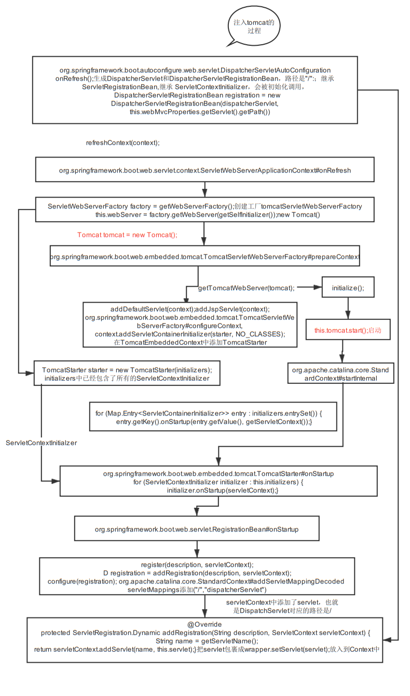
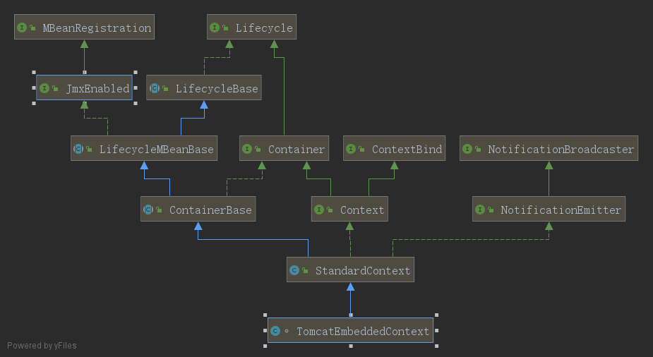
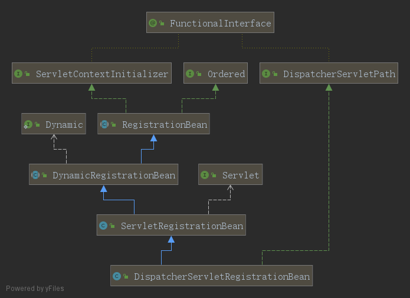
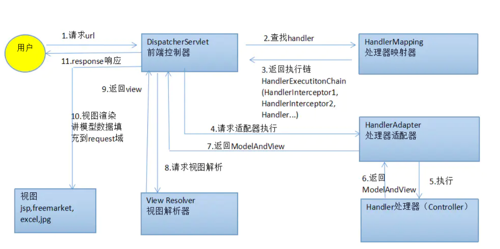
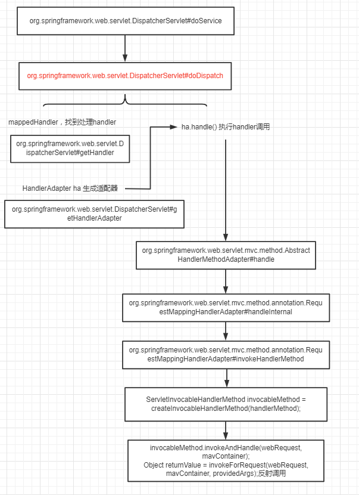
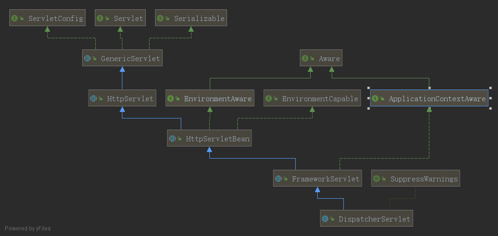
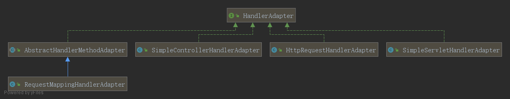
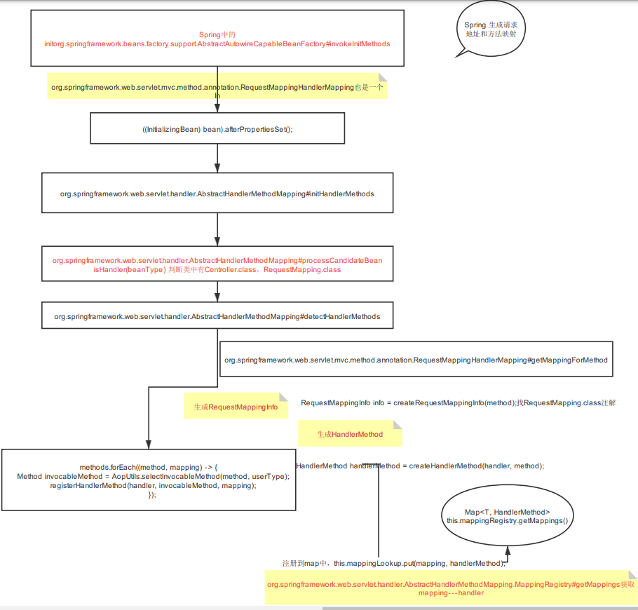
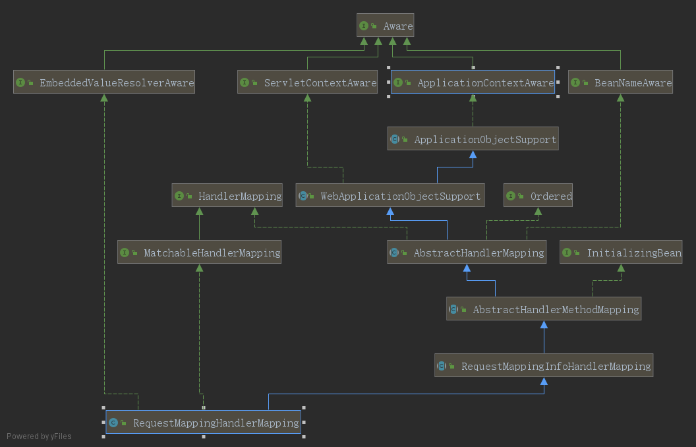
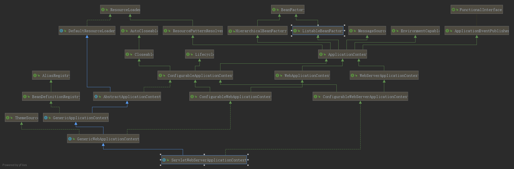

## SpringMVC的DispatcherServlet注册到tomcat中




直接从org.springframework.boot.web.servlet.context.ServletWebServerApplicationContext#onRefresh中看起，
重写onRefresh方法创建WebServer;

```
org.springframework.boot.web.servlet.context.ServletWebServerApplicationContext#createWebServer
private void createWebServer() {
    WebServer webServer = this.webServer;
    ServletContext servletContext = getServletContext();
    if (webServer == null && servletContext == null) {
        ServletWebServerFactory factory = getWebServerFactory();//这里获取了一个工厂
        this.webServer = factory.getWebServer(getSelfInitializer());//getSelfInitialzer()方法获取了一些需要实现ServletContextInitializer的对象，在StandardContext启动的时候，会之心onStartup()方法。
    }else if (servletContext != null) {
        try {
            getSelfInitializer().onStartup(servletContext);//这里如果没有servletContext的话就直接执行这些onStartup方法。
        }
        catch (ServletException ex) {
            throw new ApplicationContextException("Cannot initialize servlet context", ex);
        }
    }
    initPropertySources();
}
```

```
org.springframework.boot.web.embedded.tomcat.TomcatServletWebServerFactory#getWebServer
这里传入的getSelfInitializer()会在StandardContext start的时候执行onStartup方法。
@Override
public WebServer getWebServer(ServletContextInitializer... initializers) {
    Tomcat tomcat = new Tomcat();// 这个就是一个tocmat里面会添加两大组件 Connector和Container
    File baseDir = (this.baseDirectory != null) ? this.baseDirectory : createTempDir("tomcat");
    tomcat.setBaseDir(baseDir.getAbsolutePath());
    Connector connector = new Connector(this.protocol);
    tomcat.getService().addConnector(connector);//通过查看tomcat类方法，getService()会，getServer()里面 StandardService放在StandardServer然后把connector放在当前的StandardService中
    customizeConnector(connector);
    tomcat.setConnector(connector);//此处在所有的service中设置Connector
    tomcat.getHost().setAutoDeploy(false);//这里会设置一个StandardHost放在StandardEngine中
    configureEngine(tomcat.getEngine());//这里会获取service设置一个StandardEngine
    for (Connector additionalConnector : this.additionalTomcatConnectors) {
        tomcat.getService().addConnector(additionalConnector);
    }
    prepareContext(tomcat.getHost(), initializers);//这里把需要initialzers的ServletContextInitialzer放到
    return getTomcatWebServer(tomcat);// 最终返回的就是一个TomcatWebServer
}

protected TomcatWebServer getTomcatWebServer(Tomcat tomcat) {
    return new TomcatWebServer(tomcat, getPort() >= 0);
}
```

在初始化的时候会执行`initialize`,里面有启动`this.tomcat.start();`就是当前的Tomcat的启动。

重点看两个`prepareContext(tomcat.getHost(), initializers);`是准备了一个`TomcatEmbeddedContext`放在host里面

可看出来，这就是一个 StandardContext也是一个Container组件，就是tomcat的两个组件之一，另外一个是Connector。
```
protected void prepareContext(Host host, ServletContextInitializer[] initializers) {
		File documentRoot = getValidDocumentRoot();
		TomcatEmbeddedContext context = new TomcatEmbeddedContext();//新建一个  StandardContext
		if (documentRoot != null) {
			context.setResources(new LoaderHidingResourceRoot(context));
		}
		context.setName(getContextPath());
		context.setDisplayName(getDisplayName());
		context.setPath(getContextPath());
		File docBase = (documentRoot != null) ? documentRoot : createTempDir("tomcat-docbase");
		context.setDocBase(docBase.getAbsolutePath());
		context.addLifecycleListener(new FixContextListener());
		context.setParentClassLoader((this.resourceLoader != null) ? this.resourceLoader.getClassLoader()
				: ClassUtils.getDefaultClassLoader());
		resetDefaultLocaleMapping(context);
		addLocaleMappings(context);
		context.setUseRelativeRedirects(false);
		...
		configureTldSkipPatterns(context);
		WebappLoader loader = new WebappLoader(context.getParentClassLoader());
		loader.setLoaderClass(TomcatEmbeddedWebappClassLoader.class.getName());
		loader.setDelegate(true);
		context.setLoader(loader);
		if (isRegisterDefaultServlet()) {
			addDefaultServlet(context);//在context中添加默认的Servlet处理
		}
		if (shouldRegisterJspServlet()) {
			addJspServlet(context);//添加默认Jsp处理
			addJasperInitializer(context);
		}
		context.addLifecycleListener(new StaticResourceConfigurer(context));

		ServletContextInitializer[] initializersToUse = mergeInitializers(initializers);
		host.addChild(context);// StandardHost 添加context，
		configureContext(context, initializersToUse);
		postProcessContext(context);
	}
```
`configureContext(context, initializersToUse);`最后再配置一下

这个里面是初始化了一个TomcatStarter放在context中作为一个Servlet容器也就是放在，StandardContext的initializers中
```
protected void configureContext(Context context, ServletContextInitializer[] initializers) {
    TomcatStarter starter = new TomcatStarter(initializers);
    if (context instanceof TomcatEmbeddedContext) {
        TomcatEmbeddedContext embeddedContext = (TomcatEmbeddedContext) context;
        embeddedContext.setStarter(starter);
        embeddedContext.setFailCtxIfServletStartFails(true);
    }
    context.addServletContainerInitializer(starter, NO_CLASSES);
}
```
在StandardContext是LifecycleBase的子类，因此在Lifecycle的start的时候就会执行下面的startInternal(),
```
@Override
protected synchronized void startInternal() throws LifecycleException {
    for (Map.Entry<ServletContainerInitializer, Set<Class<?>>> entry :initializers.entrySet()) {
        //这里是ToncatStarter的执行，
        entry.getKey().onStartup(entry.getValue(),getServletContext());//getServletContext() 会 new ApplicationContext(this);
    }
}
```
这里面的ServletContainerInitialzer就是上面TomcatStarter 然后执行TomcatStarter的onStartup方法。

```
for (ServletContextInitializer initializer : this.initializers) {
    //将当前的ServletContextInitializer启动执行,
    initializer.onStartup(servletContext);
}
```
这样就找到了最初始的getSelfInitializer()中的对象开始执行onStartup方法。`org.springframework.boot.web.servlet.context.ServletWebServerApplicationContext#getSelfInitializer`


#### 看一下 getSelfInitializer() 怎么添加的

这里的启动`initializer.onStartup(servletContext);`即 `getSelfInitializer().onStartup(servletContext)`也验证了`createWebServer()`方法里面的代码。

```
private void selfInitialize(ServletContext servletContext) throws ServletException {
    prepareWebApplicationContext(servletContext);
    registerApplicationScope(servletContext);
    WebApplicationContextUtils.registerEnvironmentBeans(getBeanFactory(), servletContext);
    for (ServletContextInitializer beans : getServletContextInitializerBeans()) {
        beans.onStartup(servletContext);//这里就直接执行了
    }
}
```
此处的`getServletContextInitializerBeans()`是一个集合，在递归循环的时候返回，所以就是`this.sortedList`的循环onStartup(),

```
org.springframework.boot.web.servlet.context.ServletWebServerApplicationContext#getServletContextInitializerBeans

protected Collection<ServletContextInitializer> getServletContextInitializerBeans() {
    return new ServletContextInitializerBeans(getBeanFactory());//此处获取的即ServletContextInitializerBeans集合
}

```
在`org.springframework.boot.SpringApplication#run(java.lang.String...)`中有`context = createApplicationContext(); `的时候，创建了beanFactory,
```
public GenericApplicationContext() {
    this.beanFactory = new DefaultListableBeanFactory();
}
```
```
可以看出此处是集合类，会递归
public class ServletContextInitializerBeans extends AbstractCollection<ServletContextInitializer> {
    //递归调用的是 this.sortedList
	@Override
	public Iterator<ServletContextInitializer> iterator() {
		return this.sortedList.iterator();
	}
	@SafeVarargs
	public ServletContextInitializerBeans(ListableBeanFactory beanFactory,
			Class<? extends ServletContextInitializer>... initializerTypes) {
		this.initializers = new LinkedMultiValueMap<>();
		this.initializerTypes = (initializerTypes.length != 0) ? Arrays.asList(initializerTypes)
				: Collections.singletonList(ServletContextInitializer.class);//默认只有ServletContextInitializer类型
		addServletContextInitializerBeans(beanFactory);//从beanFactory中获取到ServletContextInitializer并添加到initializers中
		addAdaptableBeans(beanFactory);
		List<ServletContextInitializer> sortedInitializers = this.initializers.values().stream()
				.flatMap((value) -> value.stream().sorted(AnnotationAwareOrderComparator.INSTANCE))
				.collect(Collectors.toList());
		this.sortedList = Collections.unmodifiableList(sortedInitializers);//最终执行的位置，也是返回的ServletContextInitializer
		logMappings(this.initializers);
	}
    //两次循环获取ServletContextInitializer的所有子类
	private void addServletContextInitializerBeans(ListableBeanFactory beanFactory) {
		for (Class<? extends ServletContextInitializer> initializerType : this.initializerTypes) {
			for (Entry<String, ? extends ServletContextInitializer> initializerBean : getOrderedBeansOfType(beanFactory,
					initializerType)) {
                    //获取到的getOrderedBeansOfType(beanFactory,initializerType): beanName和对应的bean
				addServletContextInitializerBean(initializerBean.getKey(), initializerBean.getValue(), beanFactory);
			}
		}
	}
    //添加到initializers中
	private void addServletContextInitializerBean(String beanName, ServletContextInitializer initializer,
			ListableBeanFactory beanFactory) {
		if (initializer instanceof ServletRegistrationBean) {
			Servlet source = ((ServletRegistrationBean<?>) initializer).getServlet();
			addServletContextInitializerBean(Servlet.class, beanName, initializer, beanFactory, source);
		}
		...
		else {
			addServletContextInitializerBean(ServletContextInitializer.class, beanName, initializer, beanFactory,
					initializer);
		}
	}

	private void addServletContextInitializerBean(Class<?> type, String beanName, ServletContextInitializer initializer,
			ListableBeanFactory beanFactory, Object source) {
		    this.initializers.add(type, initializer);
	}
    
    // 从beanFactory(DefaultListableBeanFactory)中获取对应的类，这里的获取到的
    private <T> List<Entry<String, T>> getOrderedBeansOfType(ListableBeanFactory beanFactory, Class<T> type,
			Set<?> excludes) {
		String[] names = beanFactory.getBeanNamesForType(type, true, false);
		Map<String, T> map = new LinkedHashMap<>();
		for (String name : names) {
			if (!excludes.contains(name) && !ScopedProxyUtils.isScopedTarget(name)) {
				T bean = beanFactory.getBean(name, type);
				if (!excludes.contains(bean)) {
					map.put(name, bean);
				}
			}
		}
		List<Entry<String, T>> beans = new ArrayList<>();
		beans.addAll(map.entrySet());
		beans.sort((o1, o2) -> AnnotationAwareOrderComparator.INSTANCE.compare(o1.getValue(), o2.getValue()));
		return beans;
	}
}
```

org.springframework.boot.autoconfigure.web.servlet.DispatcherServletAutoConfiguration，自动扫描,
onRefresh();生成`DispatcherServlet`和`DispatcherServletRegistrationBean`,路径是"/":继承ServletRegistrationBean,继承 ServletContextInitializer，会被初始化调用，   DispatcherServletRegistrationBean registration = new DispatcherServletRegistrationBean(dispatcherServlet,this.webMvcProperties.getServlet().getPath()),此处的路径就是"/"
```
public ServletRegistrationBean(T servlet, boolean alwaysMapUrl, String... urlMappings) {
		Assert.notNull(servlet, "Servlet must not be null");
		Assert.notNull(urlMappings, "UrlMappings must not be null");
		this.servlet = servlet;
		this.alwaysMapUrl = alwaysMapUrl;
		this.urlMappings.addAll(Arrays.asList(urlMappings));
	}
```


实现了ServletContextInitializer，因此会被扫描到添加到this.sortedList,然后执行`beans.onStartup(servletContext);`


将servlet添加到context中

```
    org.springframework.boot.web.servlet.RegistrationBean#onStartup
    @Override
	public final void onStartup(ServletContext servletContext) throws ServletException {
		String description = getDescription();
		if (!isEnabled()) {
			logger.info(StringUtils.capitalize(description) + " was not registered (disabled)");
			return;
		}
		register(description, servletContext);
	}
```
`register(description, servletContext);`在当前的servletContext中添加了description,`addRegistration(description, servletContext);`是添加servlet,`configure(registration);`是给当前的Wrapper添加对应的path ,同时给StandardContext添加路径和类名字对应，`servletMappings.put(adjustedPattern, name);`，
```

@Override
protected final void register(String description, ServletContext servletContext) {
    D registration = addRegistration(description, servletContext);
    if (registration == null) {
        logger.info(
                StringUtils.capitalize(description) + " was not registered " + "(possibly already registered?)");
        return;
    }
    configure(registration);
}

//ServletRegistrationBean的两个，一个是放servlet 一个是放mapping关系
@Override
protected ServletRegistration.Dynamic addRegistration(String description, ServletContext servletContext) {
    String name = getServletName();
    return servletContext.addServlet(name, this.servlet);//此处的this.servlet是DispatcherServletAutoConfiguration注入的ApplicationContext
}
@Override
protected void configure(ServletRegistration.Dynamic registration) {
    super.configure(registration);
    String[] urlMapping = StringUtils.toStringArray(this.urlMappings);
    if (urlMapping.length == 0 && this.alwaysMapUrl) {
        urlMapping = DEFAULT_MAPPINGS;
    }
    if (!ObjectUtils.isEmpty(urlMapping)) {
        registration.addMapping(urlMapping);
    }
    registration.setLoadOnStartup(this.loadOnStartup);
    if (this.multipartConfig != null) {
        registration.setMultipartConfig(this.multipartConfig);
    }
}
```

```
//ApplicationContext
private ServletRegistration.Dynamic addServlet(String servletName, String servletClass,
        Servlet servlet, Map<String,String> initParams) throws IllegalStateException {
    Wrapper wrapper = (Wrapper) context.findChild(servletName);
    ...
    wrapper = context.createWrapper();
    wrapper.setName(servletName);
    context.addChild(wrapper);//在当前context添加servletWrapper
    ...
    wrapper.setServletClass(servlet.getClass().getName());
    wrapper.setServlet(servlet);//这里的servlet就是DispatcherServlet
    ServletRegistration.Dynamic registration =new ApplicationServletRegistration(wrapper, context);// 
    return registration;
}
```
## DispatcherServlet执行流程


前言是tomcat的请求可以到servlet中，中间经过了Connector到Container，经过一些Valve，Engine，Host，Contex，到Wrapper，
因为拦截所有"/"请求，因此全部都在DispatherServlet中处理请求




- 1.DispatcherServlet：前端控制器。用户请求到达前端控制器，它就相当于mvc模式中的c，dispatcherServlet是整个流程控制的中心，由它调用其它组件处理用户的请求，dispatcherServlet的存在降低了组件之间的耦合性,系统扩展性提高。由框架实现
- 2.HandlerMapping：处理器映射器。HandlerMapping负责根据用户请求的url找到Handler即处理器，springmvc提供了不同的映射器实现不同的映射方式，根据一定的规则去查找,例如：xml配置方式，实现接口方式，注解方式等。由框架实现
- 3.Handler：处理器。Handler 是继DispatcherServlet前端控制器的后端控制器，在DispatcherServlet的控制下Handler对具体的用户请求进行处理。由于Handler涉及到具体的用户业务请求，所以一般情况需要程序员根据业务需求开发Handler。
- 4.HandlAdapter：处理器适配器。通过HandlerAdapter对处理器进行执行，这是适配器模式的应用，通过扩展适配器可以对更多类型的处理器进行执行。由框架实现。
- 5.ModelAndView是springmvc的封装对象，将model和view封装在一起。
- 6.ViewResolver：视图解析器。ViewResolver负责将处理结果生成View视图，ViewResolver首先根据逻辑视图名解析成物理视图名即具体的页面地址，再生成View视图对象，最后对View进行渲染将处理结果通过页面展示给用户。
- 7.View:是springmvc的封装对象，是一个接口, springmvc框架提供了很多的View视图类型，包括：jspview，pdfview,jstlView、freemarkerView、pdfView等。一般情况下需要通过页面标签或页面模版技术将模型数据通过页面展示给用户，需要由程序员根据业务需求开发具体的页面。



```
try {
	doDispatch(request, response);
}

protected void doDispatch(HttpServletRequest request, HttpServletResponse response) throws Exception {
	HttpServletRequest processedRequest = request;
	HandlerExecutionChain mappedHandler = null;
	boolean multipartRequestParsed = false;

	WebAsyncManager asyncManager = WebAsyncUtils.getAsyncManager(request);
	...
	ModelAndView mv = null;
	...
	//检查是否是上传附件
	processedRequest = checkMultipart(request);
	multipartRequestParsed = (processedRequest != request);

	//通过request找到处理handler，对应图中2、3步骤,返回请求链
	// Determine handler for the current request.
	mappedHandler = getHandler(processedRequest);
	...
	//对应图中4步骤，找到handlerAdapter数据
	// Determine handler adapter for the current request.
	HandlerAdapter ha = getHandlerAdapter(mappedHandler.getHandler());
	...
	//真正调用到处理的地方，对应图中5部分，然后返回对应7 ModelAndView
	// Actually invoke the handler.
	mv = ha.handle(processedRequest, response, mappedHandler.getHandler());

	if (asyncManager.isConcurrentHandlingStarted()) {
		return;
	}

	applyDefaultViewName(processedRequest, mv);
	mappedHandler.applyPostHandle(processedRequest, response, mv);
	...
	processDispatchResult(processedRequest, response, mappedHandler, mv, dispatchException);
}
```
getHandler()找到对应的处理`HandlerExecutionChain`请求处理链，返回的是HandlerMapping的包装。
```
@Nullable
protected HandlerExecutionChain getHandler(HttpServletRequest request) throws Exception {
	if (this.handlerMappings != null) {
		for (HandlerMapping mapping : this.handlerMappings) {
			HandlerExecutionChain handler = mapping.getHandler(request);
			if (handler != null) {
				return handler;
			}
		}
	}
	return null;
}
```
this.handlerMappings在初始化的时候`initHandlerMappings(context);`在context中找`HandlerMapping.class`对象的所有bean放入的
```
private void initHandlerMappings(ApplicationContext context) {
	this.handlerMappings = null;
	Map<String, HandlerMapping> matchingBeans =
	BeanFactoryUtils.beansOfTypeIncludingAncestors(context, HandlerMapping.class, true, false);
	if (!matchingBeans.isEmpty()) {
		this.handlerMappings = new ArrayList<>(matchingBeans.values());
	}
```
那这个context是怎么得到的？
就是Spring的ApplicationContext，确切的说是`AnnotationConfigServletWebServerApplicationContext`,在实例化DispatcherServlet的时候会调用所有的BeanPostProcessor，恰巧也会调用ApplicationContextAwareProcessor的`postProcessBeforeInitialization`,在这里面调用了
`invokeAwareInterfaces`，就调用了bean的`setApplicationContext()`方法，DispatcherServlet实现了`ApplicationContextAware`
因此就把Spring的applicationContext放到DispatcherServlet对象里面了。


```
@Override
@Nullable
public Object postProcessBeforeInitialization(final Object bean, String beanName) throws BeansException {
	AccessControlContext acc = null;
	
	invokeAwareInterfaces(bean);

	return bean;
}

private void invokeAwareInterfaces(Object bean) {
	if (bean instanceof Aware) {
		if (bean instanceof EnvironmentAware) {
			((EnvironmentAware) bean).setEnvironment(this.applicationContext.getEnvironment());
		}
		if (bean instanceof EmbeddedValueResolverAware) {
			((EmbeddedValueResolverAware) bean).setEmbeddedValueResolver(this.embeddedValueResolver);
		}
		if (bean instanceof ResourceLoaderAware) {
			((ResourceLoaderAware) bean).setResourceLoader(this.applicationContext);
		}
		if (bean instanceof ApplicationEventPublisherAware) {
			((ApplicationEventPublisherAware) bean).setApplicationEventPublisher(this.applicationContext);
		}
		if (bean instanceof MessageSourceAware) {
			((MessageSourceAware) bean).setMessageSource(this.applicationContext);
		}
		//bean 实现了ApplicationContextAware，因此dispatcherServlet中就有了
		if (bean instanceof ApplicationContextAware) {
			((ApplicationContextAware) bean).setApplicationContext(this.applicationContext);
		}
	}
}

```




```
public interface HandlerAdapter {

	boolean supports(Object handler);

	@Nullable
	ModelAndView handle(HttpServletRequest request, HttpServletResponse response, Object handler) throws Exception;

	long getLastModified(HttpServletRequest request, Object handler);
}

```
需要判断当前的mappedHandler.getHandler()的类型来生成Adapter，
RequestMappingHandlerAdapter实现了HandlerAdapter，判断handler 就是执行supports(),handle就是handlerReqeust();

`mav = invokeHandlerMethod(request, response, handlerMethod);`
`invocableMethod.invokeAndHandle(webRequest, mavContainer);`调用反射

## Spring生成请求地址和方法映射

主要是找到两个注解的解析，@RequestMapping,@Controller,以及他们的变种,@RestControllrt,@GetMapping,@PostMapping










- [springboot如何添加dispacherServerlet到tomcat中](https://blog.csdn.net/bishabeijing/article/details/115729250)
- [springmvc 源码分析（一）-- DisparcherServlet的创建和注册到tomcat](https://www.cnblogs.com/yangxiaohui227/p/13187719.html)
- [SpringMVC执行流程及工作原理](https://www.jianshu.com/p/8a20c547e245)