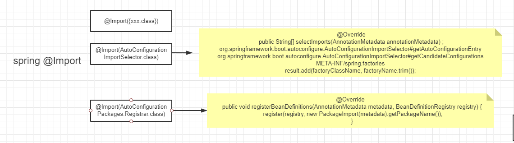

主图是spring和mybatis的结合的内容

此为主要部分spring @Import

一点点分析：

@Import({xxx.class})直接来的

@EnableAutoConfiguration中的@Import(AutoConfigurationImportSelector.class)扫描 `META-INF/spring.factories`中的

@AutoConfigurationPackage中的@Import(AutoConfigurationPackages.Registrar.class)
注册包中的

这些配置都存在 ，在run中读取放入Spring中

这是一个BeanPostProcessor执行，所有有@Autowired注解的都会被执行注入

[Spring Boot 注解原理，自动装配原理，图文并茂，万字长文！](https://mp.weixin.qq.com/s?__biz=MzA3MjMwMzg2Nw==&mid=2247493911&idx=1&sn=1e3a08d74795a5019ad75aeb96e6d03f&chksm=9f22fc83a855759508466fd2b688b84596322c5cf09544d8c131a82b050519863130abb2861d&mpshare=1&scene=1&srcid=0413hiUoUrSnubWmvPrjhtEb&sharer_sharetime=1618283761073&sharer_shareid=76ce302a154389434cac572dafac93a9&exportkey=AWeI%2BZ6voGgk7zqHOgEJWv4%3D&pass_ticket=kIMvV2YwZ%2FHhNKTNMAeYQZjH1J5ya%2BLtLS4VTLEYVerq1bu1Os1JaaImGAR8cIvz&wx_header=0#rd)