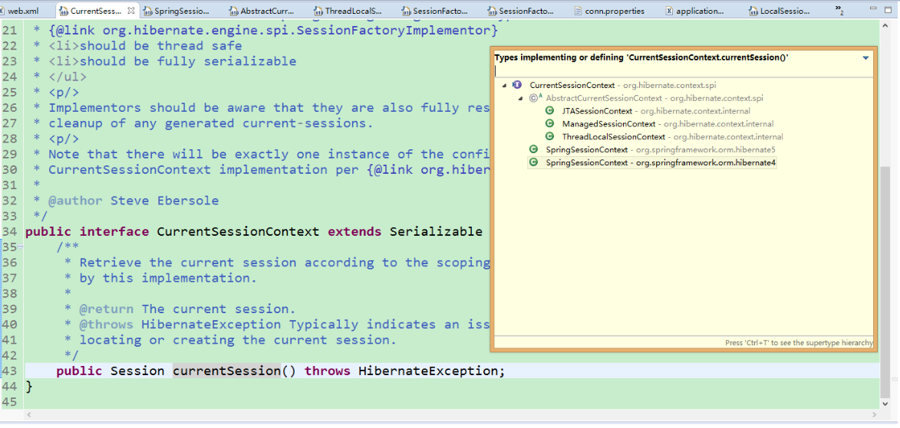
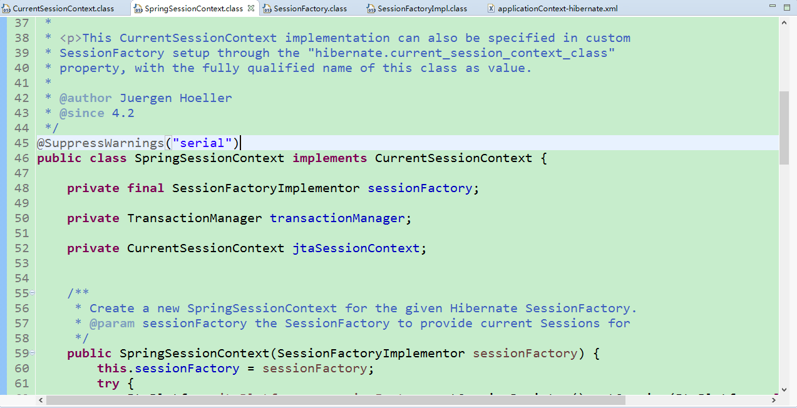
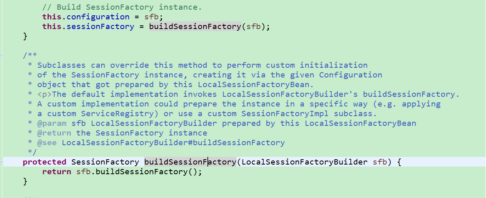
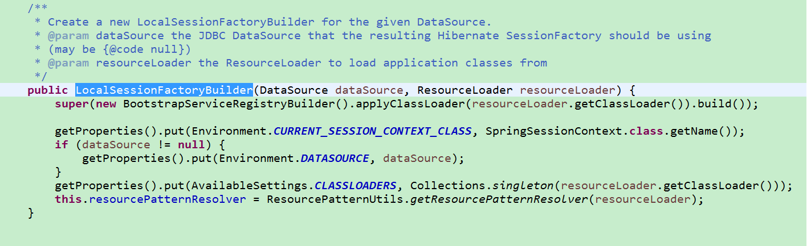
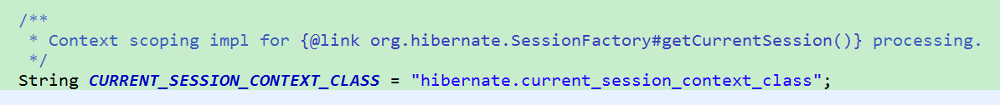

## Session是Hiberante中SessionFactory创建的Session，和Cookie、Session是两个东西。
	
## 事务

#### 事务相关的特性就不说了。ACID 

#### 事务必须在Session中。
Hibernate事例

```
		// 实例化Configuration，
		Configuration conf = new Configuration()
		// 不带参数的configure()方法默认加载hibernate.cfg.xml文件，
		// 如果传入abc.xml作为参数，则不再加载hibernate.cfg.xml，改为加载abc.xml
			.configure();
		ServiceRegistry serviceRegistry = new StandardServiceRegistryBuilder()
			.applySettings(conf.getProperties()).build();
		// 以Configuration实例创建SessionFactory实例
		SessionFactory sf = conf.buildSessionFactory(serviceRegistry);
		// 创建Session
		Session sess = sf.openSession();
		// 开始事务
		Transaction tx = sess.beginTransaction();
		User n = new User();
		n.setName("muxiaobai");
		n.setPassword("sosiiillliii");
		// 保存消息
		sess.save(n);
		// 提交事务
		tx.commit();
		// 关闭Session
		sess.close();
		sf.close();
```
提交Transaction的时候，Session还开启着，save()方法虽然使用的是Session对象。但是在提交事务之前，Session是不能关闭的。

applicationContext.xml文件中(Spring文件)

```
<bean id="transactionManager"
		class="org.springframework.orm.hibernate5.HibernateTransactionManager"
		p:sessionFactory-ref="sessionFactory" />

	<!-- 配置事务增强处理Bean,指定事务管理器 -->
	<tx:advice id="txAdvice" transaction-manager="transactionManager">
		<tx:attributes>
			<tx:method name="get*" read-only="true" propagation="REQUIRED" />
			<tx:method name="find*" read-only="true"  propagation="REQUIRED"/>
			<tx:method name="*" isolation="DEFAULT" propagation="REQUIRED"/>
		</tx:attributes>
	</tx:advice>
	<aop:config>
		<aop:pointcut id="Pointcut" expression="execution(* *.*.Service.*.*.*(..))" />
		<aop:advisor advice-ref="txAdvice" pointcut-ref="Pointcut" />
	</aop:config>
```
先明白一点：事务是切在Service中的方法，为什么呢？Service中的方法是一个完整业务操作，然后被Action或者Servlet调用。
事务为了保证一个业务场景的数据一致性，所以要切在Service中。

用化学中的原子分子来解释就是：Dao属于原子性操作，Service属于分子性操作。就像你喝水一样，吸收的是水分子而不是原子？你喝的是氢原子、氧原子。还是喝得水分子。(这个地方原子并不是对应事务的原子性，要正确理解原子性)。

一般情况下运用Spring的AOP来配置事务，但是此时的就牵扯到参数"hibernate.current_session_context_class"了，到下面再说。

## Hibernate的Session在Spring中的常见配置

#### Hibernate的Session的关闭与开启问题

如果没有Spring,Hibernate会让我们手动管理Session，
开启:**Session sess = sf.openSession();** 关闭：**sess.close();**这是比较好的，但是人嘛，总是懒嘛，所以就给Spring管理了，然后呢,我们就不想管它了，Spring就把Session给下面这个参数了"hibernate.current_session_context_class",然后使用者就只用**this.sessionFactory.getCurrentSession();**来获取Session，也不用处理关闭了，Spring处理了。

就如没有Hibernate的时候，我们使用JDBC，JDBC会用者/能用好者，实际上比Hibernate的性能好很多，但是，开发效率，开发时间就比较慢了。另一个原因，人嘛，总是懒嘛，就使用框架来工作，实际上在大量数据的添加/更新上，还是使用JDBC更好一点。使用了Hibernate后，就不用管连接**Connection**了，而且还使用了连接池，**C3P0**，所以一般开发者（或者高效开发者）使用框架来工作，这也是工作的需要，时间，效率问题。说多了。

#### hibernate.current_session_context_class

重点来了，Spring到底是怎样控制Hibernate Session的生命周期或者叫范围的？

applicationContext.xml文件中

```
<prop key="hibernate.current_session_context_class">org.springframework.orm.hibernate5.SpringSessionContext</prop>
#hibernate.current_session_context_class=thread/jta/managed/org.springframework.orm.hibernate5.SpringSessionContext
```
hibernate.current_session_context_class解释：

可以看到Hibernate下，CurrentSessionContext下面有三种上下文的实现， 	JTASessionContext、ThreadLocalSessionContext 、ManagedSessionContext。

- org.hibernate.context.JTASessionContext - 当前session根据JTA来跟踪和界定。这和以前的仅支持JTA的方法是完全一样的。

- org.hibernate.context.ThreadLocalSessionContext - 当前session通过当前执行的线程来跟踪和界定。 

- org.hibernate.context.ManagedSessionContext - 当前session通过当前执行的线程来跟踪和界定，但是需要静态方法来绑定和取消绑定Session。 

因此被Spring管理的Session中也有这三种Context上下文。同时Spring也实现了CurrentSessionContext，见下图：


要在配置文件里进行如下设置：

如果使用的是本地事务（jdbc事务）

<property name="hibernate.current_session_context_class"\>thread</property\>

如果使用的是全局事务（jta事务）

<property name="hibernate.current_session_context_class"\>jta</property\> 


hibernate.current_session_context_class 配置参数定义了应该采用哪个org.hibernate.context.CurrentSessionContext实现。注意，为了向下兼容，如果未 配置此参数，但是存在org.hibernate.transaction.TransactionManagerLookup的配 置，Hibernate会采用org.hibernate.context.JTASessionContext。一般而言，此参数的值指明了要使用的实 现类的全名，但那两个内置的实现可以使用简写，即"jta"和"thread"。

附上两篇很好的解释。
[hibernate.current_session_context_class属性配置](http://www.blogjava.net/wangxinsh55/archive/2012/10/16/389664.html)
[hibernate的current_session_context_class配置](http://blog.csdn.net/baple/article/details/39957499)

下面来看看Spring的SessionFactory是怎么获取Session的。

我们在使用session的时候大都是这样得到的吧。

applicationContext.xml

```
	<bean id="sessionFactory"
		class="org.springframework.orm.hibernate5.LocalSessionFactoryBean"
		p:dataSource-ref="dataSource">
			<property name="hibernateProperties">
			<props>
				<prop key="hibernate.current_session_context_class">${hibernate.current_session_context_class}</prop>
			</props>
		</property>
	</bean>
```
先来找"hibernate.current_session_context_class",在什么地方被注入，bean是SessionFactory，class是**org.springframework.orm.hibernate5.LocalSessionFactoryBean**我们发现其中并没有但是我们找到了这个**buildSessionFactory(LocalSessionFactoryBuilder sfb)**其中传递的参数LocalSessionFactoryBuilder


然后就开心了，看到熟悉的东西了，**Environment.CURRENT_SESSION_CONTEXT_CLASS**.最终在AvailableSettings中找到CURRENT_SESSION_CONTEXT_CLASS.

而回过头来看**Environment.CURRENT_SESSION_CONTEXT_CLASS**的值是：SpringSessionContext.class.getName()，如果我们没有写这个属性的话，默认就是SpringSessionContext。

applicationContext.xml文件中

```
	<bean id="baseDaoImpl" abstract="true"  lazy-init="true" p:sessionFactory-ref="sessionFactory" />
	<bean id="userDaoImpl" class="DaoImpl.UserDaoImpl" parent="baseDaoImpl" />
```
BaseDaoImpl中会取得

```
	/**
	 * 依赖注入SessionFactory所需的setter方法
	 * 
	 * @param sessionFactory
	 */
	public void setSessionFactory(SessionFactory sessionFactory) {
			this.sessionFactory = sessionFactory;
	}

	/**
	 * 取得Session.
	 * 
	 * @return CurrentSession
	 */
	public Session getSession() {
		  return this.sessionFactory.getCurrentSession();
	}

```

然后就用 **getCurrentSession** 得到Session并对应相应的上下文。

但是**this.sessionFactory.getCurrentSession();**这个方法得到的session，会随着get开启,随着事务的提交而关闭。

因此在SSH中就出现常见的问题，如下：
#### 常见的几种问题
##### AOP事务中Session的生命周期
正常情况下，事务提交，Session关闭。
##### "org.hibernate.LazyInitializationException: could not initialize proxy - no Session"问题
##### "org.hibernate.LazyInitializationException: failed to lazily initialize a collection of role: Model.User, no session or session was closed"
以上两种错误属于同一类，no Session

解释一下：因为Session会随着事务的提交而关闭，但是内存中的对象并没有你要访问的属性，在你要访问的时候，就会出现no Session 或者Session closed等问题。
但是，我们不可能把事务的范围扩大，因此就想着不让session关闭。在网上找到了这个openSessionInViewFilter。详解在下面。

##### "save is not valid without active transaction" 问题
正常情况下Hibernate没有问题，关键是整合Spring后，配置AOP，切面在Service，测试Dao的时候就出问题了，这个目前为止没有发现好的解决办法，我是在开发的时候Dao也配置事务，生产环境下去掉Dao事务。
####  OpenSessionInViewFilter
为了延长Session的生命周期，Spring中引入OpenSessionInviewFilter。

在web.xml文件中添加如下代码

```
<filter>
    <filter-name>openSessionInViewFilter</filter-name>
    <filter-class>org.springframework.orm.hibernate5.support.OpenSessionInViewFilter</filter-class>
    <init-param>
      <param-name>singleSession</param-name>
      <param-value>true</param-value>
    </init-param>
    <init-param>
      <param-name>sessionFactoryBean</param-name>
      <param-value>sessionFactory</param-value>
    </init-param>
  </filter>
  <filter-mapping>
    <filter-name>openSessionInViewFilter</filter-name>
    <url-pattern>/*</url-pattern>
  </filter-mapping>
```

OpenSessionInViewFilter是Spring提供的一个针对Hibernate的一个支持类，其主要意思是在发起一个页面请求时打开Hibernate的Session，一直保持这个Session，直到这个请求结束，具体是通过一个Filter来实现的。

由于Hibernate引入了Lazy Load特性，使得脱离Hibernate的Session周期的对象如果再想通过getter方法取到其关联对象的值，Hibernate会抛出一个LazyLoad的Exception。所以为了解决这个问题，Spring引入了这个Filter，使得Hibernate的Session的生命周期变长。这样不论是Servlet、JSP还是Action都可以获取Session。

[解决Hibernate的Session的关闭与开启问题](http://blog.csdn.net/a5489888/article/details/9015375)
[OpenSessionInViewFilter的作用及原理](http://blog.csdn.net/ggibenben1314/article/details/46289411)

