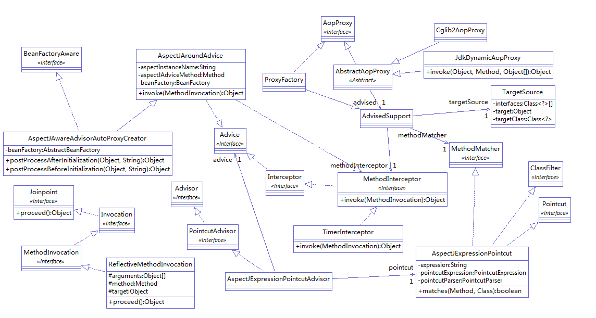

<!--more-->


[github简易Spring实现](https://github.com/code4craft/tiny-spring)


一般用作：日志，权限控制，异常，事务等情况下。

xml中的解析

```
    <bean id="autoProxyCreator" class="us.codecraft.tinyioc.aop.AspectJAwareAdvisorAutoProxyCreator"></bean>

    <bean id="timeInterceptor" class="us.codecraft.tinyioc.aop.TimerInterceptor"></bean>

    <bean id="aspectjAspect" class="us.codecraft.tinyioc.aop.AspectJExpressionPointcutAdvisor">
        <property name="advice" ref="timeInterceptor"></property>
        <property name="expression" value="execution(* us.codecraft.tinyioc.*.*(..))"></property>
    </bean>
    
```
AspectJAwareAdvisorAutoProxyCreator implements BeanPostProcessor
所以扫描这个类的时候会执行AspectJAwareAdvisorAutoProxyCreator.postProcessAfterInitialization()。

```
public Object postProcessAfterInitialization(Object bean, String beanName) throws Exception {
		if (bean instanceof AspectJExpressionPointcutAdvisor) {
			return bean;
		}
		if (bean instanceof MethodInterceptor) {
			return bean;
		}
		List<AspectJExpressionPointcutAdvisor> advisors = beanFactory
				.getBeansForType(AspectJExpressionPointcutAdvisor.class);
		for (AspectJExpressionPointcutAdvisor advisor : advisors) {
			if (advisor.getPointcut().getClassFilter().matches(bean.getClass())) {
                ProxyFactory advisedSupport = new ProxyFactory();
				advisedSupport.setMethodInterceptor((MethodInterceptor) advisor.getAdvice());
				advisedSupport.setMethodMatcher(advisor.getPointcut().getMethodMatcher());

				TargetSource targetSource = new TargetSource(bean, bean.getClass(), bean.getClass().getInterfaces());
				advisedSupport.setTargetSource(targetSource);

				return advisedSupport.getProxy();
			}
		}
		return bean;
	}
```
然后遍历所有的AspectJExpressionPointcutAdvisor,如果有其他的bean满足条件advisor.getPointcut().getClassFilter().matches(bean.getClass())那么则返回代理对象。


这里面的返回代理对象如果用代码来写的话就是下面这样，

```
    // 1. 设置被代理对象(Joinpoint)
	AdvisedSupport advisedSupport = new AdvisedSupport();
	TargetSource targetSource = new TargetSource(helloWorldService, HelloWorldServiceImpl.class,
			HelloWorldService.class);
	advisedSupport.setTargetSource(targetSource);
	
	//设置匹配的match
	MethodMatcher methodMatcher = new MethodMatcher() {
        
        @Override
        public boolean matches(Method method, Class targetClass) {
            return true;
        }
    };
	advisedSupport.setMethodMatcher(methodMatcher);
	
	// 2. 设置拦截器(Advice)
	TimerInterceptor timerInterceptor = new TimerInterceptor();
	advisedSupport.setMethodInterceptor(timerInterceptor);

	// 3. 创建代理(Proxy)
	JdkDynamicAopProxy jdkDynamicAopProxy = new JdkDynamicAopProxy(advisedSupport);
	HelloWorldService helloWorldServiceProxy = (HelloWorldService) jdkDynamicAopProxy.getProxy();

	// 4. 基于AOP的调用
	helloWorldServiceProxy.helloWorld();
		
```

advisedSupport{targetSource,methodMatcher,methodInterceptor}
这个里面记录了代理目标，和匹配的expression和具体的拦截操作


#### JDK动态代理

implements InvocationHandler

先获取代理类Proxy.newProxyInstance(getClass().getClassLoader(), advised.getTargetSource().getInterfaces(), this);，然后implements InvocationHandler ,上面的this,执行target方法的时候就会优先执行InvocationHandler.invoke(final Object proxy, final Method method, final Object[] args);

##### Proxy.newProxyInstance()

这个是jdk动态代理，需要代理类实现接口，而且只能代理接口里面的方法，因为使用接口来创建代理。

Proxy.newProxyInstance(),获取代理类方法：

```
 public static Object newProxyInstance(ClassLoader loader,
                                          Class<?>[] interfaces,
                                          InvocationHandler h)
        throws IllegalArgumentException
    {
        Objects.requireNonNull(h);//InvocationHandler 不为空

        final Class<?>[] intfs = interfaces.clone();
        
        /*
         * Look up or generate the designated proxy class.
         * 查找或生成指定的代理类。
         */
        Class<?> cl = getProxyClass0(loader, intfs);//

        /*
         * Invoke its constructor with the designated invocation handler.
         * 用指定的调用处理程序调用它的构造函数。 constructorParams = InvocationHandler.class
         */
        final Constructor<?> cons = cl.getConstructor(constructorParams);
       
        return cons.newInstance(new Object[]{h});//返回代理类

    }
```

getProxyClass0()

```
	private static Class<?> getProxyClass0(ClassLoader loader,
                                           Class<?>... interfaces) {
        if (interfaces.length > 65535) {
            throw new IllegalArgumentException("interface limit exceeded");
        }

        // If the proxy class defined by the given loader implementing
        // the given interfaces exists, this will simply return the cached copy;
        // otherwise, it will create the proxy class via the ProxyClassFactory
        //如果classloader加载的接口代理类存在，直接从cache中国返回
        //否则从ProxyClassFactory创建一个新的代理类
        return proxyClassCache.get(loader, interfaces);
    }
```

#### CGLIB


implements MethodInterceptor 

获取代理类

Enhancer e=new Enhancer();//创建代理对象类
e.setSuperclass(object.getClass());//声明代理对象的父类是谁（是目标对象）
e.setCallback(this);//设置回调函数，即调用intercept()
return e.create();//返回创建的代理对象


执行intercept(Object obj, Method method, Object[] args, MethodProxy proxy);


- [Java JDK代理、CGLIB、AspectJ代理分析比较](https://zhuanlan.zhihu.com/p/27757233)
- [Spring AOP 实现原理](https://blog.csdn.net/moreevan/article/details/11977115)
- [Spring源代码解析(收藏)](http://www.cnblogs.com/dazhaxie/archive/2012/06/18/2553300.html)