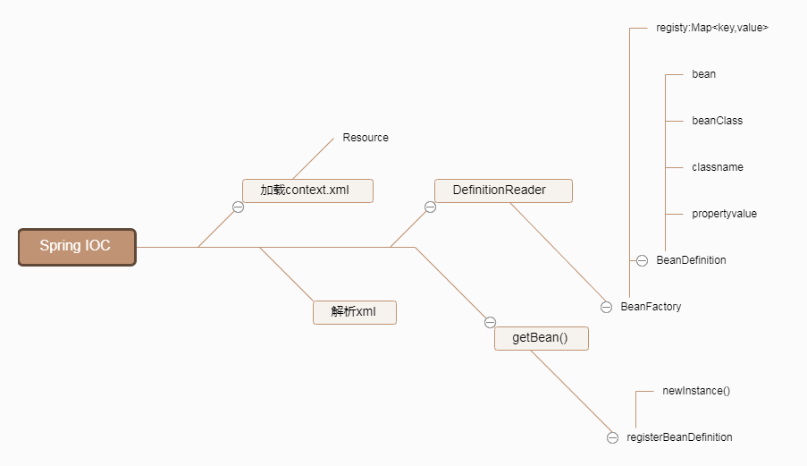

<!--more-->

[github简易Spring实现](https://github.com/code4craft/tiny-spring)

加载文件，解析XML

如果是`<bean  id ="a1" class ="b">`,AbstractBeanFactory.beanDefinitionMap中会添加一份Bean的描述其中Map<key="a1",value ="beanDefinition">beanDefinition中是描述这个Bean的，包含Bean对象，beanClass类对象，beanClassName类名，和对应的属性PropertyValues，就是List PropertyValue,

```
String name = ele.getAttribute("id");
String className = ele.getAttribute("class");
BeanDefinition beanDefinition = new BeanDefinition();
processProperty(ele, beanDefinition);
beanDefinition.setBeanClassName(className);
getRegistry().put(name, beanDefinition);

```

如果Bean内部是`<property  name ="a1" value ="b1">`,这时候PropertyValue就是一个{name ="a1",value ="b1"},

定义BeanDefination{bean,beanClass,beanClassName,PropertyValues=[list<PropertyValue> propertyValueList]}

处理引用ref

如果Bean内部是`<property  name ="a1" ref ="b2">`,这时候创建一个BeanReference("b2"),PropertyValue就是一个{name ="a1",value =BeanReference},


```
if (value instanceof BeanReference) {
				BeanReference beanReference = (BeanReference) value;
				value = getBean(beanReference.getName());//根据b2获取bean
}

Method declaredMethod = bean.getClass().getDeclaredMethod(
						"set" + propertyValue.getName().substring(0, 1).toUpperCase()
								+ propertyValue.getName().substring(1), value.getClass());
declaredMethod.setAccessible(true);

declaredMethod.invoke(bean, value);//把b2放到a1中，反射调用

```
这里的简化版本所有的引用都是在getBean之后进行的。

把所有的Bean都注册到BeanFactory中。AbstractBeanFactory.beanDefinitionMap中包含所有的{name ="", BeanDefinition = ""},定义的Bean的名字和对应class的Bean的描述类

获取Bean的时候BeanFactory.getBean()，反射newInstance()
`beanDefinition.getBeanClass().newInstance();`直接得到类对象，进行实例化。再处理各种引用等问题。

以上这个简版的Spring已经把主要的逻辑讲了，当然这只是原理，Spring比这个跟严谨更复杂。