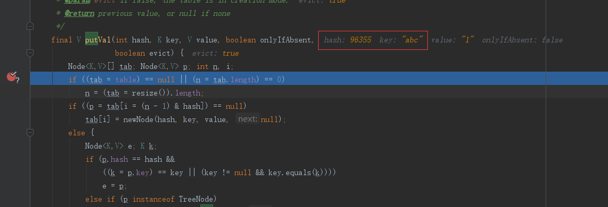
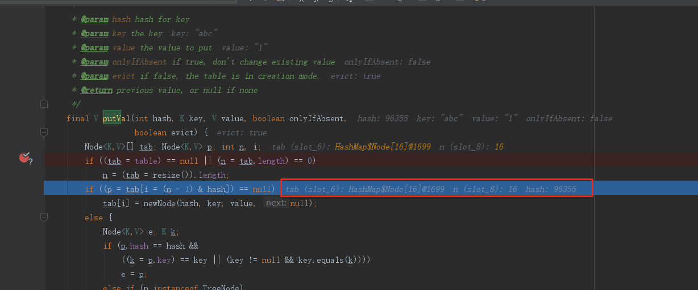
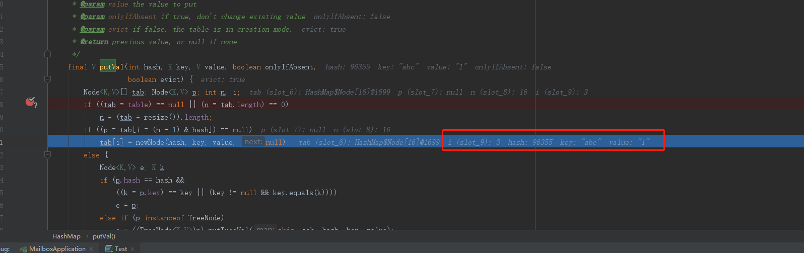

## 一个简单的put引发的惨案
    版本 jdk1.8
    Map hashMap = new HashMap<String,String>();
    hashMap.put("abc","1");
    一个简单的put
```
    /**
     * Associates the specified value with the specified key in this map.
     * If the map previously contained a mapping for the key, the old
     * value is replaced.
     *
     * @param key key with which the specified value is to be associated
     * @param value value to be associated with the specified key
     * @return the previous value associated with <tt>key</tt>, or
     *         <tt>null</tt> if there was no mapping for <tt>key</tt>.
     *         (A <tt>null</tt> return can also indicate that the map
     *         previously associated <tt>null</tt> with <tt>key</tt>.)
     */
    public V put(K key, V value) {
        return putVal(hash(key), key, value, false, true);
    }

```
#### 怎么进行hash
```
 /**
     * Computes key.hashCode() and spreads (XORs) higher bits of hash
     * to lower.  Because the table uses power-of-two masking, sets of
     * hashes that vary only in bits above the current mask will
     * always collide. (Among known examples are sets of Float keys
     * holding consecutive whole numbers in small tables.)  So we
     * apply a transform that spreads the impact of higher bits
     * downward. There is a tradeoff between speed, utility, and
     * quality of bit-spreading. Because many common sets of hashes
     * are already reasonably distributed (so don't benefit from
     * spreading), and because we use trees to handle large sets of
     * collisions in bins, we just XOR some shifted bits in the
     * cheapest possible way to reduce systematic lossage, as well as
     * to incorporate impact of the highest bits that would otherwise
     * never be used in index calculations because of table bounds.
     */
    static final int hash(Object key) {
        int h;
        return (key == null) ? 0 : (h = key.hashCode()) ^ (h >>> 16);
    }
```
key可以为null ，返回0，直接落在第一个坑位上。
> 解释了key可以为null
Object.hashCode();
```
    public native int hashCode();
```
以String举例
String.hashCode();
```
 /**
     * Returns a hash code for this string. The hash code for a
     * {@code String} object is computed as
     * <blockquote><pre>
     * s[0]*31^(n-1) + s[1]*31^(n-2) + ... + s[n-1]
     * </pre></blockquote>
     * using {@code int} arithmetic, where {@code s[i]} is the
     * <i>i</i>th character of the string, {@code n} is the length of
     * the string, and {@code ^} indicates exponentiation.
     * (The hash value of the empty string is zero.)
     *
     * @return  a hash code value for this object.
     */
    public int hashCode() {
        int h = hash;
        if (h == 0 && value.length > 0) {
            char val[] = value;

            for (int i = 0; i < value.length; i++) {
                h = 31 * h + val[i];
            }
            hash = h;
        }
        return h;
    }
```
举例
```
System.out.println("abc".hashCode());//96354
System.out.println(97*31*31 + 98*31+99);//96354
```
> s[0]*31^(n-1) + s[1]*31^(n-2) + ... + s[n-1]

String的hash算法,那么HashMap中的hash(),
`(key == null) ? 0 : (h = key.hashCode()) ^ (h >>> 16);`
"abc"进行转hashCode()之后就是96354，然后变成二进制
```
h>>>16   h^(h>>>16)
那么就是（前面补0）
96354       0000 0000 0000 0001 0111 1000 0110 0010  低16位
h>>>16      0000 0000 0000 0000 0000 0000 0000 0001  高16位
^--------------------------------------------------
h^(h>>>16)  0000 0000 0000 0001 0111 1000 0110 0011  

最终得到96355

```
高16位与低16位

结果验证


然后下一步
```
/**
     * Implements Map.put and related methods
     *
     * @param hash hash for key
     * @param key the key
     * @param value the value to put
     * @param onlyIfAbsent if true, don't change existing value
     * @param evict if false, the table is in creation mode.
     * @return previous value, or null if none
     */
    final V putVal(int hash, K key, V value, boolean onlyIfAbsent,
                   boolean evict) {
        Node<K,V>[] tab; Node<K,V> p; int n, i;
        if ((tab = table) == null || (n = tab.length) == 0)
            n = (tab = resize()).length;
        if ((p = tab[i = (n - 1) & hash]) == null)
            tab[i] = newNode(hash, key, value, null);
        else {
            Node<K,V> e; K k;
            if (p.hash == hash &&
                ((k = p.key) == key || (key != null && key.equals(k))))
                e = p;
            else if (p instanceof TreeNode)
                e = ((TreeNode<K,V>)p).putTreeVal(this, tab, hash, key, value);
            else {
                for (int binCount = 0; ; ++binCount) {
                    if ((e = p.next) == null) {
                        p.next = newNode(hash, key, value, null);
                        if (binCount >= TREEIFY_THRESHOLD - 1) // -1 for 1st
                            treeifyBin(tab, hash);
                        break;
                    }
                    if (e.hash == hash &&
                        ((k = e.key) == key || (key != null && key.equals(k))))
                        break;
                    p = e;
                }
            }
            if (e != null) { // existing mapping for key
                V oldValue = e.value;
                if (!onlyIfAbsent || oldValue == null)
                    e.value = value;
                afterNodeAccess(e);
                return oldValue;
            }
        }
        ++modCount;
        if (++size > threshold)
            resize();
        afterNodeInsertion(evict);
        return null;
    }

```

#### 没有数组

看内部的如果table是空的创建
```
 if ((tab = table) == null || (n = tab.length) == 0)
            n = (tab = resize()).length;
```
resize()把table创建好了，同时把tab.length赋给n
```
  /**
     * Initializes or doubles table size.  If null, allocates in
     * accord with initial capacity target held in field threshold.
     * Otherwise, because we are using power-of-two expansion, the
     * elements from each bin must either stay at same index, or move
     * with a power of two offset in the new table.
     *
     * @return the table
     */
    final Node<K,V>[] resize() {
        Node<K,V>[] oldTab = table;
        int oldCap = (oldTab == null) ? 0 : oldTab.length;
        int oldThr = threshold;
        int newCap, newThr = 0;
        if (oldCap > 0) {
            if (oldCap >= MAXIMUM_CAPACITY) {
                threshold = Integer.MAX_VALUE;
                return oldTab;
            }
            else if ((newCap = oldCap << 1) < MAXIMUM_CAPACITY &&
                     oldCap >= DEFAULT_INITIAL_CAPACITY)
                newThr = oldThr << 1; // double threshold
        }
        else if (oldThr > 0) // initial capacity was placed in threshold
            newCap = oldThr;
        else {               // zero initial threshold signifies using defaults 这里是初始化的时候，放容量Cap=16和最多放几个开始扩容负载因子Thr = 0.75*16 = 12，
            newCap = DEFAULT_INITIAL_CAPACITY;
            newThr = (int)(DEFAULT_LOAD_FACTOR * DEFAULT_INITIAL_CAPACITY);
        }
        
        if (newThr == 0) {
            float ft = (float)newCap * loadFactor;
            newThr = (newCap < MAXIMUM_CAPACITY && ft < (float)MAXIMUM_CAPACITY ?
                      (int)ft : Integer.MAX_VALUE);
        }
        threshold = newThr;
        @SuppressWarnings({"rawtypes","unchecked"})
        //创建一个newCap容量大小的数组，然后赋给table
            Node<K,V>[] newTab = (Node<K,V>[])new Node[newCap];
        table = newTab;
        //以下内容为把原来的Node放到新的Node中，先放一下，后面在扩容判定位置的时候再研究
        if (oldTab != null) {
            ...
            ...
            ...
        }
        return newTab;
    }
```
先看新建的，不看扩容的。知道table是个newCap大小的数组



#### 数组对应的位置为空
```
 if ((p = tab[i = (n - 1) & hash]) == null)
            tab[i] = newNode(hash, key, value, null);
```
有了数组，怎么计算放在哪一个数组上，`(n - 1) & hash]`,这个位置上如果为空，那么tab的i上就放当前的Node<K,V>;当前的n就是tab.length = 16
算一下
```
刚才abc的hash值是96355
h^(h>>>16)  0000 0000 0000 0001 0111 1000 0110 0011   96355
16-1        0000 0000 0000 0000 0000 0000 0000 1111   15
&-------------------------------------------------- 保证所有的值都落在tab之内
(n-1)hash   0000 0000 0000 0000 0000 0000 0000 0011   3

然后看tab[3]上是否为null,为空直接赋值在这里
然后tab[3] =  Node<>(hash, key, value, next);//Node<>(96355，"abc","1",null)
```



#### 数组对应的位置不为空，跟链表，超过TREEIFY_THRESHOLD时，当前hash对应的位置转为treeifyBin
```
    Node<K,V> e; K k;
    if (p.hash == hash &&
        ((k = p.key) == key || (key != null && key.equals(k))))
        e = p;

```
判断key是不是一样的，如果是一样的，直接替换前面的Node，

> 解释了 为什么key可以为null，但key一样的话不能重复

```
    else {
        //没有条件的一直循环，在内部break，
        for (int binCount = 0; ; ++binCount) {
            if ((e = p.next) == null) {
                p.next = newNode(hash, key, value, null);
                //当前容量大于8-1 = 7 的时候进行转为红黑树
                if (binCount >= TREEIFY_THRESHOLD - 1) // -1 for 1st
                    treeifyBin(tab, hash);
                break;
            }
            if (e.hash == hash &&
                ((k = e.key) == key || (key != null && key.equals(k))))
                break;
            p = e;
        }
    }
```
当前hash对应的位置转TreeNode
```
/**
     * Replaces all linked nodes in bin at index for given hash unless
     * table is too small, in which case resizes instead.
     */
    final void treeifyBin(Node<K,V>[] tab, int hash) {
        int n, index; Node<K,V> e;
        //如果tab数组小于MIN_TREEIFY_CAPACITY=64重新调整大小
        if (tab == null || (n = tab.length) < MIN_TREEIFY_CAPACITY)
            resize();
        else if ((e = tab[index = (n - 1) & hash]) != null) {
            TreeNode<K,V> hd = null, tl = null;
            do {
                TreeNode<K,V> p = replacementTreeNode(e, null);
                if (tl == null)
                    hd = p;
                else {
                    p.prev = tl;
                    tl.next = p;
                }
                tl = p;
            } while ((e = e.next) != null);
            if ((tab[index] = hd) != null)
                hd.treeify(tab);
        }
    }
```
#### 数组对应的位置不为空，跟红黑树

直接调用TreeNode的putTreeVal()
```
    else if (p instanceof TreeNode)
        e = ((TreeNode<K,V>)p).putTreeVal(this, tab, hash, key, value);

```
里面对应的旋转啊，啥子的，一堆。
#### 超过最大值，要进行扩容

当大小超过threshold=DEFAULT_LOAD_FACTOR * DEFAULT_INITIAL_CAPACITY= 0.75*16=12重新resize()
```
    if (++size > threshold)
            resize();
```
resize(),扩容的时候MAXIMUM_CAPACITY=1<<30
```
    if (oldCap >= MAXIMUM_CAPACITY) {
        threshold = Integer.MAX_VALUE;//最大值
        return oldTab;
    }
    //不到最大值，新的容量newCap为原来的左移一位 oldThr<<1, 两倍的容量
    else if ((newCap = oldCap << 1) < MAXIMUM_CAPACITY &&
                oldCap >= DEFAULT_INITIAL_CAPACITY)
        newThr = oldThr << 1; // double threshold
        //newThr 为12<<1 为 24

```


#### 扩容怎么判定原来的位置，怎么移动

上面扩容省略的部分
```
for (int j = 0; j < oldCap; ++j) {
        Node<K,V> e;
        if ((e = oldTab[j]) != null) {
            oldTab[j] = null;
            //没有next 说明只有一个Node直接在table数组中直接移动
            if (e.next == null)
                newTab[e.hash & (newCap - 1)] = e;
            //是树的情况
            else if (e instanceof TreeNode)
                ((TreeNode<K,V>)e).split(this, newTab, j, oldCap);
            else { // preserve order 顺序的模式链表
                Node<K,V> loHead = null, loTail = null;
                Node<K,V> hiHead = null, hiTail = null;
                Node<K,V> next;
                do {
                    next = e.next;
                    //hash与oldCap容量如果等于0 则还在原来的坑位，
                    if ((e.hash & oldCap) == 0) {
                        if (loTail == null)
                            loHead = e;
                        else
                            loTail.next = e;
                        loTail = e;
                    }
                    //在新的坑位
                    else {
                        if (hiTail == null)
                            hiHead = e;
                        else
                            hiTail.next = e;
                        hiTail = e;
                    }
                } while ((e = next) != null);
                if (loTail != null) {
                    loTail.next = null;
                    newTab[j] = loHead;
                }
                if (hiTail != null) {
                    hiTail.next = null;
                    newTab[j + oldCap] = hiHead;
                }
            }
        }
    }
```

`((TreeNode<K,V>)e).split(this, newTab, j, oldCap);`中有一段，当小于

```
    if (lc <= UNTREEIFY_THRESHOLD)
        tab[index] = loHead.untreeify(map);
    else {
        tab[index] = loHead;
        if (hiHead != null) // (else is already treeified)
            loHead.treeify(tab);
    }
```
已经把原来各个节点Node移动到新的数组中，当小于UNTREEIFY_THRESHOLD=6时，转为链表


链表的情况`(e.hash & oldCap) == 0`
```
刚才abc的hash值是96355
h^(h>>>16)  0000 0000 0000 0001 0111 1000 0110 0011   96355
16=oldCap   0000 0000 0000 0000 0000 0000 0001 0000   16
&-------------------------------------------------- 保证所有的值都落在tab之内
hash&oldCap 0000 0000 0000 0000 0000 0000 0000 0000   0

等于0 还在原来的位置


h^(h>>>16)  0000 0000 0000 0001 0111 1000 0110 0011
16扩32      0000 0000 0000 0000 0000 0000 0001 1111
&-------------------------------------------------- 保证所有的值都落在tab之内
hash&oldCap 0000 0000 0000 0000 0000 0000 0000 0011   3

如果不是0的话则在 16+3的位置

```
线程不安全

#### ConCurrentHashMap是怎么加锁的

ConcurrentHashMap 中的key和value都不能为空，会抛出NullPointerException
```
 /** Implementation for put and putIfAbsent */
    final V putVal(K key, V value, boolean onlyIfAbsent) {
        if (key == null || value == null) throw new NullPointerException();
        int hash = spread(key.hashCode());
        int binCount = 0;
        for (Node<K,V>[] tab = table;;) {
            Node<K,V> f; int n, i, fh;
            if (tab == null || (n = tab.length) == 0)
            //初始化要考虑多线程
                tab = initTable();
                //tabAt,getObjectVolatile native线程安全
            else if ((f = tabAt(tab, i = (n - 1) & hash)) == null) {
                //使用cas，为空的时候U.compareAndSwapObject,比较交换，使用native 线程安全
                if (casTabAt(tab, i, null,
                             new Node<K,V>(hash, key, value, null)))
                    break;                   // no lock when adding to empty bin
            }
            else if ((fh = f.hash) == MOVED)
                tab = helpTransfer(tab, f);
            else {
                V oldVal = null;
                //直接锁数组上的Node
                //put数据的时候，在同一个数组下标下，锁，保证安全
                synchronized (f) {
                    if (tabAt(tab, i) == f) {
                       ...
                       ...
                    }
                }
                if (binCount != 0) {
                    if (binCount >= TREEIFY_THRESHOLD)
                        treeifyBin(tab, i);
                    if (oldVal != null)
                        return oldVal;
                    break;
                }
            }
        }
        //扩容要考虑其它线程
        addCount(1L, binCount);
        return null;
```

#### 对比HashTable直接在方法上进行加锁，锁this
Hashtable上的put
```
public synchronized V put(K key, V value) {
    // Make sure the value is not null 不能为空
    if (value == null) {
        throw new NullPointerException();
    }
        // Makes sure the key is not already in the hashtable.
    Entry<?,?> tab[] = table;
    int hash = key.hashCode();//不能为空
    int index = (hash & 0x7FFFFFFF) % tab.length;
    @SuppressWarnings("unchecked")
```
> Hashtable中的value不能为空，抛出异常NullPointerException；key不能为空，因为null不能获取hashcode();


这种特性，在分析源码的时候就直接出来的，不用背的，不用背的。