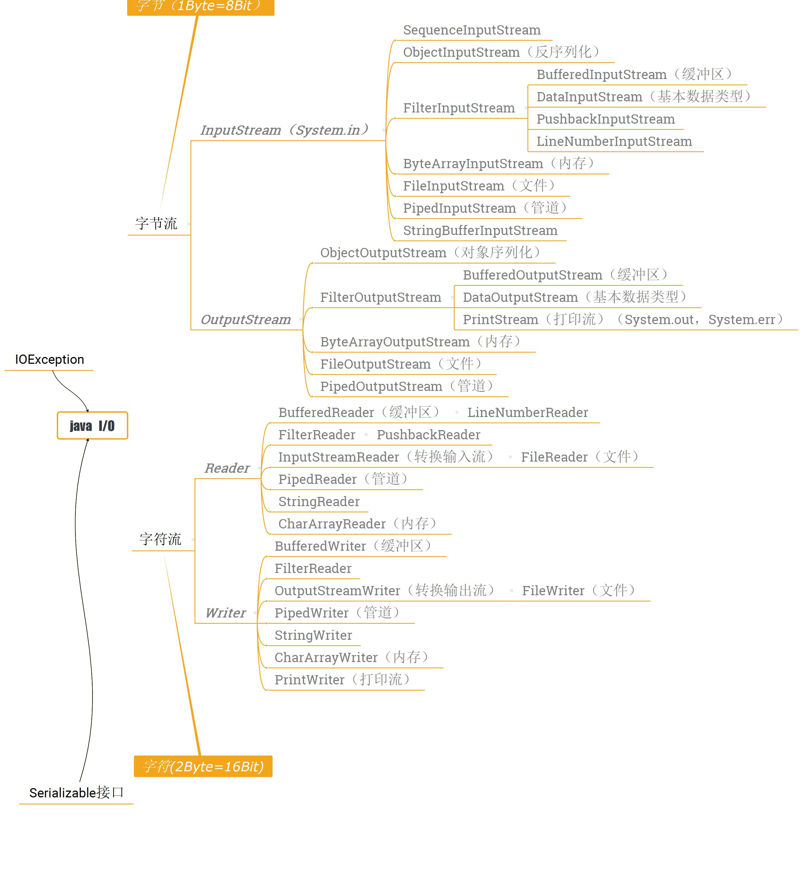
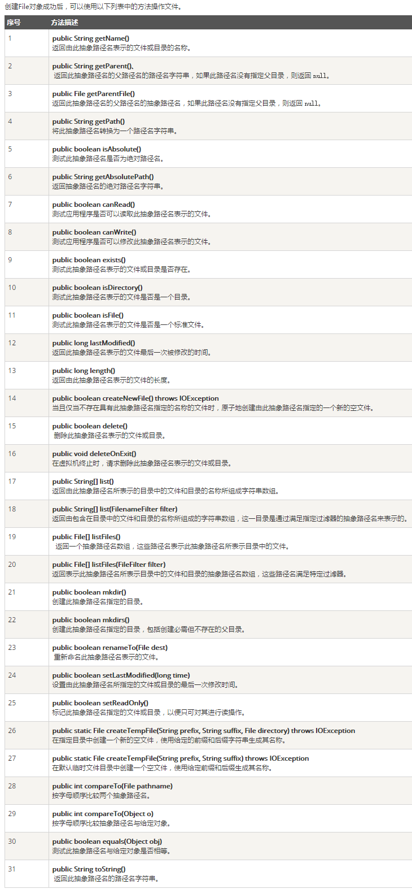

## Thinking in java基础之 I/O

#### 首先给图了解大概内容，当你忘记一些类的继承关系的时候，可以回过头来看一眼

<!--more-->
java所有的IO操作都在java.io包之中进行定义，而且整个java.io包实际上就是五个类和一个接口：

 • 五个类：File、InputStream、OutputStream、Reader、Wirter

 • 一个接口：Serializable

-------------------------------

### 简介字符流和字节流，输入流和输出流

JDK所提供的所有流类位于java.io包中，都分别继承自以下四种抽象流类。
 * InputStream：继承自InputStream的流都是用于向程序中输入数据的，且数据单位都是字节（8位）。

* OutputStream：继承自OutputStream的流都是程序用于向外输出数据的，且数据单位都是字节（8位）。

* Reader：继承自Reader的流都是用于向程序中输入数据的，且数据单位都是字符（16位）。

* Writer：继承自Writer的流都是程序用于向外输出数据的，且数据单位都是字符（16位）。

【输入和输出】是相对于【程序】而言的。以main()为例，main()就相当于程序，当使用输入(InputStream/Reader输入对应程序就是读取数据，当然是Reader)时，是从外界读取数据到main()中，【举例代码】。而输出则是，程序产生的结果输出(OutputStream/Writer输出就是写出，对应Writer)，可以输出到显示屏，控制台，文件系统等。
【字节流和字符流】大部分文件（图片，视频，音乐等）都是使用字节存放的数据，因此，字节也是用的十分广泛的，但是字节在处理中文的时候，就没有字符流具有优势，因为中文字对应两个字节，而字符也对应两个字节，刚好能对应上，因此，如果有中文处理的时候，优先考虑使用字符流。
主要的区别：
字节流没有使用到缓冲区，而字符流使用了；
处理各种数据都可以通过字节流完成，而在处理中文的时候使用字符流会更好。
字节流和字符流的转换：（上代码）

将字节输出流变为字符输出流 OutputStream→ Writer ：用OutputStreamWriter；
将字节输入流变为字符输入流InputStream → Reader：用 InputStreamReader。

### 文件操作/文件系统（File）（读文件，写文件 上代码）

在整个java.io包之中，File类是唯一的一个与文件本身操作有关的类，所谓的文件本身指的是：文件的创建、删除、重命名、取得文件大小、修改日期。但是不包括文件内容，切记。
```
package IO;
import java.io.File;
public class FileDemo {
    public static void main(String[] args) {
        String dirname = "E:"+File.separator+"Demo";
          File f1 = new File(dirname);
          if (f1.isDirectory()) {
             System.out.println( "Directory of " + dirname);
             String s[] = f1.list();
             for (int i=0; i < s.length; i++) {
                File f = new File(dirname + "/" + s[i]);
                if (f.isDirectory()) {
                   System.out.println(s[i] + " is a directory");
                } else {
                   System.out.println(s[i] + " is a file");
                }
             }
          } else {
             System.out.println(dirname + " is not a directory");
        }
    }
}
```
Directory of E:\Demo

AndroidDemo is a directory

eclipseDemo is a directory

GitHubDemo is a directory

我的电脑【E：/Demo】下面有三个文件目录，所以显示为directory。下面给出File类的方法File方法



#### 文件读取和文件输出

 - 文件输出
```
FileOutputStream

package IO;
import java.io.File;
import java.io.FileOutputStream;
import java.io.IOException;
import java.io.OutputStream;

public class FileOutputStreamDemo {
public static void main(String[] args) throws IOException {
File file = new File("E:" + File.separator + "hellodemo"

File.separator + "test.txt"); // 定义文件路径
if (!file.getParentFile().exists()) { // 父路径不存在
file.getParentFile().mkdirs(); // 创建父路径
}
OutputStream output = new FileOutputStream(file); // 通过子类实例化父类
String outputdata = "Hello World";// 要输出的数据
output.write(outputdata.getBytes()); // 输出数据，要将数据变为字节数组输出
output.close(); // 关闭资源
}
}
```

 - FileWriter
```
package IO;

import java.io.File;
import java.io.FileWriter;
import java.io.IOException;
import java.io.Writer;

public class FileWriterDemo {
public static void main(String[] args) throws IOException {
File file = new File("E:" + File.separator + "hellodemo"

File.separator + "test.txt"); // 定义文件路径
if (!file.getParentFile().exists()) {
file.getParentFile().mkdirs();// 创建父目录
}
Writer out = new FileWriter(file);
String data = "Hello World";
out.write(data) ; // 直接输出字符串
out.close() ;

}
}
```

 - 文件输入

```
 - FileInputStream
package IO;

import java.io.File;
import java.io.FileInputStream;
import java.io.IOException;
import java.io.InputStream;

public class FileInputStreamDemo {
public static void main(String[] args) throws IOException {
File file = new File("E:" + File.separator + "hellodemo"

File.separator + "test.txt"); // 定义文件路径
if (file.exists()) { // 文件存在则可以读取
InputStream input = new FileInputStream(file) ;
byte data[] = new byte[1024]; // 假设要读的长度是1024
int foot = 0; // 操作data数组的脚标
int temp = 0;
// 第一步：temp = input.read()，读取一个单个字节，并且将内容给temp变量
// 第二步：temp != -1，将接收到的temp的数值判断是否为-1，
//如果为-1则表示退出循环，如果不是，则保存数据
while ((temp = input.read()) != -1) {
data[foot++] = (byte) temp; // 保存读取进来的单个字节
}
input.close();
System.out.println("数据:【" + new String(data, 0, foot) + "】");
}else{
System.out.println("文件不存在");
}

}
}
```

 - FileReader

```
package IO;
import java.io.File;
import java.io.FileReader;
import java.io.Reader;
public class FileReaderDemo {
public static void main(String[] args) throws Exception {
File file = new File("E:" + File.separator + "hellodemo"

File.separator + "test.txt"); // 定义文件路径
if (file.exists()) {
Reader in = new FileReader(file); // 字符输入流
char data[] = new char[1024]; // 开辟数组
int len = in.read(data); // 读取数据
System.out.println("数据:【" + new String(data, 0, len) + "】");
in.close() ;
}else{
System.out.println("文件不存在");
}
}
}
```

 在工作中,IO的读取和输出是在所难免的。

 > 一定要好好掌握。

### 打印流（输出）（PrintWriter字符）（PrintStream字节）

System（输出err/out可以使用PrintStream的 print（）等方法  ，输入in可以使用InputStream的read()等方法）

---------System.out →PrintStream 

---------System.err →PrintStream  

---------System.in →InputStream （结合Scanner使用）

>out/err/in由系统进行初始化【static】可以直接使用。

### 序列化（Serializable）

作用 ：对象序列化指的是可以将内存中的对象数据（对象属性），进行二进制数据保存，或者传输的一种操作，而如果要想完成这样的二进制操作，那么对象所在的类就必须实java.io.Serializable接口。

需要的两个IO类ObjectInputStream（反序列化）、ObjectOutputStream（序列化）

```
package IO;

import java.io.File;
import java.io.FileInputStream;
import java.io.FileNotFoundException;
import java.io.FileOutputStream;
import java.io.IOException;
import java.io.ObjectInputStream;
import java.io.ObjectOutputStream;
import java.io.Serializable;
import sun.print.resources.serviceui;

@SuppressWarnings("serial")
class Book implements Serializable{
    private String title;
    private Double price;
    private  transient String content;//瞬时 不会被序列化
    public void setTitle(String title) {
        this.title = title;
    }
    public String getTitle() {
        return title;
    }
    public void setPrice(Double price) {
        this.price = price;
    }
    public Double getPrice() {
        return price;
    }
    public void setContent(String content) {
        this.content = content;
    }
    public String getContent() {
        return content;
    }
    @Override
    public String toString() {
        return "Book [title=" + title + ", price=" + price + ", content=" + content + "]";
    }

}
public class SerializableDemo {
    public static void main(String[] args) throws IOException, ClassNotFoundException {
        ser();
        //dser();

    }
    /*
     *  序列化
     */
    public static void ser() throws FileNotFoundException, IOException{
         Book book = new Book();
         book.setPrice(12.8);
         book.setTitle("admin");
        ObjectOutputStream oos = new ObjectOutputStream(
                new FileOutputStream(new File("E:" + File.separator + "person.ser")));
        oos.writeObject(book); 
        oos.close();
    }
    /*
     * 反序列化
     */
    public  static void dser() throws FileNotFoundException, IOException, ClassNotFoundException{
          ObjectInputStream ois = new ObjectInputStream(new FileInputStream(
                    new File("E:" + File.separator + "person.ser")));
            Book per = (Book) ois.readObject();  
            ois.close();
            System.out.println(per);
    }
}
```

> transient  关键字修饰的属性不会被序列化

###  I/O的设计模式（装饰者模式 Decorator Pattern）

> 用一句话表述：动态地将责任附加到对象上。

是用Decorator去装饰Component、因为实现了同一接口或者抽象类、Decorator同样可以装饰Decorator！通过这种模式我们也可以看出一个设计模式的设计原则：

> Classes should be open for extension, but closed for modification!


Decorator Pattern：Attaches additional responsibility to anobject dynamically. Decorators provide a flexible alternative to subclassingfor extending functionality.

可以参考 
[装饰者设计模式](http://blog.csdn.net/crave_shy/article/details/21223029)
### 参考文献
[网易云课堂李兴华java8](http://study.163.com/course/courseMain.htm?courseId=1455026)  [马士兵java](http://study.163.com/course/introduction.htm?courseId=342010#/courseDetail) 《Thinking in Java》《Head First Design Patterns》
