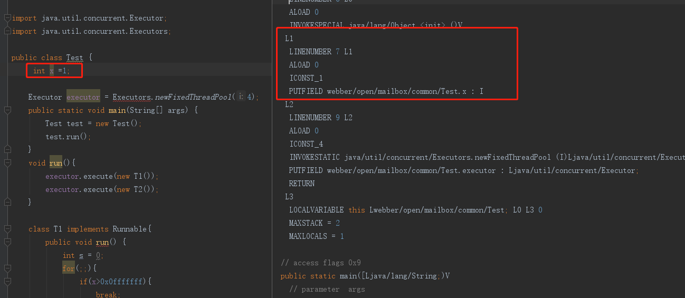
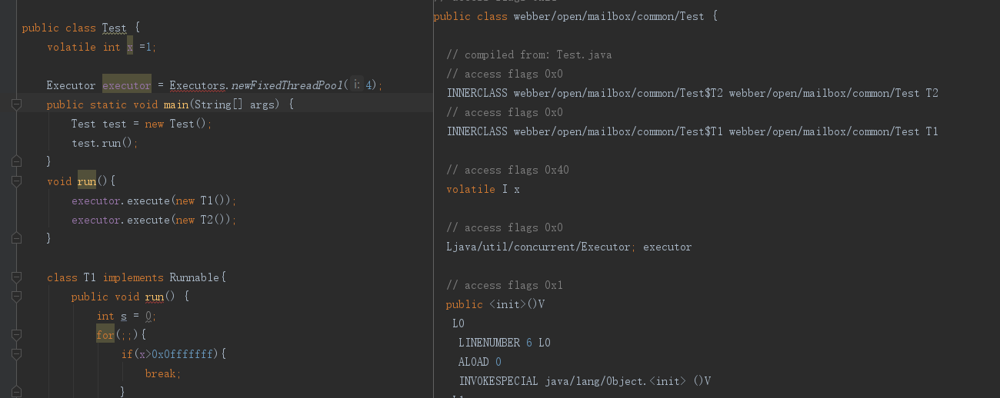
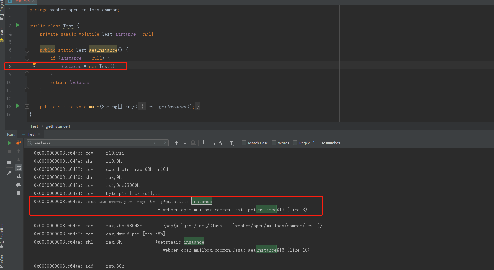
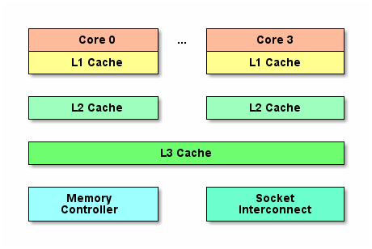
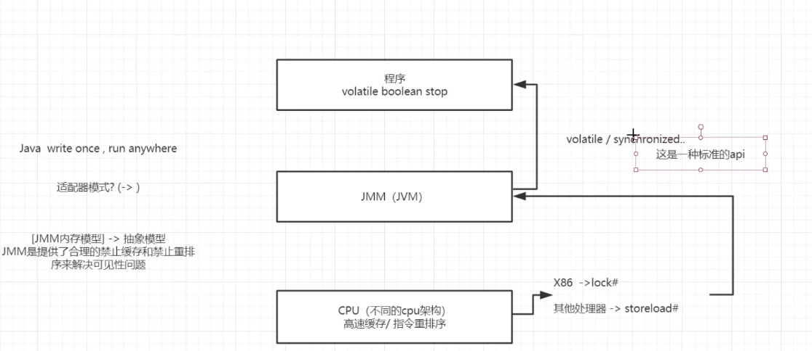

显性的作用就是： 这个变量在修改之后，可以及时更新到另外一个线程。

### 两个代码

无volatile


有volatile


看一下汇编是啥样子的

[下载](https://sourceforge.net/projects/fcml/files/fcml-1.1.1/hsdis-1.1.1-win32-amd64.zip/download)
hsdis-1.1.1-win32-amd64.zip放到${JAVA_HOME}\jdk1.8.0_171\jre\bin\server下,先`javac xxx.java` 编译成xxx.class
`java -XX:+UnlockDiagnosticVMOptions -XX:+PrintAssembly  xxx.class >a.txt `
生成汇编文件
给jvm添加参数
`-server -Xcomp -XX:+UnlockDiagnosticVMOptions -XX:+PrintAssembly -XX:CompileCommand=compileonly,*Test.getInstance`


在修改有volatile修饰的属性，加有lock add第八行。

```
public class Test {
    public static volatile boolean stop = false ;
    public static void main(String[] args) throws InterruptedException {
        Thread thread = new Thread(()->{
            int i=0;
            while (!stop){
                i++;
            }
            System.out.println(i);
        });
        thread.start();
        System.out.println("begin start thread");
        Thread.sleep(1000);
        stop = true;
    }
}

```
锁提供了原子性和可见性
volatile具有锁的可见性，

指令重排序（本是为了优化代码，对最终的结果无影响）

有序性：即程序执行的顺序按照代码的先后顺序执行。举个简单的例子，看下面这段代码：
```
int i = 0;              
boolean flag = false;
i = 1;                //语句1  
flag = true;          //语句2
```
从代码顺序上看，语句1是在语句2前面的，那么JVM在真正执行这段代码的时候会保证语句1一定会在语句2前面执行吗？不一定，为什么呢？这里可能会发生指令重排序（Instruction Reorder）。

## 指令重排序:

一般来说，处理器为了提高程序运行效率，可能会对输入代码进行优化，它不保证程序中各个语句的执行先后顺序同代码中的顺序一致，但是它会保证程序最终执行结果和代码顺序执行的结果是一致的。

比如上面的代码中，语句1和语句2谁先执行对最终的程序结果并没有影响，那么就有可能在执行过程中，语句2先执行而语句1后执行。虽然处理器会对指令进行重排序，但是它会保证程序最终结果会和代码顺序执行结果相同，那么它靠什么保证的呢？靠的是数据依赖性：

编译器和处理器在重排序时，会遵守数据依赖性，编译器和处理器不会改变存在数据依赖关系的两个操作的执行顺序。


## 内存屏障

内存屏障分为两种：Load Barrier 和 Store Barrier即读屏障和写屏障。

内存屏障有两个作用：

- 1.阻止屏障两侧的指令重排序；
- 2.强制把写缓冲区/高速缓存中的脏数据等写回主内存，让缓存中相应的数据失效。


对于Load Barrier来说，在指令前插入Load Barrier，可以让高速缓存中的数据失效，强制从新从主内存加载数据；
对于Store Barrier来说，在指令后插入Store Barrier，能让写入缓存中的最新数据更新写入主内存，让其他线程可见。
java的内存屏障通常所谓的四种即LoadLoad,StoreStore,LoadStore,StoreLoad实际上也是上述两种的组合，完成一系列的屏障和数据同步功能。

- LoadLoad屏障：对于这样的语句Load1; LoadLoad; Load2，在Load2及后续读取操作要读取的数据被访问前，保证Load1要读取的数据被读取完毕。
- StoreStore屏障：对于这样的语句Store1; StoreStore; Store2，在Store2及后续写入操作执行前，保证Store1的写入操作对其它处理器可见。
- LoadStore屏障：对于这样的语句Load1; LoadStore; Store2，在Store2及后续写入操作被刷出前，保证Load1要读取的数据被读取完毕。
- StoreLoad屏障：对于这样的语句Store1; StoreLoad; Load2，在Load2及后续所有读取操作执行前，保证Store1的写入对所有处理器可见。它的开销是四种屏障中最大的。在大多数处理器的实现中，这个屏障是个万能屏障，兼具其它三种内存屏障的功能

volatile的内存屏障策略非常严格保守，非常悲观且毫无安全感的心态：

- 在每个volatile写操作前插入StoreStore屏障，在写操作后插入StoreLoad屏障；
- 在每个volatile读操作前插入LoadLoad屏障，在读操作后插入LoadStore屏障；


由于内存屏障的作用，避免了volatile变量和其它指令重排序、线程之间实现了通信，使得volatile表现出了锁的特性。



因为CPU高速运转，直接读内存会很慢，又开辟一级二级三级缓存，多核CPU下每一个有独立的一级二级缓存；如果现在来了一个数据存在三级缓存中，第一个Thread读取之后，并修改了值，但没有同步到三级缓存中；这时候第二个线程要读值，他还是只从三级缓存中读取内容，；但有了内存屏障，在第三个读的时候，

从.java----------->.class编译完成，然后.class 在不同的平台上，对于volatile来说，JVM有不同的实现，一次编写，到处运行`Write once, run anywhere`,JVM屏蔽各种架构的指令集，例如x86 MMX，SSE等，在window系统上使用window指令，在linux上使用linux指令，最终Java实现了，程序员不用关系各个平台的差异。
但对于.net ，需要安装其他的中间件等，才能在非window系统运行。




[参考Java 内存模型](https://mrbird.cc/Java-Memory-model.html#more)