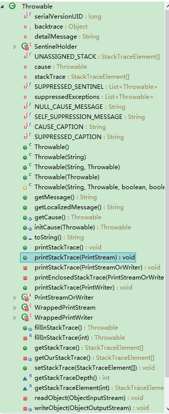
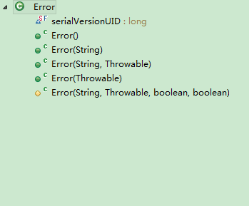
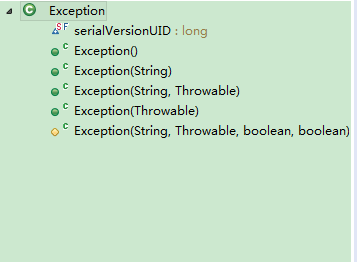
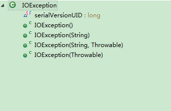
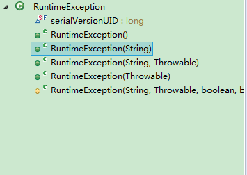

## Thinking in java 基础之异常
类图如下


#### 异常概念


checked 异常的一个问题是，有时候不允许抛出这样的异常。特别是，如果要覆盖超类中声明的方法，或者实现接口中声明的方法，而那个方法没有声明任何 checked 异常，那么新的实现也不能声明 checked 异常。因此必须预先处理异常。
Error我们不用处理。

VirtualMachineError在程序中是不能处理的，这个一般属于虚拟机的问题，内存溢出和栈溢出。(OOM) 

Exception中的IOException必须try catch，这种文件资源是必须要捕捉的，文件要在finally中进行关闭。

Exception中的RuntimeException 可以不必try，还可以继续throws，让使用者处理。

下面来看看源码








我们可以看到除了Throwable之外的类，都是只有构造方法，而且我们从类的名字就能看出具体是什么异常。


#### 为什么要用try 或者 throws

try是为了捕捉异常，而方法中throws是为了把方法抛出去。

下面我们来看例子:

例1

```
public class ExceptionTest {
	public static void main(String[] args) throws Exception {
		ExceptionTest exceptionTest=new ExceptionTest();
		System.out.println("======================");
		System.out.println(exceptionTest.va());
		System.out.println("抛出异常后，后面代码仍可以执行");
		
	}
	public Integer va() throws Exception{
		Integer ret = 0;
		ret=1/0;
		System.out.println("上面有异常，后面......");
		return ret;
	}
}

```

结果：

```
======================
java.lang.ArithmeticException: / by zero
	at Exception.ExceptionTest.va(ExceptionTest.java:21)
	at Exception.ExceptionTest.main(ExceptionTest.java:15)

```
val()方法中ret=1/0;会抛出异常。

例1中main方法中使用throws把异常抛出去，而main方法结束之后，程序就运行完了，但是Exception怎么办呢？只好在控制台打印出Exception了，同时，程序在产生异常的地方，程序就结束了。因此*System.out.println("抛出异常后，后面代码仍可以执行");*是不会执行的。即使在val(),方法中*System.out.println("上面有异常，后面......");*也是不会执行的，因为*ret=1/0;*已经让程序抛出了异常。 而下面的例子就不一样了。

例2

```

public class ExceptionTest {
	public static void main(String[] args) {
		ExceptionTest exceptionTest=new ExceptionTest();
		System.out.println("======================");
		try {
			System.out.println(exceptionTest.va());
		} catch (Exception e) {
			// TODO Auto-generated catch block
			e.printStackTrace();
		}
		System.out.println("抛出异常后，后面代码仍可以执行");
		
	}
	public Integer va() throws Exception{
		Integer ret = 0;
		ret=1/0;
		System.out.println("上面有异常，后面......");
		return ret;
	}
	
}

```

结果：

```
======================
java.lang.ArithmeticException: / by zero
	at Exception.ExceptionTest.va(ExceptionTest.java:26)
	at Exception.ExceptionTest.main(ExceptionTest.java:16)
抛出异常后，后面代码仍可以执行
```
在这个main中使用try catch 来捕捉异常，而异常捕捉后，后面的代码继续执行，因此*System.out.println("抛出异常后，后面代码仍可以执行");*可以执行，就打印出信息了。但是同样val()方法中的*System.out.println("上面有异常，后面......");*是不会执行的。
####异常分类

由上图可以看出Error和Exception是Throwable的子类

#### 关键字 try catch finally throw throws 根据关键词来解释异常

try catch finally 是一组

throw是可以自己抛出一个异常对象

throws是声明一个异常可能被抛出，让调用者处理

##### try 捕获异常 catch 处理异常 finally 有没有异常都执行

例3

```
public class ExceptionTest {
	public static void main(String[] args) {
		ExceptionTest exceptionTest=new ExceptionTest();
		System.out.println(exceptionTest.value());
	}
	public Integer value(){
		Integer ret = 0;
		try {
			ret=1/0;
		} catch (Exception e) {
			ret = 1;
			System.out.println("catch:"+ret);
			return ret;
		} finally {
			ret = 2;
			System.out.println("finally:"+ret);
		}
		return ret;
	}
}

```

结果：

```
catch:1
finally:2
1
```
例4

```

public class ExceptionTest {
	public static void main(String[] args) {
		ExceptionTest exceptionTest=new ExceptionTest();
		System.out.println(exceptionTest.value());
	}
	public Integer value(){
		Integer ret = 0;
		try {
			ret=1/1;
		} catch (Exception e) {
			ret = 3;
			System.out.println("catch:"+ret);
			return ret;
		} finally {
			ret = 2;
			System.out.println("finally:"+ret);
		}
		return ret;
	}
}


```

结果：

```

finally:2
2

```

例3例4这两个例子中，就能发现finally是不论在try{}中有没有异常，finally{}是必须要执行的，而catch(){}中呢，在try{}中有异常，catch(){}就会捕捉到。

下面看一下catch的顺序

例5:

```
public class ExceptionTest2 {
	public static void main(String[] args) {
		ExceptionTest2 exceptionTest=new ExceptionTest2();
		System.out.println(exceptionTest.value());
	}
	public Integer value(){
		Integer ret = 0;
		try {
			System.out.println("try:"+ret);
			ret=1/0;
			return ret;
		}catch(ArithmeticException e){
			System.out.println("ArithmeticException catch:"+ret);
			//e.printStackTrace();
		}catch(NullPointerException e){
			System.out.println("NullPointer catch:"+ret);
			e.printStackTrace();
		} 
		catch (Exception e) {
			System.out.println("Exception catch:"+ret);
			e.printStackTrace();
			ret =3;
		} finally {
			ret = 2;
			System.out.println("finally:"+ret);
			//return ret;
		}
		return ret;
	}
}

```

结果:

```
try:0
ArithmeticException catch:0
finally:2
2
```
如果把Exception放在第一个catch的话，就会处错误，编译出错

```
Compiling ExceptionTest2.java.......
		}catch(ArithmeticException e){
		 ^
		}catch(NullPointerException e){
		 ^
		}catch (Exception e) {
		 ^
[Finished in 0.5s]

```

##### throw 抛出一个异常对象

例6：

```
public class ExceptionCatchTest {
	public static void main(String[] args) throws Exception {
		ExceptionCatchTest exceptionTest=new ExceptionCatchTest();
		System.out.println(exceptionTest.value());
	}
	public Integer value() throws Exception{
		Integer ret = 0;
		try {
			ret=1/0;
			throw new Exception();
		}catch(ArithmeticException e){
			System.out.println("ArithmeticException catch:"+ret);
			throw new Exception();
		}catch (Exception e) {
			ret = 3;
			e.printStackTrace();
			System.out.println("catch:"+ret);
			return ret;
		} finally {
			ret = 2;
			System.out.println("finally:"+ret);
		}
		return ret;
	}
}

```
结果：
```
ArithmeticException catch:0
finally:2
Exception in thread "main" java.lang.Exception
	at Exception.ExceptionCatchTest.value(ExceptionCatchTest.java:23)
	at Exception.ExceptionCatchTest.main(ExceptionCatchTest.java:13)
```

例6上面在catch内部又抛出(throw)了一个 new Exception()；同时在方法中就会把Exception抛出到调用者处理。从而把Exception抛给main()方法处理，如果main方法中没有 throws Exception的话，就需要对*exceptionTest.value()*进行try catch 否则编译就会出错。

##### throws 声明一个异常可能被抛出

例7：

```
public class ExceptionCatchTest {
	public static void main(String[] args)  {
		ExceptionCatchTest exceptionTest=new ExceptionCatchTest();
		System.out.println(exceptionTest.value());
	}
	public Integer value() throws Exception{
		Integer ret = 0;
		try {
			ret=1/0;
			throw new Exception();
		}catch(ArithmeticException e){
			System.out.println("ArithmeticException catch:"+ret);
		}catch (Exception e) {
			ret = 3;
			e.printStackTrace();
			System.out.println("catch:"+ret);
			return ret;
		} finally {
			ret = 2;
			System.out.println("finally:"+ret);
		}
		return ret;
	}
}

```

例7上面也说明了throws 关键字的用法，抛出Exception，给调用者处理异常。因此，在main()方法中，如果main方法中没有 throws Exception的话，就需要对*exceptionTest.value()*进行try catch 否则编译就会出错。

```
try {
			System.out.println(exceptionTest.value());
		} catch (Exception e) {
			// TODO Auto-generated catch block
			e.printStackTrace();
		}
```
#### 最后要说一下执行异常的顺序

例8
```
public class ExceptionCatchTest {
	public static void main(String[] args)  {
		ExceptionCatchTest exceptionTest=new ExceptionCatchTest();
			System.out.println(exceptionTest.value());
	}
	public Integer value() {
		Integer ret = 0;
		try {
			ret=1/0;
			return ret;
		}catch (Exception e) {
			ret = 3;
			System.out.println("catch:"+ret);
			return ret;
		} finally {
			ret = 2;
			System.out.println("finally:"+ret);
		}
	}
}

```
结果：
```
catch:3
finally:2
3
```
在try中执行，如果有异常try中的return不会返回，会到catch中，如果在catch中有return的话，当执行到这里的时候，会提前执行finally，然后才会执行catch中的return。

例9：
```
public class ExceptionCatchTest {
	public static void main(String[] args)  {
		ExceptionCatchTest exceptionTest=new ExceptionCatchTest();
			System.out.println(exceptionTest.value());
	}
	public Integer value() {
		Integer ret = 0;
		try {
			//ret=1/0;
			return ret;
		}catch (Exception e) {
			ret = 3;
			System.out.println("catch:"+ret);
			return ret;
		} finally {
			ret = 2;
			System.out.println("finally:"+ret);
		}
	}
}
```
结果:
```
finally:2
0
```

如果try中的代码正常，不会产生异常的话，会在try中执行到return的时候，优先执行finally，如果在finally有return的话，直接返回，没有的话，就会返回到try内的return。

#### 到此，就基本上结束了，异常的代码很简单，说起来也很容易，但是要用好异常类还是需要深度理解的。不过呢，当你用好后，这块就没什么问题了。