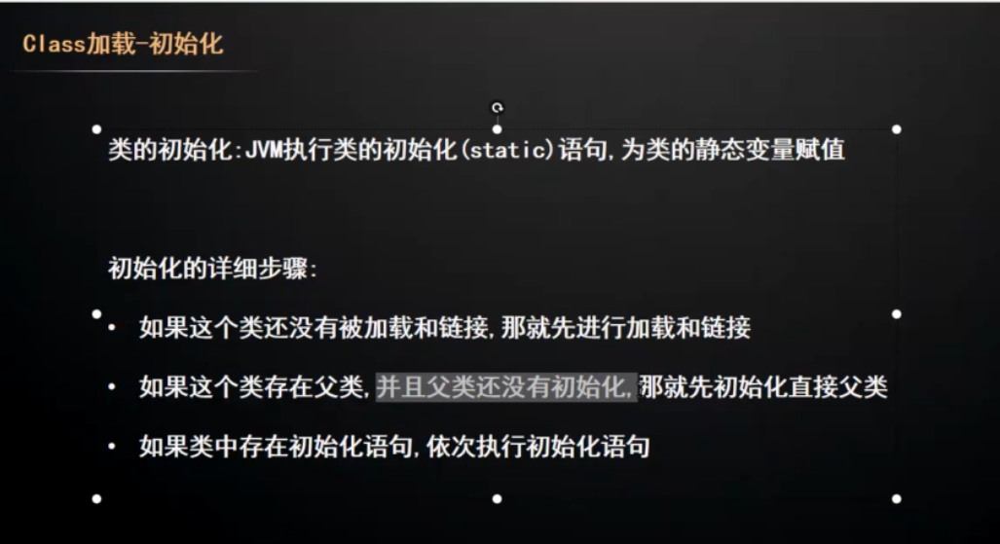
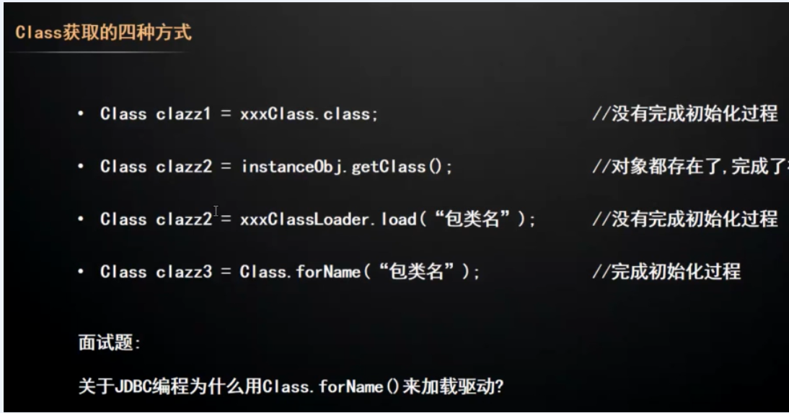
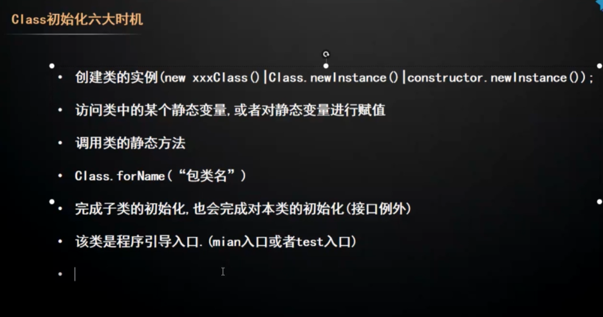

#### 先来一个题
FatherClass:
```

public class FatherClass {
    public  static  int F_NUM = 1111;
    static {
        System.out.println(F_NUM);

    }
    FatherClass(){
        System.out.println(F_NUM);
        F_NUM = 5555;
    }
}
```
SonClass
```

public class SonClass  extends  FatherClass{
    public  static  int S_NUM = 2222;
    static {
        F_NUM = 3333;
        System.out.println(S_NUM);
    }

    static {
        S_NUM = 4444;
        System.out.println(F_NUM);
    }
    //这里是一个大坑，没有无参的构造方法，所以newInstance的时候会报错
    SonClass(int inNUM){
        System.out.println(F_NUM);
    }
}

```

```

public class LoaderOrder {
    public static void main(String[] args) throws ClassNotFoundException, IllegalAccessException, InstantiationException {
//        testClassLoad();
        testClassForName();
    }
    public static void testClassLoad() throws ClassNotFoundException, IllegalAccessException, InstantiationException {
        Class clazz =LoaderOrder.class.getClassLoader().loadClass("io.github.muxiaobai.spring_my_demo.loadClass.SonClass");
        System.out.println("---------------------------");
        clazz.newInstance();
        System.out.println("===========================");
    }


    public static void testClassForName() throws ClassNotFoundException, IllegalAccessException, InstantiationException {
        Class clazz =Class.forName("io.github.muxiaobai.spring_my_demo.loadClass.SonClass");
        System.out.println("---------------------------");
        clazz.newInstance();
        System.out.println("===========================");
    }
}

```
使用ClassLoad
```

---------------------------
Exception in thread "main" java.lang.InstantiationException: io.github.muxiaobai.spring_my_demo.loadClass.SonClass
	at java.lang.Class.newInstance(Class.java:427)
```
使用Class.forName();

```
1111
2222
3333
---------------------------
Exception in thread "main" java.lang.InstantiationException: io.github.muxiaobai.spring_my_demo.loadClass.SonClass
```
链接：static成员变量，附初始值。0,null,false,

初始化做了那些事情？显性的：static语句块，执行到实例化的时候没有无参的构造函数，因此父类和子类都没有实例化。

没有完成类的初始化，无法访问类成员



#### 初始化

##### java对象，获取

- new 
- 反射
- 反序列化
- 克隆

##### Class对象获取

- 类名.class
- 实例.getClass()
- classloader.loadClass("包.类")
- Class.forName("包.类");





jvm加载步骤：加载------链接（验证，准备，解析）-----------初始化




两种，实际上是识别到字节码指令:new，putstatic,getstatic,invokestatic,
反射

根据Java虚拟机的规范，只有5中情况属于主动引用：

-  遇到new（使用new 关键字实例化一个对象）、getstatic（读取一个类的静态字段）、putstatic或者invokestatic（设置一个类的静态字段）这4条指令的时候，如果累没有进行过初始化。则需要先触发其初始化。

-  使用反射进行反射调用的时候，如果类没有初始化，则需要先触发其初始化。

-  当初始化一个类的时候，如果其父类没有初始化，则需要先触发其父类的初始化

- 程序启动需要触发main方法的时候，虚拟机会先触发这个类的初始化

- 当使用jdk1.7的动态语言支持的时候，如果一个java.lang.invoke.MethodHandler实例最后的解析结果为REF_getStatic、REF_pusStatic、REF_invokeStatic的方法句柄（句柄中包含了对象的实例数据和类型数据，句柄是访问对象的一种方法。句柄存储在堆中），并且句柄对应的类没有被初始化，那么需要先触发这个类的初始化。


####  其它


- [类加载机制和类的加载、连接（验证、准备、解析）和初始化](https://www.cnblogs.com/shyroke/p/9161603.html)
