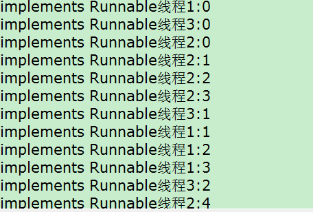
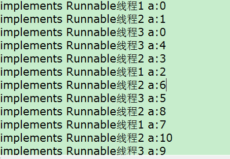
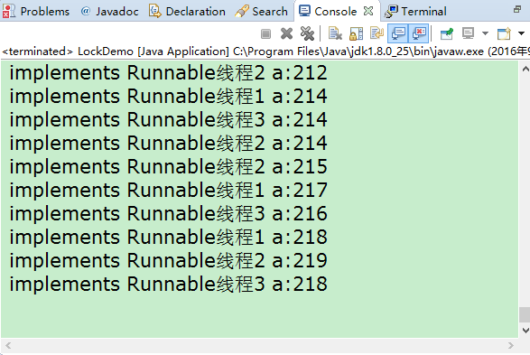

## Java中的线程和并发

#### 新线程

进程：一次程序的完整运行。同一个时间段内，会有多进程抢占资源，但是在某一个时间点上，只有一个进程正在运行。
  
例如:我们可以一边开着浏览器一边上着QQ，但是在当时，(now),这个时间点上，运行的是某一个进程。
  
线程：比如说，我们在聊QQ的时候，又可以在QQ中查找用户，可以这么理解，线程就是一个进程中的若干个功能。多线程的资源是本进程中的资源，同样，线程也是要抢占自己的资源。

那么，我们开发的java应用，main是属于一个进程，不过呢，java中可以给我们提供多线程，因此就引入了多线程编程。

##### 线程的实现

> 继承Thread类，实现Runnable接口，jdk1.5之后，实现Callable接口

下面是一个实例:继承Thread类

```
public class Demo {
	public static void main(String[] args) {
		DemoThread myThread1=new DemoThread("线程1");
		DemoThread myThread2=new DemoThread("线程2");
		DemoThread myThread3=new DemoThread("线程3");
		myThread1.start();
		myThread2.start();
		myThread3.start();
	}
	
}

class DemoThread extends Thread{
	private String name;
	public DemoThread(String name) {
		this.name=name;
	}
	@Override
	public void run() {
		for (int i = 0; i < 100; i++) {
			System.out.println(this.name+":"+i);
		}
	}
}
```


下面是一个实例:实现Runnable接口

```
public class Demo {
	public static void main(String[] args) {
		Thread myThread1=new Thread( new DemoRunnable(" implements Runnable线程1"));
		Thread myThread2=new Thread( new DemoRunnable(" implements Runnable线程2"));
		Thread myThread3=new Thread( new DemoRunnable(" implements Runnable线程3"));
		myThread1.start();
		myThread2.start();
		myThread3.start();
	}
	
}
class DemoRunnable implements Runnable{
	private String name;
	public DemoRunnable(String name) {
		this.name=name;
	}
	@Override
	public void run() {
		for (int i = 0; i < 100; i++) {
			System.out.println(this.name+":"+i);
		}
	}
}
```


多线程的启动需要Thread.start()，而且一个新线程只能运行一次start();而不是run();当我们调用run的时候，实际上是对象的方法调用，而不是启动线程。因此启动线程唯一方法start();下面来看Thread中的start();

```
  /**
     * Causes this thread to begin execution; the Java Virtual Machine
     * calls the <code>run</code> method of this thread.
     * <p>当这个方法被调用后，JVM会调用这个线程的run方法；
     * The result is that two threads are running concurrently: the
     * current thread (which returns from the call to the
     * <code>start</code> method) and the other thread (which executes its
     * <code>run</code> method).
     * <p>结果是:两个线程都是正在运行状态，concurrently（同时，同时发生地）
     * 调用start的这个线程和另一个运行run的线程
     * It is never legal to start a thread more than once.
     * In particular, a thread may not be restarted once it has completed
     * execution.
     *但是超过一次以上的调用、启动start是不合法的。
     * @exception  IllegalThreadStateException  if the thread was already
     *               started.如果线程正在运行，再次调用会抛出异常
     *  //private ThreadGroup group;
     *   //  private volatile int threadStatus = 0;
     * @see        #run()
     * @see        #stop()
     */
    public synchronized void start() {
        /**
         * This method is not invoked for the main method thread or "system"
         * group threads created/set up by the VM. Any new functionality added
         * to this method in the future may have to also be added to the VM.
         *
         * A zero status value corresponds to state "NEW".
         */
        if (threadStatus != 0)
            throw new IllegalThreadStateException();

        /* Notify the group that this thread is about to be started
         * so that it can be added to the group's list of threads
         * and the group's unstarted count can be decremented. */
        group.add(this);//第一次调用的话把当前线程添加到ThreadGroup

        boolean started = false;
        try {
            start0();
            started = true;
        } finally {
            try {
                if (!started) {
                    group.threadStartFailed(this);
                }
            } catch (Throwable ignore) {
                /* do nothing. If start0 threw a Throwable then
                  it will be passed up the call stack */
            }
        }
    }

    private native void start0();//这里使用了一个JNI native方法。其中与操作系统有关系的方法调用，JVM已经实现好了，

```
JNI(Java Native Interface)新线程的资源需要通过native来进行抢占。同样这样会变得与操作系统有关了。

优劣势：继承之后不能再继承其他类,推荐使用implements Runnable接口。

```
public class Thread implements Runnable {
    /* Make sure registerNatives is the first thing <clinit> does. */
}
```

就算继承Thread在背后也是实现了Runnable。重写了run(),方法实际上也是重写了Runnable的run()方法，原因就在这里。
Thread只是和线程的启动销毁有关，和业务无关。因此Thread实际上像一个代理。

#### 与线程有关的方法

和方法密切相关的是线程的生命周期。把生命周期搞清楚后，这些主要的方法也就了解了。


首先new Thread(),新建一个线程,然后一个主要的方法start();这个时候的状态属于:我准备好了，等待运行，当时间片转到我的时候，我就执行就好了，至于另外几种状态的话，可以更具下面的方法的一个具体解释来理解一下。

Thread方法

|方法名|作用|
|:------|:------|
|start();|将本线程变为可运行状态|
|yield();|该方法与sleep()类似，只是不能由用户指定暂停多长时间，并且yield（）方法只能让同优先级的线程有执行的机会|
|sleep(long 毫秒);|线程休眠，就是我现在累了，想休息一下,|
|join();|等待所有线程运行结束|

Object方法

|方法名|作用|
|:------|:------|
|wait();|本线程等待，这里的等待是别人不叫，不会醒的等待。|
|notifyAll();|叫醒所有线程线程|
|notify();|叫醒某一个线程，不确定|

#### 锁与共享资源

implements Runnable对于共享资源的作用

```
public class Demo {
	public static void main(String[] args) {
	DemoRunnable demoRunnable=new DemoRunnable();//只有一个Runnable对象
	Thread myThread1=new Thread(demoRunnable," implements Runnable线程1");
	Thread myThread2=new Thread(demoRunnable," implements Runnable线程2");
	Thread myThread3=new Thread(demoRunnable," implements Runnable线程3");
	//下面的每一个线程都使用同一个demoRunnable实例对象，
	//那么对于demoRunnable内部的integer a就在每一个线程中都可以修改，访问
	myThread1.start();
	myThread2.start();
	myThread3.start();
	}
}

class DemoRunnable implements Runnable{
	public String name;
	public Integer a=0;
	public DemoRunnable(){
		
	}
	public DemoRunnable(String name) {
		this.name=name;
	}
	@Override
	public void run() {
		for (int i = 0; i < 100; i++) {
			try {
					Thread.sleep(10);
				} catch (InterruptedException e) {
					// TODO Auto-generated catch block
					e.printStackTrace();
				}
			System.out.println(Thread.currentThread().getName()+" a:"+(a++));
		}
	}
}

```




虽然在这里，可以实现资源的共享，但是呢，我们仔细看一下，就会发现，如果按照单线程的话，每一个数字应该只出现一次才对，而且最终a=3*100=300，但是我们在看一下并不是。
首先0出现了2次，最后我们看一下结果，218，这是怎么回事？？？计算机坏了？一般情况下啊，千万不要怀疑计算机，前人如次多的尝试，都没问题，你出问题了？不可能，对吧？



其实在这里出现了一个问题，是丢失更新。

因此，在实际运行过程中，我们会需要这样的一种情况，举例:银行转账：在转账的同时又在取款，如果这个钱只扣了一次,那我们岂不是赚大了，天天去取钱。
这个时候就需要一个东西“锁”，保障在更新的时候别人不能更新我正在更新的数据，如果访问的话，就随便吧，无所谓，你看看，只要不动手就行。

下面就来说说怎么来实现。来解决丢失更新呢？

```

public class LockDemo {
	public static void main(String[] args) {
		System.out.println(Thread.currentThread().getPriority());
		LockDemoRunnable demoRunnable=new LockDemoRunnable();
		Thread myThread1=new Thread(demoRunnable," implements Runnable线程1");
		Thread myThread2=new Thread(demoRunnable," implements Runnable线程2");
		Thread myThread3=new Thread(demoRunnable," implements Runnable线程3");
		myThread1.start();
		myThread2.start();
		myThread3.start();
	}
}
class LockDemoRunnable implements Runnable{
	public String name;
	public Integer a=0;
	public LockDemoRunnable(){
	}
	public LockDemoRunnable(String name) {
		this.name=name;
	}
	@Override
	public void run() {
		synchronized (a) {
			for (int i = 0; i < 100; i++) {
				try {
					Thread.sleep(10);
				} catch (InterruptedException e) {
					// TODO Auto-generated catch block
					e.printStackTrace();
				}
				System.out.println(Thread.currentThread().getName()+" a:"+(a++));
			}
		}
	}
}
```
这段代码和上面的代码中间只相差了一个地方，在循环的地方添加了一个	synchronized (a) {}，这个的作用呢，很简单，在要执行里面的代码的时候首先看一下a的锁是否被放开了，如果放开了，就可以执行里面的代脉代码，如果没有，在这等着，等锁，当其他的线程（实际这里的表述应该是对象，因为程序的运行实际上是对象的调用）把这段代码执行完，或者抛出异常，反正就是执行点不在里面的时候，这是，在这等待的线程才能继续执行。

这其实也是synchronized关键字语句块的作用。到这里后呢，我们就需要知道另一个问题了，我究竟应该锁定哪一个对象呢？是this，还是a，是代码块，还是方法？这就引入了下一个问题，粒度和锁级别。

##### 锁级别 粒度

 
> 同步加锁的是对象，而不是代码。

这里推荐一篇文章[Java synchronized详解](http://www.cnblogs.com/devinzhang/archive/2011/12/14/2287675.html)

特别是第三部分，把锁的粒度解释的非常清楚。

##### 自旋锁

说白了，就是，光看，不干活。网上的答案:

```
public class SpinLock {
    private AtomicReference<Thread> owner = new AtomicReference<>();

    public void lock(){
        Thread currentThread = Thread.currentThread();
        //循环cas来判断锁是否被占用，第一个为期望值，如果为null说明锁未被占用，设置当前线程占用
        while(owner.compareAndSet(null,currentThread)){
            //这里一般会调用java.util.concurrent.locks.AbstractOwnableSynchronizer的setExclusiveOwnerThread(Thread t)方法来设置独占锁
        }
    }

    public void unlock(){
        Thread currentThread = Thread.currentThread();

        owner.compareAndSet(currentThread,null);
    }
}
```
这里是使用`import java.util.concurrent.atomic.AtomicReference;`来实现的。

##### 死锁

死锁一般不会出现，但是如果出现的话，大都是业务问题，而不是代码问题。举例：

两个线程A、B  两个资源obj1、obj2

A拥有obj1，但是需要obj2，才能成功运行

B拥有obj2，但是需要obj1，才能成功运行

这时，A不想放弃obj1，B不想放弃obj2，两个线程又都想运行，这是就会出现死锁，

死锁代码的例子:

```
public class DeadLock {
    public static void main(String[] args){
    	Runnable runnable1=new testDeadLock(true);
    	Runnable runnable2=new testDeadLock(false);
    	Thread thread1=new Thread(runnable1);
    	Thread thread2=new Thread(runnable2);
    	thread1.start();
    	thread2.start();
    }
}

class testDeadLock implements Runnable{
	
	public  boolean flag;
	static Object o1=new Object();
	static Object o2=new Object();
	public testDeadLock(boolean flag) {
		this.flag=flag;
	}
	@Override
	public void run() {
		System.out.println("=====================:"+flag);
		if(flag){
			synchronized (o1) {
				try {
					Thread.sleep(1000);
				} catch (Exception e) {
					e.printStackTrace();
				}
				synchronized (o2) {
					System.out.println("00000000000000");
				}
			}
			
		}
		
		if(!flag){
			synchronized (o2) {
				try {
					Thread.sleep(1000);
				} catch (Exception e) {
					e.printStackTrace();
				}
				synchronized (o1) {
					System.out.println("11111111111111");
				}
			}
			
		}
	}
}

```
这个应该都可以看得出来结果，只输出
```
"====================：false"
"=====================：true"
```
而00000000000000和1111111111111111都不会输出。

#### 生产者消费者模型

> 重要

下面只进行代码分析


生产者（蒸馒头的厨师）:

```
class Producer extends Thread{
	SyncStack syncStack=null;
	public Producer(SyncStack syncStack) {
		this.syncStack=syncStack;
	}
	@Override
	public void run() {
		for (int i = 0; i < 20; i++) {
			Mantou mantou=new Mantou(i);
			System.out.println(this.currentThread().getName()+" Producer mantou:"+mantou);
			syncStack.push(mantou);
//			Thread.sleep((int));
		}
	}
}
```

消费者（吃馒头的工人）：

```
class Consumer extends Thread{
	SyncStack syncStack =null;
	public Consumer(SyncStack syncStack) {
		this.syncStack=syncStack;
	}
	@Override
	public void run() {
		for (int i = 0; i < 20; i++) {
		Mantou mantou=	syncStack.pop();
			System.out.println(Thread.currentThread().getName()+" Consumer mantou:"+mantou);
		}
	}
}

```

main：

```
public class ProducerConsumer {
    public static void main(String[] args){
    	SyncStack syncStack=new SyncStack();//只有一个筐，生产者在这个筐里面工作，实际上是模拟共用资源
    	for (int i = 0; i < 3; i++) {
    		Producer producer=new Producer(syncStack);
    		Thread producerthread=new Thread(producer);
    		producerthread.setName("Producer:"+i);
    		producerthread.start();
		}
    	for (int i = 0; i < 3; i++) {
    		Consumer consumer=new Consumer(syncStack);
        	Thread consumerthread=new Thread(consumer);
        	consumerthread.setName("Consumer:"+i);
        	consumerthread.start();
		}
    	
    }
}
```
馒头：
```
class Mantou{
	int id;
	public Mantou(int id) {
		this.id=id;
	}
	@Override
	public String toString() {
		return "id:"+id;
	}
}
```
筐或者是篮子（盛馒头用的）:
```
class SyncStack{
	int index=0;
	Mantou[] arr=new Mantou[6];
	//生产者往arr中添加馒头
	public synchronized void push(Mantou mt) {
		while(index==arr.length) {//当index==6的时候，说明arr已经满了，这是生产者应该等待，因此如果下一个还是生产者的话一直等待，然后这里就是一个wait();
			try {
				this.wait();//等待，一直等，等下去，直到有人叫我。
			} catch (InterruptedException e) {
				e.printStackTrace();
			}
			
		}
		
		this.notifyAll();//唤醒所有线程
		arr[index]=mt;
		index++;
	}
	//消费者在arr中拿馒头吃
	public synchronized Mantou pop() {
		while (index==0) {
			try {
				this.wait();
			} catch (InterruptedException e) {
				e.printStackTrace();
			}
			
		}
		this.notifyAll();//唤醒所又，如果我现在拿出来一个后
		index--;
		return arr[index];
	}
}

```

#### 状态

#### 信号量

 上面的一个例子中，notifyAll(),是叫醒所有线程，这时候如果，有一个空位，我就叫醒一个线程，还有空位，我就再叫醒一个线程，这里的有多少个线程正在睡觉，就是信号量的概念。这里就不再演示了。


参考文献

- [Java线程多线程编程【尚学堂科技马士兵Java基础教程】](http://www.56.com/u74/v_MTA4MTI4MTI3.html) 
- [Java synchronized详解](http://www.cnblogs.com/devinzhang/archive/2011/12/14/2287675.html) 
- [java synchronized详解](http://www.cnblogs.com/GnagWang/archive/2011/02/27/1966606.html)
- [Java 8 并发教程：同步和锁](https://segmentfault.com/a/1190000006049612)
- [Java 多线程 并发编程](http://blog.csdn.net/escaflone/article/details/10418651)
- [JDK并发四篇文章](https://my.oschina.net/liughDevelop/blog/1505500)
- [技术面试基础知识CyC2018](https://github.com/CyC2018/Interview-Notebook/blob/master/notes/Java%20%E5%B9%B6%E5%8F%91.md)