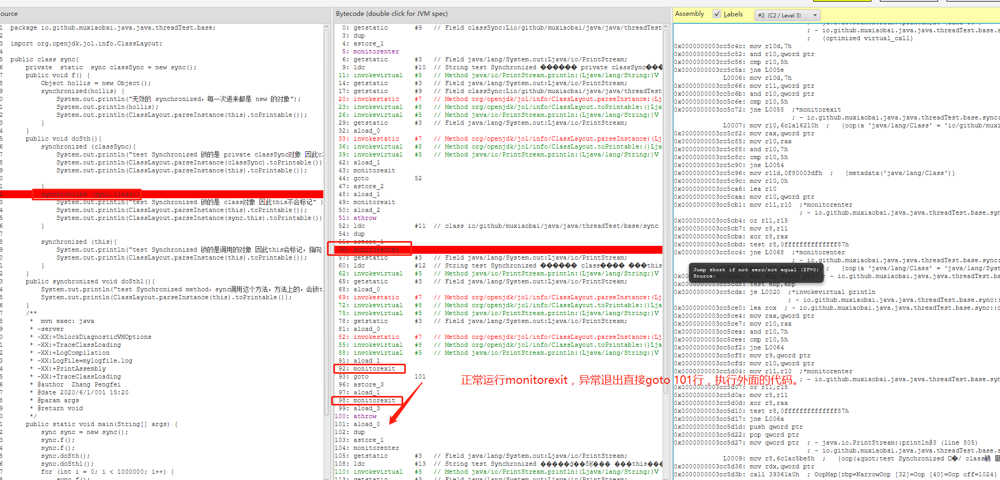
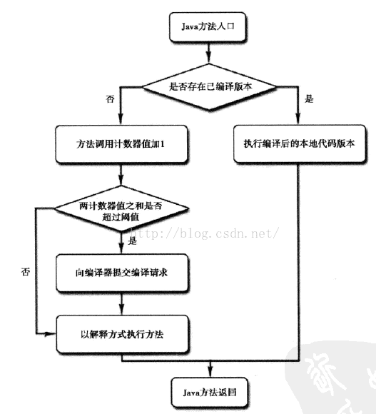
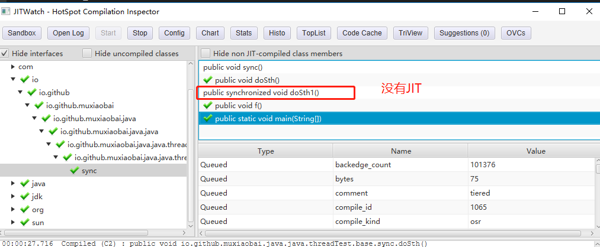

以synchronized为例：



### 什么是JIT？

JIT编译（just-in-time compilation）狭义来说是当某段代码即将第一次被执行时进行编译，因而叫“即时编译”。JIT编译是动态编译的一种特例。JIT编译一词后来被泛华，时常与动态编译等价；但要注意广义与狭义的JIT编译所指的区别。JIT(即时编译)是用来提高java程序运行效率的，原本字节码由解释器需要经过解释再运行，现在有了JIT技术，将字节码编译成平台相关的原生机器码，并进行各个层次的优化，这些机器码会被缓存起来，以备下次使用，如果JIT对每条字节码都进行编译，缓存(缓存的指令是有限的)，会增加开销，因此JIT只对热点代码进行即时编译，如循环，高频度使用的方法，会将整个方法编译成本地机器码，然后直接运行机器码。

### 操作：
pom.xml添加
```
 <plugins>
    <plugin>
        <groupId>org.codehaus.mojo</groupId>
        <artifactId>exec-maven-plugin</artifactId>
        <version>LATEST</version>
        <executions>
            <execution>
                <goals>
                    <goal>java</goal>
                </goals>
            </execution>
        </executions>
        <configuration>
            <mainClass>org.adoptopenjdk.jitwatch.launch.LaunchUI</mainClass>
        </configuration>
    </plugin>
</plugins>
```
main运行添加参数：
```
      -server
      -XX:+UnlockDiagnosticVMOptions
      -XX:+TraceClassLoading
      -XX:+LogCompilation
      -XX:LogFile=mylogfile.log
      -XX:+PrintAssembly
      -XX:+TraceClassLoading
```
生成log文件`mvn exec:java`运行，添加log文件和源文件和编译文件


### 编译器的时间开销和空间开销：



解释器的执行，抽象的看是这样的：
字节码 -> [ 解释器 解释执行机器码 ] -> 执行结果
而要JIT编译然后再执行的话，抽象的看则是：
字节码 -> [ 编译器 编译 ] -> 与机器相关的机器码-> [ 执行 ] -> 执行结果

说JIT比解释快，其实说的是“执行编译后的代码”比“解释器解释执行”要快，并不是说“编译”这个动作比“解释”这个动作快。

### 不会被JIT编译

JIT编译再怎么快，至少也比解释执行一次略慢一些，而要得到最后的执行结果还得再经过一个“执行编译后的代码”的过程。所以，对“只执行一次”的代码而言，解释执行其实总是比JIT编译执行要快。怎么算是“只执行一次的代码”呢？粗略说，下面两个条件同时满足时就是严格的“只执行一次”

1、只被调用一次，例如类的构造器（class initializer，()）
2、没有循环

对只执行一次的代码做JIT编译再执行，可以说是得不偿失。对只执行少量次数的代码，JIT编译带来的执行速度的提升也未必能抵消掉最初编译带来的开销。只有对频繁执行的代码，JIT编译才能保证有正面的收益。

对一般的Java方法而言，编译后代码的大小相对于字节码的大小，膨胀比达到10x是很正常的。同上面说的时间开销一样，这里的空间开销也是，只有对执行频繁的代码才值得编译，如果把所有代码都编译则会显著增加代码所占空间，导致“代码爆炸”。这也就解释了为什么有些JVM会选择不总是做JIT编译，而是选择用解释器+JIT编译器的混合执行引擎。
哪些程序代码会被编译为本地代码？如何编译为本地代码？

### 会被JIT编译

程序中的代码只有是热点代码时，才会编译为本地代码，那么什么是热点代码呢？运行过程中会被即时编译器编译的“热点代码”有两类：

1、被多次调用的方法。
2、被多次执行的循环体。

两种情况，编译器都是以整个方法作为编译对象。 这种编译方法因为编译发生在方法执行过程之中，因此形象的称之为栈上替换（On Stack Replacement，OSR），即方法栈帧还在栈上，方法就被替换了。


### 呢到底多少次才会被JIT编译？

即时编译JIT只在代码段执行足够次数才会进行优化，在执行过程中不断收集各种数据，作为优化的决策，所以在优化完成之前，例子中的User对象还是在堆上进行分配。

那么一段代码需要执行多少次才会触发JIT优化呢？通常这个值由-XX:CompileThreshold参数进行设置：

1、使用client编译器时，默认为1500；
2、使用server编译器时，默认为10000；

意味着如果方法调用次数或循环次数达到这个阈值就会触发标准编译，更改CompileThreshold标志的值，将使编译器提早（或延迟）编译。

除了标准编译，还有一个叫做OSR（On Stack Replacement）栈上替换的编译，如上述例子中的main方法，只执行一次，远远达不到阈值，但是方法体中执行了多次循环，OSR编译就是只编译该循环代码，然后将其替换，下次循环时就执行编译好的代码，不过触发OSR编译也需要一个阈值，可以通过以下公式得到。

```
-XX:CompileThreshold = 10000
-XX:OnStackReplacePercentage = 140
-XX:InterpreterProfilePercentage = 33
```
OSR trigger = (CompileThreshold * (OnStackReplacePercentage - InterpreterProfilePercentage)) / 100 = 10700

其中trigger即为OSR编译的阈值。


- [Java性能优化指南系列(三）：理解JIT编译器](https://blog.csdn.net/qq_28674045/article/details/51896129)
- [浅谈HotSpot逃逸分析](https://www.jianshu.com/p/20bd2e9b1f03)
- [Java JIT 知识](https://www.jianshu.com/p/eea12f3bf490)
- [什么是JIT](https://www.cnblogs.com/dzhou/p/9549839.html)