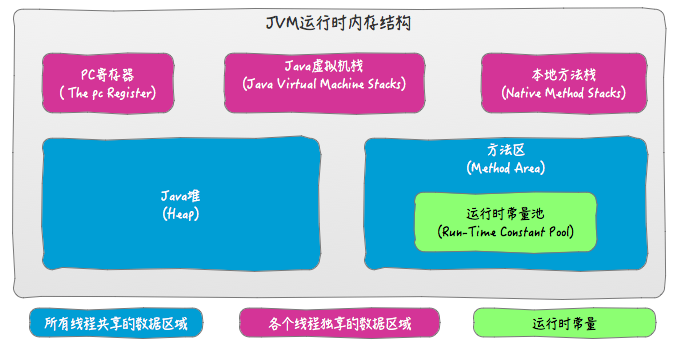

本文主要介绍对象的创建，对象一般有哪些内容，对象大小是怎么计算的，学习完，可以根据对象大小来优化jvm的设置。

下文默认64位机并开启指针压缩，-XX:+UseCompressedOops
压缩的所用：
1.在64位平台的HotSpot中使用32位指针，内存使用会多出1.5倍左右，使用较大指针在主内存和缓存之间移动数据，占用较大宽带，同时GC也会承受较大压力
2.为了减少64位平台下内存的消耗，启用指针压缩功能
3.在jvm中，32位地址表示4G个对象的指针，在4G-32G堆内存范围内，可以通过编码、解码方式进行优化，使得jvm可以支持更大的内存配置
4.堆内存小于4G时，不需要启用指针压缩，jvm会直接去除高32位地址，即使用低虚拟地址空间
5.堆内存大于32G时，压缩指针会失效，会强制使用64位(即8字节)来对java对象寻址，这就会出现1的问题，所以堆内存不要大于32G为好

以下内容会被压缩：
1.对象的全局静态变量(即类属性)
2.对象头信息:64位平台下，原生对象头大小为16字节，压缩后为12字节
3.对象的引用类型:64位平台下，引用类型本身大小为8字节，压缩后为4字节
4.对象数组类型:64位平台下，数组类型本身大小为24字节，压缩后16字节



jvm内存模型图，熟悉吧，接着往下看。


先看图这个熟悉jvm的对这个指针指向都知道，基本数据类型在栈帧中，对象，复杂类型，栈帧中只保存对对象的应用，而真实的对象是存在堆中的，我们本文是要揭示堆中的这个对象到底有什么内容，包含哪些数据，记录的什么信息。

## 大小
首先堆中的都是复杂对象这个可以理解吧，基本对象都在栈帧中了，就是int，long，char这些，注意String 不是 Integer不是，基本类型，这种是包装类型，String
内部包含一个char[] 和一个hash属性。

对象包括 markword oop，（数组长度）成为对象头，这里有可能有一个内部对齐，然后是对象的属性，最后还有一个对齐。

注意：对齐，8位对齐，一个字节。


大小应该怎么计算呢？分为两种情况，一种是Object ，一种是Array，Array中对象头包含了一个4位的数组长度。

 ### _markword


这是markword的详细信息，也就是堆中的对象头包含的信息。
这里的正常对象，age  4位  2^4-1 =15,Eden区，从form到to同一个对象，最多标记只能移动15次，参数是
MaxTenuringThreshold 默认也是15，在调试gc的时候可以把年龄打印出来-XX:+PrintTenuringDistribution.

markword 
第一部分markword,用于存储对象自身的运行时数据，如哈希码（HashCode）、GC分代年龄、锁状态标志、线程持有的锁、偏向线程ID、偏向时间戳等，这部分数据的长度在32位和64位的虚拟机（未开启压缩指针）中分别为32bit和64bit，官方称它为“MarkWord”。


### KlassOop


klass 64位机本有8字节，压缩之后4字节
对象头的另外一部分是klass类型指针，即对象指向它的类元数据的指针，虚拟机通过这个指针来确定这个对象是哪个类的实例. 32位4字节，64位开启指针压缩或最大堆内存<32g时 4字节，否则8字节

指针，治理是指向方法区现在叫metaspace，我们可以想象一下反射的时候我们是不是要获取Class对象，这个Oop可以想象就是为了获取Class对象。

### 数组长度(Array对象)
数组长度（只有数组对象有） 4字节
如果对象是一个数组, 那在对象头中还必须有一块数据用于记录数组长度.int最大值2g，2^31，java数组（包含字符串）最长2g

### 实际数据大小

#### 基本类型
基本类型大小：单位字节
- 1 byte boolean
- 2 short char (ref引用，复杂对象指向，)
- 4 int folat
- 8 long double

#### 对象类型
String =char[] + hash
Object = ref 4
上一个对象添加引用，本对象计算

#### 数组类型
包含数组类型属性的对象，还要加上一个数组长度，
一个数组需要添加一个长度

- int[] 基本类型 添加数组长度4 加上基本类型大小
- Object[] 对象数组  添加数组长度 + ref  另外Object对象要占用16个位

[DoubleArraySize](https://github.com/muxiaobai/java-demo/blob/master/test-java-demo/src/main/java/io/github/muxiaobai/java/objectsize/DoubleArraySize.java)

下面来实战一下吧。

## JOL工具

pom.xml 引用
```
    <dependency>
        <groupId>org.openjdk.jol</groupId>
        <artifactId>jol-core</artifactId>
        <version>0.10</version>
    </dependency>
```

```
    print(ClassLayout.parseClass(Object.class).toPrintable());
    print(ClassLayout.parseInstance(new Object()).toPrintable());
    print(ClassLayout.parseInstance(Object.class).toPrintable());//这个实际上是class对象

```

```

-------------------------
java.lang.Object object internals:
 OFFSET  SIZE   TYPE DESCRIPTION                               VALUE
      0    12        (object header)                           N/A
     12     4        (loss due to the next object alignment)
Instance size: 16 bytes
Space losses: 0 bytes internal + 4 bytes external = 4 bytes total

-------------------------
java.lang.Object object internals:
 OFFSET  SIZE   TYPE DESCRIPTION                               VALUE
      0     4        (object header)                           01 00 00 00 (00000001 00000000 00000000 00000000) (1)
      4     4        (object header)                           00 00 00 00 (00000000 00000000 00000000 00000000) (0)
      8     4        (object header)                           e5 01 00 f8 (11100101 00000001 00000000 11111000) (-134217243)
     12     4        (loss due to the next object alignment)
Instance size: 16 bytes
Space losses: 0 bytes internal + 4 bytes external = 4 bytes total

-------------------------
java.lang.Class object internals:
 OFFSET  SIZE                                              TYPE DESCRIPTION                               VALUE
      0     4                                                   (object header)                           01 e8 bf 80 (00000001 11101000 10111111 10000000) (-2134906879)
      4     4                                                   (object header)                           1e 00 00 00 (00011110 00000000 00000000 00000000) (30)
      8     4                                                   (object header)                           df 03 00 f8 (11011111 00000011 00000000 11111000) (-134216737)
     12     4                     java.lang.reflect.Constructor Class.cachedConstructor                   null
     16     4                                   java.lang.Class Class.newInstanceCallerCache              null
     20     4                                  java.lang.String Class.name                                (object)
     24     4                                                   (alignment/padding gap)                  
     28     4                       java.lang.ref.SoftReference Class.reflectionData                      (object)
     32     4   sun.reflect.generics.repository.ClassRepository Class.genericInfo                         null
     36     4                                java.lang.Object[] Class.enumConstants                       null
     40     4                                     java.util.Map Class.enumConstantDirectory               null
     44     4                    java.lang.Class.AnnotationData Class.annotationData                      (object)
     48     4             sun.reflect.annotation.AnnotationType Class.annotationType                      null
     52     4                java.lang.ClassValue.ClassValueMap Class.classValueMap                       null
     56    32                                                   (alignment/padding gap)                  
     88     4                                               int Class.classRedefinedCount                 0
     92   404                                                   (loss due to the next object alignment)
Instance size: 496 bytes
Space losses: 36 bytes internal + 404 bytes external = 440 bytes total

```
## 计算

### 本身大小

```
package io.github.muxiaobai.java.objectsize;

import org.openjdk.jol.info.ClassLayout;

public class JOLPeople {
    int age = 20;
    String name = "Xiaoming";
    public static void main(String[] args) {
        print(ClassLayout.parseInstance(new JOLPeople()).toPrintable());

        print(ClassLayout.parseInstance(new String("Xiaoming")).toPrintable());
        char[] chars = new char[8];
        chars[0] = 'X';
        chars[1] = 'i';
        chars[2] = 'a';
        chars[3] = 'o';
        chars[4] = 'm';
        chars[5] = 'i';
        chars[6] = 'n';
        chars[7] = 'g';

        print(ClassLayout.parseInstance(chars).toPrintable());
    }

    static void print(String message) {
        System.out.println(message);
        System.out.println("-------------------------");
    }
}

```

/***************************************************************************/

JOLPeople 本身
 -------------------------
 io.github.muxiaobai.java.objectsize.JOLPeople object internals:
 OFFSET  SIZE               TYPE DESCRIPTION                               VALUE
 0     4                    (object header)                           05 00 00 00 (00000101 00000000 00000000 00000000) (5)
 4     4                    (object header)                           00 00 00 00 (00000000 00000000 00000000 00000000) (0)
 8     4                    (object header)                           af f3 00 f8 (10101111 11110011 00000000 11111000) (-134155345)
 12     4                int JOLPeople.age                             20
 16     4   java.lang.String JOLPeople.name                            (object)
 20     4                    (loss due to the next object alignment)
 Instance size: 24 bytes
 Space losses: 0 bytes internal + 4 bytes external = 4 bytes total

 -------------------------
 _mark +oop  + 4(age的value)+ 4(name引用)
 8     + 4   +  4            +4          + 4(lose) =  24


### ShallowSize 

 String 是一个char[] 数组 和hash 两个属性

 The value is used for character storage.
private final char value[];

 Cache the hash code for the string
private int hash; // Default to 0

String

 -------------------------
 java.lang.String object internals:
 OFFSET  SIZE     TYPE DESCRIPTION                               VALUE
 0     4          (object header)                           05 00 00 00 (00000101 00000000 00000000 00000000) (5)
 4     4          (object header)                           00 00 00 00 (00000000 00000000 00000000 00000000) (0)
 8     4          (object header)                           da 02 00 f8 (11011010 00000010 00000000 11111000) (-134216998)
 12     4   char[] String.value                              []
 16     4      int String.hash                               0
 20     4          (loss due to the next object alignment)
 Instance size: 24 bytes
 Space losses: 0 bytes internal + 4 bytes external = 4 bytes total

 -------------------------
 _mark +oop  + 引用(char[])+ hash
 8     + 4   +  4            4 + lose =  24


 char[]数组 大小

 -------------------------
 [C object internals:
 OFFSET  SIZE   TYPE DESCRIPTION                               VALUE
 0     4        (object header)                           01 00 00 00 (00000001 00000000 00000000 00000000) (1)
 4     4        (object header)                           00 00 00 00 (00000000 00000000 00000000 00000000) (0)
 8     4        (object header)                           41 00 00 f8 (01000001 00000000 00000000 11111000) (-134217663)
 12     4        (object header)                           08 00 00 00 (00001000 00000000 00000000 00000000) (8)
 16    16   char [C.<elements>                             N/A
 Instance size: 32 bytes
 Space losses: 0 bytes internal + 0 bytes external = 0 bytes total

 -------------------------

 _mark +oop + 数组长度 + 实际数据
 8     + 4   +  4     + 8(arrLength) * 2(char) =  32


 我们可以手工计算一下JOLPeople obj = new JOLPeople()的大小：
 JOLPeople的Shallow size = 8(_mark) + 4(oop指针) +  4(age的value)+ 4(name引用) + 4(lose) = 24
 String对象的长度 = 8(_mark) + 4(oop指针) + 4(char[8]引用) +4(hash) +4(lose) =  24
 char[]对象长度 =  8(_mark) + 4(oop指针) +  4(数组长度占4个字节) + 8*2(value) = 32
 所以JOLPeople实际占用的空间 = 24 + 24 + 32 = 80


验证：参考:[github ShallowSize.java](https://github.com/muxiaobai/java-demo/blob/master/test-java-demo/src/main/java/io/github/muxiaobai/java/objectsize/ShallowSize.java)
[Java对象结构与锁实现原理及MarkWord详解](https://blog.csdn.net/scdn_cp/article/details/86491792)
