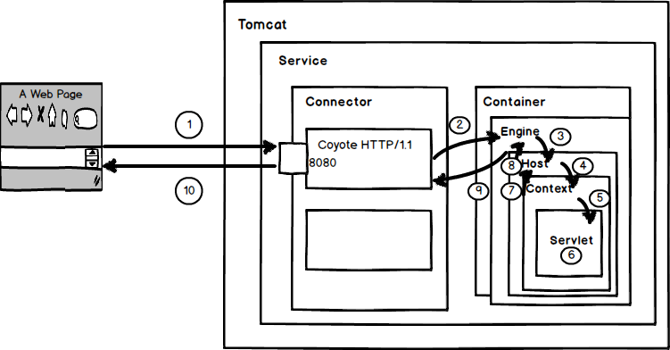
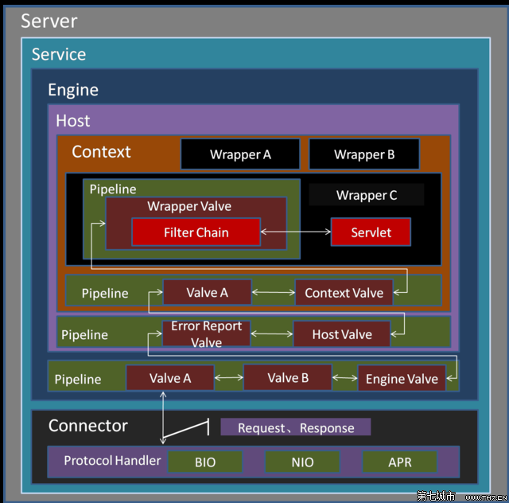

上篇讲到Connector到Container的转换，本文主要是Container内部的转换，四个组件Engine、Host、Context、Wrapper。
顺便提一下Pipeline和Value.

接上文的CoyoteAdapter.service()`connector.getService().getContainer().getPipeline().getFirst().invoke(request, response);`,

如图如图


默认的Engine是StandardEngine，这个是在EngineRuleSet中通过digester设置的，
```

        digester.addObjectCreate(prefix + "Engine",
                                 "org.apache.catalina.core.StandardEngine",
                                 "className");
        digester.addSetProperties(prefix + "Engine");
        digester.addRule(prefix + "Engine",
                         new LifecycleListenerRule
                         ("org.apache.catalina.startup.EngineConfig",
                          "engineConfigClass"));
        digester.addSetNext(prefix + "Engine",
                            "setContainer",
                            "org.apache.catalina.Engine");
```
然后这个`org.apache.catalina.core.StandardEngine`就是connector.getService().getContainer()的实际Container，所有的Container实例化的时候，都有pipeline和setBasic()。

StandardEngine构造方法
```
    public StandardEngine() {

        super();
        pipeline.setBasic(new StandardEngineValve());
        /* Set the jmvRoute using the system property jvmRoute */
        try {
            setJvmRoute(System.getProperty("jvmRoute"));
        } catch(Exception ex) {
            log.warn(sm.getString("standardEngine.jvmRouteFail"));
        }
        // By default, the engine will hold the reloading thread
        backgroundProcessorDelay = 10;

    }

```
ContainerBase中会有这个
```
 protected final Pipeline pipeline = new StandardPipeline(this);
```

这样再Engine这个级别的Container中就有一个流水线了StandardPipeline，然后这个流水线的getFirst(),这里的getFirst是StandardEngine.构造函数setBasic方法给到的一个StandardEngineValve(),如下图，这样就把StandardEngineValve就是`connector.getService().getContainer().getPipeline().getFirst()` (如果没有first的话)的最终效果，这个也是最后一个Valve(阀门)。
如果有其他的Valve呢，EngineRuleSet中就会读取到对应的Valve调用addValve，添加到base的前面(链表操作),因为每一个继承ValveBase都要实现一个方法`invoke`在这个方法中最后都会执行一个`        getNext().invoke(request, response);`这样就找到了下一个Next，直到最后一个到StandardXXXValve。接着下一步执行。
下面是StandardPipeline
```
 @Override
    public void addValve(Valve valve) {

        // Validate that we can add this Valve
        if (valve instanceof Contained)
            ((Contained) valve).setContainer(this.container);

        // Start the new component if necessary
        if (getState().isAvailable()) {
            if (valve instanceof Lifecycle) {
                try {
                    ((Lifecycle) valve).start();
                } catch (LifecycleException e) {
                    log.error("StandardPipeline.addValve: start: ", e);
                }
            }
        }
        //链表操作,如果没有第一个当前的就是第一个，
        // Add this Valve to the set associated with this Pipeline
        if (first == null) {
            first = valve;
            valve.setNext(basic);
        } else {
        //如果有把当前的就设为第一个,
            Valve current = first;
            while (current != null) {
            //直到那个是StandardXXXValve,的时候就把传入的这个valve插入进去，并valve的下一个保证是最后一个StandardXXXValve.
                if (current.getNext() == basic) {
                    current.setNext(valve);
                    valve.setNext(basic);
                    break;
                }
            //然后当前的下一个赋值给当前这个
                current = current.getNext();
            }
        }

        container.fireContainerEvent(Container.ADD_VALVE_EVENT, valve);
    }
@Override
    public void setBasic(Valve valve) {

        // Change components if necessary
        Valve oldBasic = this.basic;
        if (oldBasic == valve)
            return;

        // Stop the old component if necessary
        if (oldBasic != null) {
            if (getState().isAvailable() && (oldBasic instanceof Lifecycle)) {
                try {
                    ((Lifecycle) oldBasic).stop();
                } catch (LifecycleException e) {
                    log.error("StandardPipeline.setBasic: stop", e);
                }
            }
            if (oldBasic instanceof Contained) {
                try {
                    ((Contained) oldBasic).setContainer(null);
                } catch (Throwable t) {
                    ExceptionUtils.handleThrowable(t);
                }
            }
        }

        // Start the new component if necessary
        if (valve == null)
            return;
        if (valve instanceof Contained) {
            ((Contained) valve).setContainer(this.container);
        }
        if (getState().isAvailable() && valve instanceof Lifecycle) {
            try {
                ((Lifecycle) valve).start();
            } catch (LifecycleException e) {
                log.error("StandardPipeline.setBasic: start", e);
                return;
            }
        }

        // Update the pipeline
        Valve current = first;
        while (current != null) {
            if (current.getNext() == oldBasic) {
                current.setNext(valve);
                break;
            }
            current = current.getNext();
        }

        this.basic = valve;//设置base

    }
    @Override
    public Valve getFirst() {
        if (first != null) {
            return first;
        }

        return basic;
    }

```
这样就把StandardEngineValve就是Engine的最后一个接着调用的时候就找到Host。
```
 @Override
    public final void invoke(Request request, Response response)
        throws IOException, ServletException {

        // Select the Host to be used for this Request
        Host host = request.getHost();
        if (host == null) {
            response.sendError
                (HttpServletResponse.SC_BAD_REQUEST,
                 sm.getString("standardEngine.noHost",
                              request.getServerName()));
            return;
        }
        if (request.isAsyncSupported()) {
            request.setAsyncSupported(host.getPipeline().isAsyncSupported());
        }

        // Ask this Host to process this request
        host.getPipeline().getFirst().invoke(request, response);

    }
```
而同样host设置的配置是在HostRuleSet中。其他的步骤和上一面一样哦。Engine---->Host---->Context---->Wrapper
这样我们直接就找到最后一层的StandardWrapper.找到最后一个StandardWrapperValve阀门的invoke方法
这个方法中的有个Filter.

```

 // Create the filter chain for this request
        ApplicationFilterChain filterChain =
                ApplicationFilterFactory.createFilterChain(request, wrapper, servlet);
        // Call the filter chain for this request
        // NOTE: This also calls the servlet's service() method
        filterChain.doFilter(request.getRequest(),
                response.getResponse());
                 
```

这里也有一个注释 Call the filter chain for this request，调用request的过滤器链`calls the servlet's service() method`调用servlet的service()方法。

ApplicationFilterChain这个类中。doFilter最后，`servlet.service(request, response);`


#### Pipeline Value

管道，阀门，责任链，外界进来的请求，先从Connector到Container,中间经过协议处理，然后在Container中，依次讲请求通过各种管道，每一层管道的最后阀门都是StandardXXXValve,然后交到下一层的第一个阀门再进行处理，最终会流到Servlet.service(),这里就是我们正常写的代码，`doGet();doPost();`

HttpServlet.service();
```
    protected void service(HttpServletRequest req, HttpServletResponse resp)
        throws ServletException, IOException {

        String method = req.getMethod();

        if (method.equals(METHOD_GET)) {
            long lastModified = getLastModified(req);
            if (lastModified == -1) {
                // servlet doesn't support if-modified-since, no reason
                // to go through further expensive logic
                doGet(req, resp);//Get
            } else {
                long ifModifiedSince;
                try {
                    ifModifiedSince = req.getDateHeader(HEADER_IFMODSINCE);
                } catch (IllegalArgumentException iae) {
                    // Invalid date header - proceed as if none was set
                    ifModifiedSince = -1;
                }
                if (ifModifiedSince < (lastModified / 1000 * 1000)) {
                    // If the servlet mod time is later, call doGet()
                    // Round down to the nearest second for a proper compare
                    // A ifModifiedSince of -1 will always be less
                    maybeSetLastModified(resp, lastModified);
                    doGet(req, resp);
                } else {
                    resp.setStatus(HttpServletResponse.SC_NOT_MODIFIED);
                }
            }

        } else if (method.equals(METHOD_HEAD)) {
            long lastModified = getLastModified(req);
            maybeSetLastModified(resp, lastModified);
            doHead(req, resp);

        } else if (method.equals(METHOD_POST)) {
            doPost(req, resp);//Post

        } else if (method.equals(METHOD_PUT)) {
            doPut(req, resp);

        } else if (method.equals(METHOD_DELETE)) {
            doDelete(req, resp);

        } else if (method.equals(METHOD_OPTIONS)) {
            doOptions(req,resp);

        } else if (method.equals(METHOD_TRACE)) {
            doTrace(req,resp);

        } else {
            //
            // Note that this means NO servlet supports whatever
            // method was requested, anywhere on this server.
            //

            String errMsg = lStrings.getString("http.method_not_implemented");
            Object[] errArgs = new Object[1];
            errArgs[0] = method;
            errMsg = MessageFormat.format(errMsg, errArgs);

            resp.sendError(HttpServletResponse.SC_NOT_IMPLEMENTED, errMsg);
        }
    }

```

至此，用户请求的URL就给我们处理了，写doGet，doPost等等，这一个阶段的Tomcat源码就先到这里，告一段落！

             
系列文章

- [Tomcat源码阅读之从server.xml看组件关系](http://muxiaobai.github.io/2018/04/16/Tomcat%E6%BA%90%E7%A0%81%E9%98%85%E8%AF%BB%E4%B9%8B%E4%BB%8Eserver-xml%E7%9C%8B%E7%BB%84%E4%BB%B6%E5%85%B3%E7%B3%BB/)
- [Tomcat源码阅读之组件生命周期](http://muxiaobai.github.io/2018/04/16/Tomcat%E6%BA%90%E7%A0%81%E9%98%85%E8%AF%BB%E4%B9%8B%E7%BB%84%E4%BB%B6%E7%94%9F%E5%91%BD%E5%91%A8%E6%9C%9F/)
- [Tomcat源码阅读之URL请求解析](http://muxiaobai.github.io/2018/04/17/Tomcat%E6%BA%90%E7%A0%81%E9%98%85%E8%AF%BB%E4%B9%8BURL%E8%AF%B7%E6%B1%82%E8%A7%A3%E6%9E%90/)
- [Tomcat源码阅读之Container责任链](https://muxiaobai.github.io/2018/04/20/Tomcat%E6%BA%90%E7%A0%81%E9%98%85%E8%AF%BB%E4%B9%8BContainer%E8%B4%A3%E4%BB%BB%E9%93%BE/)

参考文献：

- [Tomcat中的设计模式](https://www.cnblogs.com/coldridgeValley/p/6606271.html)
- 《深入剖析Tomcat》
