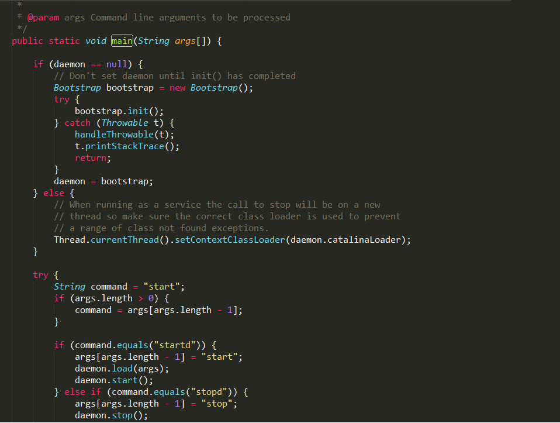
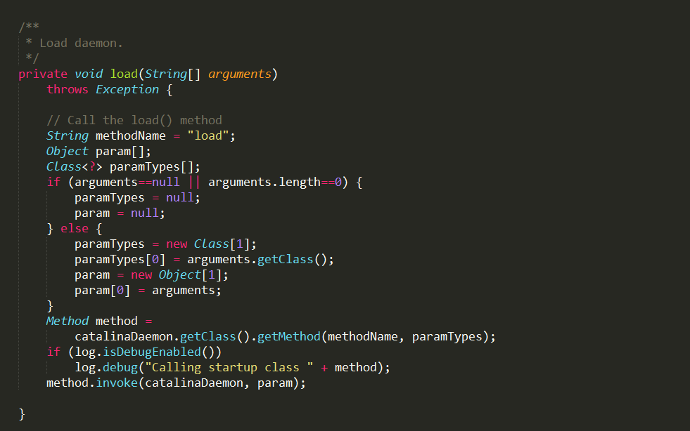
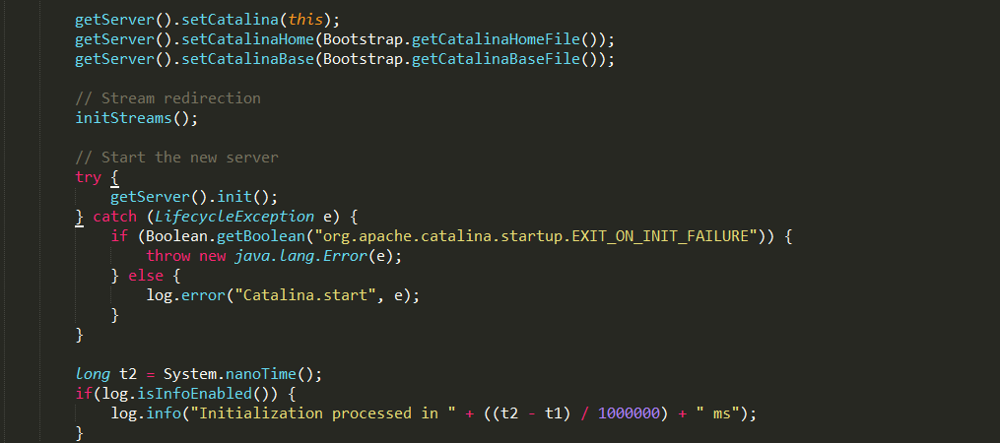
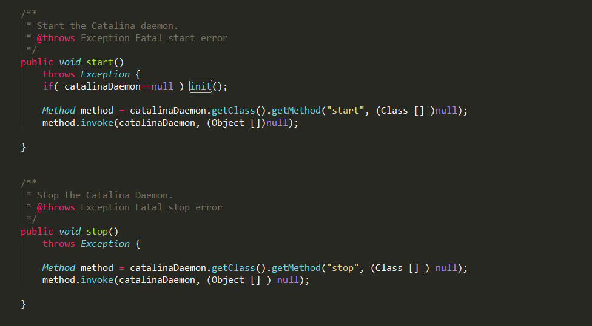
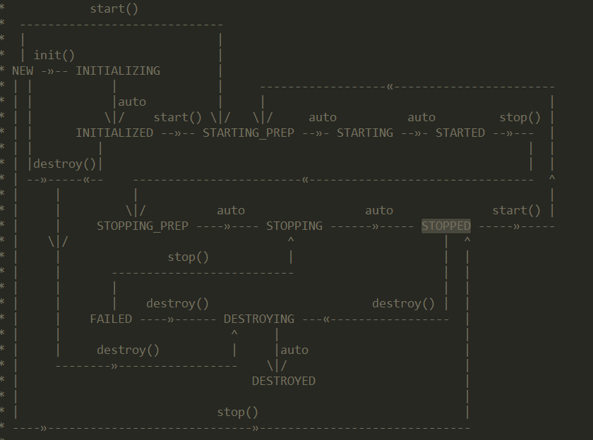

## 组件关系图

[百度脑图Server.xml](http://naotu.baidu.com/file/43052d65c99873cc44a09e10a577de38?token=2c2c55090d50e6df)


## server.xml 文件

```
<?xml version="1.0" encoding="UTF-8"?>
<Server port="8005" shutdown="SHUTDOWN">
  <Listener className="org.apache.catalina.startup.VersionLoggerListener" />
  <Listener className="org.apache.catalina.core.AprLifecycleListener" SSLEngine="on" />
  <Listener className="org.apache.catalina.core.JreMemoryLeakPreventionListener" />
  <Listener className="org.apache.catalina.mbeans.GlobalResourcesLifecycleListener" />
  <Listener className="org.apache.catalina.core.ThreadLocalLeakPreventionListener" />

  <GlobalNamingResources>
    <Resource name="UserDatabase" auth="Container"
              type="org.apache.catalina.UserDatabase"
              description="User database that can be updated and saved"
              factory="org.apache.catalina.users.MemoryUserDatabaseFactory"
              pathname="conf/tomcat-users.xml" />
  </GlobalNamingResources>
  <Service name="Catalina">
    <Connector port="8080" protocol="HTTP/1.1" connectionTimeout="20000" redirectPort="8443" />
    <!-- Define an AJP 1.3 Connector on port 8009 -->
    <Connector port="8009" protocol="AJP/1.3" redirectPort="8443" />
    <Engine name="Catalina" defaultHost="localhost">
      <!--
      <Cluster className="org.apache.catalina.ha.tcp.SimpleTcpCluster"/>
      -->
      <Realm className="org.apache.catalina.realm.LockOutRealm">
        <Realm className="org.apache.catalina.realm.UserDatabaseRealm" resourceName="UserDatabase"/>
      </Realm>

      <Host name="localhost"  appBase="webapps"
            unpackWARs="true" autoDeploy="true">
        <!--
        <Valve className="org.apache.catalina.authenticator.SingleSignOn" />
        -->
        <Valve className="org.apache.catalina.valves.AccessLogValve" directory="logs"
               prefix="localhost_access_log" suffix=".txt"
               pattern="%h %l %u %t &quot;%r&quot; %s %b" />
        <Context path="/" docBase="D:\Program Files \app1.war" reloadable="true"/>
      </Host>
    </Engine>
  </Service>
</Server>

```

这个大致的组件印象也是之后研究代码的方向。


## catalina.bat 文件告诉你那个是启动入口

#### 怎么找到启动类?

分析catalina.bat 文件
`  --setlocal 设置变量等 -- `
设置 CATALINA_HOME  CATALINA_BASE
执行setenv.bat  setclasspath.bat
设置CLASSPATH tomcat-juli.jar JAVA_OPTS LOGGING_CONFIG  LOGGING_MANAGER

`-- Execute The Requested Command 执行用户请求 --`

set _EXECJAVA=%_RUNJAVA%
set MAINCLASS=org.apache.catalina.startup.Bootstrap

echo   debug             Start Catalina in a debugger
echo   debug -security   Debug Catalina with a security manager
echo   jpda start        Start Catalina under JPDA debugger
echo   run               Start Catalina in the current window
echo   run -security     Start in the current window with security manager
echo   start             Start Catalina in a separate window
echo   start -security   Start in a separate window with security manager
echo   stop              Stop Catalina
echo   configtest        Run a basic syntax check on server.xml
echo   version 


其中的命令

找到了  `set MAINCLASS=org.apache.catalina.startup.Bootstrap` 从Bootstrap找到main函数.


#### 从main启动到所有组件启动

tomcat 启动的时候打印的日志可以借助这个来分析一下

```

四月 16, 2018 5:46:37 下午 org.apache.catalina.startup.VersionLoggerListener log
信息: Server version:        Apache Tomcat/8.0.39
四月 16, 2018 5:46:37 下午 org.apache.catalina.startup.VersionLoggerListener log
信息: Server built:          Nov 9 2016 08:48:39 UTC
四月 16, 2018 5:46:37 下午 org.apache.catalina.startup.VersionLoggerListener log
信息: Server number:         8.0.39.0
四月 16, 2018 5:46:37 下午 org.apache.catalina.startup.VersionLoggerListener log
信息: OS Name:               Windows 7
四月 16, 2018 5:46:37 下午 org.apache.catalina.startup.VersionLoggerListener log
信息: OS Version:            6.1
四月 16, 2018 5:46:37 下午 org.apache.catalina.startup.VersionLoggerListener log
信息: Architecture:          amd64
四月 16, 2018 5:46:37 下午 org.apache.catalina.startup.VersionLoggerListener log
信息: Java Home:             C:\Program Files\Java\jdk1.8.0_111\jre
四月 16, 2018 5:46:37 下午 org.apache.catalina.startup.VersionLoggerListener log
信息: JVM Version:           1.8.0_111-b14
四月 16, 2018 5:46:37 下午 org.apache.catalina.startup.VersionLoggerListener log
信息: JVM Vendor:            Oracle Corporation
四月 16, 2018 5:46:37 下午 org.apache.catalina.startup.VersionLoggerListener log
信息: CATALINA_BASE:         D:\tomcat\apache-tomcat-8.0.39-8080
四月 16, 2018 5:46:37 下午 org.apache.catalina.startup.VersionLoggerListener log
信息: CATALINA_HOME:         D:\tomcat\apache-tomcat-8.0.39-8080
四月 16, 2018 5:46:37 下午 org.apache.catalina.startup.VersionLoggerListener log
信息: Command line argument: -Dcatalina.base=D:\tomcat\apache-tomcat-8.0.39-8080
四月 16, 2018 5:46:37 下午 org.apache.catalina.startup.VersionLoggerListener log
信息: Command line argument: -Dcatalina.home=D:\tomcat\apache-tomcat-8.0.39-8080
四月 16, 2018 5:46:37 下午 org.apache.catalina.startup.VersionLoggerListener log
信息: Command line argument: -Dwtp.deploy=D:\tomcat\apache-tomcat-8.0.39-8080\webapps
四月 16, 2018 5:46:37 下午 org.apache.catalina.startup.VersionLoggerListener log
信息: Command line argument: -Djava.endorsed.dirs=D:\tomcat\apache-tomcat-8.0.39-8080\endorsed
四月 16, 2018 5:46:37 下午 org.apache.catalina.startup.VersionLoggerListener log
信息: Command line argument: -Djava.library.path=C:\Program Files\Java\jdk1.8.0_111\bin;D:\tomcat\apache-tomcat-8.0.39-8080\bin
四月 16, 2018 5:46:37 下午 org.apache.catalina.startup.VersionLoggerListener log
信息: Command line argument: -Dfile.encoding=UTF-8
```
以上 都是Log信息打印出来的信息

```
四月 16, 2018 5:46:37 下午 org.apache.catalina.core.AprLifecycleListener lifecycleEvent
信息: Loaded APR based Apache Tomcat Native library 1.2.10 using APR version 1.5.2.
四月 16, 2018 5:46:37 下午 org.apache.catalina.core.AprLifecycleListener lifecycleEvent
信息: APR capabilities: IPv6 [true], sendfile [true], accept filters [false], random [true].
四月 16, 2018 5:46:38 下午 org.apache.catalina.core.AprLifecycleListener initializeSSL
信息: OpenSSL successfully initialized (OpenSSL 1.0.2j  26 Sep 2016)
四月 16, 2018 5:46:38 下午 org.apache.coyote.AbstractProtocol init
信息: Initializing ProtocolHandler ["http-apr-8080"]
四月 16, 2018 5:46:38 下午 org.apache.coyote.AbstractProtocol init
信息: Initializing ProtocolHandler ["ajp-apr-8018"]
四月 16, 2018 5:46:38 下午 org.apache.catalina.startup.Catalina load
信息: Initialization processed in 1173 ms
四月 16, 2018 5:46:38 下午 org.apache.catalina.core.StandardService startInternal
信息: Starting service Catalina
四月 16, 2018 5:46:38 下午 org.apache.catalina.core.StandardEngine startInternal
信息: Starting Servlet Engine: Apache Tomcat/8.0.39
四月 16, 2018 5:46:38 下午 org.apache.coyote.AbstractProtocol start
信息: Starting ProtocolHandler ["http-apr-8080"]
四月 16, 2018 5:46:38 下午 org.apache.coyote.AbstractProtocol start
信息: Starting ProtocolHandler ["ajp-apr-8018"]
四月 16, 2018 5:46:38 下午 org.apache.catalina.startup.Catalina start
信息: Server startup in 68 ms

```
从Bootstrap 到 Catalina 总体流程  main  init load start&stop



main中一上来就调用 init，init是为了产生Catalina实例,然后是load 和start 等。


main 调用 init ` Class<?> startupClass = catalinaLoader.loadClass("org.apache.catalina.startup.Catalina");`
` Object startupInstance = startupClass.getConstructor().newInstance();` 反射获取类的实例，
之后` catalinaDaemon = startupInstance;`  赋值给catalinaDaemon, laod和start、getServer等方法都是从这个对象中执行的，实际上就是执行的Catalina的方法



这个和 `method.invoke(catalinaDaemon, param);`  相当于catalina.load(param);

中间加一个Catalina的laod方法重点代码

`getServer().init();`

`log.info("Initialization processed in " + ((t2 - t1) / 1000000) + " ms");`
从上面的tomcat启动的时候打印出来的日志中就有这一行`信息: Initialization processed in 1173 ms`


这个时候是生命周期的NEW init初始化，如果执行的是启动的命令，就会调用下面Bootstrap中



`Method method = catalinaDaemon.getClass().getMethod("start", (Class [] )null); method.invoke(catalinaDaemon, (Object [])null);` 反射,一样调用Catalina中的start方法和对应的stop方法。


最后的启动后`信息: Server startup in 68 ms`日志信息,是在Catalina中的start方法`log.info("Server startup in " + ((t2 - t1) / 1000000) + " ms");`
`getServer().start();`这个方法中同样会执行一个start()方法， 之后会讲解一下这个Server和之后的其他组件之间是怎么加载启动等，这里的组件就是server.xml文件的这些组件，

这个只是简单的初始化和启动的问题，下一个就会说具体的生命周期主要类`Lifecycle`

先放个图吧


参考下一篇 [Tomcat源码阅读之组件生命周期](http://muxiaobai.github.io/2018/04/16/Tomcat%E6%BA%90%E7%A0%81%E9%98%85%E8%AF%BB%E4%B9%8B%E7%BB%84%E4%BB%B6%E7%94%9F%E5%91%BD%E5%91%A8%E6%9C%9F/)                                                                                        
系列文章

- [Tomcat源码阅读之从server.xml看组件关系](http://muxiaobai.github.io/2018/04/16/Tomcat%E6%BA%90%E7%A0%81%E9%98%85%E8%AF%BB%E4%B9%8B%E4%BB%8Eserver-xml%E7%9C%8B%E7%BB%84%E4%BB%B6%E5%85%B3%E7%B3%BB/)
- [Tomcat源码阅读之组件生命周期](http://muxiaobai.github.io/2018/04/16/Tomcat%E6%BA%90%E7%A0%81%E9%98%85%E8%AF%BB%E4%B9%8B%E7%BB%84%E4%BB%B6%E7%94%9F%E5%91%BD%E5%91%A8%E6%9C%9F/)
- [Tomcat源码阅读之URL请求解析](http://muxiaobai.github.io/2018/04/17/Tomcat%E6%BA%90%E7%A0%81%E9%98%85%E8%AF%BB%E4%B9%8BURL%E8%AF%B7%E6%B1%82%E8%A7%A3%E6%9E%90/)
- [Tomcat源码阅读之Container责任链](https://muxiaobai.github.io/2018/04/20/Tomcat%E6%BA%90%E7%A0%81%E9%98%85%E8%AF%BB%E4%B9%8BContainer%E8%B4%A3%E4%BB%BB%E9%93%BE/)


参看文献：

- 《深入剖析Tomcat》
- [Tomcat 系统架构与设计模式](https://www.ibm.com/developerworks/cn/java/j-lo-tomcat1/)
- [tomcat8.5.30源码](http://mirrors.tuna.tsinghua.edu.cn/apache/tomcat/tomcat-8/v8.5.30/src/apache-tomcat-8.5.30-src.zip)
- [手写一个简化版Tomcat](https://my.oschina.net/liughDevelop/blog/1790893#comment-list)