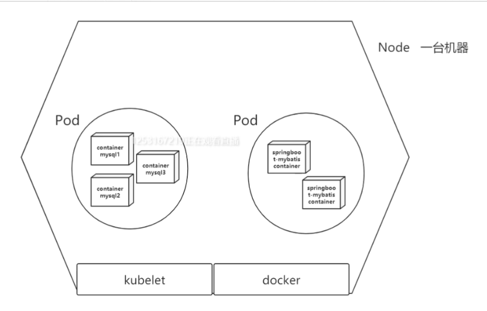
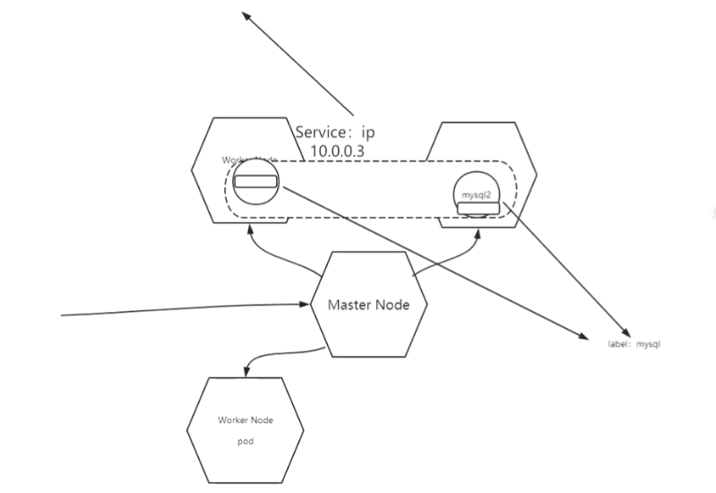
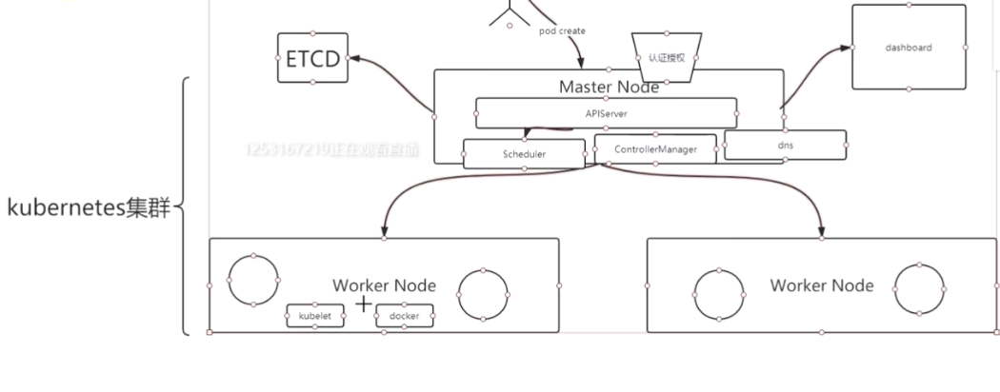
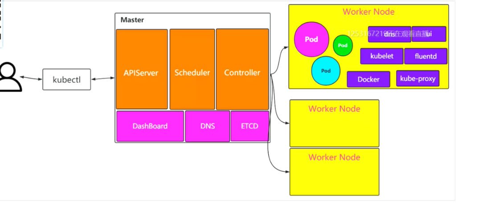

----------------------------------------

官网 hub.docker.com

docker login/logout

#### 远程镜像
docker pull mysql
docker push 
docker search 

###  本地镜像 image
docker images
docker rmi

### 网络 network
172.17.0.1/16 以下都可以是使用

docker network ls
docker network inspect mysql-net
docker network create --subnet=172.19.0.0/24 mysql-net

### volume
docker volume create --name v1
docker volumn inspect
### 容器 container
docker run -d \--name mmmysql -p 3300:3306 -m 500M
-v v1:/var/lib/mysql -e MYSQL_ROOT_PASSWORD=123456 \--privileged \--net=mysql-net --ip 172.19.0.2 mysql:latest

mvn clean clean package docker:build -Dmaven.test.skip=true

docker run -d \--name tomcat1 -p 3300:3306 \--net mysql-net \--ip 172.19.0.2 -v v1:/var/lib/mysql mytomcat:latest
### 实例

docker ps -a
docker ps 
docker exec -it mmmysql /bin/bash
docker logs -f --tail=100 mmmysql  最新的100行
docker inspect mmmysql

-----------------------------------------
docker-compose.yml docker 编排

K8s
#### Pod
Pod  (container-mysql1,container-mysql2,container-mysql3)
一个Pod包含一类的container
#### Node
Node一台机器多个Pod
Kubelet操作Pod
docker 

#### Service
label:不同的Node内部的Pod，同一个label 叫Service
mysql1  mysql2

#### 
master Node Worker Node 调度算法：Scheduler APIServer ControllerManager 

ReplicaSet 对Pod进行扩缩容

对Pod滚动更新：Deployment

分布式ETCD数据存储

使用者通过Kubectl操作K8s和docker

---------------------------------------