分两步走，第一安装，第二配置


## 权限问题

```
chown -R 1000 /root/jenkins_home
chmod 777 /var/run/docker.sock
```

## docker 创建jenkins工具持续集成

拉取镜像 `docker pulljenkins/jenkins`

8080映射到16000 5000映射到16001端口
创建容器:

```
docker run --name jenkins -p 16000:8080 -p 16001:50000 \
    -v /var/run/docker.sock:/var/run/docker.sock \
    -v $(which docker):/bin/docker \
    -v /root/jenkins_home:/var/jenkins_home \
    -d jenkins/jenkins
```

- /root/jenkins_home 为jenkins工作空间，包括插件maven，git工具等
- 需要在shell中使用宿主机的docker命令

删除容器：`docker rm -f jenkins`

下面的创建，添加了本地执行shell挂载卷

```
docker run \
    -d -p 16000:8080 -p 16001:50000 \
    -v /opt/demo/:/opt/demo \
    -v /root/jenkins_home/:/var/jenkins_home \
    -v /var/run/docker.sock:/var/run/docker.sock \
    -v $(which docker):/usr/bin/docker \
    -v $(which git):/usr/bin/git \
    -v ~/.ssh:/var/jenkins_home/.ssh \
    --name=jenkins jenkins/jenkins
```

挂载：其中/opt/demo 为命令执行空间

访问 http://ip:16000

以上 安装完成

参考[jenkins安装](https://www.cnblogs.com/stulzq/p/8627360.html)


## 构建集成配置
需要以下工具 	
- Git plugin 源码地址
- Maven Integration plugin   构建工具
- Publish Over SSH 远程发布

`/root/jenkins_home/tools/hudson.tasks.Maven_MavenInstallation`在这个文件夹下会有maven工具支持构建

新建项目选择maven,需要安装maven 工具
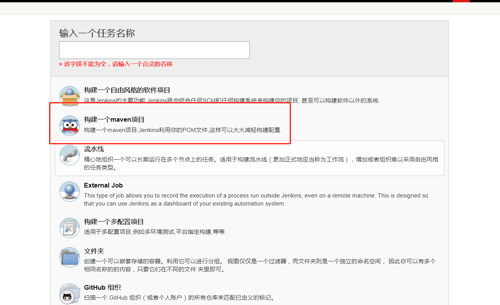
### 配置源码仓库

配置git地址，分支`refs/heads/dev`

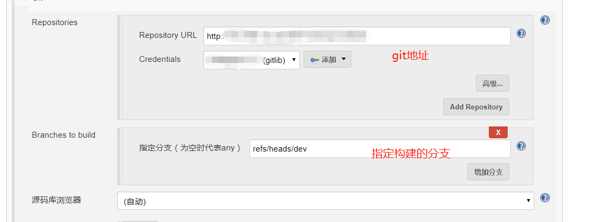
### 配置触发器

#### github hook
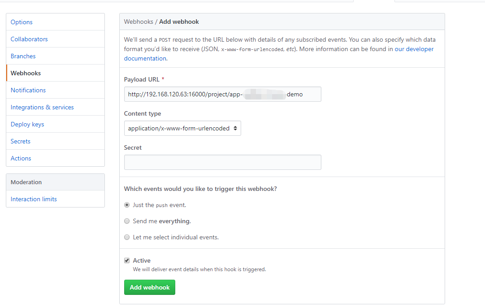
只用把github勾选
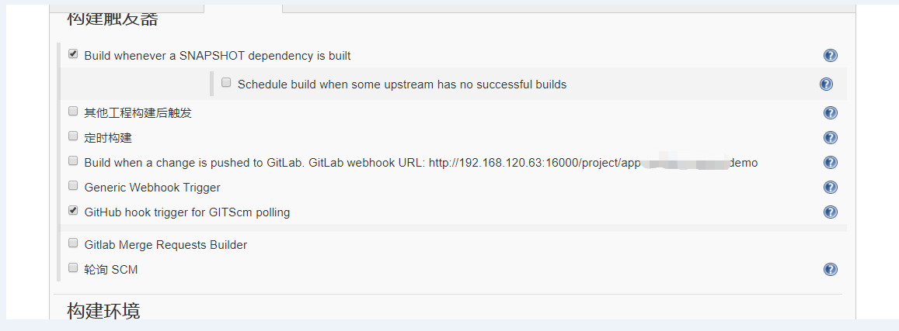

#### gitlab配置
Accepted Merge Requests Events 接受合并分支时，触发
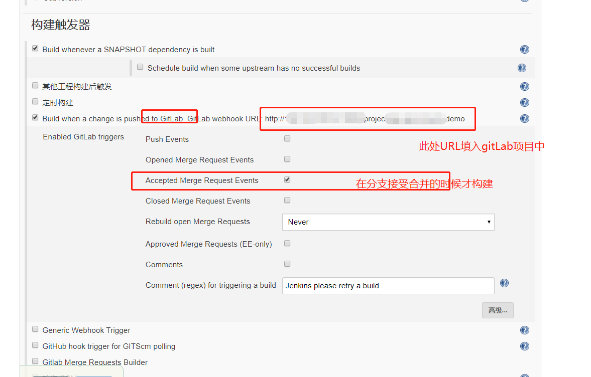
出现`Url is blocked: Requests to the local network are not allowed` 问题，需要在系统管理员处配置：
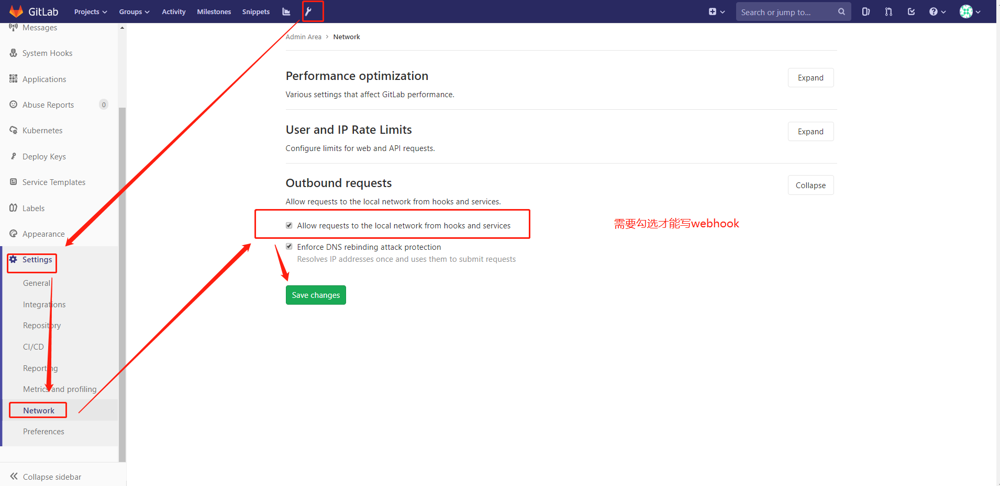
合并分支时候调用hook地址
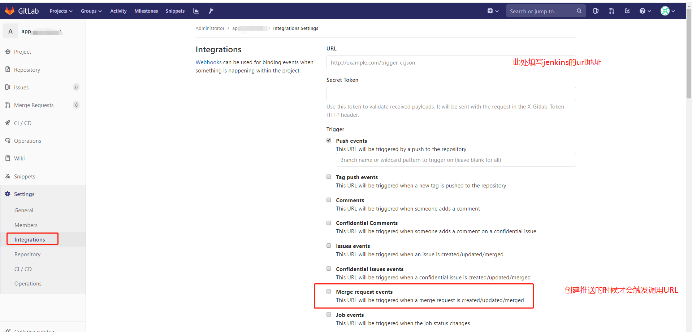

### 配置 Build
pom.xml
clean package
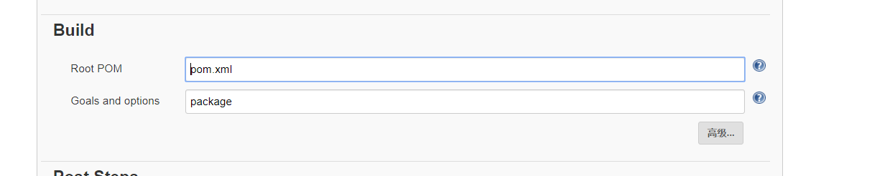
### 配置Post Steps


#### 本机发布执行shell
shell脚本

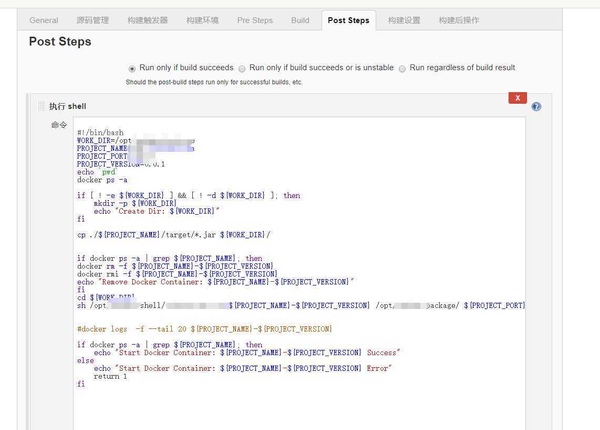


```
    #!/bin/bash
    WORK_DIR=/opt/demo/package
    PROJECT_NAME=app-demo
    PROJECT_VERSION=0.0.1
    echo `pwd`
    docker ps -a 
    #  判断工作目录是否存在
    if [ ! -e ${WORK_DIR} ] && [ ! -d ${WORK_DIR} ]; then
        mkdir -p ${WORK_DIR}
        echo "Create Dir: ${WORK_DIR}"
    fi

    # Dockerfile存在 删除
    if [ -e ${WORK_DIR}/${PROJECT_NAME}/Dockerfile ]; then
        rm -rf ${WORK_DIR}/${PROJECT_NAME}/Dockerfile
        echo "Remove File: ${WORK_DIR}/${PROJECT_NAME}/Dockerfile"
    fi
    # 如果容器已经启动，移除
    if docker ps -a | grep ${PROJECT_NAME}; then
        docker rm -f ${PROJECT_NAME}-${PROJECT_VERSION}
        docker rmi -f ${PROJECT_NAME}-${PROJECT_VERSION}
        echo "Remove Docker Container: ${PROJECT_NAME}-${PROJECT_VERSION}"
    fi

    # 拷贝jar包到工作目录 jar是通过maven pom.xml 生成的
    cp ./target/*.jar ${WORK_DIR}/${PROJECT_NAME}/ 
    # 拷贝Dockerfile到工作目录 是提前编写在git项目内
    cp ./Dockerfile ${WORK_DIR}/${PROJECT_NAME}/
    
    # 开始构建镜像
    # 进入工作目录
    cd ${WORK_DIR}/${PROJECT_NAME}/
    # 构建镜像 在个工作目录，依据当前目录创建镜像
    # docker build -t ${PROJECT_NAME}:${PROJECT_VERSION} .
    # 推送镜像
    # docker push ${PROJECT_NAME}:${PROJECT_VERSION}

    #  启动容器
    # docker run -d -p 18000:8761 --name ${PROJECT_NAME} ${PROJECT_NAME}:${PROJECT_VERSION}

    #dockerstart.sh 为便捷构建容器启动容器脚本
    #cd ${WORK_DIR}
    #sh ../shell/dockerstart.sh ${PROJECT_NAME}-${PROJECT_VERSION} /opt/demo/package/ 18000

    #判断容器启动成功
    if docker ps  | grep ${PROJECT_NAME}; then
        echo "Start Docker Container: ${PROJECT_NAME}-${PROJECT_VERSION} Success"
    else 
        echo "Start Docker Container: ${PROJECT_NAME}-${PROJECT_VERSION} Error"
        return 1
    fi

```

#### 远程发布SSH Publishers
配置插件如果要进行远程发布，需要插件

先在系统全局配置中配置以下ssh
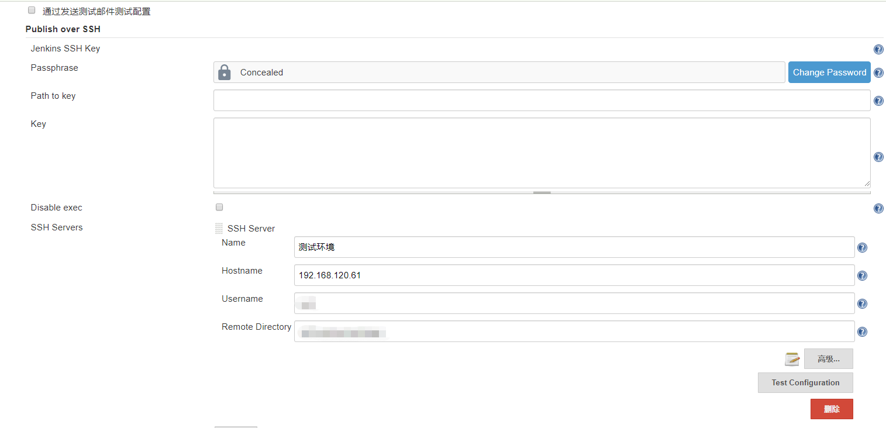
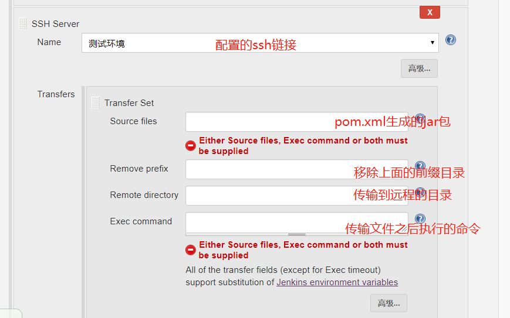


[配置构建项目](https://blog.csdn.net/Denny2333/article/details/88037413)