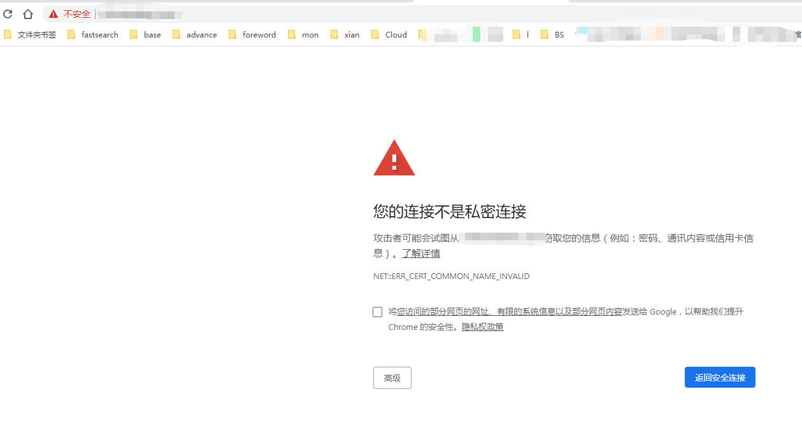

怎么配置可以参考[SpringBoot之https请求](https://muxiaobai.github.io/2020/01/02/SpringBoot%E4%B9%8Bhttps%E8%AF%B7%E6%B1%82/)

### 信息安全问题

在信息安全性问题中，我们常常要做到三点才能保证信息的安全：
- 信息的保密性
- 信息的完整性
- 身份识别

### 加密
非对称加密中的：公钥(public)和私钥(private)
- 公钥(public key)是对外开放的，私钥(private key)是自己拥有的。
- 公钥(public key)加密的数据，只能用私钥(private key)解密。
- 私钥(private key)加密的数据，只能用公钥(public key)解密。

### 一个简单的过程

首先，客户端向服务器发出加密请求。

3)服务器用自己的私钥加密网页以后，连同本身的数字证书，这里的数字证书，是CA发给你的（默认你是知道CA颁布的证书的），一起发送给客户端。

4)客户端（浏览器）的"证书管理器"，有"受信任的根证书颁发机构"列表。客户端会根据这张列表，查看解开数字证书的公钥是否在列表之内。

5)如果数字证书记载的网址，与你正在浏览的网址不一致，就说明这张证书可能被冒用，浏览器会发出警告。

6)如果这张数字证书不是由受信任的机构颁发的，浏览器会发出另一种警告

自己生成的证书，浏览器没有维护证书机构，因此标记不安全，但从算法上来说是安全的，加密过的信息，只是不知道出处，数据来源。

明确一点：各大浏览器和操作系统已经维护了所有权威证书机构的名称和公钥。所以客户端只需要知道是哪个机构(CA)颁布的证书，就可以从本地找到对应的机构公钥，解密出证书签名。

[一文看懂HTTPS、证书机构（CA）、证书、数字签名、私钥、公钥](https://www.jianshu.com/p/29e0ba31fb8d)
[是时候理解下HTTPS的原理及流程了](https://www.sohu.com/a/320031789_371153)
[钥与私钥，HTTPS详解](https://blog.csdn.net/u011123724/article/details/80586173)
[对应的英文版本 上一篇](http://www.youdzone.com/signature.html)

