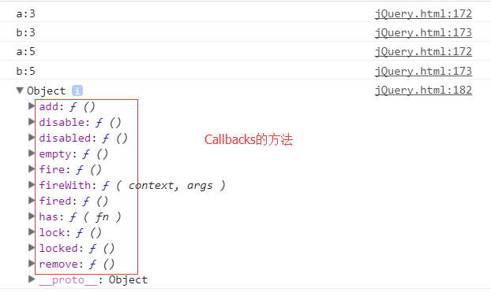

## Callbacks

```
var abc=$.Callbacks();
function a(n){   console.log("a:"+n);}
function b(x){   console.log("b:"+x);}
abc.add(a);
abc.add(b);
abc.fire(3);
abc.fire(5);
console.log(abc);
```



/*
 * Create a callback list using the following parameters:
 *
 *	options: an optional list of space-separated options that will change how
 *			the callback list behaves or a more traditional option object
 *
 * By default a callback list will act like an event callback list and can be
 * "fired" multiple times.
 * //默认为false，当有参数的时候为true
 * Possible options:
 *	//重复调用fire(),只执行一次 option.once =true
 *	once:			will ensure the callback list can only be fired once (like a Deferred)
 *	//add后继续执行fire() option.menory =true 针对add再一次调用fire
 *	memory:			will keep track of previous values and will call any callback added
 *					after the list has been fired right away with the latest "memorized"
 *					values (like a Deferred)
 *	//唯一的 函数名不能重复 针对add添加的时候
 *	unique:			will ensure a callback can only be added once (no duplicate in the list)
 *	//遇到返回false就停止
 *	stopOnFalse:	interrupt callings when a callback returns false
 *
 */


add() 添加
fire() 触发

$.Callbacks();

## Deferred

状态表格tulps


## when promise

$.when().done();


## ajax ready

$.post().success().fail();
$.get().then();