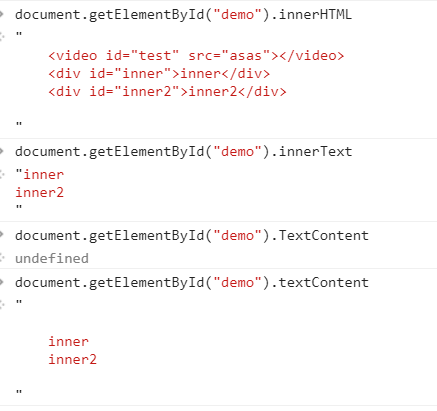

产生这种想法的原因是，之前在使用jQuery的时候，chrome的append(),insert(),等都没有问题，但是正式环境，他们使用的是IE9 可能是jQuery的版本太高了，不支持innerHTML，后来问我们大师，告诉我说innerHTML，都是支持的。这样这种问题一直记录到现在。最近在看jQuery的源码，才知道IE9是不支持innerHTML的，因此又学习了一下原生的javascript对DOM的操作。
<!--more-->
使用[caniuse.com](http://caniuse.com/#search=innerHTML)查innerHTML会有这样一个issue
  innerHTML, insertAdjacentHTML, etc aren't supported or are read-only on the following elements in IE9 and below: col, colgroup, frameset, html, head, style, table, tbody, tfoot, thead, title, and tr.
不支持，只读

###  javascript犀牛书的词典

javascript基本
null undefined 
String Number Boolean Array Object 

javascript客户端


### jQuery 源码阅读 三个抽象方法 dir siblings domMamip

dir  siblings(sibling) 针对获取、遍历

domManip 针对添加的elem片段，将一些不合规矩的元素修改一下，顺便整理一下兼容性的问题。让其符合W3C的规范。

```

//dir 层级关系抽象 2893
//参数解释 ：第一个是当前节点 dir是针对 until 直到找到until结束
var dir = function( elem, dir, until ) {
	var matched = [],
		truncate = until !== undefined;
	    //如果until没有的话 truncate 为false ，不会break，只能循环结束，
    	//如果有的话，为true，再判断当前elem是不是until
    //  这里使用dir把原生的属性都变成参数来获取，当前元素的dir元素
	while ( ( elem = elem[ dir ] ) && elem.nodeType !== 9 ) {//while重新赋值
		if ( elem.nodeType === 1 ) {//element节点
			if ( truncate && jQuery( elem ).is( until ) ) {
				break;//跳出循环的条件 找到这个终止until
			}
			matched.push( elem );//同样，添加到返回数组中
		}
	}
	return matched;
};

//兄弟节点 nextSibling
var siblings = function( n, elem ) {
	var matched = [];

	for ( ; n; n = n.nextSibling ) {//重新赋值
		if ( n.nodeType === 1 && n !== elem ) {
			matched.push( n );//只要是节点而且这个节点不等于elem（终止条件），添加到数组中返回
		}
	}

	return matched;
};
//当前cur的dir节点 while 的时候就把cur重新赋值了
function sibling( cur, dir ) {
	while ( ( cur = cur[ dir ] ) && cur.nodeType !== 1 ) {}
	return cur;
}

```


### Document Element Node

##### 获取 创建


获取了element之后，再次操作的话就是针对element了。
  ● 使用Document对象查找对象
      ○ getElementById()：通过节点的id属性，查找对应节点。
      ○ getElementsByName()：通过节点的name属性，查找对应节点。
      ○ getElementsByTagName()：通过节点名称，查找对应节点。
  ● 使用Document对象的方法创建节点：
      ○ crateElement(tagName)：创建元素节点。
      ○ createTextNode(data)：创建文本节点。
      ○ createAttirbute(name)：创建属性节点。(不使用)

这里的document获取在jQuery下分为几个判断，主要在init中，包含：
    //$(""), $(null), $(undefined), $(false)
	// Handle HTML strings
		// Match html or make sure no context is specified for #id
	    	// HANDLE: $(html) -> $(array)
	    	// HANDLE: $(#id) `getElementById`
	    // HANDLE: $(expr, $(...)) `find`复杂选择器
	    // HANDLE: $(expr, context) `find` `$(context).find(expr)`
	// HANDLE: $(DOMElement)
	// HANDLE: $(function)
调用的话，返回值就是jQuery.fn对象
复杂的直接通过Sizzle来完成了。 `jQuery.find = Sizzle;`

##### 属性 attribute 
抽象方法：access 
element 可以对属性进行操作 
  ● 获取属性：getAttribute(name);方法
  ● 设置属性：setAttribute(name,value)方法。
  ● 删除属性：removeAttribute(name);方法。
  
```
jQuery.fn.extend( {
	attr: function( name, value ) {
		return access( this, jQuery.attr, name, value, arguments.length > 1 );
	},

	removeAttr: function( name ) {//
		return this.each( function() {
			jQuery.removeAttr( this, name );//调用jQuery的removeAttr()就是下面这个
		} );
	}
} );

jQuery.extend( {
	attr: function( elem, name, value ) {//节点 name =value 赋值
		var ret, hooks,
			nType = elem.nodeType;//节点类型
		//文本/注释/属性 不能get/set属性
		// Don't get/set attributes on text, comment and attribute nodes
		if ( nType === 3 || nType === 8 || nType === 2 ) {
			return;
		}
		//不支持属性操作用jQuery.prop()
		// Fallback to prop when attributes are not supported
		if ( typeof elem.getAttribute === "undefined" ) {
			return jQuery.prop( elem, name, value );//如果没有getAttribute 的话就用prop
		}
		//节点不是元素而且不是XML节点
		// Attribute hooks are determined by the lowercase version
		//hooks //checked|selected|async|autofocus|autoplay|controls|defer|disabled|hidden|ismap|loop|multiple|open|readonly|required|scoped
		// Grab necessary hook if one is defined
		if ( nType !== 1 || !jQuery.isXMLDoc( elem ) ) {
			hooks = jQuery.attrHooks[ name.toLowerCase() ] ||
				( jQuery.expr.match.bool.test( name ) ? boolHook : undefined );
		}
		//设置了value
		if ( value !== undefined ) {
			//当value=null时，没有赋值，实际上是移除值
			if ( value === null ) {
				jQuery.removeAttr( elem, name );
				return;
			}
			//把value变为name进行set/remove 
			if ( hooks && "set" in hooks &&
				( ret = hooks.set( elem, value, name ) ) !== undefined ) {
				return ret;
			}
			//设置setAttribute()
			elem.setAttribute( name, value + "" );//有值设值
			return value;
		}

		if ( hooks && "get" in hooks && ( ret = hooks.get( elem, name ) ) !== null ) {
			return ret;
		}
		// Sizzle.attr()
		ret = jQuery.find.attr( elem, name );//无值取值

		// Non-existent attributes return null, we normalize to undefined
		return ret == null ? undefined : ret;
	},
	//移除属性
	removeAttr: function( elem, value ) {
		var name,
			i = 0,
			attrNames = value && value.match( rnotwhite );

		if ( attrNames && elem.nodeType === 1 ) {
			while ( ( name = attrNames[ i++ ] ) ) {
				elem.removeAttribute( name );//这里就可以看出来了。
			}
		}
	}
} );

```
  
  
#####  parentNode  childNodes firstChild lastChild nextSibling previousSibling

  ● 父节点：parentNode:
      ○ parentNode返回的永远都是一个节点，因为只有元素节点才有可能包含子节点。
      ○ document节点没有父节点。也就是文档节点没有父节点，也就是HTML
  ● 子节点：childNode：
      ○ childNodes，获取指定节点的所有子节点。
      ○ firstChild：指定第一个子节点。
      ○ lastChild：指定最后一个子节点。
  ● 同辈节点：
      ○ nextSibling：返回一个给定节点的下一个兄弟节点。
      ○ previousSibling：返回一个节点的上一个兄弟节点。

以document.getElementById("p1")为例说明

```
<div id="box-one"> 
    <p class="con2" id="p1">
          <span>1</span>
          <span>2</span>
    </p> 
    <p class="con2" >2</p> 
    <p class="con2" >3</p> 
</div>

var  p1 = document.getElementById("p1");
p1.parentNode == document.getElementById("box-one");
p1.childNodes == " <span>1</span><span>2</span>";
p1.firstChild == "<span>1</span>";
p1.lastChild == "<span>2</span>";
p1.nextSibling =document.getElementByClassName("con2")[0]; == " <p class="con2" >2</p> "
p1.previousSibling 没有

```


jQuery中的方法

```
	parent: function( elem ) {
		var parent = elem.parentNode;
		return parent && parent.nodeType !== 11 ? parent : null;
	},
	parents: function( elem ) {
		return dir( elem, "parentNode" );
	},
	parentsUntil: function( elem, i, until ) {
		return dir( elem, "parentNode", until );
	},
	next: function( elem ) {
		return sibling( elem, "nextSibling" );
	},
	prev: function( elem ) {
		return sibling( elem, "previousSibling" );
	},
	nextAll: function( elem ) {
		return dir( elem, "nextSibling" );
	},
	prevAll: function( elem ) {
		return dir( elem, "previousSibling" );
	},
	nextUntil: function( elem, i, until ) {
		return dir( elem, "nextSibling", until );
	},
	prevUntil: function( elem, i, until ) {
		return dir( elem, "previousSibling", until );
	},
	siblings: function( elem ) {
		return siblings( ( elem.parentNode || {} ).firstChild, elem );
	},
	children: function( elem ) {
		return siblings( elem.firstChild );
	},//一层 find("")多层
	contents: function( elem ) {
		return elem.contentDocument || jQuery.merge( [], elem.childNodes );
	}

```
根据单词意思都可以知道jQuery这几个方法的含义。

#####  appendChild  insertBefore removeChild

Element对象：
  ● 插入节点：
      ○ appendChild(newchild)方法。 在当前节点(相当于父)内部最后添加newchild（node）
      ○ insertBefore(newchild,refchild)方法。还要有一个调用节点，可在已有的节点（refchild）前插入一个新的节点  （newchild）
      ○ 没有insertAfter()方法。
  ● 删除节点：
      ○ removeChild()方法。 您必须清楚该元素的父元素  parm.removeChild(child)
  ● 替换节点：
      ○ replaceChild()方法。 同删除

应用：
jQuery四种插入 append  prepend before after ,其中domMamip是为了处理插入的内容elem
```
//内部，最后添加   appendChild原意就是在当前节点的最后添加新元素
	append: function() {
		return domManip( this, arguments, function( elem ) {
			if ( this.nodeType === 1 || this.nodeType === 11 || this.nodeType === 9 ) {
				var target = manipulationTarget( this, elem );
				target.appendChild( elem );
			}
		} );
	},
//内部 最前添加   当前节点插入，引用位置refchild为当前节点的第一个儿子节点，那么自然在原节点的最前面插入。
	prepend: function() {
		return domManip( this, arguments, function( elem ) {
			if ( this.nodeType === 1 || this.nodeType === 11 || this.nodeType === 9 ) {
				var target = manipulationTarget( this, elem );
				target.insertBefore( elem, target.firstChild );
			}
		} );
	},
//外部 ，前面最近添加    和下一个结合理解，
	before: function() {
		return domManip( this, arguments, function( elem ) {
			if ( this.parentNode ) {
				this.parentNode.insertBefore( elem, this );
			}
		} );
	},
//外部 后面最近添加  当前节点的父节点 insertBefore 是在父的最后，然后又添加了一个refchild
刚好是当前的下一个兄弟节点，那么插入位置肯定是在原节点的后面
	after: function() {
		return domManip( this, arguments, function( elem ) {
			if ( this.parentNode ) {
				this.parentNode.insertBefore( elem, this.nextSibling );
			}
		} );
	},

```

示例代码：(当前元素为documet.getElementById("p1"))

```
<div id="box-one"> 
    <p class="con2" id="p1">
          <span>1</span>
          <span>2</span>
    </p> 
    <p class="con2" >2</p> 
    <p class="con2" >3</p> 
</div>
```
内部最后插入：
```
var p1 = document.getElementById("p1");
var newNode = document.createElement("p"); 
newNode.innerHTML = " This is a newcon "; 
p1.appendChild(newNode);//直接内部插入，最后

插入结果：

<div id="box-one"> 
    <p class="con2" id="p1">
         <span>1</span>
         <span>2</span>
         <p>This is a newcon </p>//插入位置
    </p> 
    <p class="con2" >2</p> 
    <p class="con2" >3</p> 
    
</div>

```
内部最前插入：
```
var newNode = document.createElement("p"); 
newNode.innerHTML = " This is a newcon "; 
var p1 = document.getElementById("p1"); 
p1.insertBefore(newNode,p1.fiestChild); // 新建的元素节点插入到 id为p1的元素内部最前面 
结果：
<div id="box-one"> 
    <p class="con2" id="p1">
        <p>This is a newcon </p>//插入位置
        <span>1</span>
        <span>2</span>
    </p> 
    <p class="con2" >2</p> 
    <p class="con2" >3</p> 
</div>
```
外部最后插入：
```
var newNode = document.createElement("p"); 
var p1 = document.getElementById("p1"); 
newNode.innerHTML = " This is a newcon "; 
//新建的元素节点插入到 id为p1后面节点元素的前面， 
p1.parentNode.insertBefore(newNode,p1.nextSibling);　也就是说 插入id为P1节点元素的后面。
　　
插入结果：
<div id="box-one"> 
    <p class="con2" id="p1">
        <span>1</span>
        <span>2</span>
    </p>
    <p>This is a newcon </p>//插入位置
    <p class="con2" >2</p> 
    <p class="con2" >3</p> 
</div>
```
外部最前插入：
```
var newNode = document.createElement("p"); 
var p1 = document.getElementById("p1"); 
newNode.innerHTML = " This is a newcon "; 
//新建的元素节点插入到 id为p1节点元素的前面， 
p1.parentNode.insertBefore(newNode,p1);　也就是说 插入id为P1节点元素的前前面。
　　
插入结果：
<div id="box-one"> 
    <p>This is a newcon </p>//插入位置
    <p class="con2" id="p1">
        <span>1</span>
        <span>2</span>
    </p>
    <p class="con2" >2</p> 
    <p class="con2" >3</p> 
</div>

```
插入基本就到这里了。下面是删除removeChild

```
var newNode = document.createElement("p"); 
var p1 = document.getElementById("p1"); 
newNode.innerHTML = " This is a newcon "; 
p1.parentNode.removeChild(p1);
删除结果：
<div id="box-one"> 
    //删除位置
    <p class="con2" >2</p> 
    <p class="con2" >3</p> 
</div>

```
#####  innerHTML innerText textContent

innerText 是IE自己搞出来的，规范应该是textContent
innerHTML 在IE8下不支持

```
//内部 所有东西替换成这个value textContent 内部的文本
	text: function( value ) {
		return access( this, function( value ) {
			return value === undefined ?
				jQuery.text( this ) :
				this.empty().each( function() {
					if ( this.nodeType === 1 || this.nodeType === 11 || this.nodeType === 9 ) {
						this.textContent = value;
					}
				} );
		}, null, value, arguments.length );
	},
		//置空  textContent == ""
	empty: function() {
		var elem,
			i = 0;

		for ( ; ( elem = this[ i ] ) != null; i++ ) {
			if ( elem.nodeType === 1 ) {

				// Prevent memory leaks
				jQuery.cleanData( getAll( elem, false ) );

				// Remove any remaining nodes
				elem.textContent = "";
			}
		}

		return this;
	},
	// 内部 所有文本会被解释后再展示出来 innerHTML
	html: function( value ) {
		return access( this, function( value ) {
			var elem = this[ 0 ] || {},
				i = 0,
				l = this.length;

			if ( value === undefined && elem.nodeType === 1 ) {
				return elem.innerHTML;
			}

			// See if we can take a shortcut and just use innerHTML
			if ( typeof value === "string" && !rnoInnerhtml.test( value ) &&
				!wrapMap[ ( rtagName.exec( value ) || [ "", "" ] )[ 1 ].toLowerCase() ] ) {

				value = jQuery.htmlPrefilter( value );

				try {
					for ( ; i < l; i++ ) {
						elem = this[ i ] || {};

						// Remove element nodes and prevent memory leaks
						if ( elem.nodeType === 1 ) {
							jQuery.cleanData( getAll( elem, false ) );
							elem.innerHTML = value;
						}
					}

					elem = 0;

				// If using innerHTML throws an exception, use the fallback method
				} catch ( e ) {}
			}

			if ( elem ) {
				this.empty().append( value );
			}
		}, null, value, arguments.length );
	},
	
```
```
<div id="demo" value = "demo">
	<video id="test" src="asas"></video>
	<div id="inner">inner</div>
	<div id="inner2">inner2</div>
	
</div>
```


示例代码：(当前元素为documet.getElementById("p1"))

```
<div id="box-one"> 
    <p class="con2" id="p1">
    
          <span>1</span>
          <span>2</span>
    </p> 
    <p class="con2" >2</p> 
    <p class="con2" >3</p> 
</div>


var p1 = document.getElementById("p1");
//注：不能这里只是解释说明
p1.innerHTML =="<span>1</span><span></span>";
p1.innerText  == " 1  
                   2";//IE8非规范，但其他浏览器也有这个
p1.textContent == " 
                    1  
                    2
                    ";
```

###  参考:

[初学js插入节点appendChild insertBefore使用方法](http://www.jb51.net/article/27604.htm)

[被玩坏的innerHTML、innerText、textContent和value属性](http://www.cnblogs.com/fsjohnhuang/p/4319635.html)