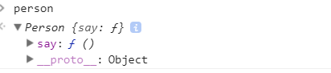
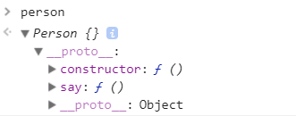

## Function中

  有prototype 和\_\_proto\_\_

#### 第一种情况 对象中有say


```
function Person(){
	  this.say = function(){
	    console.log("Hello");
	  };
	}
	var person = new Person();
	person.say(); //hello
	debugger;
```

ES6

```
class Person {
 constructor() {
     this.say = function() {
         console.log("hello");
     };
 }
}

const person = new Person();
const p2 = new Person();
console.log(person.say === p2.say);// false
debugger;
 ```
#### 第二种情况 原型上有say




p1.say == person.say 肯定是true

```
function Person {  
}
Person.prototype.say = function(){
console.log("hello");
}
const person = new Person();
const p2 = new Person();
person.say();//hello
debugger;

```

prototype实际上也是一个对象,然后constructor就是function Person

```
var Person  = function () {
console.log("person");
}
Person.prototype ={
  constructor: Person,
  say : function(){
      console.log("hello");
     }
}
const person = new Person();//person
const p2 = new Person();//person
person.say();//hello
person.say == p2.say;  //true
debugger;
```

ES6

```
class Person {
 say() {
     console.log("hello");
 }
}
const person = new Person();
const p2 = new Person();
person.say();
debugger;
```
#### 第三种情况 两个都有say，执行哪一个？

```
var Person  = function () {
    console.log("person");
	this.say = function(){
		console.log("hello2");
	}
}
Person.prototype ={
  constructor: Person,
  say : function(){
      console.log("hello");
     }
}
const person = new Person();//person
const p2 = new Person();//person
person.say();//hello2
person.say == p2.say;  //false
debugger;
```
person.say 执行最近的一个，因为对象中有,所以直接执行`hello2`,如果没有的话就找prototype中的方法，如果没有这个方法，则出错。


#### Person 方法的\_\_proto\_\_


Person.\_\_proto\_\_  === Function.prototype

这里实际上Person已经作为了Function的一个实例，对应到Person上来说，对象的\_\_proto\_\_和构造方法的prototype 是相等的

即 person.\_\_proto\_\_ === Person.prototype

## Object中

只有 \_\_proto\_\_

如果作为一个单纯的对象来说，是只有\_\_proto\_\_

所以对于Object来说，实际上是Function的一个实例 ，那么  Object.\_\_proto\_\_ === Function.prototype;

同时Object 也是一个方法,任何一个 var a ={},这样的话，a.\_\_proto\_\_ === Object.prototype;

方法的prototype 是对象吧，那么Function.prototype就有 \_\_proto\_\_, 所以下面一个就说的通了,

Function.prototype.\_\_proto\_\_ ===Object.prototype;

那么Object.prototype 是对象,那么它的\_\_proto\_\_是什么呢？ null

下面这个怎么解释？

Function.\_\_proto\_\_ === Function.prototype 


```


var A = function(){}; // A是一个方法，当然也是个对象  
var a = new A(); // a是一个由A创造出的对象，不是方法  

//看一看对象非方法的行为
console.log(a.__proto__); //object  
console.log(a.prototype); //undefined, 对象没有 

//看一看方法的行为，方法也是对象哦

console.log(A.__proto__); //function  
console.log(A.prototype); //object  


console.log(a.__proto__ === A.prototype); //true  
console.log(a.prototype === undefined); //true

console.log(A.__proto__ === Function.prototype); //true  
console.log(A.prototype === a.__proto__); //true  

//先看a这条链
console.log(a.__proto__.__proto__ === A.prototype.__proto__); //true  
console.log(a.__proto__.__proto__ === Object.prototype);//true  
console.log(a.__proto__.__proto__.__proto__ === Object.prototype.__proto__);//true  
console.log(a.__proto__.__proto__.__proto__ === null);//true


//再看看A这条条链
console.log(A.__proto__.__proto__ === Function.prototype.__proto__);//true  
console.log(A.__proto__.__proto__ === Object.prototype);//true  
console.log(A.__proto__.__proto__.__proto__ === Object.prototype.__proto__);//true  
console.log(A.__proto__.__proto__.__proto__ === null);//true  

```


参考 [从 \_\_proto\_\_ prototype 说起](http://varnull.cn/cong-\_\_proto\_\_-prototype-shuo-qi/)