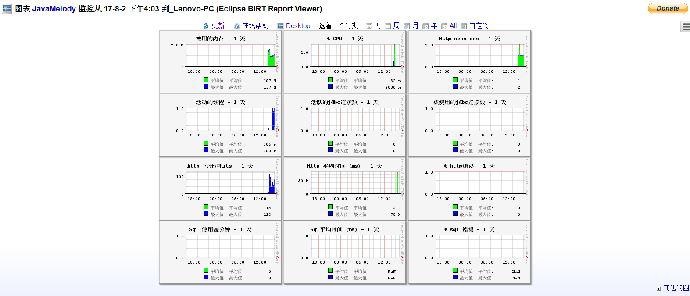

## 只为监控而生

它并不是一个模拟请求类似JMeter的压力测试工具，而是一个衡量并且计算在应用上的操作信息的工具，
也就是说，`它只负责对行为进行监控，而不负责触发操作`。

## 版本

Java version required for execution: 1.6 or later (JDK or JRE or JRockit from Oracle or J9 from IBM)
Server version required for execution: servlet api 2.4 at least (or JavaEE 1.4), like Tomcat 5.5 or +, GlassFish v2+, JBoss 4+, Jetty 6+, WebLogic 9+
Required dependency: jrobin 1.5.9+

##两种方式 ：项目监控所有的其他正在运行的  和jar直接放在项目中配置

javamelody.war   javamelody.jar 和 jrobin-1.5.9.jar

如果是servlet 3.0好像不用web.xml配置 但是应用服务器版本tomcat8+  javamelody.jar 和 jrobin-1.5.9.jar
但是你的servletAPI是3.0的，应用服务器tomcat7 glassfish v3 jboss6等等，那么就需要配置xml了。
在应用war包的web.xml中添加如下的filter
[javamelody用户指南](https://github.com/javamelody/javamelody/wiki/UserGuide)

```
<filter>
    <filter-name>monitoring</filter-name>
    <filter-class>net.bull.javamelody.MonitoringFilter</filter-class>
</filter>
<filter-mapping>
    <filter-name>monitoring</filter-name>
    <url-pattern>/*</url-pattern>
</filter-mapping>
<listener>
    <listener-class>net.bull.javamelody.SessionListener</listener-class>
</listener>

```

现在就可以启动应用服务器打开网址查看监控效果了。网址：`http://<host>/<context>/monitoring`
<host>是web应用服务器的部署IP，通常是localhost:8080 或者127.0.0.1:8080具体看你自己的应用服务器
<context>是你的web应用的名字。





[javamylody github ](https://github.com/javamelody/javamelody)