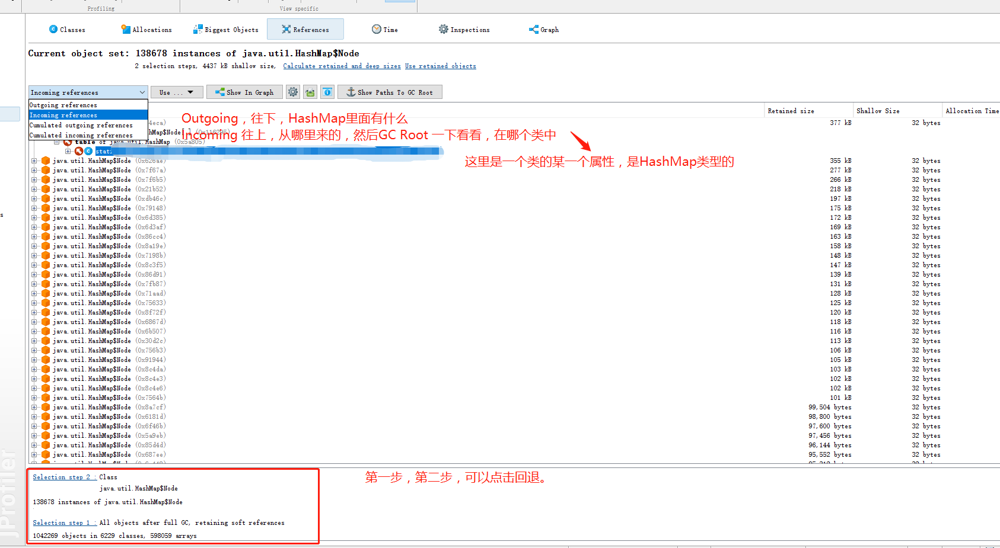

启动一个jvm进程

java -jar xxx.0.0.1.jar

服务器解压[服务器端](https://download-gcdn.ej-technologies.com/jprofiler/jprofiler_linux_11_0_2.tar.gz)
[window客户端](https://download-gcdn.ej-technologies.com/jprofiler/jprofiler_windows-x64_11_0_2.zip)

服务器

- 解压服务器
- 启动./jprofiler11.0.2/bin.jpenable
- 选择要监控功能的jvm
- 选择使用远程GUI监控
- 设置端口

客户端

新建一个remote Session

### 分析 dump---->hprof

主要筛选自 java.util集合包中或者java.lang或者自己写的包.类

class 按类寻找，Biggest Objects 大对象

1、打开hprof文件:进入classes视图，根据（instance count和Size）基本可以确定哪个类的对象出现问题。比如(java.util.LinkedList$Entry类有2731062个实例)。
2、根据常识，应该java.util.LinkedList类有个对象的Size应该很大。
3、查看java.util.LinkedList，右键 use Selected Instance
4、选择Outgoing reference 视图(可以查看对象拥有的其他对象句柄,也就是对象属性)。看Retained size列（或者size属性）（有的时候Retained size不灵光），看大小就能确定是哪个对象内存溢出了。
5、找到对应的对象，右键use Selected Instance
6、选择Incoming refrences视图（该视图显示哪些对象拥有本对象的句柄），在这个视图下有个show Paths To GC Root的按钮，点击，基本能确定我们哪开代码有问题了。

最终找到大对象的或者多对象的类，优化类的代码
