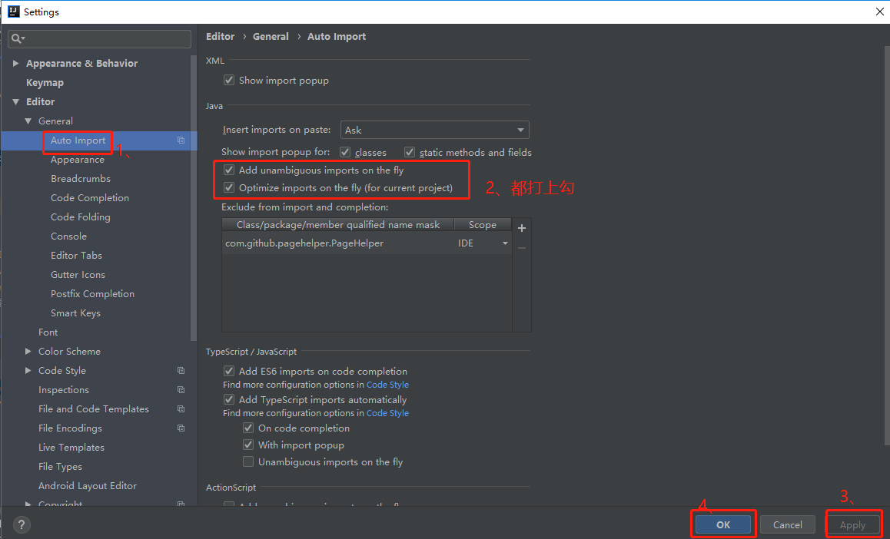

## vs Code
GitLens git 操作
vscode-icons 文件图标
Beautify 美化代码
CSS Peek 从html的class跳转到css文件对应的位置
IntelliSense for CSS class names in HTML 自动提示CSS的class
Markdown Preview markdown 预览


## sublime

sublime 工具插件
package control
ConvertToUTF8


激活sublime

C:\Windows\System32\drivers\etc  host


127.0.0.1 www.sublimetext.com
127.0.0.1 license.sublimehq.com
127.0.0.1 45.55.255.55
127.0.0.1 45.55.41.223


----- BEGIN LICENSE -----
sgbteam
Single User License
EA7E-1153259
8891CBB9 F1513E4F 1A3405C1 A865D53F
115F202E 7B91AB2D 0D2A40ED 352B269B
76E84F0B CD69BFC7 59F2DFEF E267328F
215652A3 E88F9D8F 4C38E3BA 5B2DAAE4
969624E7 DC9CD4D5 717FB40C 1B9738CF
20B3C4F1 E917B5B3 87C38D9C ACCE7DD8
5F7EF854 86B9743C FADC04AA FB0DA5C0
F913BE58 42FEA319 F954EFDD AE881E0B
------ END LICENSE ------

ZYNGA INC.
50 User License
EA7E-811825
927BA117 84C9300F 4A0CCBC4 34A56B44
985E4562 59F2B63B CCCFF92F 0E646B83
0FD6487D 1507AE29 9CC4F9F5 0A6F32E3
0343D868 C18E2CD5 27641A71 25475648
309705B3 E468DDC4 1B766A18 7952D28C
E627DDBA 960A2153 69A2D98A C87C0607
45DC6049 8C04EC29 D18DFA40 442C680B
1342224D 44D90641 33A3B9F2 46AADB8F

sublime3

----- BEGIN LICENSE -----
Member J2TeaM
Single User License
EA7E-1011316
D7DA350E 1B8B0760 972F8B60 F3E64036
B9B4E234 F356F38F 0AD1E3B7 0E9C5FAD
FA0A2ABE 25F65BD8 D51458E5 3923CE80
87428428 79079A01 AA69F319 A1AF29A4
A684C2DC 0B1583D4 19CBD290 217618CD
5653E0A0 BACE3948 BB2EE45E 422D2C87
DD9AF44B 99C49590 D2DBDEE1 75860FD2
8C8BB2AD B2ECE5A4 EFC08AF2 25A9B864
------ END LICENSE ------​

## IDEA   

###默认配置

#### 滚轮字体大小

Editor-----> General-----> Change font size(Zoom) with Ctrl+Mouse Wheel

#### 跳转

ctrl + B   使用了本方法或者类的地方
ctrl + E  最近光标出现的地方
ctrl + shift + E 最近修改的地方

shift + shift 查询所有的地方  再次双击，勾选，也能查询jar包内的搜索
ctrl + shift + A action查询 

ctrl + 

Alt + 1 跳转到项目目录
ESC 回到编辑窗口

#### 自动导包



勾选标注第1个选项，IntelliJ IDEA 将在我们书写代码的时候自动帮我们导入需要用到的包。但是对于那些同名的包，还是需要手动 Alt + Enter 进行导入的

勾选标注 第2个选项，IntelliJ IDEA 将在我们书写代码的时候自动帮我们优化导入的包，比如自动去掉一些没有用到的包。

### 插件

个人意见，仅供参考,顺序代表推荐强度

- Alibaba Java Coding Guidelines 代码检测
- JRebel for Intellij 热部署 （收费）
- Lombok 不用写get set 方法
- save-action  保存的时候导包，格式化代码
- FindBugs Idea 扫描代码，可能出现的bug
- Free Mybatis plugin   mapper跳转到xml。xml跳转到mapper
- Key promoter X  展示快捷键
- Statistic 代码统计
- Translation  Google 翻译 
- jclasslib Bytecode viewer 查看字节码文件
- GosnFormat json转java对象类
- SonarLint  代码检查

### 注释

/**
* Project Name:${project_name}
* File Name:${file_name}
* Package Name:${package_name}
* Date:${date} ${time}
* Copyright (c) ${year}, All Rights Reserved.
*
*/

${filecomment}

${package_declaration}
/**
* ClassName:${type_name} 
* Function: ${todo} 
* Reason: ${todo} 
* Date: ${date} ${time} 
* @author Mu Xiaobai
* @version 
* @since JDK 1.8 
*/
${typecomment}
${type_declaration}

aa 包
/**
* Project Name:$project_name$
* File Name:$file_name$
* Package Name:$package_name$
* Date:$date$ $time$
* Copyright (c) $year$, All Rights Reserved.
*
*/
ss 类
/**
* @ClassName: $class_name$ 
* @Function: //TODO 
* @Reason: //TODO
* @Date: $date$ $time$ 
* @author Mu Xiaobai
* @version 
* @since JDK 1.8 
*/
zz 方法
/* 
* @name: $enclosing_method$
* @description: TODO 
* @param $param$
* @return: $return$ 
* @date: $date$ $time$
* @auther: $user$
* 
*/

### 设置


### 快捷键
ctrl + shift + r 替换
ctrl + shift + f 查找

alt + ↑/↓  本类中的方法依次上下跳转
alt + ←/→  左右边的类

ctrl + shift + u 大小写替换

ctrl +  ←/→   光标左/右单词移动
ctrl+shift + ←/→  左/右边单词扩选


ctrl+w 选中光标，依次扩选
ctrl +shift + w 反向收缩选中内容

Ctrl + u	前往当前光标所在的方法的父类的方法 / 接口定义
ctrl + b 进入光标所在的方法/变量的接口或是定义处

ctrl + alt + 鼠标左键 查看方法的实现类
ctrl + alt + ←/→  鼠标上次的位置/下次的位置

Ctrl + Alt + T	对选中的代码弹出环绕选项弹出层 （必备）

ctrl + x 剪切
ctrl + d 复制粘贴
ctrl + / 单行注释
ctrl + shift + / 选中内容多行注释


ctrl + z 撤回
ctrl + shift + z 撤回的撤回

ctrl +alt + s 设置
ctrl +alt +shift + s 本项目设置 打包


参考:
- [IntelliJ-IDEA-Tutorial](https://github.com/judasn/IntelliJ-IDEA-Tutorial/blob/master/keymap-introduce.md)
- [IntelliJ IDEA 快捷键说明大全（中英对照、带图示详解）](https://blog.csdn.net/deniro_li/article/details/72902621)
- [常用操作](https://github.com/xiaoxiunique/tool-tips)
- [IDEA settigns 更新仓库](https://github.com/muxiaobai/intelliJ-settings)

## navicat

ctrl + shift + r  选中内容执行
ctrl + r 执行当期窗口所有
ctrl + q 打开新执行窗口
ctrl + w 关闭当期窗口


## plsql

F8 执行选中

设置AutoReplace
```
sf = select t.* ,t.rowid from 
s = select * from 

```
打开PL/SQL，在Tools->Perferences->Editor中Autoreplace，勾选Enabled，选择配置的AutoReplace.txt文件，点击OK即可。


## eclipse

### 快捷键
ctrl+shift+G查看方法被调用
ctrl+alt+R 重启或者启动tomcat
ctrl+shift+T 查找文件在哪里 匹配java
ctrl+shift+R resource查找所有资源
ctrl+h file search Containing text 搜索包含某个字符串的所有文件
ctrl+shift+c注释/反注释
ctrl + alt + H查看方法被调用

ctrl+shift+L  查看所有的快捷键
  
ctrl+alt+G  搜索文本

### 插件

- svn - http://subclipse.tigris.org/update_1.8.x
- jd-core - http://jd.benow.ca/jd-eclipse/update
- zookeeper：  http://www.massedynamic.org/eclipse/updates/
- Enhanced Class Decompiler  http://feeling.sourceforge.net/update

反编译

重启之后，在窗口菜单栏点击Widow->Preference->General->Editors->File Associations,将FileType里的*.class和*.class without source的Associated editors下面的Class File Editor设置成default即可


## powerdesign

### 导出excel脚本


```


'******************************************************************************
Option Explicit
   Dim rowsNum
   rowsNum = 0
'-----------------------------------------------------------------------------
' Main function
'-----------------------------------------------------------------------------
' Get the current active model
    Dim Model
    Set Model = ActiveModel
    If (Model Is Nothing) Or (Not Model.IsKindOf(PdPDM.cls_Model)) Then
       MsgBox "The current model is not an PDM model."
    Else
      ' Get the tables collection
      '创建EXCEL APP
      dim beginrow
      DIM EXCEL, SHEET, SHEETLIST
      set EXCEL = CREATEOBJECT("Excel.Application")
      EXCEL.workbooks.add(-4167)'添加工作表
      EXCEL.workbooks(1).sheets(1).name ="表结构"
      set SHEET = EXCEL.workbooks(1).sheets("表结构")
       
      EXCEL.workbooks(1).sheets.add
      EXCEL.workbooks(1).sheets(1).name ="目录"
      set SHEETLIST = EXCEL.workbooks(1).sheets("目录")
      ShowTableList Model,SHEETLIST
 
      ShowProperties Model, SHEET,SHEETLIST
       
       
      EXCEL.workbooks(1).Sheets(2).Select
      EXCEL.visible = true
      '设置列宽和自动换行
      sheet.Columns(1).ColumnWidth = 20
      sheet.Columns(2).ColumnWidth = 20
      sheet.Columns(3).ColumnWidth = 20
      sheet.Columns(4).ColumnWidth = 40
      sheet.Columns(5).ColumnWidth = 10
      sheet.Columns(6).ColumnWidth = 10
      sheet.Columns(1).WrapText =true
      sheet.Columns(2).WrapText =true
      sheet.Columns(4).WrapText =true
      '不显示网格线
      EXCEL.ActiveWindow.DisplayGridlines = False
       
       
 End If
'-----------------------------------------------------------------------------
' Show properties of tables
'-----------------------------------------------------------------------------
Sub ShowProperties(mdl, sheet,SheetList)
   ' Show tables of the current model/package
   rowsNum=0
   beginrow = rowsNum+1
   Dim rowIndex
   rowIndex=3
   ' For each table
   output "begin"
   Dim tab
   For Each tab In mdl.tables
      ShowTable tab,sheet,rowIndex,sheetList
      rowIndex = rowIndex +1
   Next
   if mdl.tables.count > 0 then
        sheet.Range("A" & beginrow + 1 & ":A" & rowsNum).Rows.Group
   end if
   output "end"
End Sub
'-----------------------------------------------------------------------------
' Show table properties
'-----------------------------------------------------------------------------
Sub ShowTable(tab, sheet,rowIndex,sheetList)
   If IsObject(tab) Then
     Dim rangFlag
     rowsNum = rowsNum + 1
      ' Show properties
      Output "================================"
      sheet.cells(rowsNum, 1) =tab.name
      sheet.cells(rowsNum, 1).HorizontalAlignment=3
      sheet.cells(rowsNum, 2) = tab.code
      'sheet.cells(rowsNum, 5).HorizontalAlignment=3
      'sheet.cells(rowsNum, 6) = ""
      'sheet.cells(rowsNum, 7) = "表说明"
      sheet.cells(rowsNum, 3) = tab.comment
      'sheet.cells(rowsNum, 8).HorizontalAlignment=3
      sheet.Range(sheet.cells(rowsNum, 3),sheet.cells(rowsNum, 7)).Merge
      '设置超链接，从目录点击表名去查看表结构
      '字段中文名    字段英文名    字段类型    注释    是否主键    是否非空    默认值
      sheetList.Hyperlinks.Add sheetList.cells(rowIndex,2), "","表结构"&"!B"&rowsNum
      rowsNum = rowsNum + 1
      sheet.cells(rowsNum, 1) = "字段中文名"
      sheet.cells(rowsNum, 2) = "字段英文名"
      sheet.cells(rowsNum, 3) = "字段类型"
      sheet.cells(rowsNum, 4) = "注释"
      sheet.cells(rowsNum, 5) = "是否主键"
      sheet.cells(rowsNum, 6) = "是否非空"
      sheet.cells(rowsNum, 7) = "默认值"
      '设置边框
      sheet.Range(sheet.cells(rowsNum-1, 1),sheet.cells(rowsNum, 7)).Borders.LineStyle = "1"
      'sheet.Range(sheet.cells(rowsNum-1, 4),sheet.cells(rowsNum, 9)).Borders.LineStyle = "1"
      '字体为10号
      sheet.Range(sheet.cells(rowsNum-1, 1),sheet.cells(rowsNum, 7)).Font.Size=10
            Dim col ' running column
            Dim colsNum
            colsNum = 0
      for each col in tab.columns
        rowsNum = rowsNum + 1
        colsNum = colsNum + 1
          sheet.cells(rowsNum, 1) = col.name
        'sheet.cells(rowsNum, 3) = ""
          'sheet.cells(rowsNum, 4) = col.name
          sheet.cells(rowsNum, 2) = col.code
          sheet.cells(rowsNum, 3) = col.datatype
        sheet.cells(rowsNum, 4) = col.comment
          If col.Primary = true Then
        sheet.cells(rowsNum, 5) = "Y"
        Else
        sheet.cells(rowsNum, 5) = " "
        End If
        If col.Mandatory = true Then
        sheet.cells(rowsNum, 6) = "Y"
        Else
        sheet.cells(rowsNum, 6) = " "
        End If
        sheet.cells(rowsNum, 7) =  col.defaultvalue
      next
      sheet.Range(sheet.cells(rowsNum-colsNum+1,1),sheet.cells(rowsNum,7)).Borders.LineStyle = "3"      
      'sheet.Range(sheet.cells(rowsNum-colsNum+1,4),sheet.cells(rowsNum,9)).Borders.LineStyle = "3"
      sheet.Range(sheet.cells(rowsNum-colsNum+1,1),sheet.cells(rowsNum,7)).Font.Size = 10
      rowsNum = rowsNum + 2
       
      Output "FullDescription: "       + tab.Name
   End If
    
End Sub
'-----------------------------------------------------------------------------
' Show List Of Table
'-----------------------------------------------------------------------------
Sub ShowTableList(mdl, SheetList)
   ' Show tables of the current model/package
   Dim rowsNo
   rowsNo=1
   ' For each table
   output "begin"
   SheetList.cells(rowsNo, 1) = "主题"
   SheetList.cells(rowsNo, 2) = "表中文名"
   SheetList.cells(rowsNo, 3) = "表英文名"
   SheetList.cells(rowsNo, 4) = "表说明"
   rowsNo = rowsNo + 1
   SheetList.cells(rowsNo, 1) = mdl.name
   Dim tab
   For Each tab In mdl.tables
     If IsObject(tab) Then
         rowsNo = rowsNo + 1
      SheetList.cells(rowsNo, 1) = ""
      SheetList.cells(rowsNo, 2) = tab.name
      SheetList.cells(rowsNo, 3) = tab.code
      SheetList.cells(rowsNo, 4) = tab.comment
     End If
   Next
    SheetList.Columns(1).ColumnWidth = 20
      SheetList.Columns(2).ColumnWidth = 20
      SheetList.Columns(3).ColumnWidth = 30
     SheetList.Columns(4).ColumnWidth = 60
   output "end"
End Sub

```