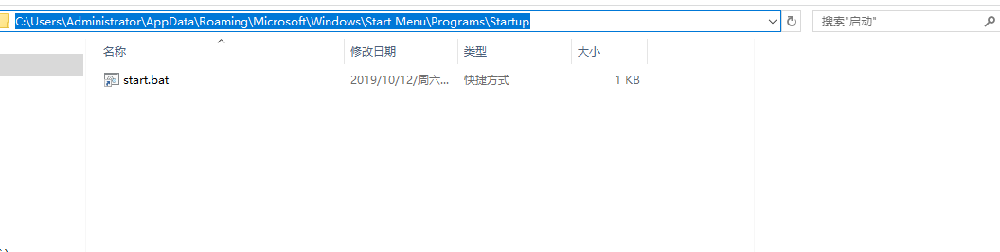

`C:\Users\Administrator\AppData\Roaming\Microsoft\Windows\Start Menu\Programs\Startup`每个人对应的目录可能不一致，
可以用 win +r  `shell:startup`
把需要启动的bat文件创建快捷方式，到此文件夹下


或者开机启动脚本

win+r  gpedit.msc

用户配置----> Windows设置---->脚本（登陆/注销）----> 登陆---->添加---->start.bat

一开机就启动必须的应用 IDEA VS Code  Chrome CloudMusic,自己写的脚本必须启动的内容

```


echo start 

echo idea START
start /d "E:\Program Files\JetBrains\IntelliJ IDEA 2019.1.2\bin" idea64.exe

echo VS CODE START
start /d "E:\tools\Microsoft VS Code" code.exe

echo sublime START
start /d "E:\Program Files\Sublime Text 3" sublime_text.exe

echo Chrome START
start /d "C:\Program Files (x86)\Google\Chrome\Application" chrome.exe

echo cloudmusic START
start /d "E:\Program Files (x86)\Netease\CloudMusic" cloudmusic.exe

echo javaw START
start /d  "E:\workspace\idea\app-cloud\" taskrunjavaw.bat

echo nginx START
start /d  "E:\tools\nginx-1.14.2\" nginx.exe  -c conf/nginx.conf

echo dbeaver START
start /d  "E:\tools\dbeaver-ee-7.2.0-win32.win32.x86_64\dbeaver" dbeaver.exe

echo redis START
start /d  "E:\tools\Redis-x64-3.2.100\" redis-server.exe --service-install redis.windows-service.conf --loglevel verbose

echo ssr START
start /d "E:\tools\ssr-win-4.9.0\ShadowsocksR-win-4.9.0" ShadowsocksR-dotnet4.0.exe

echo Ditto START
start /d "E:\tools\DittoPortable_64bit_3_23_124_0剪贴板\Ditto" Ditto.exe


echo vmware START
"E:\Program Files (x86)\VMware\VMware Workstation\vmrun.exe" start "E:\Users\Administrator\Documents\Virtual Machines\CentOS-192.168.160.75\CentOS-192.168.160.75.vmx"


pause

```
切换到对应目录然后执行exe

taskrunjavaw.bat 中是需要启动的平台
```
@echo off

start javaw -jar ./app-core/app-register/target/app-register-0.0.1.jar   &
ping -n 8 127.0.0.1 1>null
rem 等待8秒
echo "app-register"
start javaw -jar ./app-core/app-config/target/app-config-0.0.1.jar &
pause  

```

对于一些不经常变动的，定式启动内容可以如此处理。
