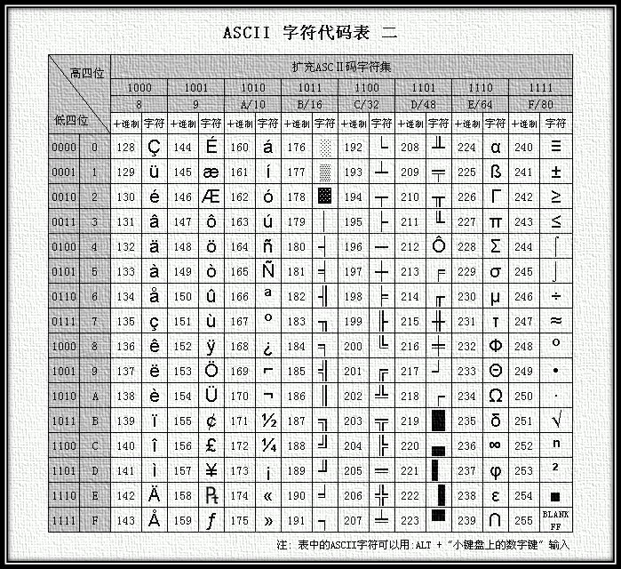

## javascript中的表示方法


```
//二进制：0111 1010 （01 111 010 ）  八进制 172   十六进制： 7A   十进制：7*16+A*1=122
//对应ASCII编码是122 如果是ASCII中的字符，UTF-8中是一致的，0-127对应0000 0000 -0xxx xxxx
//而其他的需要两个字节的，高位补0  因此为 0000 0000 0111 1010  ==> 007A
    console.log('z'); 本意
    console.log('\z');//转义字符，因为z不用转义，所以还是z
    console.log('\172');//ASCII 八进制  
    console.log('\x7A');//ASCII 十六进制
    console.log('\u007A');//Unicode 0000-FFFF之间的字符
    console.log('\u{7A}');//Unicode 大括号表示法与四字节的UTF-16编码是等价的。
B（Binary)表示二进制，O（Octal）表示八进制，D（Decimal）或不加表示十进制，H（Hexadecimal）表示十六进制。
```
转义字符对应有一个参考

| Escape Sequence |Code Unit Value | Unicode Character Name | Symbol |
| ------------- |:-------------:|:-------------:| -----:|
|\b	|0x0008	|BACKSPACE	            |&lt;BS&gt;  | 
|\t	|0x0009	|CHARACTER TABULATION	|&lt;HT&gt;  |
|\n	|0x000A	|LINE FEED (LF)	        |&lt;LF&gt;  |
|\v	|0x000B	|LINE TABULATION	    |&lt;VT&gt;  |
|\f	|0x000C	|FORM FEED (FF)	        |&lt;FF&gt;  |
|\r	|0x000D	|CARRIAGE RETURN (CR)	|&lt;CR&gt;  |
|\"	|0x0022	|QUOTATION MARK	        |"      |
|\'	|0x0027	|APOSTROPHE	            |'      |
|\\	|0x005C	|REVERSE SOLIDUS	    |\      |

> 如果转义字符不在此中，直接转义为本身

代码中6-7行是一个意思的两种表达形式 都是ASCII码6是八进制，7是16进制，8=9行代码对应Unicode码，因为\uxxxx只能表示0000-FFFF之间的字符，所以javascript中又引入了{},来展示字符。

[ECMAscript中具有转义含义的字符](http://www.ecma-international.org/ecma-262/6.0/index.html#table-34)

```
    console.log('\uD842\uDFB7');
    console.log('\u{20BB7}');   
    
```
> 但是，这种表示法只限于\u0000——\uFFFF之间的字符。超出这个范围的字符，必须用两个双字节的形式表达。

一般常见中文字符都在这个区间内。特殊的，我们到Unicode这一部分再解释。

结果在控制台上显示出“𠮷”，这是个什么字？不知道。

## ASCII到底是个什么鬼？
美国内部的统一就是ASCII码 ASCII 0-127（0000 0000 -0FFF FFFF之间）ASC码

键盘上的打印字符、以及换行、退格等都在这个区间内，但是这只是一个美国标准。

当时世界上所有的计算机都用同样的ASCII方案来保存英文文字。不过呢，随着时间的推移，欧洲等其他国家也能用得起电脑了，但是，又不能表示自己的符号，因此这个标准也可以需要被扩展了。
> 一个字符一个字节

他们决定采用 127号之后的空位来表示这些新的字母、符号，还加入表格符号、计算符号、希腊字母和特殊的拉丁符号。一直把序号编到了最后一个状态255。从128 到255这一页的字符集被称"扩展字符集"。可以说ASCII扩展集主要解决的是欧洲拉丁等字符的展示。

> 小秘密:按住ALT+要查询的码值（注意，这里是十进制），松开即可显示出对应字符。例如：按住ALT+97,则会显示出'a'。




## GB2312和GBK又有什么关系？

但是随着时间的推移，电脑也慢慢走进中国，可是电脑上不能显示汉字，这对于中国来说，是一个大问题。因此中国制定了GB2312字符集。

我国专家把那些127号之后的奇异符号（即ASCII扩展集）取消掉，规定：一个小于127的字符的意义与原来相同，但两个大于127的字符连在一起时，就表示一个汉字，前面的一个字节（他称之为高字节）从0xA1用到 0xF7，后面一个字节（低字节）从0xA1到0xFE，这样我们就可以组合出大约7000多个简体汉字了。在这些编码里，还把数学符号、罗马希腊的 字母、日文的假名们都编进去了，连在ASCII里本来就有的数字、标点、字母都统统重新编了两个字节长的编码，这就是常说的"全角"字符，而原来在127号以下的那些就叫"半角"字符了。

> 一个汉字两个字节的历史就是在这里产生的。（一个字符两个字节，连同ASCII中的字符也被编码成两个字节）

可是中国语言博大精深，那时这区区7000多个汉字就能展现的？于是就制定了新的字符集GBK，GBK包括了GB2312 的所有内容，同时又增加了近20000个新的汉字（包括繁体字）和符号。这样就大大展示出来中国语言的魅力。

后来少数民族也要用电脑了，于是我们再扩展，又加了几千个新的少数民族的字，GBK扩成了 GB18030。

顺便提一下，因为台湾也使用汉字，不过他们使用的是自己的一套字符集编码规则（BIG5），因此同属一个汉字，可能就出现两种不同的编码序列。
这时候不仅仅是中国乱成一团，世界上大多数国家都看到电脑真是个好东西，都想用，咋办，各搞各的字符集，各自制定自己的编码规范，于是出现了"百花齐放百家争鸣"的状况。

## Unicode是怎么冒出了的？

正在这时，大天使加百列及时出现了一个叫 ISO （国际标谁化组织）的国际组织决定着手解决这个问题。他们采用的方法很简单：废了所有的地区性编码方案，重新搞一个包括了地球上所有文化、所有字母和符号 的编码！他们打算叫它”Universal Multiple-Octet Coded Character Set”，简称 UCS, 俗称 “unicode“。

Unicode（统一码、万国码、单一码）是计算机科学领域里的一项业界标准,包括字符集、编码方案等。Unicode 是为了解决传统的字符编码方案的局限而产生的，它为每种语言中的每个字符设定了统一并且唯一的二进制编码，以满足跨语言、跨平台进行文本转换、处理的要求。

unicode在很长一段时间内无法推广，直到互联网的出现，为解决unicode如何在网络上传输的问题，于是面向传输的众多 UTF（UCS Transfer Format）标准出现了。


## 为什么现在都在使用UTF-8？

当初还有UTF-32，这是一种使用4字节的数字来表达每个字母、符号，或者表意文字(ideograph)，每个数字代表唯一的至少在某种语言中使用的符号的编码方案，UTF-32又称UCS-4是一种将Unicode字符编码的协定，对每个字符都使用4字节。就空间而言，是非常没有效率的。这对于存储空间来说是极大的浪费，文本文件的大小会因此大出二三倍，这是难以接受的。

不过人们逐渐意识到，我们一般不会使用如此多的字符，于是就采用了一个折中的办法，使用UTF-16。不过目前推广最好的当之无愧是UTF-8.

UTF-8（8-bit Unicode Transformation Format）是一种针对Unicode的可变长度字符编码（定长码），也是一种前缀码。它可以用来表示Unicode标准中的任何字符，
s
实际上UTF-8 与Unicode之间的转换是有一定规律的，

|Unicode编码(十六进制)| 　UTF-8 字节流(二进制)|
| ------------- |:-----|
|00000000 - 0000007F |  0xxxxxxx                                                |
|00000080 - 000007FF |  110xxxxx 10xxxxxx                                       |
|00000800 - 0000FFFF |  1110xxxx 10xxxxxx 10xxxxxx                              |
|00010000 - 001FFFFF |  11110xxx 10xxxxxx 10xxxxxx 10xxxxxx                     |
|00200000 - 03FFFFFF |  111110xx 10xxxxxx 10xxxxxx 10xxxxxx 10xxxxxx            |
|04000000 - 7FFFFFFF |  1111110x 10xxxxxx 10xxxxxx 10xxxxxx 10xxxxxx 10xxxxxx   |


> UTF-8的特点是对不同范围的字符使用不同长度的编码。

UTF-8使用一至四个字节为每个字符编码：

- 128个US-ASCII字符只需一个字节编码（Unicode范围由U+0000至U+007F）。
-  带有附加符号的拉丁文、希腊文、西里尔字母、亚美尼亚语、希伯来文、阿拉伯文、叙利亚文及它拿字母则需要二个字节编码（Unicode范围由U+0080至U+07FF）。
- 其他基本多文种平面（BMP）中的字符（这包含了大部分常用字）使用三个字节编码。中文范围 4E00-9FBF：
- 其他极少使用的Unicode辅助平面的字符使用四字节编码。

> 一个汉字三个字符

实际上UTF-8是ASCII的一个超集。因为一个纯ASCII字符串也是一个合法的UTF-8字符串，所以现存的ASCII文本不需要转换。为传统的扩展ASCII字符集设计的软件通常可以不经修改或很少修改就能与UTF-8一起使用。

> UTF-8就是在互联网上使用最广的一种unicode的实现方式。其他实现方式还包括UTF-16和UTF-32，不过在互联网上基本不用。

> UTF-8,UTF-16,UTF-32编码方式都是UNICODE，但只是他们的保存方式不同。

下一步，依据上表举几个例子：

“汉”
Unicode编码是0x6C49。(0110 1100 0100 1001) 0x6C49在0x0800-0xFFFF之间，
使用用3字节模板了：1110xxxx 10xxxxxx 10xxxxxx。
用这个比特流依次代替模板中的x，得到：11100110 10110001 10001001，即E6 B1 89。

“张”
Unicode编码：0x5F20 （0101 1111 0010 0000）0x5F20在0x0800-0xFFFF之间
依据上表，UTF-8需要三个字节 即“1110xxxx 10xxxxxx 10xxxxxx”。
用Unicode码填补模板得到： 11100101 10111100 10100000 十六进制即 E5 BC A0 

Unicode规范中定义，每一个文件的最前面分别加入一个表示编码顺序的字符，这个字符的名字叫做"零宽度非换行空格"（ZERO WIDTH NO-BREAK SPACE），用FEFF表示。这正好是两个字节，而且FF比FE大1。
如果一个文本文件的头两个字节是FE FF，就表示该文件采用大头方式；如果头两个字节是FF FE，就表示该文件采用小头方式。

需要判断文本开头的标志,下面是所有编码对应的开头标志

|文件头|编码|大小头|
|------|:-----|----|
|EF BB BF　　　 |UTF-8         |    没有区别    |
|FF FE　　　　　|UTF-16/UCS-2, |little endian   |
|FE FF　　　　　|UTF-16/UCS-2, |big endian      |
|FF FE 00 00　　|UTF-32/UCS-4, |little endian.  |
|00 00 FE FF　　|UTF-32/UCS-4, |big-endian      |

详见[Q: When a BOM is used, is it only in 16-bit Unicode text?](http://www.unicode.org/faq/utf_bom.html)

> 第一个字节在前，就是小头方式，第二个字节在前就是大头方式。

- Unicode：编码是四个字节"FF FE 6C 49"，其中"FF FE"表明是小头方式存储，真正的编码是6C49。
- Unicode big endian：编码是四个字节"FE FF 49 6C "，其中"FE FF"表明是大头方式存储。真正的编码是 6C49。
- UTF-8：编码是六个字节"EF BB BF E6 B1 89"，前三个字节"EF BB BF"表示这是UTF-8编码，后三个"E6B189"就是"汉"的具体编码，它的存储顺序与编码顺序是一致的。

[对于字符编码，程序员的话应该了解它的哪些方面？](https://www.zhihu.com/question/20152853/answer/95576659),这位仁兄很有见解。值得一看。

## URL请求编码响应分析

到此，我们再来分析一下请求一个URL怎么就能显示我们对应的字符呢？

随便打开一个网页,F12,打开开发者工具，在请求头信息里面我们会发现如下两行：

```
Accept-Encoding:gzip, deflate, sdch
Accept-Language:zh-CN,zh;q=0.8
```
我们发送请求的时候已经给服务器说我是中国，说汉语的，而且还支持gzip压缩，于是服务器回应我们，好的,然后就在响应头包含如下信息：
```
Content-Encoding:gzip
Content-Type:text/html;charset=utf-8
```
charset=utf-8，嗯好的，然后浏览器就按照UTF-8编码解析汉语。最后，正常，还好没有乱码。真好！

## 参考文献


[Unicode 和 UTF-8 有何区别？](https://www.zhihu.com/question/23374078)
[对于字符编码，程序员的话应该了解它的哪些方面？](https://www.zhihu.com/question/20152853/answer/95576659)
[Unicode](http://baike.baidu.com/link?url=ZCZSJNDfFE33N8JU7MqxedQ9HtV1KwGREMeRQAcrBW3HOvgCBxrUOBPecnHatVei9-7G7LrmM3jUouhy8bJKEa)
[字符串的扩展](https://likebeta.gitbooks.io/es6tutorial/content/docs/string.html)
[ Unicode，UTF-8,UTF-16,UTF-32](http://blog.csdn.net/mylinx/article/details/6874414)
[Unicode(UTF-8, UTF-16)令人混淆的概念](http://www.cnblogs.com/kingcat/archive/2012/10/16/2726334.html)
[java中文乱码解决之道（三）](http://www.cnblogs.com/chenssy/p/4205130.html)