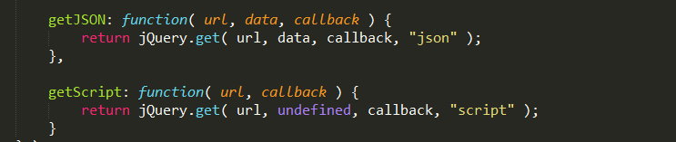
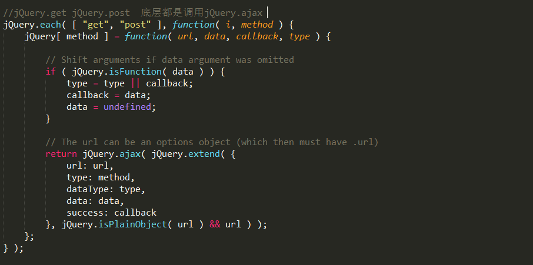

## 不同的角度，不同的说辞-------------前后台数据交互

#### 传输数据形式 

##### JSON(流行)(Javascript object Notation)
JSON
对象{} 数组[] 属性名:属性值  "键":"值"

JSONP(JSON with Padding)(解决同源策略)

HTML中 script\>、img\>、iframe\>标签可以跨域

JSONP可用于解决主流浏览器的跨域数据访问的问题；

jQuery利用**script\>**标签，来实现跨域的数据交换，然后包装的AJAX中,外部调用的时候因此就可以向各个域名下请求资源。

RESTFul(Representational State Transfer)
放在这只是显示一下JSON的趋势。

##### xml text html

xml :曾经很辉煌，现在是一个失势的宠儿，就是因为JSON，JSON看起来更容易进行数据交互，体积小，方便，简洁。

text html :老样子，我不在乎你们的争吵，一副为老独尊的样子，看你们玩耍，我不信，你们还能隔空传物？
#### 提交方式

#### Form
##### HTML的form

```
<form action="" method="" enctype="">
method: post/get

```


enctype 

application/x-www-form-urlencoded 在发送前编码所有字符（默认）

multipart/form-data 不对字符编码。在使用包含**文件上传**控件的表单时，必须使用该值。

text/plain	空格转换为 "+" 加号，但不对特殊字符编码。

按钮直接提交button/submit

##### js代替按钮的"form"
某一事件调用js，代为提交 

这种形式可以添加表单验证

在form上添加onsubmit=""事件返回false则不提交form

form.submit()

#### AJAX(Asynchronous JavaScript and XML)(异步更新)
##### xhr(XmlHttpRequest) ajax的原始形态
IE6及之前的版本使用ActiveXObject,IE7之后及其它浏览器使用XMLHttpRequest
因此很少原生的对象，现在随着jQuery的流行和增强，浏览器的升级，可以说，全部浏览器都支持XMLHttpRequest对象，我们就可以直接使用jQuery中的ajax来进行前后台交互。

偷个懒，放两篇bolg在这，
[AJAX——核心XMLHttpRequest对象](http://blog.csdn.net/liujiahan629629/article/details/17126727)
[轻松掌握XMLHttpRequest对象](http://www.cnblogs.com/beniao/archive/2008/03/29/1128914.html)

注:XMLHttpRequest Level 2添加了一个新的接口FormData.利用FormData对象,我们可以通过JavaScript用一些键值对来模拟一系列表单控件,我们还可以使用XMLHttpRequest的send()方法来异步的提交这个"表单".比起普通的ajax,使用FormData的最大优点就是我们可以异步上传一个**二进制文件**. 
 
[FormData对象](https://developer.mozilla.org/zh-CN/docs/Web/API/FormData) [Html5 FormData+Ajax表单数据提交](http://www.tuicool.com/articles/uuiE3y)

所有主流浏览器的较新版本都已经支持这个对象了，比如Chrome 7+、Firefox 4+、IE 10+、Opera 12+、Safari 5+。

> 但是jQuery不支持FormData,此对象只能在原生XmlHttpRequest中使用。
##### jQuery
包装后的形式，不用考虑浏览器的兼容性，更方便.


```
$.ajax({
	url:"",
	type:"",// get post
	cache:"",
	data:"",
	dataType:"",
	success:function(){},
	error: function(){},
});

```

url:请求地址。

-----

cache:要求为Boolean类型的参数，默认为true（当dataType为script时，默认为false），设置为false将不会从浏览器缓存中加载请求信息。

---------------

data: Object对象，JSON

---------

dataType是返回的数据类型。

dataType:要求为String类型的参数，预期服务器返回的数据类型。
如果不指定，JQuery将自动根据http包mime信息返回responseXML或responseText，并作为回调函数参数传递。可用的类型如下：

xml：返回XML文档，可用JQuery处理。

html：返回纯文本HTML信息；包含的script标签会在插入DOM时执行。

script：返回纯文本JavaScript代码。不会自动缓存结果。除非设置了cache参数。注意在远程请求时（不在同一个域下），所有post请求都将转为get请求。

json：返回JSON数据。

jsonp：JSONP格式。使用SONP形式调用函数时，例如myurl?callback=?，JQuery将自动替换后一个“?”为正确的函数名，以执行回调函数。

text：返回纯文本字符串。

---------

success/error function(){}成功或者失败回调

```
$.get();
$.post();
$.getJSON();

```

和 ```$.ajax()```类似



$.getJSON() 调用get()


$.get() $.post() 调用ajax()

但是jQuery**不支持异步上传文件**，我们可以引入AjaxFileUpload插件来实现。

#####