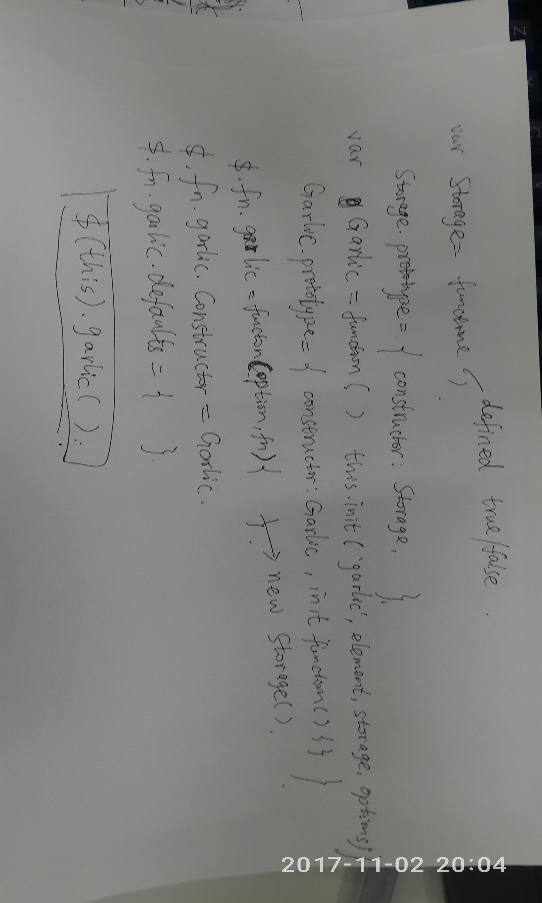

button默认的type 是submit  
textarea固定，不可拖拽： textarea{ resize:none;}

http://garlicjs.org/#download 可以form缓存，猜测应该是使用localStorage

jQuery兼容性

IE jQuery的支持程度

jquery在IE下append等需要把string转换成jquery对象 append($(str))
操作获取html或者text时也要是jquery对象不能使xmlDOM
http://www.jb51.net/Special/354.htm JQuery操作xml

IE9下使用append是怎么回事？
append($("file",xml));
$(window.frameElement)获取当期的iframe
readonly只读
对象问题innerHTML属于js原生的。DOM XMLDOM 等究竟是什么？

[卸载IE](http://www.jb51.net/softjc/148524.html)

[javascript内存](http://web.jobbole.com/82625/)

[为什么 \["1", "2", "3"\].map(parseInt) 返回 \[1,NaN,NaN\]？](http://blog.csdn.net/justjavac/article/details/19473199)
parseInt(String,radix)string可以转换成数字，radix 在2-36之间，
map 会给callback传三个参数（element，index，arr）而index刚好给了parseInt的radix

[++\[\[\]\]\[+\[\]\]+\[+\[\]\] = 10](http://justjavac.com/javascript/2012/05/24/can-you-explain-why-10.html)

[JS去除空格和换行的正则表达式(推荐)](http://www.jb51.net/article/86547.htm)
正则\r\n

空格会变成 %20

当js方法没有进入的时候，考虑一下是否有重名的方法。导致原来的方法被覆盖。

PWA & AMP

PWA(Progressive Web App)  渐进式网页应用
AMP(Accelerated Mobile Pages) 加速移动网页

系统问题,window7
标准账户上网

entity中：注解配置文件写有schema  

生成sshkey  `ssh-keygen -t rsa -C "xxxxxx@yy.com"  `