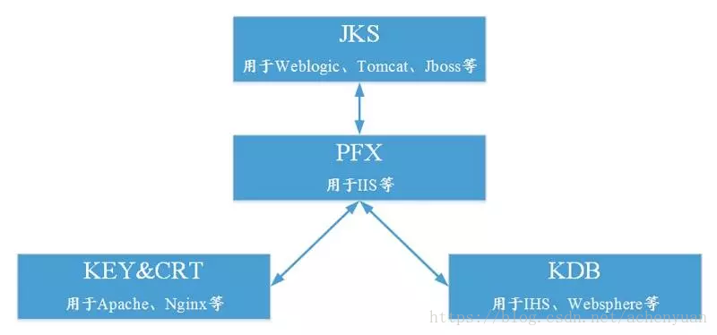

### 模块

运行nginx -V命令查看已经安装的nginx模块

./configure --prefix=/usr/local/nginx --with-http_stub_status_module --with-http_ssl_module

需要添加ssl模块
make && make install

### nginx 配置

```
server {
	listen          8080;
	listen       8443 ssl;
	server_name  localhost;
	#ssl on;
	root html/app-layui/src;
	index login.html index.htm;
	ssl_certificate    ../cert/zhang.pem;
	ssl_certificate_key ../cert/zhang.key;
	ssl_session_timeout 5m;
	ssl_ciphers ECDHE-RSA-AES128-GCM-SHA256:ECDHE:ECDH:AES:HIGH:!NULL:!aNULL:!MD5:!ADH:!RC4;
	ssl_protocols TLSv1 TLSv1.1 TLSv1.2;
	ssl_prefer_server_ciphers on;
	#charset koi8-r;
	#access_log  logs/host.access.log  main;
	location / {
	    root   html;
	    index  login.html login.thm;
	}
    proxy_set_header Host $host;
	proxy_set_header X-Real-IP $remote_addr;
	proxy_set_header REMOTE-HOST $remote_addr;
	proxy_set_header X-Forwarded-For $proxy_add_x_forwarded_for;
}
```
### 证书

证书区分



tomcat keytool 免费证书
win&linux 脚本
- [https://github.com/muxiaobai/shell/blob/master/winsh/gen_cert.bat](https://github.com/muxiaobai/shell/blob/master/winsh/gen_cert.bat)
- [https://github.com/muxiaobai/shell/blob/master/linux/gen_cert.sh](https://github.com/muxiaobai/shell/blob/master/linux/gen_cert.sh)


免费安全证书  1year
https://freessl.cn/

安全证书 

https://github.com/certbot/certbot   90day


参考:
- [keytool和openssl生成证书，应用tomcat和nginx](https://blog.csdn.net/achenyuan/article/details/83340179)