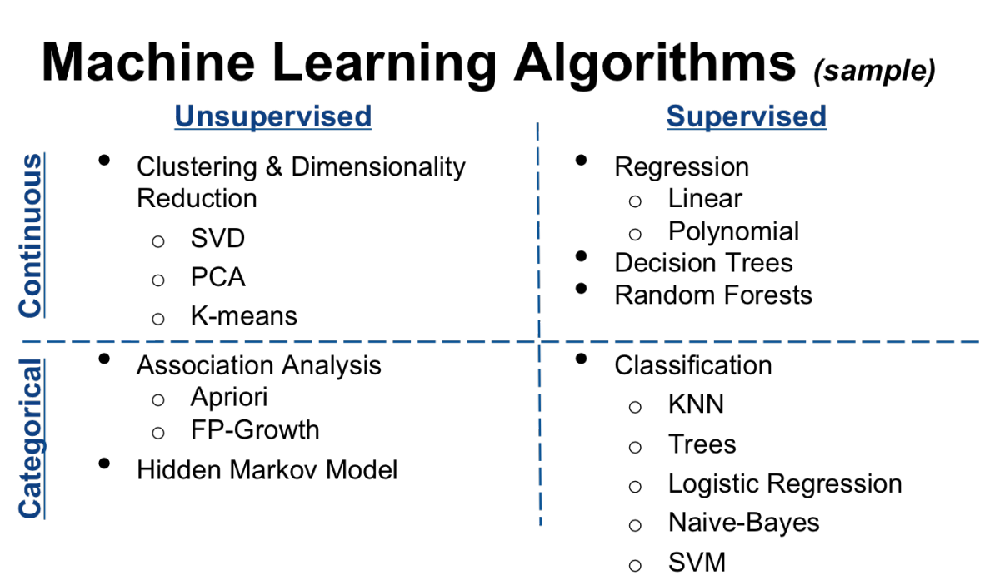

## 什么是机器学习

    通过现有数据获取一些未知的联系，生成一个模型，然后在新数据来的时候，可以通过这个模型进行预测。

## 为什么要了解机器学习

在这个人人都在说编程，说python的时候，我们要思考的是背后有什么趋势，为何会这样？

- 
- 信息的爆炸
- 
- 人是喜欢有规则的，

## 机器学习可以做什么

    预测和辅助决策

## 怎么去深入理解

    个人理解，不要一开始就研究算法，你会自己把自己绕晕，然后也出不来。应结合实际案例，理解了机器学习的常规过程。然后再整理算法，在算法阶段，也不要太纠结具体的那个参数，先有全貌，再有枝叶。

大概的一个学习过程，

## 总纲

### 先来一个最简单的例子----人人皆知的房价预测

#### 从最小二乘法开始

### 推广到线性模型

#### 线性回归

#### 变形  Rige Lasso ElasticNet

#### 计算距离/相似（欧氏距离、Jaccard相似、cos相似、person相似）

#### 怎么确认模型过拟合/欠拟合

### 逻辑回归

#### sign函数 决定

### 贝叶斯

### SVM 支持向量机

### 聚类

### 降维

#### PCA 

#### SVD

2*2情况，是否连续值；是否监督；

如何选择合适的算法进行工作：

[sklearn-CN文档](https://sklearn.apachecn.org/)
分类
