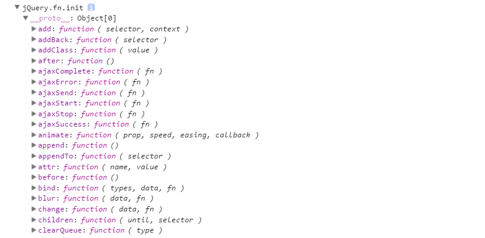
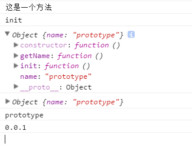
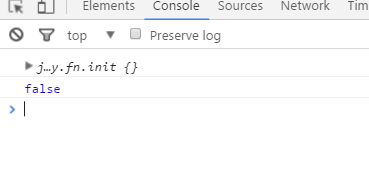

# jQuery分析实践

#### 匿名函数自执行
```
;(function(){})(window);

```

首先所有的代码都包含在这个匿名函数中，并且自执行，这样保证代码不会污染其他的合作者，那么jQuery对象又是怎么被我们使用的呢？我们来看第二段代码。
```
	window.jQuery = window.$ = jQuery;
```
一般情况下，jQuery直接在window下挂在jQuery和$命名空间，这样使用（jQuery/$）直接调用即可。但是许多框架下都会使用$来作为自己的命名空间，这样的话就会产生冲突，因此jQury添加了noConflict()方法，

```
var
	_jQuery = window.jQuery,
	_$ = window.$;
jQuery.noConflict = function( deep ) {
	if ( window.$ === jQuery ) {
		window.$ = _$;
	}
	if ( deep && window.jQuery === jQuery ) {
		window.jQuery = _jQuery;
	}
	return jQuery;
};

```
这里首先，如果在window下有jQuery或者$的话，就把他们暂存到_jQuery/_$命名空间下，然后
调用noConflict()的作用是让出控制权，如果没有参数只让出$控制权,但是如果传入true，jQuery命名空间也让出了，同时方法返回自身的jQuery对象，我们可以用变量接受这个对象。
```
var zhang=jQuery.noConflict(true);
zhang("#id");

```

这个时候$和jQuery都没有jQuery对象了，反而zhang这个命名空间是jQuery对象。最后我们看看jQuery究竟是怎么产生的。见下面的代码：

```
    jQuery = function( selector, context ) {
	    return new jQuery.fn.init( selector, context );
	},
```
从上面的代码中可以看到当我们调用jQuery()的时候，返回的是一个init()后的对象，那么就需要看看init()，内部究竟干了些什么。不过我们也说会使用"$.isFunction()"这样的形式来使用jQury，首先看init();

#### init
在看init的时候先，先看一下这句话，这里写的是jQuery的原型对象，

```
jQuery.fn = jQuery.prototype = {

	jquery: version,
	constructor: jQuery,
	length: 0,
	toArray: function() {
		return slice.call( this );
	}
};
```
主要是jQuery.fn=jQuery.prototype这一句之后，后面的init和extend都有了说法了，因为jQuery.fn.init和jQuery.fn.extend方法都是从这里来的。这样我们通过$()/jQuery(),调用方法的时候返回的new jQuery.fn.init()实例中就包含调用extend的添加的方法，这个后面还会说明。在此就先贴个图，就是jQuery的实例方法。
```
console.log($());
```


```
init = jQuery.fn.init = function( selector, context, root ) {
		var match, elem;
		// HANDLE: $(""), $(null), $(undefined), $(false)
		if ( !selector ) {
			return this;
		}
		// Handle HTML strings 只使用了id选择器，其他的选择请参考源码，这里为了节省篇幅，省略。
		 if (typeof selector === "string")
          this[0] = document.getElementById(selector);
          return this;
          }
	};
```
init就干一件事获取元素，创建元素的jQuery对象，只是这里面有许多种情况，里面的一些就省略了，如果有兴趣，可以自己看一下源码。这里return的就是调用者即上面的new的对象。下面就来看看为什么jQuery下面是怎么添加这么多方法。

#### extend方法

首先来看一下extend方法，这个方法是扩展方法的根，后面的许多方法，都是通过这个extend添加到jQuery对象上的。延续上面的图说话，为什么jQuery实例上有这么多的方法？他们都是怎么添加到jQuery的实例上的呢？

这里jQuery.extend不就是方法上的扩展吗？先举一个简单的例子说明一下这个。

```
var   fun=function(){
    console.log("这是一个方法");
    return fun.prototype.init();
}
//下面是挂在在fun上的属性和方法
fun.VERSION="0.0.1";
fun.name="zhang";
fun.prototype.init=function(){
    console.log("init");
    console.log(this);
    return this;
}
fun.prototype.name="prototype";
fun.prototype.getName=function(){
    console.log(this);    
    console.log(this.name);//因为这里的this是实例，而不是原型，因此挂载在原型上的
    return this.name;
}
fun.getVersion=function(){
    console.log(this.VERSION);
    return this.VERSION;
}
fun().getName();首先调用fun(),打印出“这是一个方法”，同时实例化一个init();在实例化init()的时候打印“init”，this就是init()的实例，然后就到了getName(),这里的getName()，输出“prototype”，是因为“zhang”是挂载在fun上。
fun.getVersion();
```


fun.getVersion就是对应jQuery的直接调用方法。

到这里就能体会到jQuery的设计巧妙，她在调用jQuery的时候，实际调用jQuery.prototype.init,而init返回的由恰巧是一个jQuery对象，这样所有挂在在jQuery.prototype上的方法就可以使用了。下面调用的实例。

上面的例子说明简单的方法中是可以添加属性和方法（也是属性）的，这样直接[方法.属性]可以直接调用这就是jQuery的方法，类级别扩展，用Java中的说法就是静态方法（后面用静态方法代替这种情况），调用的时候就是jQuery.isFunction("");/$.isFunction("");返回false；
```
console.log($.isFunction(""));

```


##### 下面来说extend的实现

这里原型和自身上都添加了extend方法，这样在之后的调用上都可以调用extend添加其他方法了。

在看下面这段代码的解释之前,建议请先看下一节[extend是怎么调用]，这样能更好的理解实现。

```
// extend方法为jQuery对象和init对象的prototype扩展方法
// 同时具有独立的扩展普通对象的功能
jQuery.extend = jQuery.fn.extend = function() {
    //这几个参数的含义比较重要
    //由返回值target可知，
	var options, name, src, copy, copyIsArray, clone,
		target = arguments[ 0 ] || {},//第一个参数，如果没有返回{}
		i = 1,
		length = arguments.length,//参数长度
		deep = false;//是否是深复制
    //处理深复制
    // target为第一个参数，如果第一个参数是Boolean类型的值，则把target赋值给deep
　　// deep表示是否进行深层面的复制，当为true时，进行深度复制，否则只进行第一层扩展
　　// 然后把第二个参数赋值给target
	// Handle a deep copy situation
	if ( typeof target === "boolean" ) {
		deep = target;
        
		// Skip the boolean and the target
		target = arguments[ i ] || {};//现在i=1，如果arguments[1]没有，返回{}
		i++;//i=2// 将i赋值为2，跳过前两个参数
	}
    // target既不是对象也不是函数则把target 设置为空对象。
	// Handle case when target is a string or something (possible in deep copy)
	if ( typeof target !== "object" && !jQuery.isFunction( target ) ) {
		target = {};
	}
    // 如果只有一个参数，则把jQuery对象赋值给target，即扩展到jQuery对象上
	// Extend jQuery itself if only one argument is passed
	if ( i === length ) {//length=2 i=2第一个参数是boolean或者i=1 length=1
		target = this;//this值jQuery，因为调用者是jQuery.extend({}),所以this是jQuery
		i--;//i=1 
	}
    // 开始遍历需要被扩展到target上的参数
	for ( ; i < length; i++ ) {
        // 处理第i个被扩展的对象，即除去deep和target之外的对象,如果是null直接下一个循环
		// Only deal with non-null/undefined values
		if ( ( options = arguments[ i ] ) != null ) {
　          // 遍历第i个对象的所有可遍历的属性for in循环
			// Extend the base object
			for ( name in options ) {
				src = target[ name ];// 根据被扩展对象的键获得目标对象相应值，并赋值给src，原值
				copy = options[ name ];　// 得到被扩展对象的值
                    
				// Prevent never-ending loop
				if ( target === copy ) {
					continue;
				}
                // 当用户想要深度操作时，递归合并 deep=true copy不空 copy是纯对象或者是数组
				// Recurse if we're merging plain objects or arrays
				if ( deep && copy && ( jQuery.isPlainObject( copy ) ||
					( copyIsArray = jQuery.isArray( copy ) ) ) ) {
                   //copyIsArray是数组jQuery.isArray(copy);
					if ( copyIsArray ) {
						copyIsArray = false; // 将copyIsArray重新设置为false，为下次遍历做准备
						clone = src && jQuery.isArray( src ) ? src : [];

					} else {
						clone = src && jQuery.isPlainObject( src ) ? src : {};
					}
                    　// 递归调用extend方法，继续进行深度遍历
					// Never move original objects, clone them
					target[ name ] = jQuery.extend( deep, clone, copy );
　              // 如果不需要深度复制，则直接把copy（第i个被扩展对象中被遍历的那个键的值）
				// Don't bring in undefined values
				} else if ( copy !== undefined ) {
					target[ name ] = copy;
				}
			}
		}
	}
    　// 原对象被改变，因此如果不想改变原对象，target可传入{}
	// Return the modified object
	return target;
};
```
extend()方法 首先是三个if判断，最后一个是for循环，最后返回target，重要的是返回值。
[JQuery中的extend方法实现原理](http://www.jb51.net/article/61478.htm)
#### 调用extend()

首先我们先看一下extend的具体用法，那样就能更深的理解，
```
jQuery.fn.extend( {
	prop: function( name, value ) {
		return access( this, jQuery.prop, name, value, arguments.length > 1 );
	},

	removeProp: function( name ) {
		return this.each( function() {
			delete this[ jQuery.propFix[ name ] || name ];
		} );
	}
} );
```

实例添加上的prop，removeProp方法，只用直接调用jQuery.fn.extend({}),jQuery的扩展插件的也是如此，把方法放入对象中，调用extend即可。是不是非常简单啊？下面的静态方法也是如此，这个静态方法一般不会使用。

```
jQuery.extend( {
	prop: function( elem, name, value ) {
		var ret, hooks,
			nType = elem.nodeType;

		// Don't get/set properties on text, comment and attribute nodes
		if ( nType === 3 || nType === 8 || nType === 2 ) {
			return;
		}

		if ( nType !== 1 || !jQuery.isXMLDoc( elem ) ) {
			//class和for不能直接操作,class for 关键字
			// Fix name and attach hooks
			name = jQuery.propFix[ name ] || name;
			hooks = jQuery.propHooks[ name ];
		}
		//set 有hooks调hooks没有直接属性操作
		if ( value !== undefined ) {
			if ( hooks && "set" in hooks &&
				( ret = hooks.set( elem, value, name ) ) !== undefined ) {
				return ret;
			}

			return ( elem[ name ] = value );
		}
		//get hooks，同get
		if ( hooks && "get" in hooks && ( ret = hooks.get( elem, name ) ) !== null ) {
			return ret;
		}

		return elem[ name ];
	},

	propHooks: {
		tabIndex: {
			get: function( elem ) {

				// Support: IE <=9 - 11 only
				// elem.tabIndex doesn't always return the
				// correct value when it hasn't been explicitly set
				// https://web.archive.org/web/20141116233347/http://fluidproject.org/blog/2008/01/09/getting-setting-and-removing-tabindex-values-with-javascript/
				// Use proper attribute retrieval(#12072)
				var tabindex = jQuery.find.attr( elem, "tabindex" );

				return tabindex ?
					parseInt( tabindex, 10 ) :
					rfocusable.test( elem.nodeName ) ||
						rclickable.test( elem.nodeName ) && elem.href ?
							0 :
							-1;
			}
		}
	},

	propFix: {
		"for": "htmlFor",
		"class": "className"
	}
} );
```
#### 最后是自己的js工具

[我的JS练习库](https://github.com/muxiaobai/CourseExercises/blob/master/js/baseJS/base.js)
影响比较大的视频 [逐行分析jQuery源码的奥秘](http://study.163.com/course/courseMain.htm?courseId=465001) 希望有后续