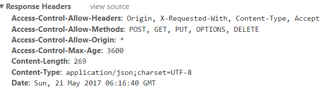

自我刷新：`<meta http-equiv="refresh" content="0.1">`更持久，更健壮
持续两个多月的毕业设计生活已经结束了，也经历了最黑暗的答辩，最后完整的通过了学业，还是比较欣慰的，下面说一些，我写毕业设计的一些收获。
 
想要跟随潮流，我自己也用了一下github作为我的代码仓库，感觉还不错。设计的系统主要分为两部分，前端和后端，分别采用spring-boot和vue来做的，中间采用jersey作为服务。（实际上，现实开发中生产中很少使用这种方式的，毕竟这只是一个尝试。因为jersey接口，服务之类的东西都是在系统对接上使用，首先这个场景就不太合适，但是为了熟悉新技术，尝试一下，也不为过）我的毕业设计全部代码提交在github上面，地址：[graduation-project](https://github.com/muxiaobai/graduation-project)。

#### （1）代码管理
代码版本控制采用git，主要的代码一直托管在Github上，实际上系统大体上可以分为两个小模块，数据方面的接口，和页面方面的展示。所以此就直接利用Github代码托管平台，其中主分支为master分支，项目还包含两个分支spring-boot和vue分支，各自提交到各自的分支上，当一个功能完成后，直接合并到master分支上来。确保master分支永远是最新的，并且是可以部署运行的分支。
#### （2）后端部分
整个数据接口采用spring-boot框架，spring技术，几乎是现在的Jave Web项目都会用到的框架，但是传统的spring需要配置大量的xml配置文件，值得庆幸的是：spring-boot的出现解决了这一问题。spring-boot项目甚至到服务器上直接就可以运行，只需要有java环境就OK了。真像spring-boot开发者所说：“just run”。而且spring-boot默认编码是utf-8。Spring-boot框架的使用可以让项目的构建变得更加的方便。Spring-boot提供大量的第三方库（libraries），这样可以让我们快速的创建一个spring工程，下面的数据库访问就是一个例子。这是使用spring-boot的优势。
```
@ComponentScan(basePackages = { "dao","service","domain","config"})//扫描组件
@EnableJpaRepositories("dao") // JPA扫描该包路径下的Repositories
@EntityScan(basePackages = { "java.lang.Object","domain"}) // 扫描实体类
@EnableAutoConfiguration
@SpringBootApplication//项目启动类
@EnableConfigurationProperties({RedisProperties.class,DatabaseProperties.class}) 
public class Application {
    //注册jersey
    @Bean
    public ServletRegistrationBean jerseyServlet() {
        ServletRegistrationBean registration = new ServletRegistrationBean(  new ServletContainer(),"/rest/*");
        registration.addInitParameter(ServletProperties.JAXRS_APPLICATION_CLASS, JerseyConfig.class.getName());
        return registration;
    }
    public static void main(String[] args) {
        SpringApplication.run(Application.class, args);
    }
```

这就是spring-boot的启动类，很简单，很原始。`gradle bootRun` 

```
@Repository
public interface UserDao  extends JpaRepository<User, Long>{
    public User getUserById(Long id);
    public User findByUsername(String username);
}
```
数据库采用MySQL来做，保存数据使用spring-boot-starter-data-jpa这个库，这个是Spring-boot提供的library，和传统访问相比，新的结合模式直接继承spring-boot-starter-data-jpa中的JpaRepository即可实现数据的操作，这可以减少CRUD等操作代码的编写，不过对于传统的DAO，Service来说，这种都是一些换汤不换药的东西，很好转换。还有一点不同的是调用Service的方式。这里采用Jersey提供接口服务。
```
	@POST
    @Path("add")
    @Consumes("application/json;charset=UTF-8")
    @Produces(MediaType.APPLICATION_JSON)
    public Map<String, Object> post(@RequestBody User user){
        returnValue.clear();
        userService.save(user);
        returnValue.put("code", 200);
        returnValue.put("msg", "success");
        returnValue.put("action", "add ");
        returnValue.put("data", user);
        return returnValue;
    }
```

采用Jersey来实现RESTful，提供数据的接口，Jersey采用了Annotation机制，上面的代码就是。所有的HTTP相关的参数设置和方法都采用标注实现。Jersey是一个平台，我们可以扩大自己的需要，如消息格式，虽然Jersey已经提供了java的基本数据类型，JSON，XML和其他类型，我们可以很容易地扩展他们的格式。测试的时候我们采用soapUI工具来检测接口的正确性。

#### （3）前端部分
采取node+webpack+vue+vuex+vue-router+axios设计网站的前台和后台，其中node是基于V8实现的一个运行环境，打包工具和创建项目采用的是webpack，剩下的都是vue的周边生态系统，提供的框架，其中vuex是管状态，vue-router管路由跳转， axios解决跨域。另外前端还采用了饿了么的element-UI和Mint-UI这两个组件，这种组件可以更方便的实现页面。另外Chrome中已经有了vue-DevTools工具了，这是VUE组件的一个调试工具，非常好用。
我们平时大多用js去操作dom，最常用的还是jQuery这个js工具。这里使用vue也是一种新的尝试，vue.js则是使用了数据绑定驱动来操作dom的，也就是说创建了view和model之间的绑定后，当model数据层发生变化时，view的dom就会发生相应变化。mvvm即是model-view-viewmodel，model和view之间的衔接交互都是通过viewmodel来实现的。viewmodel就是创建一个vue实例，vue实例是作用于某一个dom元素上的。因此，从View层看，ViewModel中的DOM Listeners工具会帮我们监测页面上DOM元素的变化，如果有变化，则更改Model中的数据；从Model层看，当我们更新Model中的数据时，Data Bindings工具会帮我们更新页面中的DOM元素。
```
<template>
  <div class="index">
  <input type="text" name="" v-model="parMsg"/>
  <p>{{parMsg}}</p>
  </div>
</template>
<script>
export default {
  name: 'index',
  data: function() {
    return {
      parMsg:''//输入input的内容会随时更新到p元素内
    }
  },
}
</script>
<!-- Add "scoped" attribute to limit CSS to this component only -->
<style scoped>
//省略
</style>
```

VUE的周边生态系统异常丰富，包括vue-router的路由机制，用Vue.js +vue-router创建单页应用，是非常简单的。使用Vue.js，我们已经可以通过组合组件来组成应用程序，当你要把vue-router添加进来，我们需要做的是，将组件(components)映射到路由(routes)，然后告诉vue-router在哪里渲染它们；Vuex 也集成到Vue的官方调试工具devtools extension，提供了诸如零配置的time-travel调试、状态快照导入导出等高级调试功能。

#### （4）前后结合
利用git工具进行模块之间的组合，开发阶段采用ngrok访问，后台提供的服务通过ngrok反代理工具发布到外网来进行访问，通过 C9在线服务器访问的时候就可以了。部署阶段，在服务器上安装java后，采用java –jar运行开发的后台jar包，另一个前端界面采用nginx应用服务器部署。
实际上这里还有一个跨域的问题需要解决。因为后台服务在一个域名下，前台运行在另一个域名下，即使端口不通，也是这样，因此前台调用的时候相当于是在跨域，这个地方主要就是后台的跨域接收。这里通过一个过滤器把返回的头部添加如下四个头信息，如下图，其中“Access-Control-Allow-Origin”参数是可以接收的允许通过的域名，在实际的应用阶段，就会替换成正式的可接受的域名，这样就能够防止其他域名的攻击。“Access-Control-Allow-Methods”参数是可以接受的方法。这也是系统的安全性的一个考虑。
```
public void doFilter(ServletRequest req, ServletResponse res, FilterChain chain)  
        throws IOException, ServletException {  
	HttpServletRequest request = (HttpServletRequest) req;
	System.out.println(request.getParameterMap());
    HttpServletResponse response = (HttpServletResponse) res;
    request.setCharacterEncoding("UTF-8");
    response.setCharacterEncoding("UTF-8");
    response.setHeader("Access-Control-Allow-Origin", "*");  
    response.setHeader("Access-Control-Allow-Methods", 
    		"POST, GET, PUT, OPTIONS, DELETE");  
    response.setHeader("Access-Control-Max-Age", "3600");  
    response.setHeader("Access-Control-Allow-Headers",
    		"Origin, X-Requested-With, Content-Type, Accept");  
    chain.doFilter(request, response);  
}
```

前台在调用的时候，我们通过截图就可以看出，响应的头信息中已经包含了“response”添加的头信息。允许通过的域名、方法、支持的头信息和最大时间。下图只是一个简单的示范，从图中可以看出上面介绍的四个参数全在响应头中，实际上跨域资源共享CORS（Cross-origin resource sharing）问题看起来比较难，不过一旦理解了，自己动手做过一次之后，那就很简单了。  


以上就是关于毕业设计技术方面的总结，业务方面，如果自己有一个好的IDEA，特别是生活中遇到的问题，或者自己需要的东西，恰恰又没有人提供这种服务，你就可以尝试一下，说不定，就能做大了呢？

鸣谢：孟老（xian）师（fei），李老（kai）师（feng），叶老（xin）师（feng），王老（he）师（chao），系（wang）老师，学院老师，校老师（著名的思修，毛概，马哲）。