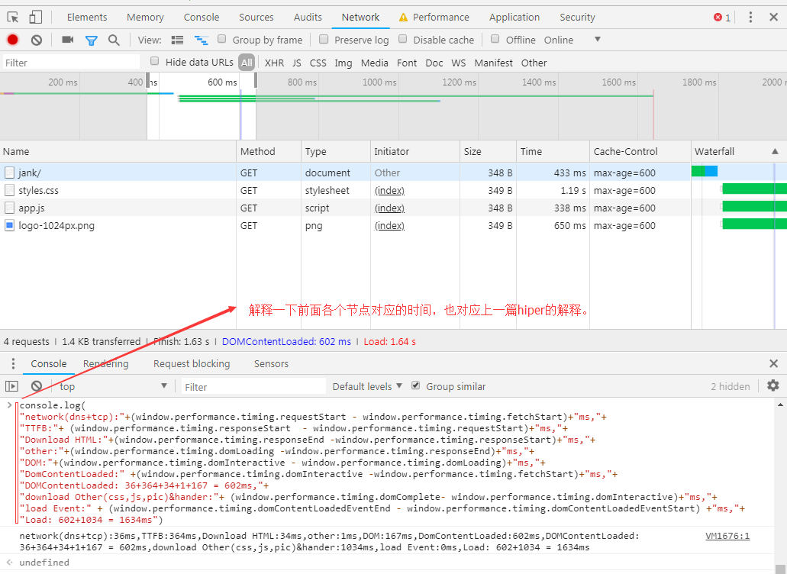
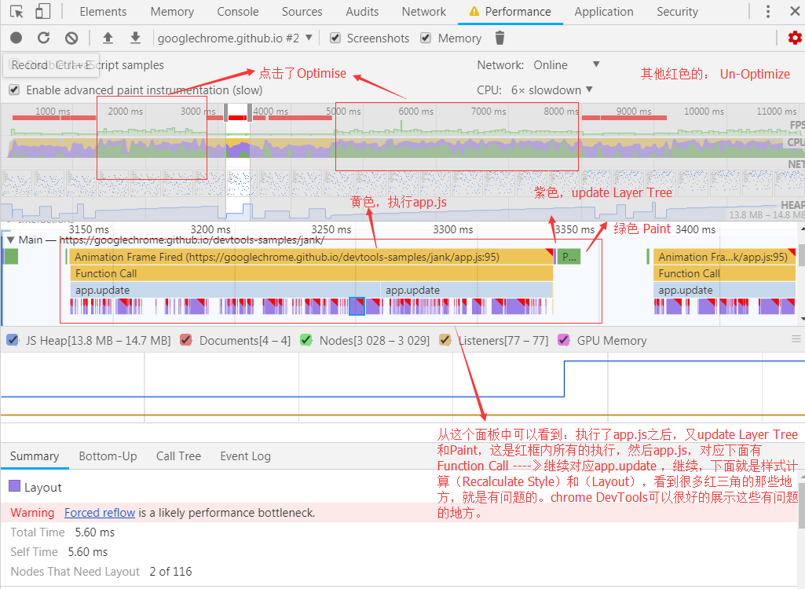
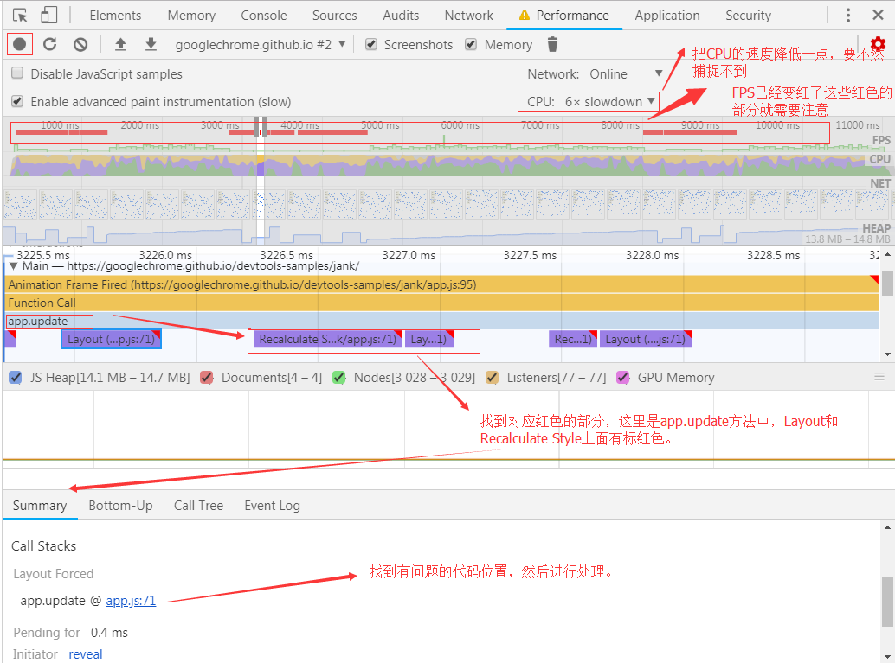

## 接上一篇中的DOM所有时间，浏览器在做些什么？

之前是接受资源,domLoading,domInteractive,domContentLoadedEventStart,domContentLoadedEventEnd,domComplete,之后是其他，主要分析这中间的时间，浏览器做什么来展示内容。
loadEventStart,loadEventEnd

### 构建DOM 渲染 绘画


关键渲染路径:DOM javascript CSSOM Render Tree Layout Paint

- 1.处理 HTML 标记并构建 DOM 树。
- 2.处理 CSS 标记并构建 CSSOM 树。
- 3.将 DOM 与 CSSOM 合并成一个渲染树。（Render Tree）
- 4.根据渲染树来布局，以计算每个节点的几何信息。（Layout）
- 5.将各个节点绘制到屏幕上。（Paint）


## 性能分析


### 网络


```

"network(dns+tcp):"+(window.performance.timing.requestStart - window.performance.timing.fetchStart)+"ms,"+
"TTFB:"+ (window.performance.timing.responseStart  - window.performance.timing.requestStart)+"ms,"+
"Download HTML:"+(window.performance.timing.responseEnd -window.performance.timing.responseStart)+"ms,"+
"other:"+(window.performance.timing.domLoading -window.performance.timing.responseEnd)+"ms,"+
"DOM:"+(window.performance.timing.domInteractive - window.performance.timing.domLoading)+"ms,"+
"DomContentLoaded:" +(window.performance.timing.domInteractive -window.performance.timing.fetchStart)+"ms,"+
"DOMContentLoaded: 36+364+34+1+167 = 602ms,"+
"download Other(css,js,pic)&hander:"+ (window.performance.timing.domComplete- window.performance.timing.domInteractive)+"ms,"+
"load Event:" + (window.performance.timing.domContentLoadedEventEnd - window.performance.timing.domContentLoadedEventStart) +"ms,"+
"Load: 602+1034 = 1634ms"

```
先从时间上看：

性能的话，如果，这里的(requestStart - fetchStart) 时间很大的话，就需要看一下是不是网络的问题了；如果responseStart - requestStart很大，是不是服务器的响应速度有问题呢？这个需要后台，负载等处理，查一下请求响应时间，是不是很长？然后在responseEnd之后，得到了HTML，就是浏览器的渲染等问题了。

### 构建对象生成时间,生成DOM和CSSOM

涉及到解析HTML等，语法解析问题。

CSSOM，层级级联样式怎么最简化，怎么渲染的时候构建Render Tree最优。

CSS选择器内套多层，越来越复杂;精简不用的样式

### 加载资源时间

> HTML 和 CSS 都是阻塞渲染的资源

HTML 必须的，渲染内容。

然后是CSS资源，CSS是阻塞资源，需要尽快加载，方便浏览器快速加载。使用媒体查询，让一些样式不用阻塞渲染。

例:
```
<link href="style.css" rel="stylesheet">  默认是all
<link href="style.css"    rel="stylesheet" media="all">
<link href="print.css" rel="stylesheet" media="print"> 打印时
<link href="other.css" rel="stylesheet" media="(min-width: 40em)">最小宽度加载
<link href="portrait.css" rel="stylesheet" media="orientation:portrait"> 定输出设备中的页面可见区域高度大于或等于宽度，竖屏
```
注意“阻塞渲染”仅是指浏览器是否需要暂停网页的首次渲染，直至该资源准备就绪。无论哪一种情况，浏览器仍会下载 CSS 资源，只不过不阻塞渲染的资源优先级较低罢了。

JavaScript 也会阻止 DOM 构建和延缓网页渲染。 为了实现最佳性能，可以让您的 JavaScript 异步执行，并去除关键渲染路径中任何不必要的 JavaScript。当 HTML 解析器遇到一个 script 标记时，它会暂停构建 DOM，将控制权移交给 JavaScript 引擎；等 JavaScript 引擎运行完毕，浏览器会从中断的地方恢复 DOM 构建。
` <script src="app.js" async></script>`可以添加异步，这样可以等资源加载完后，再进行执行。

### 内存

内存溢出:JS死循环，DOM引用


### 怎样找到具体的问题代码




[上面图的网址: https://googlechrome.github.io/devtools-samples/jank/](https://googlechrome.github.io/devtools-samples/jank/)
先得到profile，现在已经在Performance面板中了，FPS一般都在60左右，这里有红色的已经降到10以下了。然后我们选取其中的一部分,上图分析了结果，找到问题的所在，然后进行处理。这个问题是: `Layout Forced和First Layout Invalidation`

> 注：先降低CPU的速度。

参考：

- [google官方文档-关键渲染路径](https://developers.google.com/web/fundamentals/performance/critical-rendering-path/)
- [chrome-devtools](https://developers.google.com/web/tools/chrome-devtools/)
- [分析关键渲染路径性能](https://developers.google.com/web/fundamentals/performance/critical-rendering-path/analyzing-crp)
- [内存模型](https://developers.google.com/web/tools/chrome-devtools/memory-problems/)
- [性能演示测试](https://googlechrome.github.io/devtools-samples/jank/)