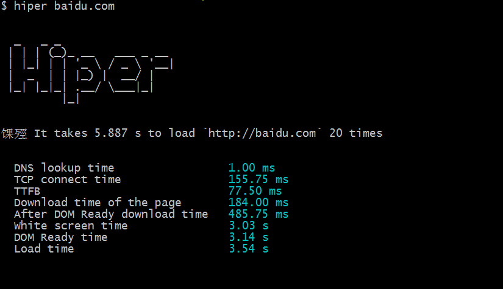
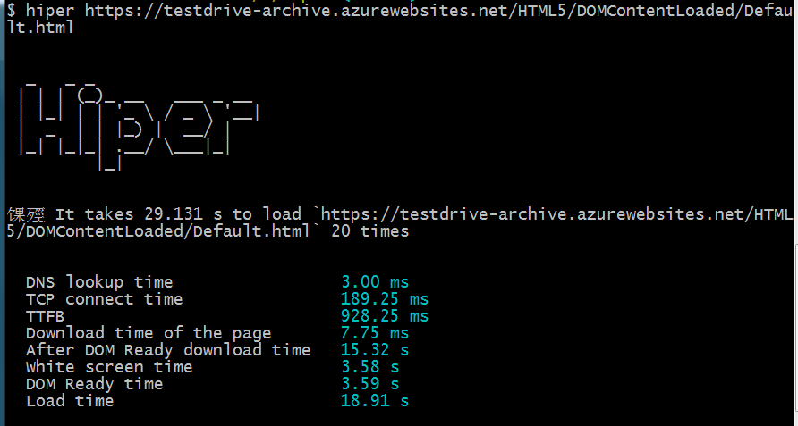
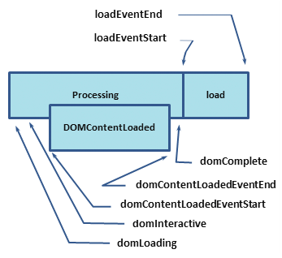

从一个简单的工具说起:[hiper](https://github.com/pod4g/hiper)




- DNS look time: DNS 寻址
- TCP connect time: TCP握手
- TTFB : 最初的发送request到response接受到第一个字节(对于浏览器来说，就是等待Waiting) Time To First Byte
- Download time of the page: 下载页面
- After DOM Ready download time: 下载其他资源
- White screen time: 白屏时间（从浏览器发送到DOM解析之前）
- DOM Ready time: DOM准备时间
- Load time: Load所有时间

以上这些时间是判断一个页面对于使用者的友好程度，要清楚到底是哪一个环节耗时，才是解决问题的重中之重。

- 1.totalDNSTime += this.getDNSTime(domainLookupStart, domainLookupEnd)
- 2.totalTCPTime += this.getTCPTime(connectStart, connectEnd)
- 3.totalTTFBTime += this.getTTFB(requestStart, responseStart)
- 4.totalDownloadTime += this.getDownloadTime(responseStart, responseEnd)
- 5.totalAfterDOMReadyTheDownloadTimeOfTheRes += this.getAfterDOMReadyTheDownloadTimeOfTheRes(domInteractive, domComplete)
- 6.totalWhiteScreenTime += this.getWhiteScreenTime(navigationStart, domInteractive)
- 7.totalDOMReadyTime += this.getDOMReadyTime(navigationStart, domContentLoadedEventEnd)
- 8.totalLoadTime += this.getLoadTime(navigationStart, loadEventEnd)

这个工具中的时间计算


chrome 中的performance.timing对象记录了所有的时间 [浏览器从输入网址发生的事(前端优化)](https://www.cnblogs.com/btgyoyo/p/6341077.html)

navigationStart,如果没有前一个网页，则等于fetchStart属性。
fetchstart,

DNS: domainLookupStart,domainLookupEnd,

TCP: connectStart,secureConnectionStart,connectEnd,

TTFB和Download: requestStart,responseStart,responseEnd,

渲染DOM:
domLoading,开始解析渲染DOM树的时间
domInteractive,完成解析DOM树的时间

加载资源:
domContentLoadedEventStart,在DOM树解析完成后，网页内资源加载开始的时间
domContentLoadedEventEnd,DOM树解析完成后，网页内资源加载完成时间（如JS脚本加载执行完成） 这个阶段会可能会触发 domcontentLoaded 事件
domComplete,DOM已经结束，而且资源也加载完了。

DOM的onload回调方法时间: loadEventStart,loadEventEnd load回调函数执行完成的时间

[各个时间](https://blog.csdn.net/redtopic/article/details/70677690)
[介绍performance中的time](https://www.cnblogs.com/btgyoyo/p/6341077.html)


### DOMContentLoaded Load 两个事件

[DOMContentLoaded和Load两个时间，蓝线和红线](https://testdrive-archive.azurewebsites.net/HTML5/DOMContentLoaded/Default.html)
这两种情况的差别，DOMContentLoaded完成的时候，是页面已经出来，结束白屏状态，当Load的时候，图片，等其他资源也加载完毕。

[DOMContentLoaded 与 load事件](https://www.cnblogs.com/Bonnie3449/p/8419609.html)

### DOM中的document.readystate属性值：

- uninitialized (未初始化) ：对象尚未初始化
- loading (正在加载) ：对象正在加载
- loaded (加载完毕) ：对象加载数据完成
- interactive (交互)：可以操作对象，但还没完全加载
- complete (完成)：对象已经加载完毕

### DOMContentLoaded/ jquery ready事件

$(function(){})$(document).ready(function(){})jQuery中是怎么处理这两种加载情况的

```
jQuery.readyException = function( error ) {
	window.setTimeout( function() {
		throw error
	} )
}
这里使用了Deferred对象，最终会执行这个fn，而且会给参数 readyList.resolveWith( document, [ jQuery ] ) 把当前的document 和jQUery给fn内部可以使用
// The deferred used on DOM ready
var readyList = jQuery.Deferred()
jQuery.fn.ready = function( fn ) {
--------3-----------
	readyList.then( fn )
		// Wrap jQuery.readyException in a function so that the lookup
		// happens at the time of error handling instead of callback
		// registration.
		.catch( function( error ) {
			jQuery.readyException( error )
		} )
	return this
}
jQuery.extend( {
	// Is the DOM ready to be used? Set to true once it occurs.
	isReady: false,
	// A counter to track how many items to wait for before
	// the ready event fires. See #6781
	readyWait: 1,
	//ready等会
	// Hold (or release) the ready event
	holdReady: function( hold ) {
		if ( hold ) {
			jQuery.readyWait++
		} else {
			jQuery.ready( true )
		}
	},
	// Handle when the DOM is ready
	ready: function( wait ) {
		// Abort if there are pending holds or we&aposre already ready
		if ( wait === true ? --jQuery.readyWait : jQuery.isReady ) {
			return
		}
		// Remember that the DOM is ready
		jQuery.isReady = true
		// If a normal DOM Ready event fired, decrement, and wait if need be
		if ( wait !== true && --jQuery.readyWait > 0 ) {
			return
		}
        //这里会被调用，jQuery.ready()--------2-----------
		// If there are functions bound, to execute
		readyList.resolveWith( document, [ jQuery ] )
	}
} )
jQuery.ready.then = readyList.then
// The ready event handler and self cleanup method
function completed() {
	document.removeEventListener( "DOMContentLoaded", completed )
	window.removeEventListener( "load", completed )
	jQuery.ready()
}
--------1-----------
// Catch cases where $(document).ready() is called
// after the browser event has already occurred.
// Support: IE <=9 - 10 only
// Older IE sometimes signals "interactive" too soon
if ( document.readyState === "complete" ||
	( document.readyState !== "loading" && !document.documentElement.doScroll ) ) {
    
	// Handle it asynchronously to allow scripts the opportunity to delay ready
	window.setTimeout( jQuery.ready )
} else {
	// Use the handy event callback
	document.addEventListener( "DOMContentLoaded", completed )
	// A fallback to window.onload, that will always work
	window.addEventListener( "load", completed )
}
```

按照1,2,3的代码顺序执行，首先1后面，判断，如果当前的document状态已经完整，就可以直接立即执行2，|| 不是在加载状态，兼容IE， 否则的话，在document中添加两个事件的监听，发生这种事件之后，执行completed，这个方法内部会调用jQuery.ready()—-2
2最后还是调用3，

[浅谈DOMContentLoaded事件及其封装方法](https://segmentfault.com/a/1190000005869515)

#### load/onload 事件

上面事件顺序理解之后，再结合上面一个事件，这个事件只是事件更靠后一点。

body标签中加onload事件，可以做出来等待的情况，[转圈效果](https://muxiaobai.github.io/2016/12/17/%E7%AD%89%E5%BE%85-%E7%AD%89%E5%BE%85-%E7%AD%89%E5%BE%85/)

## 各大浏览器内核介绍

常见的浏览器内核:

- IE : Trident
- firefox: Gecko(Mozilla)
- Safari: Webkit
- Chrome Blink
- Opera: Presto,现使用Chrome的Blink

注：Blink是Chromium的核心,它的前身是Webkit.国内的大部分浏览器,其中一个内核是Trident，然后再增加一个其他内核。国内的厂商一般把其他内核叫做“高速浏览模式”，而Trident则是“兼容浏览模式”，用户可以来回切换。

## chrome F12开发者工具

常用面板: Console Elements Sources

网络问题: Network Audits

性能其他: Application Performance Momery

- Elements: 最终浏览器展示的结果，可以查看到元素的样式Style，计算出来的元素位置Computed，事件的监听Event；
- Network: 解决常用数据问题，比如前后端数据传输呀。查看请求头，响应头，请求参数，响应结果等。以及每一个资源的Timing（Waterfall）（请求- 响应时间）Network
- Console: 控制台，查看一些参数呀，输入命令等。
- Application: 参考[HTML5-API新特性](https://muxiaobai.github.io/2016/08/20/HTML5-API-%E6%96%B0%E7%89%B9%E6%80%A7/),主要是Cookie,Session,Storage,还有两个新特性，Manifest,Service Workers,一般网站开发，上面已经够用了，如果遇到其他页面响应慢等性能问题，就需要下面两个面板:
- Performance: 性能
- Momery: 内存

下面这两个系列文章很全的。

- [Chrome开发者工具不完全指南](http://www.cnblogs.com/constantince/category/712675.html)
- [Chrome开发者工具详解](http://www.cnblogs.com/charliechu/p/5948448.html)

缺少浏览器的渲染和优化方向

参考文献:

- [chrome官方开发者工具文档](https://developers.google.com/web/tools/chrome-devtools/)
- [memory测试](https://developer.chrome.com/devtools/docs/demos/memory)
- [google文档 评估关键渲染路径](https://developers.google.com/web/fundamentals/performance/critical-rendering-path/measure-crp)☆☆
- [google文档 分析关键渲染路径性能](https://developers.google.com/web/fundamentals/performance/critical-rendering-path/analyzing-crp)☆☆☆☆

