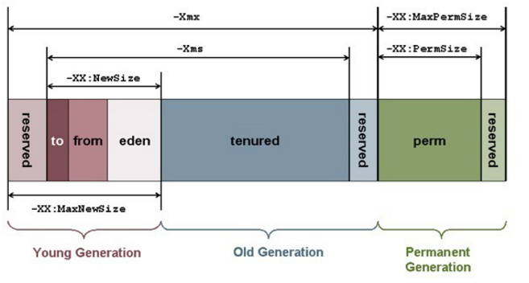

先放一下我在慕课网上的三篇关于JVM的一些手记
- [深入理解JVM之基本构架](http://www.imooc.com/article/6143)
- [深入理解JVM之对象生命周期](http://www.imooc.com/article/6319)
- [深入理解JVM之类加载](http://www.imooc.com/article/6461)

本次 [JVM参数](http://www.cnblogs.com/redcreen/archive/2011/05/04/2037057.html)
[GC知识要点回顾,有案例](http://blog.csdn.net/firecoder/article/details/7225654)
[“-Xmx1024m -Xms1024m -Xmn512m -Xss256k”——Java运行参数(转)](http://blog.csdn.net/a503921892/article/details/39048889)
[监测工具](http://www.cnblogs.com/redcreen/archive/2011/05/09/2040977.html)
web监测工具Javamelody.jar[Javamelody](https://muxiaobai.github.io/2017/08/02/Javamelody-%E5%B7%A5%E5%85%B7/)
jdk自带工具：
jmc: java mission  control (飞行记录器(黑匣子))
监测:jconsole
监视:jvisualvm   

jvisualvm工具插件下载地址修改为[https://visualvm.github.io/pluginscenters.html](https://visualvm.github.io/pluginscenters.html)在这个上面查找到对应的版本，进行更新。

上线的话用jstack 命令行或者Java Mission Control 图形化界面（jml）
<!--more-->




#### 修改tomcat 的java_opts

在Catalina.bat 中添加 `set JAVA_OPTS=-Xms512m -Xmx1024m -XX:NewSize=512m -XX:MaxNewSize=512m `
`set JAVA_OPTS=-Xms512m -Xmx1024m -XX:NewSize=768m -XX:MaxNewSize=768m -XX:+PrintGCDetails -Xloggc:..\logs\gc.log -XX:+PrintGCTimeStamps  `
`set JAVA_OPTS=-Xms6g -Xmx6g -XX:NewSize=4g -XX:MaxNewSize=4g  -XX:MaxPermSize=512m -XX:+UseParNewGC -XX:+UseConcMarkSweepGC -XX:+PrintGCDetails -Xloggc:..\logs\gc.log -XX:+PrintGCDateStamps  -XX:+PrintTenuringDistribution`

#### 各个参数的含义

[JVM参数](http://www.cnblogs.com/redcreen/archive/2011/05/04/2037057.html)

|参数名称	|含义	|默认值	|
|:---:|:---:| :---:|
|-Xms | 初始堆大小	物理内存的1/64(<1GB)|默认(MinHeapFreeRatio参数可以调整)空余堆内存小于40%时，JVM就会增大堆直到-Xmx的最大限制.|
|-Xmx |最大堆大小	|物理内存的1/4(<1GB)|	默认(MaxHeapFreeRatio参数可以调整)空余堆内存大于70%时，JVM会减少堆直到 -Xms的最小限制|
|-Xmn |	年轻代大小(1.4 or lator) 默认1/64 | 	注意：此处的大小是（eden+ 2 survivor space).与jmap -heap中显示的New gen是不同的。整个堆大小=年轻代大小 + 年老代大小 + 持久代大小.增大年轻代后,将会减小年老代大小.此值对系统性能影响较大,Sun官方推荐配置为整个堆的3/8|
|-XX:NewSize|	设置年轻代大小(for 1.3/1.4)|	 	 
|-XX:MaxNewSize	|年轻代最大值(for 1.3/1.4)|	 	 
|-XX:PermSize	|设置持久代(perm gen)初始值|	物理内存的1/64|	 
|-XX:MaxPermSize|	设置持久代最大值	|物理内存的1/4	|
|-XX:NewRatio	| |年轻代(包括Eden和两个Survivor区)与年老代的比值(除去持久代) |默认值为2，-XX:NewRatio=4表示年轻代与年老代所占比值为1:4,年轻代占整个堆栈的1/5 Xms=Xmx并且设置了Xmn的情况下，该参数不需要进行设置。|
|-XX:SurvivorRatio|	Eden区与Survivor区的大小比值	|默认值为8，设置为8,则两个Survivor区与一个Eden区的比值为2:8,一个Survivor区占整个年轻代的1/10|

注意：两个比率问题-XX:NewRatio  -XX:SurvivorRatio  


设置了堆的大小-Xms 和-Xmx之后，再修改-Xmn Eden后， Survivor 根据比例配置，Old区域就会受影响（，没有Perm区域了）
对于非堆来说就有MetaSpace Code Class

jdk1.8之后，把perm修改为matespace，具体的修改配置以及介绍
在JDK8中,classe metadata(the virtual machines internal presentation of Java class),
被存储在叫做Metaspace的native memory。一些新的flags被加入：

|参数名称	|含义	|默认值	|
|:---:|:---:| :---:|
|-XX:MetaspaceSize| class metadata的初始空间配额，以bytes为单位，|达到该值就会触发垃圾收集进行类型卸载，同时GC会对该值进行调整：如果释放了大量的空间，就适当的降低该值；如果释放了很少的空间，那么在不超过MaxMetaspaceSize（如果设置了的话），适当的提高该值。
|-XX:MaxMetaspaceSize|可以为class metadata分配的最大空间。|默认是没有限制的。 32位的JVM默认MaxPermSize是64M 但如果不指定MaxMetaspaceSize的话，Metaspace的大小仅受限于native memory的剩余大小。
|-XX:MinMetaspaceFreeRatio|在GC之后，最小的Metaspace剩余空间容量的百分比，减少为class metadata分配空间导致的垃圾收集
|-XX:MaxMetaspaceFreeRatio|在GC之后，最大的Metaspace剩余空间容量的百分比，减少为class metadata释放空间导致的垃圾收集
 
☆-XX:+UseParNewGC -XX:+UseConcMarkSweepGC 使用ParNew 和 CMS 
-XX:CMSInitiatingOccupancyFraction=80 即老年代满80%时触发CMS(full gc)，调高则full gc相对减少，调低则full gc处理得比较快；
-XX:+UseCMSCompactAtFullCollection 或 -XX:CMSFullGCsBeforeCompaction=5 即full gc前或后做碎片整理。

每次full gc之后，进行压缩 -XX:CMSFullGCsBeforeCompaction=0

CMS的两个挑战：
1. 堆碎片
CMS收集器默认并没有任何碎片整理的机制。所以可能会出现这样的情形：
即使总的堆大小远没有耗尽但却不能分配对象，仅仅是因为没有足够连续的空间完全容纳对象。
当这种事发生后，JVM会触发Full GC

2. 对象分配率高
获取对象实例的频率高于收集器清除堆里死对象的频率
并发模式失败： 老年代没有足够的可用空间来容纳一个从年轻代提升过来的对象
此时JVM会执行堆碎片整理：触发Full GC


以下参数没有具体尝试，

|参数名称	|含义	|默认值	|
|:---:|:---:| :---:|
|-Xss	|每个线程的堆栈大小	 |	JDK5.0以后每个线程堆栈大小为1M,以前每个线程堆栈大小为256K.更具应用的线程所需内存大小进行 调整.在相同物理内存下,减小这个值能生成更多的线程.但是操作系统对一个进程内的线程数还是有限制的,不能无限生成,经验值在3000~5000左右一般小的应用， 如果栈不是很深， 应该是128k够用的 大的应用建议使用256k。这个选项对性能影响比较大，需要严格的测试。（校长）和threadstacksize选项解释很类似,官方文档似乎没有解释,在论坛中有这样一句话:-Xss is translated in a VM flag named ThreadStackSize一般设置这个值就可以了。|
|-XX:ThreadStackSize|	Thread Stack Size	|(0 means use default stack size) [Sparc: 512; Solaris x86: 320 (was 256 prior in 5.0 and earlier); Sparc 64 bit: 1024; Linux amd64: 1024 (was 0 in 5.0 and earlier); all others 0.]|
|-XX:LargePageSizeInBytes	|内存页的大小不可设置过大， 会影响Perm的大小	| 	=128m|
|-XX:+UseFastAccessorMethods	|原始类型的快速优化	| 	 
|-XX:+DisableExplicitGC	|关闭System.gc()	 	|这个参数需要严格的测试|
|-XX:MaxTenuringThreshold	|垃圾最大年龄	 |	如果设置为0的话,则年轻代对象不经过Survivor区,直接进入年老代. 对于年老代比较多的应用,可以提高效率.如果将此值设置为一个较大值,则年轻代对象会在Survivor区进行多次复制,这样可以增加对象再年轻代的存活 时间,增加在年轻代即被回收的概率 该参数只有在串行GC时才有效.|
|-XX:+AggressiveOpts	|加快编译	 	 
|-XX:+UseBiasedLocking|	锁机制的性能改善	 	 
|-Xnoclassgc	|禁用垃圾回收	 	 
|-XX:SoftRefLRUPolicyMSPerMB	|每兆堆空闲空间中SoftReference的存活时间	|1s	softly reachable objects will remain alive for some amount of time after the last time they were referenced. The default value is one second of lifetime per free megabyte in the heap|
|-XX:PretenureSizeThreshold |	对象超过多大是直接在旧生代分配	|0	单位字节 新生代采用Parallel Scavenge GC时无效 另一种直接在旧生代分配的情况是大的数组对象,且数组中无外部引用对象.|
|-XX:TLABWasteTargetPercent|	TLAB占eden区的百分比|	1%	| 
|-XX:+CollectGen0First|	FullGC时是否先YGC	|false	 |


其他功能，方便之后查找问题
`java -X `展示-X参数
`java -XX:+PrintFlagsFinal` 打印所有的-XX：参数

|参数名称	|含义	|默认值	|
|:---:|:---:| :---:|
|-XX:+HeapDumpOnOutOfMemoryError|在OutOfMenory的时候自动创建Heapdump,注：其中不设-XX:HeapDumpPath时，dump出的文件在/tomcat_home/bin目录下|-XX:HeapDumpPath=D:/heapdump,文章最后还有手动生成jmap|


为了分析可以将gc日志搞出来

| 属性        |     说明	     | 
| :--------:  | :---------------:| 
|-XX:+PrintGC | 	 输出形式 :  [GC 118250K->113543K(130112K), 0.0094143 secs]  [Full GC 121376K->10414K(130112K), 0.0650971 secs]   |  
|-XX:+PrintGCDetails  |输出形式:[GC [DefNew: 8614K->781K(9088K), 0.0123035 secs] 118250K->113543K(130112K), 0.0124633 secs] [GC [DefNew: 8614K->8614K(9088K), 0.0000665 secs][Tenured: 112761K->10414K(121024K), 0.0433488 secs] 121376K->10414K(130112K), 0.0436268 secs]|
|-XX:+PrintGCTimeStamps	 | -XX:+PrintGCDateStamps |	 	 
|-XX:+PrintGC:PrintGCTimeStamps	 	| 	可与-XX:+PrintGC -XX:+PrintGCDetails混合使用  输出形式:11.851: [GC 98328K->93620K(130112K), 0.0082960 secs]|
|-XX:+PrintGCApplicationStoppedTime	|打印垃圾回收期间程序暂停的时间.可与上面混合使用	输出形式:Total time for which application threads were stopped: 0.0468229 seconds|
|-XX:+PrintGCApplicationConcurrentTime	|打印每次垃圾回收前,程序未中断的执行时间.可与上面混合使用	 	输出形式:Application time: 0.5291524 seconds|
|-XX:+PrintHeapAtGC	|打印GC前后的详细堆栈信息	 |	 
|-Xloggc:../logs/gc.log	|把相关日志信息记录到文件以便分析.|
|-XX:+PrintClassHistogram | garbage collects before printing the histogram.	与上面几个配合使用		 |
|-XX:+PrintTLAB	|查看TLAB空间的使用情况	 	 |
|-XX:+PrintTenuringDistribution	|查看每次minor GC后新的存活周期的阈值		 Desired survivor size 1048576 bytes, new threshold 7 (max 15) new threshold 7即标识新的存活周期的阈值为7。|
|-XX:+PrintTenuringDistribution | 打印对象年龄 默认配置的15，jvm是动态对象年龄判定的 取决于survivor的大小，调大survivor会增加age|
|-XX:MaxTenuringThreshold=10|Desired survivor size 40239104 bytes, new threshold 6 (max 6)意思是说对象在survivor区域中经过10minorGC还存活的话就提拔到老生代。再比如 -XX:SurvivorRatio=65536 -XX:MaxTenuringThreshold=0这样的配置实际上就是去掉了survivor区域，直接将对象从eden区域提拔到老生代  |

#### tomcat下的几个日志

gc日志 配置Catalina.bat JAVA_OPTS
-XX:+PrintGCDetails -Xloggc:..\logs\gc.log -XX:+PrintGCDateStamps -XX:+PrintTenuringDistribution -XX:+PrintHeapAtGC
 
##### 根据gc log分析收集器

[日志含义及分析](http://blog.csdn.net/doc_sgl/article/details/46594123)
默认的垃圾收集器 PS Scavenge 和PS MarkSweep  对应 PS Eden 和PS Old, Parallel Scavenge 和Serial Old
`-XX:+UseParallelGC `
```
Java HotSpot(TM) 64-Bit Server VM (25.111-b14) for windows-amd64 JRE (1.8.0_111-b14), built on Sep 22 2016 19:24:05 by "java_re" with MS VC++ 10.0 (VS2010)
Memory: 4k page, physical 8299408k(1668496k free), swap 16596956k(4817128k free)
CommandLine flags: -XX:InitialHeapSize=1073741824 -XX:MaxHeapSize=1073741824 -XX:MaxNewSize=536870912 -XX:NewSize=536870912 -XX:+PrintGC -XX:+PrintGCDetails -XX:+PrintGCTimeStamps -XX:+UseCompressedClassPointers -XX:+UseCompressedOops -XX:-UseLargePagesIndividualAllocation -XX:+UseParallelGC 
3.009: [GC (Allocation Failure) [PSYoungGen: 393216K->44906K(458752K)] 393216K->44994K(983040K), 0.0299992 secs] [Times: user=0.09 sys=0.02, real=0.03 secs] 
4.184: [GC (Metadata GC Threshold) [PSYoungGen: 438122K->52440K(458752K)] 438210K->52536K(983040K), 0.0307814 secs] [Times: user=0.09 sys=0.00, real=0.03 secs] 
4.215: [Full GC (Metadata GC Threshold) [PSYoungGen: 52440K->0K(458752K)] [ParOldGen: 96K->50332K(524288K)] 52536K->50332K(983040K), [Metaspace: 20805K->20805K(1069056K)], 0.0588943 secs] [Times: user=0.19 sys=0.03, real=0.06 secs] 
5.833: [GC (Metadata GC Threshold) [PSYoungGen: 223304K->16405K(458752K)] 273636K->66746K(983040K), 0.0090804 secs] [Times: user=0.00 sys=0.03, real=0.01 secs] 
5.842: [Full GC (Metadata GC Threshold) [PSYoungGen: 16405K->0K(458752K)] [ParOldGen: 50340K->35102K(524288K)] 66746K->35102K(983040K), [Metaspace: 34776K->34776K(1081344K)], 0.0372804 secs] [Times: user=0.09 sys=0.00, real=0.04 secs] 
```
说明 进行了三次 Minor GC(Metadata GC Threshold)和二次Full GC (Metadata GC Threshold)，PSYoungGen 和ParOldGen Metaspace三个区域进行garbage回收，


-XX:+UseParNewGC  -XX:+UseConcMarkSweepGC对应  ParNew Eden 和 CMS Old

各种收集器的搭配 


参数：`-XX:+UseConcMarkSweepGC -XX:+UseParNewGC ` 

```
Java HotSpot(TM) 64-Bit Server VM (25.111-b14) for windows-amd64 JRE (1.8.0_111-b14), built on Sep 22 2016 19:24:05 by "java_re" with MS VC++ 10.0 (VS2010)
Memory: 4k page, physical 8299408k(1605020k free), swap 16596956k(4755960k free)
CommandLine flags: -XX:InitialHeapSize=1073741824 -XX:MaxHeapSize=1073741824 -XX:MaxNewSize=536870912 -XX:MaxTenuringThreshold=6 -XX:NewSize=536870912 -XX:OldPLABSize=16 -XX:+PrintGC -XX:+PrintGCDetails -XX:+PrintGCTimeStamps -XX:+UseCompressedClassPointers -XX:+UseCompressedOops -XX:+UseConcMarkSweepGC -XX:-UseLargePagesIndividualAllocation -XX:+UseParNewGC 
2.538: [GC (Allocation Failure) 2.538: [ParNew: 419456K->45084K(471872K), 0.0319020 secs] 419456K->45084K(996160K), 0.0320000 secs] [Times: user=0.09 sys=0.00, real=0.03 secs] 
4.063: [GC (Allocation Failure) 4.063: [ParNew: 464540K->47903K(471872K), 0.0510502 secs] 464540K->62045K(996160K), 0.0511090 secs] [Times: user=0.19 sys=0.00, real=0.05 secs] 
4.114: [GC (CMS Initial Mark) [1 CMS-initial-mark: 14142K(524288K)] 69798K(996160K), 0.0044547 secs] [Times: user=0.00 sys=0.00, real=0.00 secs] 
4.119: [CMS-concurrent-mark-start]
4.131: [CMS-concurrent-mark: 0.013/0.013 secs] [Times: user=0.06 sys=0.00, real=0.01 secs] 
4.131: [CMS-concurrent-preclean-start]
4.132: [CMS-concurrent-preclean: 0.001/0.001 secs] [Times: user=0.00 sys=0.00, real=0.00 secs] 
4.132: [CMS-concurrent-abortable-preclean-start]
5.631: [CMS-concurrent-abortable-preclean: 1.022/1.499 secs] [Times: user=3.53 sys=0.31, real=1.50 secs] 
5.631: [GC (CMS Final Remark) [YG occupancy: 264766 K (471872 K)]5.631: [Rescan (parallel) , 0.0148491 secs]5.646: [weak refs processing, 0.0000339 secs]5.646: [class unloading, 0.0040028 secs]5.650: [scrub symbol table, 0.0052723 secs]5.656: [scrub string table, 0.0006273 secs][1 CMS-remark: 14142K(524288K)] 278909K(996160K), 0.0254939 secs] [Times: user=0.08 sys=0.00, real=0.03 secs] 
5.657: [CMS-concurrent-sweep-start]
5.660: [CMS-concurrent-sweep: 0.003/0.003 secs] [Times: user=0.00 sys=0.00, real=0.00 secs] 
5.660: [CMS-concurrent-reset-start]
5.660: [CMS-concurrent-reset: 0.001/0.001 secs] [Times: user=0.00 sys=0.00, real=0.00 secs] 
310.132: [GC (Allocation Failure) 310.132: [ParNew: 467359K->25032K(471872K), 0.0437937 secs] 481496K->47728K(996160K), 0.0438755 secs] [Times: user=0.03 sys=0.05, real=0.04 secs] 
2176.769: [GC (Allocation Failure) 2176.769: [ParNew: 444488K->20094K(471872K), 0.0397949 secs] 467184K->42790K(996160K), 0.0399206 secs] [Times: user=0.13 sys=0.00, real=0.04 secs] 
4106.112: [GC (Allocation Failure) 4106.112: [ParNew: 439550K->27010K(471872K), 0.0349045 secs] 462246K->49707K(996160K), 0.0350339 secs] [Times: user=0.05 sys=0.03, real=0.03 secs] 

```

5次GC (Allocation Failure)和2次Full GC ，这个我还没有看出来怎么是两次，CMS Initial Mark 一次， CMS Final Remark一次？好像jconsole和jvisualvm的统计不一致。
5.631: [GC (CMS Final Remark) [YG occupancy: 264766 K (471872 K)]5.631: [Rescan (parallel) , 0.0148491 secs]5.646: [weak refs processing, 0.0000339 secs]5.646: [class unloading, 0.0040028 secs]5.650: [scrub symbol table, 0.0052723 secs]5.656: [scrub string table, 0.0006273 secs][1 CMS-remark: 14142K(524288K)] 278909K(996160K), 0.0254939 secs] [Times: user=0.08 sys=0.00, real=0.03 secs] 
这个是全部GC的， YG occupancy、Rescan (parallel)、weak refs processing、class unloadingscrub symbol table、scrub string table、1 CMS-remark


|-XX:+PrintTenuringDistribution	|查看每次minor GC后新的存活周期的阈值		 Desired survivor size 1048576 bytes, new threshold 7 (max 15) new threshold 7即标识新的存活周期的阈值为7。|

```
Desired survivor size 40239104 bytes, new threshold 6 (max 6)
- age   1:   38395784 bytes,   38395784 total
: 697938K->46713K(707840K), 0.0827063 secs] 697938K->62235K(969984K), 0.0828384 secs] [Times: user=0.26 sys=0.00, real=0.08 secs] 
2017-11-06T17:47:26.663+0800: 2084.592: [GC (Allocation Failure) 2017-11-06T17:47:26.663+0800: 2084.592: [ParNew
Desired survivor size 40239104 bytes, new threshold 6 (max 6)
- age   1:    7222536 bytes,    7222536 total
- age   2:   12782736 bytes,   20005272 total
: 675961K->26286K(707840K), 0.0380878 secs] 691483K->41807K(969984K), 0.0382007 secs] [Times: user=0.06 sys=0.00, real=0.04 secs] 

```

经常性的 "premature promotion”， 最总会导致大量短期对象被提升到老年代， 最终导致老年代空间不足， 引发另一个 JVM 内存问题 “promotion failure”（提升失败： 即老年代空间不足以容乃 Minor GC 中提升上来的对象）

阈值 6


-XX:+PrintHeapAtGC 打印GC前后的堆栈信息
```
{Heap before GC invocations=0 (full 0):
 par new generation   total 707840K, used 629248K [0x00000000c0000000, 0x00000000f0000000, 0x00000000f0000000)
  eden space 629248K, 100% used [0x00000000c0000000, 0x00000000e6680000, 0x00000000e6680000)
  from space 78592K,   0% used [0x00000000e6680000, 0x00000000e6680000, 0x00000000eb340000)
  to   space 78592K,   0% used [0x00000000eb340000, 0x00000000eb340000, 0x00000000f0000000)
 concurrent mark-sweep generation total 262144K, used 0K [0x00000000f0000000, 0x0000000100000000, 0x0000000100000000)
 Metaspace       used 15947K, capacity 16294K, committed 16512K, reserved 1064960K
  class space    used 1780K, capacity 1877K, committed 1920K, reserved 1048576K
2017-11-07T21:14:24.642+0800: 12.757: [GC (Allocation Failure) 2017-11-07T21:14:24.642+0800: 12.757: [ParNew
Desired survivor size 40239104 bytes, new threshold 1 (max 6)
- age   1:   73044040 bytes,   73044040 total
: 629248K->71474K(707840K), 0.0671453 secs] 629248K->71474K(969984K), 0.0672460 secs] [Times: user=0.14 sys=0.05, real=0.07 secs] 
Heap after GC invocations=1 (full 0):
 par new generation   total 707840K, used 71474K [0x00000000c0000000, 0x00000000f0000000, 0x00000000f0000000)
  eden space 629248K,   0% used [0x00000000c0000000, 0x00000000c0000000, 0x00000000e6680000)
  from space 78592K,  90% used [0x00000000eb340000, 0x00000000ef90ca70, 0x00000000f0000000)
  to   space 78592K,   0% used [0x00000000e6680000, 0x00000000e6680000, 0x00000000eb340000)
 concurrent mark-sweep generation total 262144K, used 0K [0x00000000f0000000, 0x0000000100000000, 0x0000000100000000)
 Metaspace       used 15947K, capacity 16294K, committed 16512K, reserved 1064960K
  class space    used 1780K, capacity 1877K, committed 1920K, reserved 1048576K
}
```


catalina host-manage manager localhost日志 配置Catalina.bat JAVA_OPTS
-Djava.util.logging.manager=org.apache.juli.ClassLoaderLogManager -Djava.util.logging.config.file="..\conf\logging.properties" 
对应下面几个
localhost.2012-07-05.txt
catalina.2012-07-05.txt
manager.2012-07-05.txt
host-manager.2012-07-05.txt


访问日志access_log 配置server.xml Host节点内部添加的Valve
`<Valve className="org.apache.catalina.valves.AccessLogValve" directory="logs/tomcat"  prefix="localhost_access_log." suffix=".txt" pattern="common" resolveHosts="false"/>`

app日志
log4j 应用内部的log


#### 堆文件分析


查看pid : jps  -m -l
生成hprof文件 : jmap -dump:format=b,file=log.hprof [pid]


`-XX:+HeapDumpOnOutOfMemoryError` 自动生成dump 

##### visual VM  jvisualvm工具亦可

##### eclipse中的分析工具加载地址: http://www.eclipse.org/mat/downloads.php 找到Update Site

在Eclipse中点击Windows->Open Perspective->Other->Memory Analysis
导入.hprof文件
在MAT中点击 File->Open File,浏览到刚刚转换而得到的.hprof文件，并Cancel掉自动生成报告,点击Dominator Tree，并按Package分组，
选择自己所定义的Package 类点右键，在弹出菜单中选择List objects->With incoming references。
这时会列出所有可疑类，右键点击某一项，并选择Path to GC Roots->exclude weak/soft references,
会进一步筛选出跟程序相关的所有有内存泄露的类。据此，可以追踪到代码中的某一个产生泄露的类。


