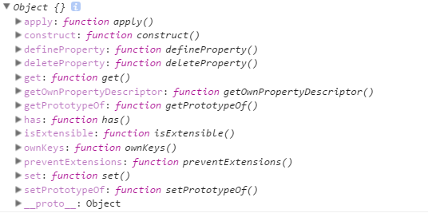
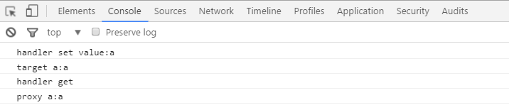
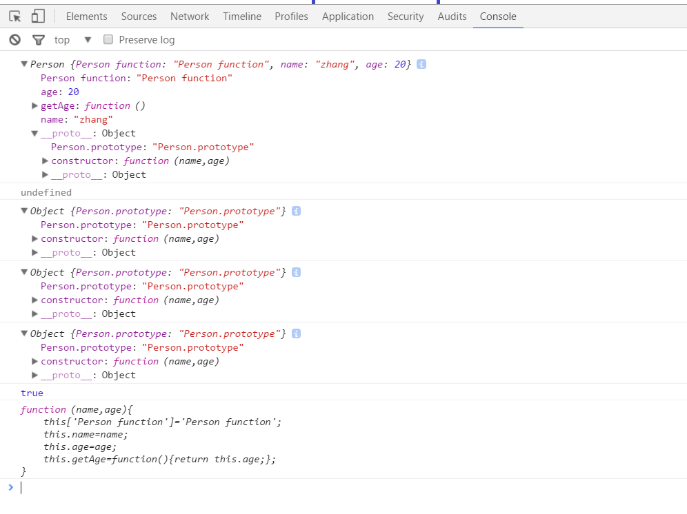
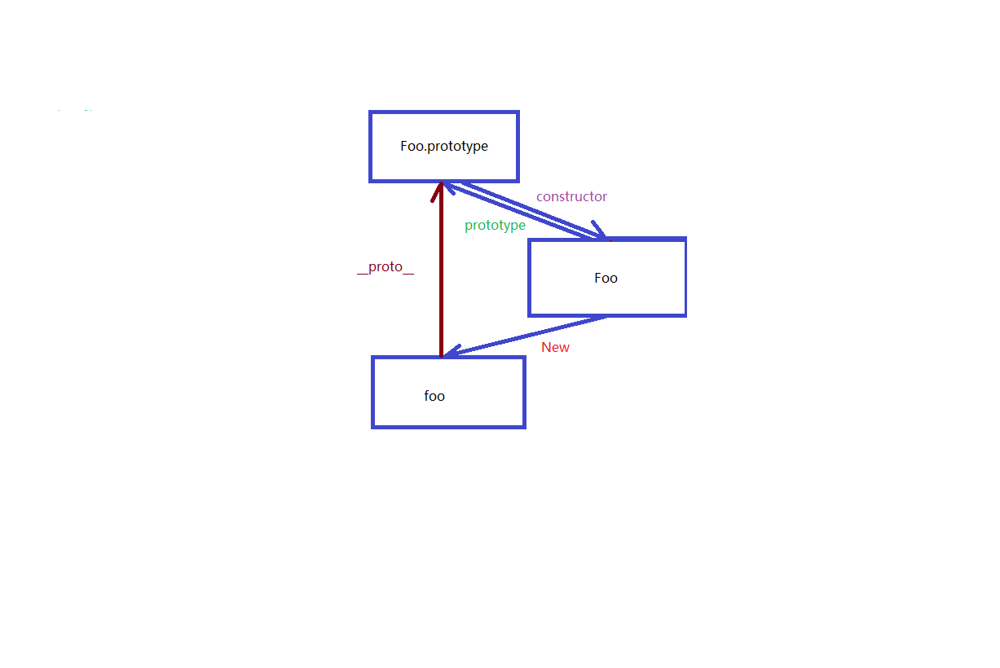

## 看看Proxy和Reflect的作用

  概念
  
  代理:对外暴露代理对象,操作的时候，表面上操作的是代理对象(proxy)，实际上改变的是目标对象 (target)，从而可以在操作代理对象的时候进行一些处理(handler)后，再传递到目标对象。 (全是个人理解) 没有官方论文引用。
  
  反射: 通过类的类类型来操作类的属性。在Javascript中这个作用可以通过Object中的方法来实现，不过为了保证各司其职，逐渐让Reflect做一些她该做的一些事情。而且Reflect有的方法，在Proxy中都有对应，如果在Proxy中调用Reflect的话，其实对应的就是默认行为。

## 由作用到怎么用，这是一个实践过程呢。  

他们的方法可以使用一个5+2+2+2+1+1的模板来总结。

- get() set() has() deleteProperty() difineProperty()//与属性有关的方法
- getOwnPropertyDescriptor() ownKeys()//Own的属性描述和属性keys
- getPrototypeOf() setPrototypeOf()//与原型有关的方法
- isExtensible()判断是否可以扩展 preventExtensions()阻止添加新属性
- apply()//调用方法有关
- construct()//和new 有关的

```
console.log(Reflect);

```



5+2+2+2+1+1模板出现，下面来看具体的一个使用:

```
var target={};
var handler={
    get:function(target,property){
        console.log('handler get');
        return target[property];
    },
    set(target,propkey,value){
        console.log("handler set value:"+value);
        return Reflect.set(...arguments);
    }
};
var proxy=new Proxy(target,handler);
proxy.a='a';
console.log("target a:"+target.a);//实际上不知道target，只知道proxy，所以所有的对target的操作都落在proxy上了。
console.log("proxy a:"+proxy.a);//通过proxy取得target上的值，广义上，通过操作proxy来操作target。
```


在上面的例子中，通过两个方法来说明Proxy和Reflect，我们一个一个看，handler中的set方法，在我们对proxy.a进行赋值的时候，Proxy对象首先通过handler的set，然后输出"handler set value: a",紧接着return了Reflect.set(),这里通过反射静态类方法，调用set，然后把proxy传过来的参数通过，各个参数对应起来，就相当于直接调用target['propkey']=value。

> 注:这里的Reflect调用就是实现其默认行为。

到这里实际上我是想直接在研究一下Object上到底还有什么东西？为了衔接，接着分析。

在下一行，输出target的时候，在这里说明一下，因为是做实验，所以我们想通过调用target和调用proxy做一个对比，从而找出Proxy对象的不同，在实际情况中，应该是不知道target的，只知道proxy对象。

target的时候，我们看到控制台只输出了"target a:a",但是proxy的时候，先输出了"handler get"然后才输出""proxy a:a",就是说调用proxy，实际上是返回就是target的，但是其中proxy做了一些处理。

其他的一些13种方法就不再阐述了，和这两个是一模一样的。

> 注:这其实就是代理模式的实现。

## 回头再看Object 

先看一段代码:

```
var Person=function(name,age){
    this['Person function']='Person function';
    this.name=name;
    this.age=age;
    this.getAge=function(){return this.age;};
}

Person.prototype={constructor:Person,'Person.prototype':'Person.prototype'};
var myPerson=new Person('zhang',20);
Object.preventExtensions(myPerson);
//Object.freeze(myPerson);

myPerson.a='as';
console.log(myPerson);
console.log(myPerson.a);//undifined因为myPerson被freeze了，其中freeze是冻结，preventExtensions是组织扩展，阻止添加新属性
console.log(myPerson.__proto__);
console.log(Object.getPrototypeOf(myPerson));
console.log(Person.prototype);//

console.log(myPerson.constructor==Person);//true
console.log(Person.prototype.constructor);

```


```
 {constructor:Person,'Person.prototype':'Person.prototype'};//这是一个神奇的东西
```

myPerson.__proto__===Object.getPrototypeOf（myPerson）==Person.prototype

实例的__proto__是这个神奇的东西，她的另一种取法是通过Object.getPrototypeOf(实例)，对应构造函数的prototype也是这个神奇的东西，而这个东西的constructor就是前面的函数。那我们再试一次函数的prototype是什么?
```
console.log(Person.prototype.constructor.prototype);
```
结果显示:
```
{constructor:Person,'Person.prototype':'Person.prototype'};还是这个神奇的东西

```
挺神奇的，是吧?

## Object原型分析

借用一幅图来说明


图片来源；[Javascript的原型链图（原创 知乎首发）](https://zhuanlan.zhihu.com/p/22189387)
非常推荐用户去读一读这篇文章。到此结束！

